# Huawei LiteOS Developer Guide

## Contents

* [1 Knowledge Sharing License Agreement](#1)

* [2 Preface](#2)

* [3 Overview](#3)

* [4 Basic Kernel](#4)

* [4.1 Task](#4.1)

* [4.2 Memory](#4.2)

* [4.3 Interrupt](#4.3)

* [4.4 Queue](#4.4)

* [4.5 Event](#4.5)

* [4.6 Mutex](#4.6)

* [4.7 Semaphore](#4.7)

* [4.8 Time Management](#4.8)

* [4.9 Software Time](#4.9)

* [4.10 Doubly Linked List](#4.10)

* [5 AgentTiny](#5)

<h2 id="1">1.Knowledge Sharing License Agreement</h2>

**You are free to:**

**Share** — copy and redistribute the material in any medium or format

**Adapt** — remix, transform, and build upon the material

The licensor cannot revoke these freedoms as long as you follow the license
terms

**Under the following terms:**

**Attribution** — You must give appropriate credit, provide a link to the
license, and indicate if changes were made. You may do so in any reasonable
manner, but not in any way that suggests the licensor endorses you or your use.

**NonCommercial** — You may not use the material for commercial purposes.

**ShareAlike** — If you remix, transform, or build upon the material, you must
distribute your contributions under the same license as the original.

**No additional restrictions** — You may not apply legal terms or technological
measures that legally restrict others from doing anything the license permits.

**Notices:**

You do not have to comply with the license for elements of the material in the
public domain or where your use is permitted by an applicable exception or
limitation.

No warranties are given. The license may not give you all of the permissions
necessary for your intended use. For example, other rights such as publicity,
privacy, or moral rights may limit how you use the material.


This is a human-readable summary of (and not a substitute for) the license.
Visit [https://creativecommons.org/licenses/by-sa/3.0/](https://creativecommons.org/licenses/by-sa/3.0/) legalcode for complete
license.

<h2 id="2">2.Preface</h2>

**Purpose**

This guide describes the structure of Huawei LiteOS Kernel. It also explains how
to develop and debug.

**Intended Audience**

This guide is primarily intended for Huawei LiteOS developers, and is also
recommended for:

-   Internet of Things (IoT) device software engineers

-   IoT architects

**Symbol Conventions**

The symbols that may be found in this guide are defined as follows:

| Symbol | Description |  
| - | :- |  
|| Indicates an emergency hazardous situation that, if not avoided, could result in death or serious injury. |                                                       
|| Indicates a potentially hazardous situation that, if not avoided, could result in death or serious injury. |
|| Indicates a potentially hazardous situation that, if not avoided, could result in minor or moderate injury. |
|| Indicates a device or environmental safety alert that, if not avoided, could result in equipment damage, data loss, performance deterioration, or unanticipated consequences. "Notice" cannot result in injury. |
|| "Note" is not a safety alert, cannot result in personal, device or environmental injury. |

**Change History**

Document changes are cumulative. The latest document issue contains all the
changes made in earlier issues.

| Date | Version | Description |  
| - | :- | :- |  
| 2018-03-30 | V2.1.1 | Initial release. |

<h2 id="3">3.Overview</h2>

### 3.1 Background Introduction

Huawei LiteOS is a lightweight real-time operating system

**Huawei LiteOS Kernel framework**

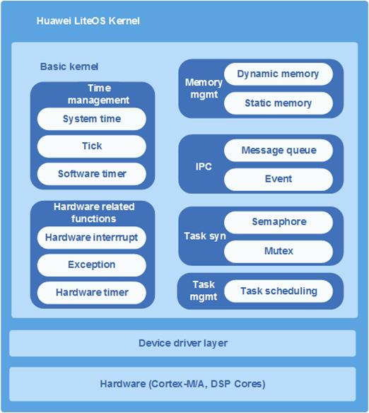

Basic kernel of Huawei LiteOS is the most tidy code of operating system. It
contains operating system components based task management, memory management,
time management, communication mechanism, interrupt management, queue
management, event management, timer, etc. It can run independently.

Highlights of Huawei LiteOS Kernel

Highlight real-time and stable

* Ultra-small kernel, basic kernel size of less than 10 KB

* Low power consumption

* Capable of Static function compaction

Modules

**Task**

Creates, deletes, delays, suspends, and resumes tasks, and can lock or unlock
task scheduling. High priority tasks preempt resources from low priority ones.
Tasks of the same priority share resources in a round robin setup using time
slicing.

**Task Synchronization**

* Semaphore: creates, deletes, pends on, and releases semaphores.

* Mutex: creates, deletes, pends on, and releases mutexes.

**Hardware Related Functions**

Provides the following functions:

* Interrupt: Creates, deletes, enables, and disables interrupts; clears interrupt request flags.

* Timer: Creates, deletes, starts, and stops timers.

**Inter-Process Communication (IPC)**

Provides the following functions:

* Event: Reads and writes events

* Message queue: Creates, deletes, reads from, and writes into message queues

**Time Management**

* System time: generated when an output pulse of a timer/counter triggers an interrupt.

* Tick time: the basic time unit used in OS scheduling. The tick length is user configurable. Typically, it is determined by the system clock speed and represented in the form of ticks per second.

* Software timer: The timer length is measured in ticks. The Timer_Callback function (a function used to process timer expiry) is called when a soft tick interrupt is generated.

**Memory Management**

* Provide two algorithms of dynamic memory and static memory. Allocates or frees memory statically using the Membox algorithm or dynamically using the SLAB algorithm and DLINK algorithm.

* Provides memory statistics, cross-border detection memory.

### 3.2 Supported Cores

Cores supported by Huawei LiteOS

| Core | Chip |  
| - | :- |  
| Cortex-A7 | STM32L053R8Tx ATSAMD21G18A ATSAMD21J18A ATSAMR21G18A EFM32HG322F64 MKL26Z128 MKW41Z512 LPC824M201JHI33 MM32L073PF nRF51822 NANO130KE3BN |                                                       
| Cortex-M3 | K3V3 and K3V3+STM32F103RB ATSAM4SD32C EFM32GG990F1024 GD32F103VCT6 GD32150R8 GD32F190R8 GD32F207VC MM32F103CBT6 MM32L373PS |
| Cortex-M4 | STM32F411, STM32F412, STM32L476, STM32F429, and STM476STM32F411RE STM32F412ZG STM32F429ZI STM32F429IG STM32F476RG EFM32PG1B200F256GM48 GD32F450IK CC3220SF LPC54114j256BD64 nRF52840 nRF52832 NUC472HI8AE ATSAMG55J19 ADuCM4050LF |
| Cortex-M7 | K3V5 and STM32F746STM32F746ZG ATSAME70Q21 |

### 3.3 Constraints

* Both Huawei LiteOS interfaces and CMSIS interfaces are supported, but hybrid use of them may lead to unpredictable results. (For example, a CMSIS interface is used for requesting semaphores while a Huawei LiteOS interface is used for releasing semaphores.)

* Use only Huawei LiteOS interfaces for driver development. CMSIS interfaces are recommended for app development.

<h2 id="4">4.Basic Kernel</h2>

<h3 id="4.1">4.1 Task</h3>

**Overview**

**Basic Concept**

* Task is the minimum running unit of competitive system resources from a system
perspective. It can use or wait for CPU, use memory space, and can run
independently of other tasks.

* Task modules of Huawei LiteOS provide a lot of tasks to help users manage
business process procedures. It makes switches and communications between tasks
come true. Through this, users can devote more energies to the achievement of
business function.

* Huawei LiteOS is an operating system supported multi-task. In Huawei LiteOS, a
task is same as a thread.

* Task in Huawei LiteOS is preemptive scheduling mechanism, while supporting
round-robin scheduling.

* High-priority task can interrupt low-priority task, low-priority task can only
be scheduled when the high-priority task blocked or completed.

* A total of 32 priorities are defined, with priority 0 being the highest and 31
being the lowest.

**Related Concepts**

**Task States**

A task in Huawei LiteOS switches between different states. After the operating
system is initialized, a created task is allowed to contend for system resources
according to the scheduling procedure regulated by Huawei LiteOS Kernel.

There are usually four task states:

* Ready: The task is waiting for execution by a CPU.

* Running: The task is being executed.

* Blocked: The task is not on the list of ready tasks. For example, the task may be suspended, delayed, waiting for a semaphore, waiting to read from or write into a queue, or reading from or writing into a queue.

* Dead: The task execution is complete, and resources are waiting to be reclaimed.

**Task state schematic diagram**

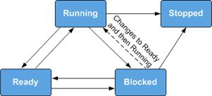

The state transition process is as follows:

* Ready → Running

A task enters Ready state once created. When a task switch occurs, the task with
the highest priority is selected from ready tasks and enters Running state to be
executed. Although the task is in Running state, it remains on the list of ready
tasks.

* Running → Blocked

When a running task is blocked (for example, it is suspended, delayed, obtaining
a mutex, reading a message, or waiting to read a semaphore), it will be deleted
from the list of ready tasks and enters Blocked state. The state transition
triggers a task switch where the task with the highest priority is selected from
ready tasks.

* Blocked → Ready (Blocked → Running)

After a blocked task is recovered (for example, if the task is resumed, the task
successfully reads a semaphore, or if the delay period or semaphore read period
expires), the task will be added to the list of ready tasks and enters ready
state. If the recovered task takes precedence over the running task, a task
switch will occur to send the resumed task into running state.

* Ready → Blocked

If a ready task is blocked (suspended), it will be deleted from the list of
ready tasks no longer participated in task scheduling and enter blocked state.

* Running → Ready

When a task is created or resumed with a higher priority than the running task,
the created or resumed task enters running state and task scheduling will be
occurred. Meanwhile, the original running task enters ready state but it remains
on the list of ready tasks.

* Running → Stopped

When a task running is stopped, the kernel automatically deletes the task. The
status of the task will change from running to stopped.

* Blocked → Stopped

If calling the delete API when the task is in blocked status, the task status
will change from blocked to stopped.

**Task ID**

* You will receive a task ID after successfully creating a task. You may suspend,
resume, or query a task using its ID.

**Task Priority**

* Tasks are executed based on their priority. In the event of a task switch, the
task with the highest priority will be selected from ready tasks.

**Task Entry Function**

* Each task has a task entry function, which is defined by the task creation
structure at the time of task creation and is executed after the task is
scheduled. You can design task entry functions.

**Task Control Block**

* Each task has a task control block (TCB). A TCB contains task information such
as context stack pointer (SP), state, priority, ID, name, and stack size. TCB
can reflect running conditions of each task.

**Task Stack**

* Each task has a separate task stack. The task stack stores information such as
local variables, registers, function parameters, and function return addresses.
When a task switch occurs, the context information of the task that is replaced
is saved to its task stack. When the task is resumed, its context information
will be quickly retrieved from the task stack to help resume the task from where
it was paused.

**Task Context**

* Resources (such as registers) used by a running task are collectively known as
task context, just like registers. After a task is suspended, other running
tasks might modify the context of the suspended task. If the original context of
the suspended task is not saved, the suspended task uses the modified context
once resumed, incurring unpredictable errors.

* Therefore, Huawei LiteOS will save the task context information of this task in
its own task stack. This function is to resume context information after the
task is resumed. There by continuing to execute the interrupted code when the
task is suspended.

**Task Switch**

* A task switch process involves a few activities, including selecting the ready
task with the highest priority, saving the context of the task that will be
replaced, and restoring the context of the task that is newly selected to be
executed.

**Operation Mechanism**

* The task management module of Huawei LiteOS provides functions such as creating,
deleting, delaying, suspending, and resuming tasks, changing task priorities,
locking and unlocking task scheduling, querying task IDs according to TCB, and
querying TCB information according to IDs.

* When a module is initialized before a task is created, the OS allocates memory
space needed by the TCB of the task. If insufficient memory space is available,
the task fails to be initialized. After the task is successfully initialized,
the operating system initializes the TCB of the task.

* While creating a task, the operating system initializes the task stack and
resets the context. The operating system also places the task entry function in
the correct position so that the function will be executed after the task is
booted for the first time.

### 4.1.2 Development Guidelines

**Usage Scenarios**

After a task is created, Huawei LiteOS Kernel can perform operations such as
unlocking task scheduling, scheduling/suspending/resuming/delaying a task, or
assigning/acquiring a task priority. When the task ends, the task will be
detached.

**Functions**

The task management module provides the following functions:

| Function Category            | API                 | Description                                                                                    |
|------------------------------|---------------------|------------------------------------------------------------------------------------------------|
| Task creation and deletion   | LOS_TaskCreateOnly  | Creates a task and suspends the task without scheduling it                                     |
|                              | LOS_TaskCreate      | Creates a task. The task enters Ready state and is scheduled                                   |
|                              | LOS_TaskDelete      | Deletes a particular task                                                                      |
| Task state control           | LOS_TaskResume      | Resumes the suspended task                                                                     |
|                              | LOS_TaskSuspend     | Suspends a particular task                                                                     |
|                              | LOS_TaskDelay       | Delays the task                                                                                |
|                              | LOS_TaskYield       | Defines decentralization, and adjusts the scheduling order of tasks with a particular priority |
| Task scheduling control      | LOS_TaskLock        | Locks task scheduling                                                                          |
|                              | LOS_TaskUnlock      | Unlocks task scheduling                                                                        |
| Task priority control        | LOS_CurTaskPriSet   | Assigns a priority to the current task                                                         |
|                              | LOS_TaskPriSet      | Set the priority of a particular task                                                          |
|                              | LOS_TaskPriGet      | Gets the priority of a particular task                                                         |
| Task information acquisition | LOS_CurTaskIDGet    | Gets the ID of the current task                                                                |
|                              | LOS_TaskInfoGet     | Gets the information of the current task                                                       |
|                              | LOS_TaskStatusGet   | Obtains the status of a specified task.                                                        |
|                              | LOS_TaskNameGet     | Obtains the name of a specified task.                                                          |
|                              | LOS_TaskInfoMonitor | Monitors all tasks and obtains task information.                                               |
|                              | LOS_NextTaskIDGet   | Obtains the ID of the task to be scheduled.                                                    |

**Development Process**

Task creation is used as an example to explain the development process.

1.  Configure the task management module in the los_config.h file.

    LOSCFG_BASE_CORE_TSK_LIMIT: the maximum number of tasks allowed. You can config according to requirement.

    LOSCFG_BASE_CORE_TSK_IDLE_STACK_SIZE: IDLE task stack size. Retain the default value unless otherwise required. You can config according to requirement.

    LOSCFG_BASE_CORE_TSK_DEFAULT_STACK_SIZE: default task stack size. Specify the parameter value according to actual needs when users create tasks.

    LOSCFG_BASE_CORE_TIMESLICE: a switch to enable or disable the Time Slice. Set it to YES.

    LOSCFG_BASE_CORE_TIMESLICE_TIMEOUT: time slice. You can config according to actual situations.

    LOSCFG_BASE_CORE_TSK_MONITOR: a switch to enable or disable the task monitoring module.

2.  Call the LOS_TaskLock API to lock task scheduling. Prohibits high-priority task scheduling.

3.  Call the LOS_TaskCreate API to create a task.

4.  Call the LOS_TaskUnlock API to unlock task scheduling. Schedules tasks in order of priority.

5.  Schedules tasks in order of priority. Delays the task.

6.  Call the LOS_TaskSuspend API to suspend the task. Suspends the task.

7.  Call the LOS_TaskResume API to resume the suspended task. Resumes the suspended task.

**Task State**

The status of Huawei LiteOS tasks is automatically maintained by the kernel,
which is invisible to users. Therefore, users do not need to perform this
operation.

**Task Error Codes**

An error code is returned when attempting to create, delete, suspend, resume, or
delay a task fails. The error code gives some insights into the possible cause
of the failure.

| SN | Error Code                              | Error ID Number | Description                                                 | Recommended Solution                                                 |
|----|-----------------------------------------|-----------------|-------------------------------------------------------------|----------------------------------------------------------------------|
| 1  | LOS_ERRNO_TSK_NO_MEMORY                 | 0x02000200      | Insufficient memory                                         | Allocate a larger memory area                                        |
| 2  | LOS_ERRNO_TSK_PTR_NULL                  | 0x02000201      | Null task parameter                                         | Check task parameters                                                |
| 3  | LOS_ERRNO_TSK_STKSZ_NOT_ALIGN           | 0x02000202      | Task stack size not aligned                                 | Align the task stack size on the boundary                            |
| 4  | LOS_ERRNO_TSK_PRIOR_ERROR               | 0x02000203      | Incorrect task priority                                     | Check the task priority                                              |
| 5  | LOS_ERRNO_TSK_ENTRY_NULL                | 0x02000204      | Null task entry function                                    | Define a task entry function                                         |
| 6  | LOS_ERRNO_TSK_NAME_EMPTY                | 0x02000205      | Task name unspecified                                       | Specify the task name                                                |
| 7  | LOS_ERRNO_TSK_STKSZ_TOO_SMALL           | 0x02000206      | Too small task stack                                        | Expand the task stack                                                |
| 8  | LOS_ERRNO_TSK_ID_INVALID                | 0x02000207      | Invalid task ID                                             | Check task IDs                                                       |
| 9  | LOS_ERRNO_TSK_ALREADY_SUSPENDED         | 0x02000208      | Task already suspended                                      | Suspend the task after it is resumed                                 |
| 10 | LOS_ERRNO_TSK_NOT_SUSPENDED             | 0x02000209      | Task not suspended                                          | Suspend the task                                                     |
| 11 | LOS_ERRNO_TSK_NOT_CREATED               | 0x0200020a      | Task not created                                            | Create the task                                                      |
| 12 | LOS_ERRNO_TSK_OPERATE_SWTMR             | 0x02000222      | Cannot operate software timer tasks                         | Do not operate software timer tasks                                  |
| 13 | LOS_ERRNO_TSK_MSG_NONZERO               | 0x0200020c      | Task information not zero                                   | Do not use the error code                                            |
| 14 | LOS_ERRNO_TSK_DELAY_IN_INT              | 0x0300020d      | Attempt to delay the task while an interrupt is underway    | Delay the task after the interrupt is finished                       |
| 15 | LOS_ERRNO_TSK_DELAY_IN_LOCK             | 0x0200020e      | Attempt to delay the task while task scheduling is locked   | Delay the task after task scheduling is unlocked                     |
| 16 | LOS_ERRNO_TSK_YIELD_INVALID_TASK        | 0x0200020f      | Invalid task to be scheduled                                | Check the task                                                       |
| 17 | LOS_ERRNO_TSK_YIELD_NOT_ENOUGH_TASK     | 0x02000210      | No task or only one task available for scheduling           | Add more tasks                                                       |
| 18 | LOS_ERRNO_TSK_TCB_UNAVAILABLE           | 0x02000211      | No idle TCB                                                 | Add more TCBs                                                        |
| 19 | LOS_ERRNO_TSK_HOOK_NOT_MATCH            | 0x02000212      | Task hook function mismatch                                 | Do not use the error code                                            |
| 20 | LOS_ERRNO_TSK_HOOK_IS_FULL              | 0x02000213      | Maximum number of task hook functions is reached            | Do not use the error code                                            |
| 21 | LOS_ERRNO_TSK_OPERATE_IDLE              | 0x02000214      | Idle task                                                   | Check the task ID and do not attempt to operate the task with the ID |
| 22 | LOS_ERRNO_TSK_SUSPEND_LOCKED            | 0x03000215      | Attempt to suspend the task while task scheduling is locked | Suspend the task after task scheduling is unlocked                   |
| 23 | LOS_ERRNO_TSK_FREE_STACK_FAILED         | 0x02000217      | Failed to free task stack                                   | Do not use the error code                                            |
| 24 | LOS_ERRNO_TSK_STKAREA_TOO_SMALL         | 0x02000218      | Small task stack area                                       | Do not use the error code                                            |
| 25 | LOS_ERRNO_TSK_ACTIVE_FAILED             | 0x02000219      | Failed to trigger the task                                  | Create an idle task and trigger a task switch                        |
| 26 | LOS_ERRNO_TSK_CONFIG_TOO_MANY           | 0x0200021a      | Too many task configuration options                         | Do not use the error code                                            |
| 27 | LOS_ERRNO_TSK_CP_SAVE_AREA_NOT_ALIGN    | 0x0200021b      | None                                                        | Do not use the error code                                            |
| 28 | LOS_ERRNO_TSK_MSG_Q_TOO_MANY            | 0x0200021d      | None                                                        | Do not use the error code                                            |
| 29 | LOS_ERRNO_TSK_CP_SAVE_AREA_NULL         | 0x0200021e      | None                                                        | Do not use the error code                                            |
| 30 | LOS_ERRNO_TSK_SELF_DELETE_ERR           | 0x0200021f      | None                                                        | Do not use the error code                                            |
| 31 | LOS_ERRNO_TSK_STKSZ_TOO_LARGE           | 0x02000220      | Large task stack                                            | Reduce the task stack size                                           |
| 32 | LOS_ERRNO_TSK_SUSPEND_SWTMR_NOT_ALLOWED | 0x02000221      | Suspension of a software timer task not allowed             | Check the task ID. Do not attempt to suspend a software timer task.  |

Error Code Definition

An error code is 32 bits in length, where:

* Bits 31–24: error severity

* Bits 23–16: error flag

* Bits 15–8: module that encounters the error

* Bits 7–0: error ID number

```
#define LOS_ERRNO_OS_NORMAL(MID,ERRNO)  \ 
(LOS_ERRTYPE_NORMAL | LOS_ERRNO_OS_ID | ((UINT32)(MID) << 8) | (ERRNO)) 
LOS_ERRTYPE_NORMAL : Define the error level as critical 
LOS_ERRNO_OS_ID : OS error code flag. 
MID: OS_MOUDLE_ID 
ERRNO: error ID number
```

For example:

```
LOS_ERRNO_TSK_NO_MEMORY  LOS_ERRNO_OS_FATAL(LOS_MOD_TSK, 0x00)
```


0x16,0x1c and 0x0b error codes are not defined and therefore cannot be used.

**Platform Differences**

None.

### 4.1.3 Precautions

* While a new task is being created, the task control blocks (TCBs) and task stacks of previously deleted tasks are reclaimed.

* A task name is a pointer and not allocated memory space. Do not set a task name to the address of a local variable when you set task name.

* If the task size is set to 0, the setting does not take effect. Instead, the default task size defined by the \#LOSCFG_BASE_CORE_TSK_DEFAULT_STACK_SIZE parameter is applied.

* Task stack size is aligned with the base address on the boundary of 8 bytes. Follow the "nothing more and nothing less" principle while determining the task stack size.

* A running task cannot be suspended while current task scheduling is locked.

* Idle and software timer tasks must not be suspended or deleted.

* In the interrupt handler function or in the case of the lock task, the operation that calls the LOS_TaskDelay API will fail.

* Locking task scheduling does not disable interrupts. Tasks can still be interrupted while task scheduling is locked.

* Locked task scheduling and unlocked task scheduling must be used in coordination.

* Task scheduling may occur while a task priority is being set.

* The maximum number of tasks (excluding idle tasks) able to be set by operating system is not equal to the total number of tasks available to users. For example, when a task is created for software timers, the number of available tasks is decreased by 1.

* Do not change the priority of a software timer task by calling the LOS_CurTaskPriSet API or the LOS_TaskPriSet API. Otherwise, system problems may occur.

* The LOS_CurTaskPriSet or LOS_TaskPriSet API must not be used when interrupts are being processed.

* If the corresponding task ID that LOS_TaskPriGet interface into the task is not created or exceed the maximum number of tasks, unified return 0xffff.

* Resources such as a mutex or a semaphore allocated to a task must have been released when the task is being deleted.

### 4.1.4 Programming Example

**Example Description**

Two tasks will be created: TaskHi and TaskLo. TaskHi has a higher priority than
TaskLo.

There are some examples giving some basic insight into priority-based task
scheduling and use cases of APIs, including create, delay, lock, unlock,
suspend, resume, and query (task ID and information by task ID) a task.

1.  Two tasks will be created: TaskHi and TaskLo.

2.  TaskHi has a higher priority.

3.  TaskLo has a lower priority.  

**Example Code**

```  
static UINT32 g_uwTskHiID;
static UINT32 g_uwTskLoID;

#define TSK_PRIOR_HI 4
#define TSK_PRIOR_LO 5

static UINT32 Example_TaskHi(VOID)
{
    UINT32 uwRet = LOS_OK;

    dprintf("Enter TaskHi Handler.\r\n");

    /* task delay 5 ticks, task will be suspend */
    uwRet = LOS_TaskDelay(5);
    if (uwRet != LOS_OK)
    {
        dprintf("Delay Task Failed.\r\n");
        return LOS_NOK;
    }

    /* task resumed */
    dprintf("TaskHi LOS_TaskDelay Done.\r\n");

    /* suspend self */
    uwRet = LOS_TaskSuspend(g_uwTskHiID);
    if (uwRet != LOS_OK)
    {
        dprintf("Suspend TaskHi Failed.\r\n");
        uwRet = LOS_InspectStatusSetByID(LOS_INSPECT_TASK, LOS_INSPECT_STU_ERROR);
        if (LOS_OK != uwRet)
        {
            dprintf("Set Inspect Status Err\n");
        }
        return LOS_NOK;
    }

    dprintf("TaskHi LOS_TaskResume Success.\r\n");

    uwRet = LOS_InspectStatusSetByID(LOS_INSPECT_TASK, LOS_INSPECT_STU_SUCCESS);
    if (LOS_OK != uwRet)
    {
        dprintf("Set Inspect Status Err\n");
    }

    /* delete self */
    if(LOS_OK != LOS_TaskDelete(g_uwTskHiID))
    {
        dprintf("TaskHi delete failed .\n");
        return LOS_NOK;
    }

    return LOS_OK;
}

static UINT32 Example_TaskLo(VOID)
{
    UINT32 uwRet;

    dprintf("Enter TaskLo Handler.\r\n");

    /* task delay 10 ticks, task will be suspend */
    uwRet = LOS_TaskDelay(10);
    if (uwRet != LOS_OK)
    {
        dprintf("Delay TaskLo Failed.\r\n");
        return LOS_NOK;
    }

    dprintf("TaskHi LOS_TaskSuspend Success.\r\n");

    /* resumed task g_uwTskHiID */
    uwRet = LOS_TaskResume(g_uwTskHiID);
    if (uwRet != LOS_OK)
    {
        dprintf("Resume TaskHi Failed.\r\n");
        uwRet = LOS_InspectStatusSetByID(LOS_INSPECT_TASK, LOS_INSPECT_STU_ERROR);
        if (LOS_OK != uwRet)
        {
            dprintf("Set Inspect Status Err\n");
        }
        return LOS_NOK;
    }

    /* delete self */
    if(LOS_OK != LOS_TaskDelete(g_uwTskLoID))
    {
        dprintf("TaskLo delete failed .\n");
        return LOS_NOK;
    }

    return LOS_OK;
}

UINT32 Example_TskCaseEntry(VOID)
{
    UINT32 uwRet;
    TSK_INIT_PARAM_S stInitParam;

    /* lock task shcedue */
    LOS_TaskLock();

    dprintf("LOS_TaskLock() Success!\r\n");

    stInitParam.pfnTaskEntry = (TSK_ENTRY_FUNC)Example_TaskHi;
    stInitParam.usTaskPrio = TSK_PRIOR_HI;
    stInitParam.pcName = "HIGH_NAME";
    stInitParam.uwStackSize = LOSCFG_BASE_CORE_TSK_DEFAULT_STACK_SIZE;
    /* create high prio task */
    uwRet = LOS_TaskCreate(&g_uwTskHiID, &stInitParam);
    if (uwRet != LOS_OK)
    {
        LOS_TaskUnlock();

        dprintf("Example_TaskHi create Failed!\r\n");
        return LOS_NOK;
    }

    dprintf("Example_TaskHi create Success!\r\n");

    stInitParam.pfnTaskEntry = (TSK_ENTRY_FUNC)Example_TaskLo;
    stInitParam.usTaskPrio = TSK_PRIOR_LO;
    stInitParam.pcName = "LOW_NAME";
    stInitParam.uwStackSize = LOSCFG_BASE_CORE_TSK_DEFAULT_STACK_SIZE;
    /* create low prio task */
    uwRet = LOS_TaskCreate(&g_uwTskLoID, &stInitParam);
    if (uwRet != LOS_OK)
    {
        /* delete high prio task */
        if (LOS_OK != LOS_TaskDelete(g_uwTskHiID))
        {
            dprintf("TaskHi delete failed .\n");
        }

        LOS_TaskUnlock();

        dprintf("Example_TaskLo create Failed!\r\n");

        return LOS_NOK;
    }
```  

**Verification**

The verification result is as follows:

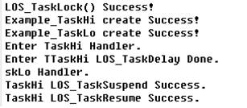

<h3 id="4.2">4.2 Memory</h3>

### 4.2.1 Overview

**Basic Concept**

The memory management module is one of the core modules of an operating system.
Memory management primarily involves initializing, allocating, and freeing up
memory.

While the operating system is running, the memory management module manages
memory usage of users and the operating system by allocating and freeing up
memory. This helps reduce memory fragments as much as possible.

Memory management is classified into static and dynamic memory management.

* Dynamic memory: a memory block of user-defined size

  -  Advantage: on-demand memory allocation

  -  Disadvantage: risk of memory fragments

* Static memory: a memory block whose size is predefined at the time of initialization

  -  Advantages: no memory fragments; efficient memory allocation and freeing

  -  Disadvantage: memory cannot be allocated on demand

**Dynamic Memory Operation Mechanism**

Dynamic memory management means taking a memory block of the required size out
of the large pool of continuous memory whenever a user needs it, and reclaiming
the memory block when the user no longer needs it.

Comparing with static memory, the advantage is to allocate a memory block of the
required size, and the disadvantage is that memory pool prone to fragmentation.

If a user's request for memory is fulfilled, the user will be allocated a memory
block of the requested size. The control header indicates the start address of
the allocated memory block.

All control headers are recorded in a linked list and categorized by memory
size. From the linked list, the operating system can quickly find which memory
block has the required size.

The LiteOS dynamic memory supports two standard algorithms: DLINK and BEST
LITTLE.

**1 DLINK**

Figure the dynamic memory management structure in Huawei LiteOS:

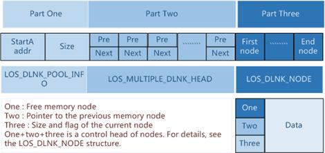

**Part one:** indicates the start address and size of the heap memory (memory pool).

**Part two:** is an array of which each element is a doubly linked list. Control
headers of all free nodes are categorized and mounted to the doubly linked lists
in this array.

If the smallest node allowed by the memory is 2min bytes, the first doubly
linked list in the array stores free nodes of the size that is bigger than 2min
and smaller than 2min+1. The second doubly linked list in the array stores free
nodes of the size that is bigger than 2min+1 and smaller than 2min+2. The nth
doubly linked list in the array stores free nodes of the size that is bigger
than 2min+n–1 and smaller than 2min+n. When memory is allocated, a free node of
appropriate size (the size of the node being created) is located and memory is
allocated to the free node. When memory is freed up, the freed memory is stored
to the array as free nodes for later use.

**Part three:** uses most space in the memory pool and is the actual area that stores
nodes. The ```LOS_MEM_DYN_NODE node``` structure is described as follows:

```  
typedef struct tagLOS_MEM_DYN_NODE
{
LOS_DL_LIST stFreeNodeInfo;
struct tagLOS_MEM_DYN_NODE *pstPreNode;
UINT32 uwSizeAndFlag;
}LOS_MEM_DYN_NODE;
```    

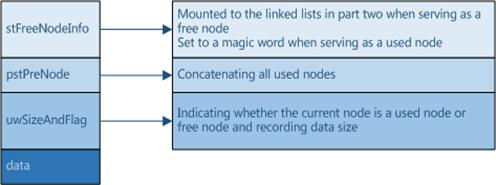

**2 BEST LITTLE**

The dynamic memory allocation of LiteOS supports the best adaptation algorithm,
that is, BEST LITTLE. Each time the allocation is performed, the smallest and
most suitable memory block in the memory pool is selected for allocation. Based
on BEST LITTLE, LiteOS dynamic memory management uses the SLAB mechanism to
allocate memory blocks of a fixed size to reduce the possibility of generating
memory fragments.

The SLAB mechanism in LiteOS memory management supports the configurable number
of SLAB CLASSes and the maximum space of each CLASS. In this example, the number
of SLAB CLASSes is four and the maximum space of each CLASS is 512 bytes. There
are four SLAB CLASSes in the memory pool. The total assignable size of each SLAB
CLASS is 512 bytes. The first SLAB CLASS is divided into 32 16-byte SLAB blocks,
and the second SLAB CLASS is divided into 16 32-byte SLAB blocks. The third SLAB
CLASS is divided into eight 64-byte SLAB blocks, and the fourth SLAB CLASS is
divided into four 128-byte SLAB blocks. The four SLAB CLASSes are allocated from
the memory pool based on BEST LITTLE.

When initializing the memory management, initialize the memory pool first, apply
for four SLAB CLASSes according to BEST LITTLE in the initialized memory pool,
and initialize the four SLAB CLASS according to the SLAB mechanism one by one.

Each time applying for the memory, apply for the best SLAB CLASS that meets the
requested size. For example, if the user applies for a 20-byte memory, apply for
the SLAB CLASS with the size of 32 bytes. If the application succeeds, the
entire SLAB memory block is returned to the user. When the memory block is
released, the entire block is recycled. If no memory block that can be allocated
exists in the SLAB CLASS that meets the condition, continue to apply to the
memory pool according to BEST LITTLE. Note that if there is no available SLAB
block in the current SLAB CLASS, apply to the memory pool directly instead of
applying to the SLAB CLASS with larger SLAB blocks.

When the memory is released, the system checks whether the released memory block
belongs to a SLAB CLASS. If the memory block belongs to a SLAB CLASS, the memory
block is returned to the SLAB CLASS. Otherwise, the memory block is returned to
the memory pool.

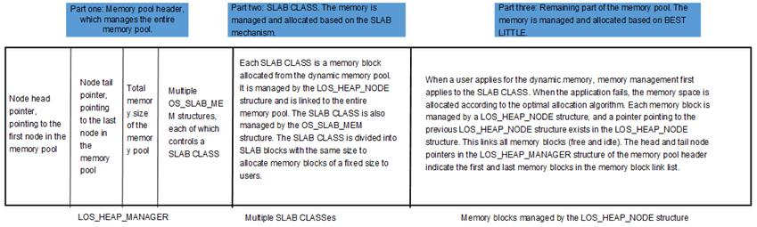

**Static Memory Operation Mechanism**

Static memory is in essence a static array. The size of a static memory block is
defined at the time of initialization and cannot be changed since then.

A static memory pool consists of a control block and several memory blocks of
same size. The control block is placed at the head of the static memory pool to
manage memory blocks. Then allocate and free up of memory block according to the
size of the blocks.

Static memory

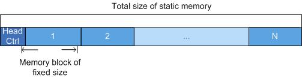

### 4.2.2 Dynamic Memory

#### 4.2.2.1 Development Guidelines

**Usage Scenarios**

The main task of memory management is to dynamically partition and manage user
allocated memory intervals.

Dynamic memory management is used when users have different demands on memory
blocks.

When a user allocates a memory block of specified size, the operating system
calls the LOS_AllocMem API to allocate the requested amount of memory. When the
user no longer needs the memory block, the operating system calls the
LOS_FreeMem API to free up the memory block.

**Functions**

The memory management module in Huawei LiteOS System provides the following
functions. For details about the APIs, see the API reference.

| Function Category                                                       | API                      | Description                                                                                                                                                                                 |
|-------------------------------------------------------------------------|--------------------------|---------------------------------------------------------------------------------------------------------------------------------------------------------------------------------------------|
| Memory initialization                                                   | LOS_MemInit              | Initializes a specific dynamic memory pool                                                                                                                                                  |
| Dynamic memory allocation                                               | LOS_MemAlloc             | Allocates a specific dynamic memory pool block of specified size                                                                                                                            |
| Dynamic memory free up                                                  | LOS_MemFree              | Frees up the allocated dynamic memory block                                                                                                                                                 |
| Memory reallocation                                                     | LOS_MemRealloc           | Reallocates memory block according to the size, and retains data in the previously allocated memory area.                                                                                   |
| Aligned memory allocation                                               | LOS_MemAllocAlign        | Takes the memory block of requested specific size out of the specific dynamic memory pool and aligns the head or tail of the memory address with a base address on the predefined boundary. |
| Analyzing memory pool status                                            | LOS_MemStatisticsGet     | Obtains the statistics of a specified memory pool.                                                                                                                                          |
| Querying the maximum number of available idle blocks in the memory pool | LOS_MemGetMaxFreeBlkSize | Obtains the maximum number of available idle blocks in a specified memory pool.                                                                                                             |

**Development Process**

1 Configuration:

OS_SYS_MEM_ADDR: start address of the dynamic memory pool. In most cases, retain
the default value.

OS_SYS_MEM_SIZE: size (in bytes) of the dynamic memory pool. By default, the
dynamic memory pool is the memory space that is left unused after DDR is
allocated.

LOSCFG_BASE_MEM_NODE_INTEGRITY_CHECK: a switch to enable or disable memory
overwriting check. Default value: disabled. If enabled, the operating system
carries out the memory overwriting check when a dynamic memory block is
allocated or a static memory block is freed.

2 LOS_MemInit initialization

The result of initializing a dynamic memory pool is shown as the figure bellow,
generating a EndNode, and all the memory left signed to be FreeNode. Notice:
EndNode as the last node in memory pool with size 0.


3 LOS_MemAlloc for allocating a dynamic memory block of any sizes

Determines whether the required amount of memory is available. If available, it
takes a dynamic memory block of requested size out of the large continuous
memory and returns the pointer of the dynamic memory block to the user. If
unavailable, it returns NULL to the user.

Call the LOS_MemAlloc API three times to create three nodes. Assumes that their
names are UsedA, UsedB, and UsedC. Their sizes are sizeA, sizeB, and sizfeC.
Because there is only one large FreeNode in the memory pool when the pool is
just initialized, these memory blocks cut from the FreeNode.


If malloc occurred when there are many FreeNodes in the memory pool, memory
block will be created with the FreNode that malloced with the most benefited
size to reduce memory fragmentation. If the size of the new one is not equal to
the used one, the redundant memory block will be signed as a new FreeNode after
creating a new memory block.

4 LOS_MemFree for free up dynamic memory

Reclaims the dynamic memory block for using next time.

Suppose that calling the LOS_MemFree to free up memory block UsedB, the memory
block UsedB will be reclaimed and signed as FreeNode.


**BEST LITTLE Development Process**

1 Configure the SLAB CLASS.

**OS_SYS_MEM_ADDR**: Indicates the start address of the dynamic memory pool of
LiteOS, which is user-defined.

**OS_SYS_MEM_SIZE**: Indicates the size of the dynamic memory pool in the unit
of byte, which is user-defined.

**LOSCFG_MEMORY_BESTFIT**: Set this parameter to **YES**, indicating that the
BESTFIT algorithm selected.

**LOSCFG_KERNEL_MEM_SLAB**: Set this parameter to **YES**, indicating that the
SLAB mechanism is enabled.

**SLAB_MEM_COUNT**: This parameter is in the kernel and does not need to be
modified. It indicates the number of SLAB CLASSes. Currently, this parameter is
set to **4**.

**SLAB_MEM_ALLOCATOR_SIZE**: This parameter is in the kernel and does not need
to be modified. It indicates the maximum block size to be allocated of each SLAB
CLASS.

**SLAB_BASIC_NEED_SIZE**: This parameter is in the kernel and does not need to
be modified. It indicates the minimum stack space required for initializing the
SLAB mechanism. If the **SLAB_MEM_COUNT** and **SLAB_MEM_ALLOCATOR_SIZE**
parameters are modified, this parameter needs to be modified synchronously.

2 Initialize the SLAB CLASS.

Call the LOS_MemInit function to initialize the specified dynamic memory pool.
If the SLAB mechanism is enabled and the available memory in the memory pool is
greater than the minimum memory required by the SLAB, the SLAB CLASS is
initialized.

3 Apply for a dynamic memory of any size.

Call the LOS_MemAlloc function to apply for a memory block of a specified size
from the specified memory pool. The memory management module first applies for a
memory block from the SLAB CLASS. If the application fails, the memory
management module applies to the stack memory space and returns the application
result to the user. When applying to the stack memory space, a memory block may
be split.

4 Release the dynamic memory.

Call the LOS_MemFree function to release the specified memory block from the
specified dynamic memory pool. When releasing the memory block, the system
checks whether the memory block belongs to a SLAB CLASS. If the memory block
belongs to a SLAB CLASS, the system returns the memory block to the SLAB CLASS.
Otherwise, the memory block is released to the stack memory space. When
releasing the memory block to the stack memory space, a memory block may be
split.

**Platform Differences**

None.

#### 4.2.2.2 Precautions

* Dynamic memory management consumes the memory of the management control block structure. Therefore, the memory space available to users is smaller than the OS_SYS_MEM_SIZE defined in the los_config.h file.

* Calls to the LOS_MemAllocAlign API may consume a certain amount of memory and result in memory fragments. When the memory used for alignment is freed up, the resulting memory fragments will be reclaimed.

* During memory reallocation to a user by using the LOS_MemRealloc API, the operating system determines whether sufficient continuous memory is adjacent to the memory area that has been allocated to the user. If adjacent memory is insufficient, the operating system frees up the previously allocated memory area and finds a new memory area for the user. The user does not need to manually free up the previously allocated memory area.

* If the same memory block is repeatedly freed using the LOS_MemFree API, the first free-up operation receives an operation succeed message. However, subsequent free-up attempts lead to invalid operations on the pointer of the memory block and ultimately unpredictable results.

#### 4.2.2.3 Programming Example

**Example Description**

Memory is a scarce resource. If memory is frequently used while the operating
system is running, program the memory management module to allocate and free up
memory efficiently.

In the programming example, the following steps will be performed:

1 Initialize a dynamic memory pool.

2 Take a memory block out of the initialized memory pool and allocate it to a user.

3 Store data in the memory block.

4 Print the data in the memory block.

5 Free up the memory block.

**Example Code**

```  
UINT32 Example_Dyn_Mem(VOID)
{
    UINT32 *p_num = NULL;
    UINT32 uwRet;
    uwRet = LOS_MemInit(m_aucSysMem0, OS_SYS_MEM_SIZE);
    if (LOS_OK == uwRet)
    {
        dprintf("mempool init ok!\n");//内存初始化成功！
    }
    else
    {
        dprintf("mempool init failed!\n");//内存初始化失败！
        return LOS_NOK;
    }
    /*分配内存*/
    p_num = (UINT32*)LOS_MemAlloc(m_aucSysMem0, 4);
    if (NULL == p_num)
    {
        dprintf("mem alloc failed!\n");//内存分配失败！
        return LOS_NOK;
    }
    dprintf("mem alloc ok\n");//内存分配成功！
    /*赋值*/
    *p_num = 828;
    dprintf("*p_num = %d\n", *p_num);
    /*释放内存*/
    uwRet = LOS_MemFree(m_aucSysMem0, p_num);
    if (LOS_OK == uwRet)
    {
        dprintf("mem free ok!\n");//内存释放成功！
        uwRet = LOS_InspectStatusSetByID(LOS_INSPECT_DMEM,LOS_INSPECT_STU_SUCCESS);
  if (LOS_OK != uwRet)  
  {
   dprintf("Set Inspect Status Err\n");
  }
    }
    else
    {
        dprintf("mem free failed!\n");//内存释放失败！
        uwRet = LOS_InspectStatusSetByID(LOS_INSPECT_DMEM,LOS_INSPECT_STU_ERROR);
  if (LOS_OK != uwRet)  
  {
   dprintf("Set Inspect Status Err\n");
  }
        return LOS_NOK;
    }
    return LOS_OK;
}
```  

**Verification**

Verification result

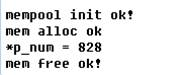

### 4.2.3 Static Memory

### 4.2.3.1 Development Guidelines

**Usage Scenarios**

Static memory management is used when users demand memory of fixed size. When a
user requests memory, the operating system calls the LOS_AllocBox API to
allocate a static memory block. When the user no longer needs the memory, the
operating system calls the LOS_FreeBox API to free up the memory block.

**Functions**

Static memory management of Huawei LiteOS provides the following functions:

| Function Category                  | API                     | Description                                                                                                                                     |
|------------------------------------|-------------------------|-------------------------------------------------------------------------------------------------------------------------------------------------|
| Static memory initialization       | LOS_MemboxInit          | Initializes a static memory pool; defines the start address and total size of the static memory pool, as well as the size of each memory block. |
| Static memory clearing             | LOS_MemboxClr           | Clears data in a memory block of fixed size.                                                                                                    |
| Static memory allocation           | LOS_MemboxAlloc         | Allocates a static memory block.                                                                                                                |
| Memory free-up                     | LOS_MemboxFree          | Frees up a static memory block.                                                                                                                 |
| Static memory pool status analysis | LOS_MemboxStatisticsGet | Obtains the statistics of a specified static memory pool.                                                                                       |

**Development Process**

This section introduces the typical scenario development process using static memory:

1 Allocate continuous memory as a static memory pool.

2 Call the LOS_MemboxInit API

Initializes the static memory pool; divides the memory pool that matches the
input parameters into N memory blocks, where N depends on the total size of
static memory pool and the size of each static memory block); adds all static
memory blocks into a linked list of idle memory blocks; places a control header
at the beginning of static memory pool.

3 Call the LOS_MemboxAlloc API

Takes an idle memory block out of the linked list and returns the user space
address of the memory block.

4 Call the LOS_MemboxFree API

Adds the static memory block that has been freed up to the linked list.

5 Call the LOS_MemboxClr API

Clears data in the static memory block that matches the input parameters.

**Platform Differences**

None.

#### 4.2.3.2 Precautions

The range of static memory pool can be acquired by using either a global variable array or the LOS_AllocMem API. In the latter case, to avoid memory leaks, free up a static memory block when the block is no longer in use.

#### 4.2.3.3 Programming Example

**Example Description**

Memory is a scarce resource. If memory is frequently used while the operating
system is running, program the memory management module to allocate and free up
memory efficiently.

In the programming example, the following steps will be performed:

1 Initialize a static memory pool.

2 Take a static memory block out of the static memory pool.

3 Store data in the memory block.

4 Print the data in the memory block.

5 Clear the data in the memory block.

6 Free up the memory block.

**Example Code**

```  
UINT32 Example_StaticMem(VOID)
{
    UINT32 *p_num = NULL;
    UINT32 uwBlkSize = 3, uwBoxSize = 48;
    UINT32 uwRet;

    uwRet = LOS_MemboxInit(&pBoxMem[0], uwBoxSize, uwBlkSize);
    if (uwRet != LOS_OK)
    {
        dprintf("Mem box init failed\n");
        return LOS_NOK;
    }
    else
    {
        dprintf("Mem box init ok!\n");
    }

    /* membox alloc */
    p_num = (UINT32*)LOS_MemboxAlloc(pBoxMem);
    if (NULL == p_num)
    {
        dprintf("Mem box alloc failed!\n");
        return LOS_NOK;
    }
    dprintf("Mem box alloc ok\n");
    /* assignment */
    *p_num = 828;
    dprintf("*p_num = %d\n", *p_num);
    /* clear mem context */
    LOS_MemboxClr(pBoxMem, p_num);
    dprintf("clear data ok\n *p_num = %d\n", *p_num);
    /* membox free */
    uwRet = LOS_MemboxFree(pBoxMem, p_num);
    if (LOS_OK == uwRet)
    {
        dprintf("Mem box free ok!\n");
        uwRet = LOS_InspectStatusSetByID(LOS_INSPECT_SMEM, LOS_INSPECT_STU_SUCCESS);
        if (LOS_OK != uwRet)
        {
            dprintf("Set Inspect Status Err\n");
        }
    }
    else
    {
        dprintf("Mem box free failed!\n");
        uwRet = LOS_InspectStatusSetByID(LOS_INSPECT_SMEM, LOS_INSPECT_STU_ERROR);
        if (LOS_OK != uwRet)
        {
            dprintf("Set Inspect Status Err\n");
        }
    }

    return LOS_OK;
}  
```  

**Verification**

Verification result


<h3 id="4.3">4.3 Interrupt</h3>

#### 4.3.1 Overview

**Basic Concept**

When a condition that needs immediate attention occurs, the CPU suspends current
activities and switches to deal with the condition.

The CPU runs faster than external peripherals. When external peripherals are
able to fulfill an activity alone, the CPU takes care of other activities.

When the CPU must be involved in fulfilling an activity, the interrupt mechanism
enables an external peripheral to emit an interrupt signal to alert the CPU of
the high-priority condition requiring the interruption of current activities.
The CPU does not need to keep waiting for peripheral states, thereby improving
CPU efficiency and accelerating system response.

The interrupt mechanism supports:

* Initialize

* Create

* Lock or unlock

* Restore

* Enable

* Disable


The interrupt mechanism of Huawei LiteOS is based on interrupt.

**Introduce of Interrupt**

The following three types of hardware are involved in the interrupt mechanism:

* Device: the interrupt source. When a device requests the help of the CPU, it emits an interrupt signal to the interrupt controller.

* Interrupt controller: a type of peripheral that sends an interrupt request to the CPU after receiving an interrupt signal from the interrupt pins of other peripherals. On the interrupt controller, you can prioritize, enable, or disable interrupt sources, as well as specify an interrupt trigger mode on each interrupt source. Common interrupt controllers include the Vector Interrupt Controller (VIC) and General Interrupt Controller (GIC, typically used in ARM Cortex-A7).

* CPU: executes an interrupt handler at the request of an interrupt source.

**Terminology Associated With Interrupt**

Interrupt ID: a unique identifier contained in all interrupt requests from a
particular interrupt source.

Interrupt request (IRQ): an electrical pulse signal sent to alert the CPU of an
urgent condition. The CPU suspends current activities and deals with the
condition that needs immediate attention.

Interrupt priority: the priority of an interrupt source. Interrupt priority is
determined based on importance and urgency. Huawei LiteOS supports the interrupt
priority and interrupt nesting of the interrupt controller. Interrupt management
does not limit the priority and nesting.

Interrupt handler: When an external peripheral generates an interrupt request,
the CPU executes an interrupt handler to switch from current activities to the
event that needs immediate attention.

Interrupt trigger: set to 1 when an interrupt source emits an interrupt signal.

Interrupt trigger type: the way in which an interrupt signal is sent to the
interrupt controller. Typically, an interrupt signal is either level-triggered
or edge-triggered.

Interrupt vector: starting address of interrupt service routine.

Interrupt vector table: a table where interrupt vectors are stored based on
interrupt ID.

Interrupt sharing: If only a few external peripherals are present, each external
peripheral is allocated a unique interrupt ID. However, if there are many
external peripherals, consider sharing an interrupt ID among external
peripherals. The interrupt handlers of the interrupts that share the same
interrupt ID form a linked list. When an external peripheral generates an
interrupt request, Huawei LiteOS Kernel traverses the linked list to find the
interrupt handler of the interrupt request.

Interrupt top half and bottom half: If an interrupt is long, other interrupts
that are more important may be blocked out. To balance the performance and
workload of an interrupt handler, an interrupt handler is logically divided into
two parts. The top half takes care of the urgent and critical part of the
interrupt, and the bottom half deals with work, the longer yet less important
part of the interrupt.

The top half of an interrupt typically reads the interrupt state from a
register, clears the interrupt flag, and places the work in the workqueue.

**Operation Mechanism**

Interrupt mechanism of Huawei LiteOS supports interrupt sharing:

The implementation of interrupt sharing depends on the linked list. Each
interrupt ID creates a linked list, the linked list node contains the interrupt
handler function and the function input. When creating interrupts for many times
to one same interrupt ID, the interrupt handler function and the function input
will be added to linked list. So when the hardware is interrupted, through the
interrupt number to find its corresponding structure of the list, the
implementation of the list of the interrupt handler.

Interrupt mechanism of Huawei LiteOS supports Interrupt bottom half:

The implementation of interrupt bottom half depends on workqueue, job is divided
into interrupt top half and bottom half in interrupt handler. Handler int bottom
half is associated with work, and mounted to legal workqueue. System executes
bottom half program of work in workqueque while free.

#### 4.3.2 Development Guidelines

**Usage Scenarios**

When an interrupt request is generated, the CPU responds by suspending current
activities and calling the user-defined interrupt handler to deal with the
condition that needs immediate attention.

**Functions**

The interrupt module provides the following functions:

| API            | Description                                                                  |
|----------------|------------------------------------------------------------------------------|
| LOS_HwiCreate  | Creates a hardware interrupt to register the corresponding interrupt handler |
| LOS_IntUnLock  | Unlocks an interrupt                                                         |
| LOS_IntRestore | Restores an interrupt                                                        |
| LOS_IntLock    | Locks an interrupt                                                           |
| LOS_HwiDelete  | Deletes a hard interrupt                                                     |

**Development Process**

1 Configure the following parameters:

  - LOSCFG_PLATFORM_HWI: a switch to enable or disable the hardware interrupt module. Set to YES.

  - LOSCFG_PLATFORM_HWI_LIMIT: the maximum allowed number of hardware interrupts.

2 Call the LOS_HwiInit API to initialize the interrupt mechanism.

3 Call the LOS_HwiCreate API to create an interrupt. Enabel the specified interrupt as required.

4 Call the LOS_HwiDelete API to delete an interrupt.  


#### 4.3.3 Precautions

* The register address of the LosHwiInit operation and the maximum allowed number of interrupts vary depending on hardware specifications.

* Avoid long-running interrupt handlers because they have negative impact on CPU's response to interrupts.

* The function leading to schedule cannot be performed after breading off.

* The input parameter of the LOS_IntRestore() API must be the PRIMASK that is saved by the LOS_IntLock() API before locking the interrupt.

* In Cortex-A7, interrupts 0–31 are for internal use and it is not advisable to request or create them.

#### 4.3.4 Programming Example

**Example Description**

The programming example will cover the following functions:

1 Disabling an interrupt

2 Creating an interrupt

3 Enabling an interrupt

4 Restoring an interrupt

5 Disabling an interrupt

**Example Code**

Prerequisite

* The **LOSCFG_PLATFORM_HWI** parameter in the **los_config.h** file is set to
    **YES**.

* The **OS_HWI_LIMIT MAX_USED_NUM** parameter in the **los_config.h** file is set to the maximum number of hardware interrupts the operating system allows.


The current interrupt test code provides a basic framework. The interrupt
hardware initialization code can be implemented by calling the
Example_Exti0_Init () function based on the hardware of the development board.

The code is as follows:

```  
static VOID Example_Exti0_Init(VOID)
{
    /*add your IRQ init code here*/

    return;
}

static VOID User_IRQHandler(VOID)
{
    dprintf("\n User IRQ test\n");
    //LOS_InspectStatusSetByID(LOS_INSPECT_INTERRUPT,LOS_INSPECT_STU_SUCCESS);
    return;
}

UINT32 Example_Interrupt(VOID)
{
    UINTPTR uvIntSave;
    uvIntSave = LOS_IntLock();

    Example_Exti0_Init();

    LOS_HwiCreate(6, 0, 0, User_IRQHandler, 0);//create interrupt

    LOS_IntRestore(uvIntSave);

    return LOS_OK;
}  
```  

**Verification**


<h3 id="4.4">4.4 Queue</h3>

#### 4.4.1 Overview

**Basic Concept**

A queue, also known as message queue, stores messages (also known as data) to be
communicated between tasks. The length of message received by a queue is user
defined. A queue receives messages of user-defined length from tasks or
interrupts and determines whether to store a transferred message based on the
interface through which the message is sent. A task reads messages from a queue.
If the queue is empty, the task is suspended. When a new message is stored in
the queue, the suspended task is woken up and processes the message.

A queue allows for asynchronous processing of messages, through which a message
can be placed in a queue but left not processed immediately, and messages can be
buffered.

The following features characterize queues:

* Messages in a queue are processed in the first in first out order. A message can be read and written asynchronously.

* Reading data from a queue and writing data into a queue support the timeout mechanism.

* The sender and the receiver agree on the type of message to be exchanged. The message length is variable, but cannot exceed the maximum message unit length.

* A task can choose any queue to send or receive messages.

* Multiple tasks can choose the same queue to send or receive messages.

* If a queue is allocated a dynamic memory block, the memory block can be reclaimed using the LOS_FreeMem API when the queue is no longer in use.

**Operation Mechanism**

**Queue Control Block**

```  
/**
  * @ingroup los_queue
  * Queue information block structure
  */
typedef struct tagQueueCB
{
    UINT8       *pucQueue;      /**< pointer to the queue */
    UINT16      usQueueState;   /**< queue state */
    UINT16      usQueueLen;     /**< number of messages in the queue */
    UINT16      usQueueSize;    /**< message node size */
    UNIT16      usQueueID;      /**< queue ID */
    UINT16      usQueueHead;    /**< message head node position (array subscript)*/
    UINT16      usQueueTail;    /**< message tail node position (array superscript)*/
    UINT16      usReadWritableCnt[2];      /**< Number of writable or readable messages in a queue. 0 indicates readable, and 1 indicates writable.*/ 
    LOS_DL_LIST stReadWriteableList[2];    /**< Read/write blocking queue. 0 indicates the read blocking queue, and 1 indicates the write blocking queue.*/
    LOS_DL_LIST stMemList;      /**< MailBox module usage */
} QUEUE_CB_S;  
```  

Each queue control block contains the element of queue state that indicates the
usage of this queue:

* OS_QUEUE_UNUSED: The queue is not in use.

* OS_QUEUE_INUSED: The queue is in use.

**Working Principles**

During queue creation, memory is allocated to the queue based on the queue
length and message node size and the queue ID is returned.

A message head node position (Head) and a message tail node position (Tail) are
used in a queue control block to indicate the message storage in a queue. Head
indicates the start position of an occupied message, and Tail indicates the
start position of a vacant message. When a queue is first created, both Head and
Tail point to the start position of the queue.

Data is written into the vacant message unit after the occupied message unit
tail. If Tail points to the queue tail, the data is written into the start of
the queue. The **usWritableCnt** parameter specifies whether the queue is fully
occupied. Data cannot be written to a fully occupied queue (the
**usWritableCnt** parameter value is **0**).

Data is read from the head of the occupied message units. If Head points to the
queue tail, the data that is first written into the start of the queue is read.
The **usReadableCnt** parameter specifies whether data is available for reading.
A task of reading data from a vacant queue (the **usReadableCnt** parameter
value is **0**) will be suspended.

During queue deletion, locate the queue that has a specified ID, set the queue
state to be not in use, free up the memory allocated to the queue, and
initialize the queue control head.

Read/write from/into a queue

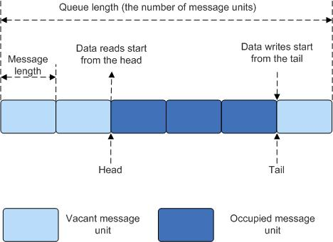

#### 4.4.2 Development Guidelines

**Functions**

The message processing module of Huawei LiteOS provides the following functions:

| Function Category             | API                | Description                                                                                                            |
|-------------------------------|--------------------|------------------------------------------------------------------------------------------------------------------------|
| Queue creation                | LOS_QueueCreate    | Creates a queue.                                                                                                       |
| Queue reading                 | LOS_QueueRead      | Reads data from a queue; data copy is not supported. The buff stores addresses of message units.                       |
| Queue writing                 | LOS_QueueWrite     | Writes data into a queue; data copy is not supported. The data written into a message unit is the buff address.        |
| Queue reading                 | LOS_QueueReadCopy  | Reads data from a particular queue; data copy is supported. The buff stores data retrieved from message units.         |
| Queue writing                 | LOS_QueueWriteCopy | Writes data into a particular queue; data copy is supported. The data written into a message unit is the buff address. |
| Queue writing                 | LOS_QueueWriteHead | Write data into the head of a particular queue.                                                                        |
| Queue deletion                | LOS_QueueDelete    | Deletes a queue.                                                                                                       |
| Queue information acquisition | LOS_QueueInfoGet   | Gets information about a queue.                                                                                        |

**Development Process**

Typical process of using the queue module:

1 Call the LOS_QueueCreate API to create a queue. Creates a queue and returns a queue ID.

2 Call the LOS_QueueWrite API to write data into a queue.

3 Call the LOS_QueueRead API to read data from a queue.

4 Call the LOS_QueueInfoGet API to get information about the queue.

5 Call the LOS_QueueDelete to delete a queue.

**Queue Error Code**

Error codes are returned if errors occur during queue operations, such as queue
creation and queue deletion, to facilitate fault locating.

| No. | Definition                          | Error Code | Description                                                                                 | Solution                                                                                                                                                             |
|-----|-------------------------------------|------------|---------------------------------------------------------------------------------------------|----------------------------------------------------------------------------------------------------------------------------------------------------------------------|
| 1   | LOS_ERRNO_QUEUE_MAXNUM_ZERO         | 0x02000600 | The maximum number of queue resources is set to 0.                                          | Set the maximum number of queue resources to be greater than 0. If the queue module is not used, disable the configuration of the maximum number of queue resources. |
| 2   | LOS_ERRNO_QUEUE_NO_MEMORY           | 0x02000601 | The memory allocated to queue block fails to be initialized.                                | Allocate more memory to the queue block. Alternatively, decrease the maximum number of queue resources.                                                              |
| 3   | LOS_ERRNO_QUEUE_CREATE_NO_MEMORY    | 0x02000602 | Memory fails to be allocated to the queue to be created.                                    | Allocate more memory to the queue. Alternatively, decrease the length of the queue or the number of nodes in the queue to be created.                                |
| 4   | LOS_ERRNO_QUEUE_SIZE_TOO_BIG        | 0x02000603 | The size of the largest message in the queue to be created exceeds the upper limit.         | Change the size of the largest message to a size not exceeding the upper limit.                                                                                      |
| 5   | LOS_ERRNO_QUEUE_CB_UNAVAILABLE      | 0x02000604 | The number of created queues has exceeded the upper limit.                                  | Increase the number of queue configuration resources.                                                                                                                |
| 6   | LOS_ERRNO_QUEUE_NOT_FOUND           | 0x02000605 | The queue is invalid.                                                                       | Ensure the queue ID is valid.                                                                                                                                        |
| 7   | LOS_ERRNO_QUEUE_PEND_IN_LOCK        | 0x02000606 | The task must not be blocked on the queue when it is locked.                                | Unlock the task before the queue is used.                                                                                                                            |
| 8   | LOS_ERRNO_QUEUE_TIMEOUT             | 0x02000607 | The wait time for processing a queue expires.                                               | Set an appropriate expiry time.                                                                                                                                      |
| 9   | LOS_ERRNO_QUEUE_IN_TSKUSE           | 0x02000608 | The queue on which a task is blocked must not be deleted.                                   | Enable the task to acquire resources rather than make the task blocked on the queue.                                                                                 |
| 10  | LOS_ERRNO_QUEUE_WRITE_IN_INTERRUPT  | 0x02000609 | Writing data into a queue is not allowed when an interrupt is being processed.              | Set the mode of writing data into a queue to non-blocking mode.                                                                                                      |
| 11  | LOS_ERRNO_QUEUE_NOT_CREATE          | 0x0200060a | The queue is not created.                                                                   | Pass in a valid handle.                                                                                                                                              |
| 12  | LOS_ERRNO_QUEUE_IN_TSKWRITE         | 0x0200060b | Queue reading and writing are not synchronous.                                              | Synchronize queue reading and writing.                                                                                                                               |
| 13  | LOS_ERRNO_QUEUE_CREAT_PTR_NULL      | 0x0200060c | A null pointer is passed in during queue creation.                                          | Pass in a non-null pointer.                                                                                                                                          |
| 14  | LOS_ERRNO_QUEUE_PARA_ISZERO         | 0x0200060d | The queue length or message node size passed in during queue creation is 0.                 | Pass in correct queue length and message node size.                                                                                                                  |
| 15  | LOS_ERRNO_QUEUE_INVALID             | 0x0200060e | An invalid queue handle is passed in during queue reading or writing.                       | Pass in a valid handle.                                                                                                                                              |
| 16  | LOS_ERRNO_QUEUE_READ_PTR_NULL       | 0x0200060f | A null pointer is passed in during queue reading.                                           | Pass in a non-null pointer.                                                                                                                                          |
| 17  | LOS_ERRNO_QUEUE_READSIZE_ISZERO     | 0x02000610 | The buffer size passed in during queue reading is 0.                                        | Pass in a correct buffer size.                                                                                                                                       |
| 18  | LOS_ERRNO_QUEUE_WRITE_PTR_NULL      | 0x02000612 | A null pointer passed in during queue writing.                                              | Pass in a non-null pointer.                                                                                                                                          |
| 19  | LOS_ERRNO_QUEUE_WRITESIZE_ISZERO    | 0x02000613 | The buffer size passed in when data is being written into the queue is 0.                   | Pass in a correct buffer size.                                                                                                                                       |
| 20  | LOS_ERRNO_QUEUE_WRITE_SIZE_TOO_BIG  | 0x02000615 | The buffer size passed in during writing data into the queue is bigger than the queue size. | Decrease the buffer size. Alternatively, increase the node size.                                                                                                     |
| 21  | LOS_ERRNO_QUEUE_ISFULL              | 0x02000616 | Free nodes are unavailable during queue writing.                                            | Ensure free nodes are available before writing data into the queue.                                                                                                  |
| 22  | LOS_ERRNO_QUEUE_PTR_NULL            | 0x02000617 | A null pointer is passed in when queue information is being acquired.                       | Pass in a non-null pointer.                                                                                                                                          |
| 23  | LOS_ERRNO_QUEUE_READ_IN_INTERRUPT   | 0x02000618 | Reading data from a queue is not allowed when an interrupt is being processed.              | Set the mode of reading data from a queue to non-blocking mode.                                                                                                      |
| 24  | LOS_ERRNO_QUEUE_MAIL_HANDLE_INVALID | 0x02000619 | An invalid queue handle is passed in during releasing the memory allocated to the queue.    | Pass in a valid handle.                                                                                                                                              |
| 25  | LOS_ERRNO_QUEUE_MAIL_PTR_INVALID    | 0x0200061a | The passed-in pointer to the message memory pool is null.                                   | Pass in a non-null pointer.                                                                                                                                          |
| 26  | LOS_ERRNO_QUEUE_MAIL_FREE_ERROR     | 0x0200061b | Membox fails to be released.                                                                | Pass in a non-null pointer to membox.                                                                                                                                |
| 27  | LOS_ERRNO_QUEUE_ISEMPTY             | 0x0200061d | The queue is empty.                                                                         | Ensure the queue contains messages when it is being read.                                                                                                            |
| 28  | LOS_ERRNO_QUEUE_READ_SIZE_TOO_SMALL | 0x0200061f | The buffer size passed in during queue reading is much smaller than the queue size.         | Increase the buffer size. Alternatively, decrease the node size.                                                                                                     |

**Platform Differences**  
None.  


#### 4.4.3 Precautions

* The maximum number of queues is not equal to the total number of queues available to users. When a queue is allocated to accommodate software timers, the number of available queues is decreased by 1.

* The queue name that is passed into the LOS_QueueCreate API is reserved for future use.

* The input parameter uwTimeOut of queue APIs must be set to relative time.

* The LOS_QueueReadCopy API must be used together with the LOS_QueueWriteCopy API, and the LOS_QueueRead and LOS_QueueWrite APIs must be used together.

* The LOS_QueueWrite and LOS_QueueRead APIs are called to operate data addresses. Ensure that the memory that is pointed to by the pointer obtained by calling the LOS_QueueRead API is not modified or released during the queue reading. Otherwise, unexpected results may be caused.

#### 4.4.4 Programming Example

**Example Description**

Two tasks are created in the programming example. Task 1 calls the send_Entry
API to send messages. Task 2 calls the recv_Entry API to receive messages.

1 Call the LOS_TaskCreate API to create tasks 1 and 2.

2 Call the LOS_QueueCreate API to create a queue.

3 Call the send_Entry API to enable task 1 to send a message.

4 Call the rev_Entry API to enable task 2 to send a message.

5 Call the LOS_QueueDelete API to delete the queue.

**Example Code**

```  
#include "los_base.h"
#include "los_task.h"
#include "los_swtmr.h"
#include "los_hwi.h"
#include "los_queue.h"
#include "los_event.h"
#include "los_typedef.h"
#include "los_api_msgqueue.h"
#include "los_inspect_entry.h"

#ifdef __cplusplus
#if __cplusplus
extern "C" {
#endif /* __cpluscplus */
#endif /* __cpluscplus */

static UINT32 g_uwQueue;

static CHAR abuf[] = "test is message x";

/* task1 send data */
static VOID *send_Entry(UINT32 uwParam)
{
    UINT32 i = 0,uwRet = 0;
    UINT32 uwlen = sizeof(abuf);

    while (i < API_MSG_NUM)
    {
        abuf[uwlen -2] = '0' + i;
        i++;

        /* write abuf data to queue */
        uwRet = LOS_QueueWrite(g_uwQueue, abuf, uwlen, 0);
        if(uwRet != LOS_OK)
        {
            dprintf("send message failure,error:%x\n",uwRet);
        }

        LOS_TaskDelay(5);
    }

    return NULL;
}

/* task2 recv data */
static VOID *recv_Entry(UINT32 uwParam)
{
    UINT32 uwReadbuf;
    UINT32 uwRet = LOS_OK;
    UINT32 uwMsgCount = 0;

    while (1)
    {
        /* read data from queue to uwReadbuf */
        uwRet = LOS_QueueRead(g_uwQueue, &uwReadbuf, 24, 0);
        if (uwRet != LOS_OK)
        {
            dprintf("recv message failure,error:%x\n",uwRet);
            break;
        }
        else
        {
            dprintf("recv message:%s\n", (CHAR *)uwReadbuf);
            uwMsgCount++;
        }

        (VOID)LOS_TaskDelay(5);
    }

    /* delete queue */
    while (LOS_OK != LOS_QueueDelete(g_uwQueue))
    {
        (VOID)LOS_TaskDelay(1);
    }

    dprintf("delete the queue success!\n");

    if (API_MSG_NUM == uwMsgCount)
    {
        uwRet = LOS_InspectStatusSetByID(LOS_INSPECT_MSG, LOS_INSPECT_STU_SUCCESS);
        if (LOS_OK != uwRet)
        {
            dprintf("Set Inspect Status Err\n");
        }
    }
    else
    {
        uwRet = LOS_InspectStatusSetByID(LOS_INSPECT_MSG, LOS_INSPECT_STU_ERROR);
        if (LOS_OK != uwRet)
        {
            dprintf("Set Inspect Status Err\n");
        }
    }

    return NULL;
}

UINT32 Example_MsgQueue(VOID)
{
    UINT32 uwRet = 0;
    UINT32 uwTask1, uwTask2;
    TSK_INIT_PARAM_S stInitParam1;

    /* create task1 */
    stInitParam1.pfnTaskEntry = send_Entry;
    stInitParam1.usTaskPrio = 9;
    stInitParam1.uwStackSize = LOSCFG_BASE_CORE_TSK_DEFAULT_STACK_SIZE;
    stInitParam1.pcName = "sendQueue";
    LOS_TaskLock();//lock task schedue
    uwRet = LOS_TaskCreate(&uwTask1, &stInitParam1);
    if (uwRet != LOS_OK)
    {
        dprintf("create task1 failed!,error:%x\n",uwRet);
        return uwRet;
    }

    /*create task2*/
    stInitParam1.pfnTaskEntry = recv_Entry;
    uwRet = LOS_TaskCreate(&uwTask2, &stInitParam1);
    if (uwRet != LOS_OK)
    {
        dprintf("create task2 failed!,error:%x\n",uwRet);
        return uwRet;
    }

    /* create queue */
    uwRet = LOS_QueueCreate("queue", 5, &g_uwQueue, 0, 24);
    if (uwRet != LOS_OK)
    {
        dprintf("create queue failure!,error:%x\n",uwRet);
    }

    dprintf("create the queue success!\n");
    LOS_TaskUnlock();//unlock task schedue

    return LOS_OK;
}  
```

**Verification**

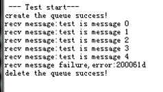

<h3 id="4.5">4.5 Event</h3>

#### 4.5.1 Overview

**Basic Concept**

Events are used for synchronization between tasks. A task or interrupt service
routine can trigger an event (a synchronization signal) to another task through
an event control block. One task is able to wait for several events to occur:
whether while one event occurring or after several events occurred, both of
these are sure to wake task up to do event handling.

In a multi-task environment, tasks must be synchronized. In the one-to-many
synchronization model, a task waits for multiple events. In the many-to-many
synchronization model, multiple tasks wait for multiple events.

Tasks trigger or wait for events through event control blocks. Events in Huawei
LiteOS are used only for task synchronization, and not for data transport.

Characteristics of events in Huawei LiteOS are as follows:

* Events are not associated with tasks and are independent from each other. A 32-bit variable is used to indicate the type of the event in which a task is interested. Each bit indicates one event type with 0 indicating that the event does not occur and 1 indicating that the event occurs. There are 31 bits that indicate event types (bit 25 is reserved).

* Events are used only for task synchronization, and not for data transport.

* Sending the same event type to a task for multiple times is equivalent to sending for only once.

* Multiple tasks are allowed to read or write the same event.

* Huawei LiteOS supports event reading and writing timeout.

**Event control block**

```  
/**
 * @ingroup los_event
 * Event control structure
 */
typedef struct tagEvent
{
    UINT32 uwEventID;            /**bit that indicates an event type*/
    LOS_DL_LIST    stEventList;  /**linked list of  event reading tasks*/
} EVENT_CB_S, *PEVENT_CB_S;
```  

uwEventID indicates the type of the event in which a task is interested. Each
bit indicates one event type with 0 indicating that the event does not occur and
1 indicating that the event occurs. There are 31 bits that indicate event types
(bit 25 is reserved).

**Event reading mode**

An event reading mode can be configured during event reading. Event reading
modes are as follows:

**LOS_WAITMODE_AND** indicates that event of all event types specified by a mask
need to be read. Event reading succeeds only when all events that are read
occur.

**LOS_WAITMODE_OR** indicates that an event of an event type specified by a mask
needs to be read. Event reading succeeds when the event that is read occurs.

**LOS_WAITMODE_CLR** indicates that after successful event reading, the event
types or event type that is read is automatically cleared.

**Operation Mechanism**

During event reading, one type or multiple types specified by uwEventMask are
read. After event reading succeeds, the event type that is read is explicitly
cleared if **LOS_WAITMODE_CLR** is configured in the event reading mode. The
event type that is not cleared if **LOS_WAITMODE_CLR** is not configured. You
can configure the event reading mode by passing in **LOS_WAITMODE_AND** to read
all events of the event types specified by the event mask or by passing in
**LOS_WAITMODE_OR** to read an event of an event type specified by the event
mask.

During event writing, a specified event type is written into an event. Multiple
event types can be written concurrently. Event writing may trigger task
scheduling.

During event clearance, the bit that specifies the event type to be cleared is
set to 0.

**Tasks woken up by events**

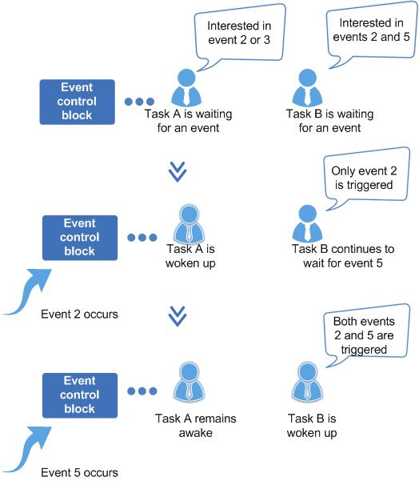

#### 4.5.2 Development Guidelines

**Usage Scenarios**

Events are applicable in a variety of task synchronization scenarios and are
partially similar to semaphore in purpose.

**Functions**

The event module provides the following functions:

| Function Category       | API              | Description                                                                                                              |
|-------------------------|------------------|--------------------------------------------------------------------------------------------------------------------------|
| Event initialization    | LOS_EventInit    | Initializes an event control block                                                                                       |
| Event reading           | LOS_EventRead    | Reads an event within N ticks                                                                                            |
| Event writing           | LOS_EventWrite   | Writes an event                                                                                                          |
| Event clearance         | LOS_EventClear   | Clears an event                                                                                                          |
| Event mask verification | LOS_EventPoll    | Determines whether an event meets the expectations based on the passed-in event value, event mask, and verification mode |
| Event destroying        | LOS_EventDestroy | Destroys a specified event control block                                                                                 |

**Development Process**

Typical process of using the event module:

1 Call the LOS_EventInit API to initialize an event control block.

2 Call the LOS_EventInit to write an event.

3 Call the LOS_EventRead API to read an event.

4 Call the LOS_EventClear API to clear an event.

**Event Error Code**

Error codes are returned if errors occur during event operations, such as event
initialization, event destroying, event reading, event writing, and event
clearance, to facilitate fault locating.

| No. | Definition                        | Error Code | Description                                                                          | Solution                                                            |
|-----|-----------------------------------|------------|--------------------------------------------------------------------------------------|---------------------------------------------------------------------|
| 1   | LOS_ERRNO_EVENT_SETBIT_INVALID    | 0x02001c00 | Bit 25 of the event ID must not be set to 1 because it is reserved as an error code. | Set bit 25 of the event ID to 0.                                    |
| 2   | LOS_ERRNO_EVENT_READ_TIMEOUT      | 0x02001c01 | Event reading times out.                                                             | Increase the permitted wait time. Alternatively, re-read the event. |
| 3   | LOS_ERRNO_EVENT_EVENTMASK_INVALID | 0x02001c02 | The passed-in event ID is invalid.                                                   | Pass in a valid event ID.                                           |
| 4   | LOS_ERRNO_EVENT_READ_IN_INTERRUPT | 0x02001c03 | The event is being read when an interrupt is being processed.                        | Let a new task read the event.                                      |
| 5   | LOS_ERRNO_EVENT_FLAGS_INVALID     | 0x02001c04 | The mode of event reading is invalid.                                                | Pass in a valid mode.                                               |
| 6   | LOS_ERRNO_EVENT_READ_IN_LOCK      | 0x02001c05 | The task is locked and fails to read the event.                                      | Unlock the task, and then let the task read the event.              |
| 7   | LOS_ERRNO_EVENT_PTR_NULL          | 0x02001c06 | The passed-in pointer is null.                                                       | Pass in a non-null pointer.                                         |

An error code is a 32-bit storage unit. Bit 24 to bit 31 indicate an error
level; bit 16 to bit 23 indicate an error code flag; bit 8 to bit 15 indicate
the ID of the module that reports the error code; bit 0 to bit 7 indicate an
error code. The following is the example of an error code:

```  
#define LOS_ERRNO_OS_ERROR(MID, ERRNO)  \
(LOS_ERRTYPE_ERROR | LOS_ERRNO_OS_ID | ((UINT32)(MID) << 8) | (ERRNO))
LOS_ERRTYPE_ERROR: Define critical OS errors
LOS_ERRNO_OS_ID: OS error code flag
MID: OS_MOUDLE_ID
LOS_MOD_EVENT: Event module ID
ERRNO: error ID number
```  

For example:

```  
#define LOS_ERRNO_EVENT_READ_IN_LOCK LOS_ERRNO_OS_ERROR(LOS_MOD_EVENT, 0x05)
```  

**Platform Differences**

None.

#### 4.5.3 Precautions

* Do not make calls to the LOS_EventRead and LOS_EventWrite APIs prior to the operating system being initialized. Otherwise, the operating system exhibits unexpected behavior.

* While an interrupt is underway, events can be written into an event control block but event reads are not allowed.

* Task blocking and event reading are not allowed while task scheduling is locked.

* The input parameter of LOS_EventClear is \~uwEvents (reverse code of event type).

* Bit 25 of the event mask is merely used to distinguish whether the LOS_EventRead API returns an event or error code.

#### 4.5.4 Programming Example

**Example Description**

In the programming example, the Example_TaskEntry task is executed to create the
Example_Event task. The Example_Event task is blocked from reading events. The
Example_TaskEntry task writes an event in which the Example_Event task shows
interest.

1 The Example_TaskEntry task is executed to create the Example_Event task. The Example_Event task takes a higher priority than the Example_TaskEntry task.

2 The Example_Event task is blocked from reading the event 0x00000001. After the Example_Event task is blocked, a task switch occurs to execute the task with a lower priority, namely, the Example_TaskEntry task.

3 The Example_TaskEntry task writes the event 0x00000001 toward the  Example_Event task. The Example_Event task is interested in the event 0x00000001 and is therefore woken up to process the event.

4 The Example_Event task is executed.

5 The Example_TaskEntry task is executed.

**Example Code**

The order in which print-out is generated provides some clues into task switches
that occur during event operations.

The code is as follows:

```  
/* task pid */
static UINT32 g_TestTaskID;
/* event control struct */
static EVENT_CB_S  example_event;

/* wait event type */
#define event_wait 0x00000001

/* example task entry function */
VOID Example_Event(VOID)
{
    UINT32 uwEvent;
    UINT32 uwRet = LOS_OK;

    /*
     * timeout, WAITMODE to read event, timeout is 100 ticks,
     * if timeout, wake task directly
     */
    dprintf("Example_Event wait event 0x%x \n",event_wait);

    uwEvent = LOS_EventRead(&example_event, event_wait, LOS_WAITMODE_AND, 100);
    if(uwEvent == event_wait)
    {
        dprintf("Example_Event,read event :0x%x\n",uwEvent);
        uwRet = LOS_InspectStatusSetByID(LOS_INSPECT_EVENT, LOS_INSPECT_STU_SUCCESS);
        if (LOS_OK != uwRet)
        {
            dprintf("Set Inspect Status Err\n");
        }
    }
    else
    {
        dprintf("Example_Event,read event timeout\n");
        uwRet = LOS_InspectStatusSetByID(LOS_INSPECT_EVENT, LOS_INSPECT_STU_ERROR);
        if (LOS_OK != uwRet)
        {
            dprintf("Set Inspect Status Err\n");
        }
    }
    return;
}

UINT32 Example_SndRcvEvent(VOID)
{
    UINT32 uwRet;
    TSK_INIT_PARAM_S stTask1;

    /* event init */
    uwRet = LOS_EventInit(&example_event);
    if(uwRet != LOS_OK)
    {
        dprintf("init event failed .\n");
        return LOS_NOK;
    }

    /* create task */
    memset(&stTask1, 0, sizeof(TSK_INIT_PARAM_S));
    stTask1.pfnTaskEntry = (TSK_ENTRY_FUNC)Example_Event;
    stTask1.pcName       = "EventTsk1";
    stTask1.uwStackSize  = LOSCFG_BASE_CORE_TSK_DEFAULT_STACK_SIZE;
    stTask1.usTaskPrio   = 5;
    uwRet = LOS_TaskCreate(&g_TestTaskID, &stTask1);
    if(uwRet != LOS_OK)
    {
        dprintf("task create failed .\n");
        return LOS_NOK;
    }

    /* write event */
    dprintf("Example_TaskEntry_Event write event .\n");
    uwRet = LOS_EventWrite(&example_event, event_wait);
    if(uwRet != LOS_OK)
    {
        dprintf("event write failed .\n");
        return LOS_NOK;
    }

    /* clear event flag */
    dprintf("EventMask:%d\n", example_event.uwEventID);
    LOS_EventClear(&example_event, ~example_event.uwEventID);
    dprintf("EventMask:%d\n", example_event.uwEventID);

    return LOS_OK;
}
```  

**Verification**

The verification result is as follows:

```  
Example_Event wait event 0x1  
 Example_TaskEntry write event . 
 Example_Event,read event :0x1 
 EventMask:1 
 EventMask:0  
```  

<h3 id="4.6">4.6 Mutex</h3>

#### 4.6.1 Overview

**Basic Concept**

A mutual exclusion (mutex) is a special binary semaphore designed to grant a
task exclusive use of common resources.

At a given point in time, a mutex is either locked or unlocked. When a task
acquires a mutex, the mutex is locked and the task has exclusive ownership of
the mutex. When the task releases the mutex, the mutex is unlocked and the task
loses exclusive ownership of the mutex. While a task has exclusive ownership of
a mutex, other tasks are unable to acquire or release the mutex.

In a multi-task environment, it is common to see tasks competing for the same
common resource. A mutex can avoid the task conflict problem without the trouble
of priority inversion experienced with semaphores.

Mutex of Huawei LiteOS has characters as below:

* Solve the problem of priority inversion by using inheritance algorithm.

**Operation Mechanism**

**Mutex Operation Principle**

In a multi-task environment, multiple tasks may battle for the same common
resource. If the common resource is not shareable, it must be used exclusively
by a particular task.

When a task accesses a non-shareable common resource, the mutex is locked. Other
tasks are blocked from accessing the resource until the task releases the mutex.
In this way, only one task accesses the non-shareable common resource at a given
point in time, which ensures the integrity of the non-shareable common
resources.

Working principle of a mutex

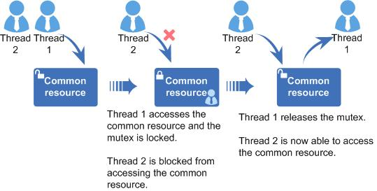

#### 4.6.2 Development Guidelines

**Usage Scenarios**

A mutex is a good choice for preventing tasks from accessing the same shared
resource at the same time.

**Functions**

The mutex module provides the following functions:

| Function Category           | API           | Description      |
|-----------------------------|---------------|------------------|
| Mutex creation and deletion | LOS_MuxCreate | Creates a mutex  |
|                             | LOS_MuxDelete | Deletes a mutex  |
| Mutex request and release   | LOS_MuxPend   | Pends on a mutex |
|                             | LOS_MuxPost   | Releases a mutex |

**Development Process**

Mutex typical development process:

1 Call the LOS_MuxCreate API to create a mutex.

2 Call the LOS_MuxPend API to pend on a mutex. Takes actions depending on the mutex pend mode.

  * Non-blocking mode: If no task has acquired the mutex or the task that has acquired the mutex is the same as the requesting task, the operating system grants the mutex to the requesting task.

  * Permanent blocking mode: the requesting task waits endlessly for a mutex and enters Blocked state in the meantime. If the mutex has not been acquired by any task, the operating system grants the mutex to the requesting task. Otherwise, the operating system blocks the requesting task until the mutex is released. While the requesting task is blocked, the operating system selects the task with the highest priority among ready tasks to be executed.

  * Temporary blocking mode: the requesting task waits for a specified period of time for a mutex and enters Blocked state in the meantime. If the mutex has not been acquired by any task, the operating system grants the mutex to the requesting task. Otherwise, the operating system blocks the requesting task until the mutex is released or the timeout period elapses. It then selects the ready task with the highest priority to be executed.

3 Call the LOS_MuxPost to release a mutex.

  * If there are tasks blocked from acquiring the mutex, the operating system wakes up the first blocked task. The woken-up task then enters Ready state and is scheduled.

  * If there are no tasks blocked from acquiring the mutex, the operating system releases the mutex.

4 Call the LOS_MuxDelete API to delete a mutex.

**Mutex Error Code**

Error codes are returned if errors occur during mutex operations, such as mutex
creation, mutex deletion, mutex pending, and mutex posting, to facilitate fault
locating.

| No. | Definition                  | Error Code | Description                                                                                        | Solution                                                                                       |
|-----|-----------------------------|------------|----------------------------------------------------------------------------------------------------|------------------------------------------------------------------------------------------------|
| 1   | LOS_ERRNO_MUX_NO_MEMORY     | 0x02001d00 | The request for memory is rejected.                                                                | Lower the upper limit on the number of mutexes.                                                |
| 2   | LOS_ERRNO_MUX_INVALID       | 0x02001d01 | The mutex is not usable.                                                                           | Pass in a valid mutex ID.                                                                      |
| 3   | LOS_ERRNO_MUX_PTR_NULL      | 0x02001d02 | The input parameter is null.                                                                       | Pass in a non-null parameter.                                                                  |
| 4   | LOS_ERRNO_MUX_ALL_BUSY      | 0x02001d03 | No mutexes are available.                                                                          | Raise the upper limit on the number of mutexes.                                                |
| 5   | LOS_ERRNO_MUX_UNAVAILABLE   | 0x02001d04 | The mutex fails to be locked because it is locked by another thread.                               | Wait for another thread to release the mutex. Alternatively, set a timeout period.             |
| 6   | LOS_ERRNO_MUX_PEND_INTERR   | 0x02001d05 | Mutex pend occurs when an interrupt is being processed.                                            | Do not call this API when an interrupt is being processed.                                     |
| 7   | LOS_ERRNO_MUX_PEND_IN_LOCK  | 0x02001d06 | Task scheduling is not enabled, and the thread is waiting for another thread to release the mutex. | Set the mutex pend mode to the non-blocking mode. Alternatively, enable task scheduling.       |
| 8   | LOS_ERRNO_MUX_TIMEOUT       | 0x02001d07 | Mutex pend times out.                                                                              | Increase the wait time. Alternatively, set the mutex pend mode to the permanent blocking mode. |
| 9   | LOS_ERRNO_MUX_OVERFLOW      | 0x02001d08 | The error code is not in use.                                                                      | N/A                                                                                            |
| 10  | LOS_ERRNO_MUX_PENDED        | 0x02001d09 | The mutex being deleted is locked.                                                                 | Delete the mutex after it is released.                                                         |
| 11  | LOS_ERRNO_MUX_GET_COUNT_ERR | 0x02001d0a | The error code is not in use.                                                                      | N/A                                                                                            |
| 12  | LOS_ERRNO_MUX_REG_ERROR     | 0x02001d0b | The error code is not in use.                                                                      | N/A                                                                                            |

An error code is a 32-bit storage unit. Bit 24 to bit 31 indicate an error
level; bit 16 to bit 23 indicate an error code flag; bit 8 to bit 15 indicate
the ID of the module that reports the error code; bit 0 to bit 7 indicate an
error code. The following is the example of an error code:

```  
(LOS_ERRTYPE_ERROR | LOS_ERRNO_OS_ID | ((UINT32)(MID) << 8) | (ERRNO))
LOS_ERRTYPE_ERROR: Define critical OS errors
LOS_ERRNO_OS_ID: OS error code flag
LOS_MOD_MUX: Mutex module ID
MID: OS_MOUDLE_ID
ERRNO: error ID number
```  

For example: 

```
LOS_ERRNO_MUX_TIMEOUT LOS_ERRNO_OS_ERROR(LOS_MOD_MUX, 0x07)
```

**Platform Differences**

None.

#### 4.6.3 Precautions

* Tasks are unable to lock the same mutex. If a task attempts to lock a mutex that has been locked by another task, the task will be blocked from locking the mutex until the mutex is unlocked.

* Do not use any mutex for interrupt service routines.

* Release a mutex immediately when the mutex is no longer in use. Otherwise, tasks will be blocked for a long time, slowing down task scheduling.

* Do not change the priority of a task by calling APIs such as LOS_TaskPriSet while the task has full ownership of a mutex.

#### 4.6.4 Programming Example

**Example Description**

In the programming example, the following activities will happen:

1 The Example_TaskEntry task is executed to create a mutex. Task scheduling is locked. Two tasks Example_MutexTask1 and Example_MutexTask2 are created, where Example_MutexTask2 takes a higher priority than Example_MutexTask1. Then, task scheduling is unlocked.

2 Example_MutexTask2 is scheduled, granted a mutex, and then sent to sleep mode for 100 ticks. While Example_MutexTask2 is suspended, Example_MutexTask1 is woken up.

3 Example_MutexTask1 pends on the mutex and is willing to wait the mutex for 10 ticks to become free. At the time when Example_MutexTask1 requests the mutex, the mutex is held by Example_MutexTask2 and consequently  Example_MutexTask1 is suspended. After the 10-tick wait period elapses, the mutex is still out of the reach of Example_MutexTask1, and Example_MutexTask1 is woken up, attempting to wait permanently for the mutex. The wait for the mutex switches Example_MutexTask1 to suspended state.

4 After 100 ticks, Example_MutexTask2 is woken up and releases the mutex. Example_MutexTask1 is scheduled, granted the mutex, and finally releases it.

5 300 ticks after Example_MutexTask1 is finished, Example_TaskEntry is executed to delete the mutex.

**Example Code**

Prerequisites

* The LOSCFG_BASE_IPC_MUX parameter in the los_config.h file is set to YES.

* The LOSCFG_BASE_IPC_MUX_LIMIT parameter in the los_config.h file is set to the maximum number of mutexes that the operating system allows.

The code is as follows:

```  
/* mux handle id */
static UINT32 g_Testmux01;

/* task pid */
static UINT32 g_TestTaskID01;
static UINT32 g_TestTaskID02;

static VOID Example_MutexTask1(VOID)
{
    UINT32 uwRet;

    dprintf("task1 try to get mutex, wait 10 Tick.\n");
    /* get mux */
    uwRet = LOS_MuxPend(g_Testmux01, 10);

    if (uwRet == LOS_OK)
    {
        dprintf("task1 get mutex g_Testmux01.\n");
        /* release mux */
        LOS_MuxPost(g_Testmux01);
        return;
    }
    else if (uwRet == LOS_ERRNO_MUX_TIMEOUT)
    {
        dprintf("task1 timeout and try to get  mutex, wait forever.\n");
        /* LOS_WAIT_FOREVER type get mux, LOS_MuxPend return until has been get mux */
        uwRet = LOS_MuxPend(g_Testmux01, LOS_WAIT_FOREVER);
        if (uwRet == LOS_OK)
        {
            dprintf("task1 wait forever,got mutex g_Testmux01 success.\n");
            /* release mux */
            LOS_MuxPost(g_Testmux01);
            uwRet = LOS_InspectStatusSetByID(LOS_INSPECT_MUTEX, LOS_INSPECT_STU_SUCCESS);
            if (LOS_OK != uwRet)
            {
                dprintf("Set Inspect Status Err\n");
            }
            return;
        }
    }
    return;
}

static VOID Example_MutexTask2(VOID)
{
    UINT32 uwRet;

    dprintf("task2 try to get mutex, wait forever.\n");
    /* get mux */
    uwRet = LOS_MuxPend(g_Testmux01, LOS_WAIT_FOREVER);
    if(uwRet != LOS_OK)
    {
        dprintf("task2 LOS_MuxPend failed .\n");
        return;
    }

    dprintf("task2 get mutex g_Testmux01 and suspend 100 Tick.\n");

    /* task delay 100 ticks */
    LOS_TaskDelay(100);

    dprintf("task2 resumed and post the g_Testmux01\n");
    /* release mux */
    LOS_MuxPost(g_Testmux01);
    return;
}

UINT32 Example_MutexLock(VOID)
{
    UINT32 uwRet;
    TSK_INIT_PARAM_S stTask1;
    TSK_INIT_PARAM_S stTask2;

    /* create mux */
    LOS_MuxCreate(&g_Testmux01);

    /* lock task schedue */
    LOS_TaskLock();

    /* create task1 */
    memset(&stTask1, 0, sizeof(TSK_INIT_PARAM_S));
    stTask1.pfnTaskEntry = (TSK_ENTRY_FUNC)Example_MutexTask1;
    stTask1.pcName       = "MutexTsk1";
    stTask1.uwStackSize  = LOSCFG_BASE_CORE_TSK_DEFAULT_STACK_SIZE;
    stTask1.usTaskPrio   = 5;
    uwRet = LOS_TaskCreate(&g_TestTaskID01, &stTask1);
    if (uwRet != LOS_OK)
    {
        dprintf("task1 create failed .\n");
        return LOS_NOK;
    }

    /* create task2 */
    memset(&stTask2, 0, sizeof(TSK_INIT_PARAM_S));
    stTask2.pfnTaskEntry = (TSK_ENTRY_FUNC)Example_MutexTask2;
    stTask2.pcName       = "MutexTsk2";
    stTask2.uwStackSize  = LOSCFG_BASE_CORE_TSK_DEFAULT_STACK_SIZE;
    stTask2.usTaskPrio   = 4;
    uwRet = LOS_TaskCreate(&g_TestTaskID02, &stTask2);
    if (uwRet != LOS_OK)
    {
        dprintf("task2 create failed .\n");
        return LOS_NOK;
    }

    /* unlock task schedue */
    LOS_TaskUnlock();
    /* task delay 300 ticks */
    LOS_TaskDelay(300);

    /* delete mux */
    LOS_MuxDelete(g_Testmux01);

    return LOS_OK;
}  
```  

**Verification**

The verification result is as follows:

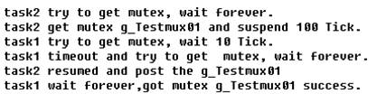

<h3 id="4.7">4.7 Semaphore</h3>

#### 4.7.1 Overview

**Basic Concept**

A semaphore is a mechanism used for communication within a kernel, to achieve
synchronization or mutual exclusion of critical resources between tasks.

In a multi-task system, it is necessary to synchronize one task with another or
prevent tasks battling for critical resources. Semaphores are a good choice to
serve that purpose.

Typically, a numerical value of a signal is used to correspond to the number of
available resources. It means mutually exclusive resources remained that could
be occupied. The meaning of its value is divided into two kinds of situations:

* 0, it means the post operation that is not accumulated, and it is possible to block tasks on this signal.

* Positive number, it means there is one or several release operations which are posted.

The differences to use between semaphore for the purpose of synchronization and
semaphore for the purpose of mutex are:

* If a semaphore is used as a mutex, it is created with a full internal counter. Each time a task waits on critical resources, it is assigned the semaphore and the counter value is decreased by 1. When the counter value drops to 0, subsequent tasks are blocked from getting the semaphore.

* If a semaphore is used for task synchronization, it is created with an empty counter. When task 1 attempts to get the semaphore, it is blocked because the counter has reached the maximum value. Task 1 will enter Ready or Running state after task 2 releases the semaphore, thereby achieving task synchronization.

**Operation Mechanism**

**Semaphore Control Block**

```  
/**
 * @ingroup los_sem
 * Semaphore control structure.
 */
typedef struct
{
    UINT8           usSemStat;          /**whether to use flag bit*/
    UINT16          uwSemCount;         /**semaphore quantity index*/
    UINT32UINT16    usMaxSemCount;      /**Maximum number of semaphores*/
    UINT32          usSemID;            /**semaphore count*/
    LOS_DL_LIST     stSemList;          /**suspend the task blocked on the semaphore*/
}SEM_CB_S;
```  

**Semaphore Operation Principle**

During semaphore initialization, memory is allocated to N semaphores. N is
configurable by users and limited by memory. All semaphores are initialized and added to the
linked list of semaphores that are not in use.

During semaphore creation, a semaphore is obtained from the linked list of
semaphores that are not in use and the initial value of the semaphore is set.

If the internal counter of a semaphore is more than 0 when the semaphore is
pended, the counter value is decreased by 1 and the pending succeeds. If the
counter value is 0, tasks are blocked from getting the semaphore and wait for
other tasks to post the semaphore. The timeout interval of waiting on the
semaphore can be configured. If a task is blocked from getting the semaphore,
suspend the task to the tail of the queue of tasks waiting on the semaphore.

If no tasks are waiting on a semaphore, the counter value is increased by 1 and
the semaphore is posted. Otherwise, wake up the first task in the queue of tasks
waiting on the semaphore.

During semaphore deletion, the semaphore that is in use is set to be not in use
and is added to the linked list of semaphores that are not in use.

A semaphore allows multiple tasks to access the same resource at the same time
but sets a limit on the number of the tasks. Tasks are not allowed to access the
resource if the maximum number of the tasks that can access the resource is
reached and need to wait for one task to release the semaphore.

Working principle of semaphore


#### 4.7.2 Development Guidelines

**Usage Scenarios**

Semaphores find their use in locking resources, counting resources, and
maintaining synchronization between threads or between threads and interrupts.

**Functions**

The semaphore module provides the following functions:

| Function Category               | API                 | Description                |
|---------------------------------|---------------------|----------------------------|
| Semaphore creation and deletion | LOS_SemCreate       | Creates a semaphore        |
|                                 | LOS_BinarySemCreate | Creates a binary semaphore |
|                                 | LOS_SemDelete       | Deletes a semaphore        |
| Semaphore pend and post         | LOS_SemPend         | Pends on a semaphore       |
|                                 | LOS_SemPost         | Posts a semaphore          |

**Development Process**

Semaphore typical development process:

1 Call the LOS_SemCreate API to create a semaphore.

2 Call the LOS_SemPend to pend on a semaphore.

Huawei LiteOS takes actions depending on the semaphore pend mode.

 * Non-blocking mode: If the maximum number of tasks allowed by the semaphore is not reached, the request for the semaphore is fulfilled. Otherwise, the request for the semaphore is rejected.

 * Permanent blocking mode: The requesting task waits endlessly for a semaphore and the task enters Blocked state in the meantime. If the maximum number of tasks allowed by the semaphore is not reached, the request for the semaphore is fulfilled. Otherwise, the operating system blocks the requesting task until a task releases the semaphore. It then selects the ready task with the highest priority to be executed.

 * If a task enters the Blocked state, this task will be re-executed when either of
the following conditions is met:

  * Other tasks release semaphores before the specified period expires.

  * The specified period expires.

 * Temporary blocking mode: the requesting task waits for a specified period of time for a semaphore and enters Blocked state in the meantime. If the maximum number of tasks allowed by the semaphore is not reached, the request for the semaphore is fulfilled. Otherwise, the operating system blocks the requesting task until a task releases the semaphore or the timeout period elapses. It then selects the ready task with the highest priority to be executed.

3 Call the LOS_SemPost API to post a semaphore.

 * If there are tasks blocked from acquiring the semaphore, the operating system wakes up the first blocked task. The woken-up task then enters Ready state and is scheduled.

 * If there are no tasks blocked from acquiring the semaphore, the operating system posts the semaphore.

4 Call the LOS_SemDelete API to delete a semaphore.

**Semaphore Error Codes**

Error codes are returned if errors occur during semaphore operations, such as
creating, pending, posting, and deleting semaphores, to facilitate fault
locating.

| No. | Definition                 | Error Code | Description                                                           | Solution                                                                             |
|-----|----------------------------|------------|-----------------------------------------------------------------------|--------------------------------------------------------------------------------------|
| 1   | LOS_ERRNO_SEM_NO_MEMORY    | 0x02000700 | The memory space is insufficient.                                     | Allocate a larger memory space to the semaphore.                                     |
| 2   | LOS_ERRNO_SEM_INVALID      | 0x02000701 | The passed-in parameter is invalid.                                   | Modify the parameter to a valid one.                                                 |
| 3   | LOS_ERRNO_SEM_PTR_NULL     | 0x02000702 | The passed-in pointer is null.                                        | Pass in a non-null pointer.                                                          |
| 4   | LOS_ERRNO_SEM_ALL_BUSY     | 0x02000703 | The semaphore control block is unavailable.                           | Post semaphore resources.                                                            |
| 5   | LOS_ERRNO_SEM_UNAVAILABLE  | 0x02000704 | The scheduled time is invalid.                                        | Modify the scheduled time to a correct one.                                          |
| 6   | LOS_ERRNO_SEM_PEND_INTERR  | 0x02000705 | When the CPU is processing interrupts, the LOS_SemPend API is called. | Do not call the LOS_SemPend API when the CPU is processing interrupts.               |
| 7   | LOS_ERRNO_SEM_PEND_IN_LOCK | 0x02000706 | The task is locked and fails to obtain the semaphore.                 | Do not call the LOS_SemPend API when the task is locked.                             |
| 8   | LOS_ERRNO_SEM_TIMEOUT      | 0x02000707 | The time for obtaining semaphores expires.                            | Set the time to a proper range.                                                      |
| 9   | LOS_ERRNO_SEM_OVERFLOW     | 0x02000708 | The number of allowed semaphore pendings exceeds the maximum value.   | Pass in a valid value.                                                               |
| 10  | LOS_ERRNO_SEM_PENDED       | 0x02000709 | The task queue waiting for the semaphore is not empty.                | Wake up all tasks that are waiting for the semaphore, and then delete the semaphore. |

An error code is a 32-bit storage unit. Bit 24 to bit 31 indicate an error
level; bit 16 to bit 23 indicate an error code flag; bit 8 to bit 15 indicate
the ID of the module that reports the error code; bit 0 to bit 7 indicate an
error code. The following is the example of an error code:

```  
#define LOS_ERRNO_OS_NORMAL(MID,ERRNO)  \
(LOS_ERRTYPE_NORMAL | LOS_ERRNO_OS_ID | ((UINT32)(MID) << 8) | (ERRNO))
LOS_ERRTYPE_NORMAL: Define the error level as critical
LOS_ERRNO_OS_ID: OS error code flag.
MID: OS_MOUDLE_ID
ERRNO: error ID number  
```  

For example

```
LOS_ERRNO_SEM_NO_MEMORY        LOS_ERRNO_OS_ERROR(LOS_MOD_SEM, 0x00))
```

**Platform Differences**

None.

#### 4.7.3 Precautions

* As interrupts cannot be blocked, permanent blocking and temporary blocking
    are not allowed for interrupts during the request for a semaphore.

#### 4.7.4 Programming Example

**Example Description**

In the programming example, the following activities will happen:

1 The Example_TaskEntry task is executed to create a semaphore. Task scheduling is locked. Two tasks Example_SemTask1 and Example_SemTask2 are created, where Example_SemTask2 takes a higher priority than Example_SemTask1. Then, task scheduling is unlocked. Example_TaskEntry releases the semaphore.

2 Example_SemTask2 is granted the semaphore, scheduled, and sent to sleep mode for 20 ticks. While Example_SemTask2 is delayed, Example_SemTask1 is woken up.

3 Example_SemTask1 pends on the semaphore and is willing to wait the semaphore for 10 ticks to become free. At the time when Example_SemTask1 requests the semaphore, the semaphore is held by Example_SemTask2 and consequently Example_SemTask1 is suspended. After the 10-tick wait period elapses, the semaphore is still out of the reach of Example_SemTask1, and Example_SemTask1 is woken up, attempting to wait permanently for the semaphore. The wait for semaphore switches Example_SemTask1 to suspended state.

4 After 20 ticks, Example_SemTask2 is woken up and releases the semaphore. Example_SemTask1 is scheduled, granted the semaphore, and finally releases it.

5 40 ticks after Example_SemTask1 is finished, Example_TaskEntry is woken up, deletes the semaphore and then the two tasks.

**Example Code**

Prerequisites

* The **LOSCFG_BASE_IPC_SEM** parameter in the **los_config.h** file is set to YES.

* The **LOSCFG_BASE_IPC_SEM_LIMIT** parameter in the **los_config.h** file is set to the maximum number (for example, 1024) of semaphores that the operating system allows.

The code is as follows:

```
/* task pid */
static UINT32 g_TestTaskID01, g_TestTaskID02;
/* sem id */
static UINT32 g_usSemID;

static VOID Example_SemTask1(VOID)
{
    UINT32 uwRet;

    dprintf("Example_SemTask1 try get sem g_usSemID ,timeout 10 ticks.\n");
    /* get sem, timeout is 10 ticks */
    uwRet = LOS_SemPend(g_usSemID, 10);

    /* get sem ok */
    if (LOS_OK == uwRet)
    {
        LOS_SemPost(g_usSemID);
        return;
    }
    /* timeout, get sem fail */
    if (LOS_ERRNO_SEM_TIMEOUT == uwRet)
    {
        dprintf("Example_SemTask1 timeout and try get sem g_usSemID wait forever.\n");
        /* get sem wait forever, LOS_SemPend return until has been get mux */
        uwRet = LOS_SemPend(g_usSemID, LOS_WAIT_FOREVER);
        if (LOS_OK == uwRet)
        {
            dprintf("Example_SemTask1 wait_forever and got sem g_usSemID success.\n");
            LOS_SemPost(g_usSemID);
            uwRet = LOS_InspectStatusSetByID(LOS_INSPECT_SEM, LOS_INSPECT_STU_SUCCESS);
            if (LOS_OK != uwRet)
            {
                dprintf("Set Inspect Status Err\n");
            }
            return;
        }
    }
    return;
}

static VOID Example_SemTask2(VOID)
{
    UINT32 uwRet;
    dprintf("Example_SemTask2 try get sem g_usSemID wait forever.\n");
    /* wait forever get sem */
    uwRet = LOS_SemPend(g_usSemID, LOS_WAIT_FOREVER);

    if(LOS_OK == uwRet)
    {
        dprintf("Example_SemTask2 get sem g_usSemID and then delay 20ticks .\n");
    }

    /* task delay 20 ticks */
    LOS_TaskDelay(20);

    dprintf("Example_SemTask2 post sem g_usSemID .\n");
    /* release sem */
    LOS_SemPost(g_usSemID);

    return;
}

UINT32 Example_Semphore(VOID)
{
    UINT32 uwRet = LOS_OK;
    TSK_INIT_PARAM_S stTask1;
    TSK_INIT_PARAM_S stTask2;

   /* create sem */
    LOS_SemCreate(0, &g_usSemID);

    /* lock task schedue */
    LOS_TaskLock();

    /* create task1 */
    memset(&stTask1, 0, sizeof(TSK_INIT_PARAM_S));
    stTask1.pfnTaskEntry = (TSK_ENTRY_FUNC)Example_SemTask1;
    stTask1.pcName       = "MutexTsk1";
    stTask1.uwStackSize  = LOSCFG_BASE_CORE_TSK_IDLE_STACK_SIZE;
    stTask1.usTaskPrio   = TASK_PRIO_TEST;
    uwRet = LOS_TaskCreate(&g_TestTaskID01, &stTask1);
    if (uwRet != LOS_OK)
    {
        dprintf("task1 create failed .\n");
        return LOS_NOK;
    }

    /* create task2 */
    memset(&stTask2, 0, sizeof(TSK_INIT_PARAM_S));
    stTask2.pfnTaskEntry = (TSK_ENTRY_FUNC)Example_SemTask2;
    stTask2.pcName       = "MutexTsk2";
    stTask2.uwStackSize  = LOSCFG_BASE_CORE_TSK_IDLE_STACK_SIZE;
    stTask2.usTaskPrio   = (TASK_PRIO_TEST - 1);
    uwRet = LOS_TaskCreate(&g_TestTaskID02, &stTask2);
    if (uwRet != LOS_OK)
    {
        dprintf("task2 create failed .\n");

        /* delete task 1 */
        if (LOS_OK != LOS_TaskDelete(g_TestTaskID01))
        {
            dprintf("task1 delete failed .\n");
        }

        return LOS_NOK;
    }

    /* unlock task schedue */
    LOS_TaskUnlock();

    uwRet = LOS_SemPost(g_usSemID);

    /* task delay 40 ticks */
    LOS_TaskDelay(40);

    /* delete sem */
    LOS_SemDelete(g_usSemID);

    return uwRet;
}
```

**Verification**

The verification result is as follows:


<h3 id="4.8">4.8 Time Management</h3>

#### 4.8.1 Overview

**Basic Concept**

Time management provides time services to applications and uses system time as
the reference time.

System time is generated when an output pulse of a timer/counter triggers an
interrupt, it is an integral number or long integral number of ticks. The
interval between consecutive output pulses is a tick. The tick length is
statically configured.

User time is measured in seconds or milliseconds, whereas CPU time is measured
in ticks. When a user initiates an operation to the operating system, such as
suspending or delaying a task, the time management module converts user time
between seconds/milliseconds and ticks.

The rule for conversion between ticks and seconds is user configurable.

The time management module of Huawei LiteOS provides time conversion,
measurement, and deferral to satisfy what users need.

**Related Concepts**

* Cycle

Cycle is the minimal time unit of the operating system. The system clock speed
is represented in the form of cycles per second.

* Tick

A tick is the basic time unit used in OS. The tick length is user configurable.
Typically, it is determined by the system clock speed and represented in the
form of ticks per second.

#### 4.8.2 Development Guidelines

**Usage Scenarios**

Read the topic when you want to learn more about system time and conversion
between ticks and seconds/milliseconds.

**Functions**

The time management module of Huawei LiteOS provides the following functions:

* Time conversion: converts the CPU runtime from ticks to milliseconds or microseconds

* Time measurement: measures the system runtime in ticks

| Function Category | API                 | Description                                 |
|-------------------|---------------------|---------------------------------------------|
| Time conversion   | LOS_MS2Tick         | Converts milliseconds into ticks (reserved) |
|                   | LOS_Tick2MS         | Converts ticks into milliseconds (reserved) |
| Time measurement  | LOS_CyclePerTickGet | Counts the number of cycles per tick        |
|                   | LOS_TickCountGet    | Measures the runtime in ticks               |


**Development Process**

Time management typical development process:

1 Set the LOSCFG_BASE_CORE_TICK_HW_TIME parameter in the los_config.h file to YES.

 * Set the LOSCFG_BASE_CORE_TICK_PER_SECOND parameter in the los_config.h file to a valid number of ticks per second.

2 Call the clock conversion API.

3 Gets the system runtime that is measured in ticks

 * Calls the LOS_TickCountGet API to get the global g_ullTickCount.

#### 4.8.3 Precautions

* The system runtime (measured in ticks) can be acquired only after the system clock is enabled.

* The time management module works only after the OS_SYS_CLOCK in los_config.h is enabled and the LOSCFG_BASE_CORE_TICK_PER_SECOND of the Tick module is specified.

 * When measured in ticks, system runtime is not accurate, because it is not measured while interrupts are disabled.

#### 4.8.4 Programming Example

**Example Description**

The programming example will cover the following functions:

1 Time conversion: from milliseconds to ticks, or conversely

2 Time measurement and deferral: measures the number of cycles per second, the number of ticks for which the system is running, and the number of ticks for which the deferral lasts

**Example Code**

Prerequisites

* The LOSCFG_BASE_CORE_TICK_PER_SECOND in the los_config.h file is set to a valid number of ticks per second.

* The OS_SYS_CLOCK (unit: Hz) is set.

Time conversion:

```
VOID Example_TransformTime(VOID) 
 { 
     UINT32 uwMs; 
     UINT32 uwTick; 

     uwTick = LOS_MS2Tick(10000);//Convert 10000 ms into ticks 
      printf("uwTick = %d \n",uwTick); 
     uwMs= LOS_Tick2MS(100);//Convert 100 ticks into ms 
         printf("uwMs = %d \n",uwMs); 
 }
```

Time measurement and deferral:  
```  
UINT32 Example_GetTick(VOID)
{
    UINT32 uwRet = LOS_OK;
    UINT32 uwcyclePerTick;
    UINT64 uwTickCount1,uwTickCount2;

    uwcyclePerTick  = LOS_CyclePerTickGet();
    if (0 != uwcyclePerTick)
    {
        dprintf("LOS_CyclePerTickGet = %d \n", uwcyclePerTick);
    }

    uwTickCount1 = LOS_TickCountGet();
    if (0 != uwTickCount1)
    {
        dprintf("LOS_TickCountGet = %d \n", (UINT32)uwTickCount1);
    }
    LOS_TaskDelay(200);
    uwTickCount2 = LOS_TickCountGet();
    if (0 != uwTickCount2)
    {
        dprintf("LOS_TickCountGet after delay = %d \n", (UINT32)uwTickCount2);
    }

    if ((uwTickCount2 - uwTickCount1) >= 200)
    {
        uwRet = LOS_InspectStatusSetByID(LOS_INSPECT_SYSTIC, LOS_INSPECT_STU_SUCCESS);
        if (LOS_OK != uwRet)
        {
            dprintf("Set Inspect Status Err\n");
        }
        return LOS_OK;
    }
    else
    {
        uwRet = LOS_InspectStatusSetByID(LOS_INSPECT_SYSTIC, LOS_INSPECT_STU_ERROR);
        if (LOS_OK != uwRet)
        {
            dprintf("Set Inspect Status Err\n");
        }
        return LOS_NOK;
    }
}
```  


**Verification**

The verification result is as follows:

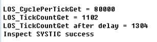


In this example, the system clock frequency is 80 MHz.

<h3 id="4.9">4.9 Software Timer</h3>

### 4.9.1 Overview

**Basic Concept**

A software timer is a timer simulated by software, and works based on system
tick interrupts. When a predefined number of ticks elapse, a software timer
triggers a user-defined callback function. The timer length is an integral
number of ticks.

Only a limited number of hardware timers can be used due to hardware
constraints. Software timers can fulfill the demand for more timers, allowing
you to create more timing services.

The software timer module supports the following functions:

* Statically disable a software timer by macro

* Create a software timer

* Start a software timer

* Stop a software timer

* Delete a software timer

* Measure the number of ticks that must elapse prior to expiry of a software timer

**Operation Mechanism**

Software timers are system resources and are allocated continuous memory at the
initialization of the timer module. The maximum number of software timers
supported by the operating system is defined by LOSCFG_BASE_CORE_SWTMR_LIMIT in
the los_config.h file.

Software timers are placed in a queue and a triggered in the first in first out
order. The software timers with a short life cycle are placed at the beginning
of queue so that they will be triggered earlier than those with a longer life
cycle.

The software timer length is measured in ticks. When a software timer is
actuated, Huawei LiteOS determines the timer expiry time based on the current
system time (in ticks) and timer length (in ticks) and adds the timer control
structure to the global timing list.

When a tick interrupt occurs, the tick interrupt handler scans the global timing
list for expired timers. If such a timer is found, the timer is recorded.

After the tick interrupt handler finishes processing, the software timer task (a
task exclusively used for software timers) is assigned the highest priority and
then woken up to call the Timer_Callback function (callback function that
handles software timer expiry) of the expired timer.

**Software Timer States**

* OS_SWTMR_STATUS_UNUSED

While the timer module is being initialized, the operating system initializes
all timer resources in the system to OS_SWTMR_STATUS_UNUSED state.

* OS_SWTMR_STATUS_CREATED

If the LOS_SwtmrCreate API is called in OS_SWTMR_STATUS_UNUSED state or if the
LOS_SwtmrStop API is called after timer start-up, the timer switches to
OS_SWTMR_STATUS_CREATED state.

* OS_SWTMR_STATUS_TICKING

If the LOS_SwtmrStart API is called after the timer is created, the timer
switches to OS_SWTMR_STATUS_TICKING state.

**Software Timer Modes**

Depending on timer mode, software timers are classified into two types:

* One-shot timer: The timer triggers the timer event only once after it is
    started. Then, the timer is automatically deleted.

* Periodic timer: The timer triggers the timer event periodically until the
    timer is manually stopped.

#### 4.9.2 Development Guidelines

**Usage Scenarios**

* If you want to trigger a timer event only once, create a one-shot timer and define a Timer_Callback function for the timer. When the timer expires, the Timer_Callback function will be executed.

* If you want to trigger a timer event periodically, create a periodic timer and define a Timer_Callback function for the timer. When the timer expires, the Timer_Callback function will be executed.

**Functions**

The software timer module provides the following functions. For details about
the APIs, see the API reference.

| Function Category                                    | API              | Description                                                                       |
|------------------------------------------------------|------------------|-----------------------------------------------------------------------------------|
| Timer creation and deletion                          | LOS_SwtmrCreate  | Creates a software timer                                                          |
|                                                      | LOS_SwtmrDelete  | Deletes a software timer                                                          |
| Timer start and stop                                 | LOS_SwtmrStart   | Starts a software timer                                                           |
|                                                      | LOS_SwtmrStop    | Stops a software timer                                                            |
| Measurement of remaining ticks prior to timer expiry | LOS_SwtmrTimeGet | Measures the number of ticks that must elapse prior to expiry of a software timer |

**Development Process**

Software timer typical development process:

1 Set software timer.

 * Set LOSCFG_BASE_CORE_SWTMR and LOSCFG_BASE_IPC_QUEUE to YES.

 * Set LOSCFG_BASE_CORE_SWTMR_LIMIT to the maximum number of software timers supported by the operating system.

 * Set OS_SWTMR_HANDLE_QUEUE_SIZE to the maximum size of the software timer queue.

2 Call the LOS_SwtmrCreate API to create a software timer.

 * Creates a software timer that has a user-defined timer length, Timer_Callback function, and trigger mode; returns the software timer handler after successful creation.

 * Returns the function execution result (successful or failed).

3 Call the LOS_SwtmrStart API to start a software timer.

4 Call the LOS_SwtmrTimeGet API to get left number of Ticks of software timer.

5 Call the LOS_SwtmrStop API to stop a software timer.

6 Call the LOS_SwtmrDelete API to delete a software timer.

**Software Timer Error Codes**

Error codes are returned if errors occur during software timer operations, such
as creating, deleting, suspending, or restarting a software timer, to facilitate
fault locating.

| No. | Definition                          | Error Code | Description                                                                                  | Solution                                                                                           |
|-----|-------------------------------------|------------|----------------------------------------------------------------------------------------------|----------------------------------------------------------------------------------------------------|
| 1   | LOS_ERRNO_SWTMR_PTR_NULL            | 0x02000300 | The callback function of the software timer is null.                                         | Define the callback function of the software timer.                                                |
| 2   | LOS_ERRNO_SWTMR_INTERVAL_NOT_SUITED | 0x02000301 | The timer length of the software timer is 0.                                                 | Redefine the timer length.                                                                         |
| 3   | LOS_ERRNO_SWTMR_MODE_INVALID        | 0x02000302 | The mode of the software timer is incorrect.                                                 | Modify the mode of the software timer. Range: [0, 2].                                              |
| 4   | LOS_ERRNO_SWTMR_RET_PTR_NULL        | 0x02000303 | The passed-in pointer to the software timer ID is null.                                      | Pass in a non-null pointer.                                                                        |
| 5   | LOS_ERRNO_SWTMR_MAXSIZE             | 0x02000304 | The number of software timers exceeds the maximum value.                                     | Redefine the maximum number of software timers, or wait until a software timer releases resources. |
| 6   | LOS_ERRNO_SWTMR_ID_INVALID          | 0x02000305 | The passed-in software timer ID is incorrect.                                                | Pass in a correct software timer ID.                                                               |
| 7   | LOS_ERRNO_SWTMR_NOT_CREATED         | 0x02000306 | No software timer is created.                                                                | Create a software timer.                                                                           |
| 8   | LOS_ERRNO_SWTMR_NO_MEMORY           | 0x02000307 | The memory space is insufficient for creating the linked list of a software timer.           | Apply for a larger memory space for the software timer.                                            |
| 9   | LOS_ERRNO_SWTMR_MAXSIZE_INVALID     | 0x02000308 | The maximum number of software timers is incorrect.                                          | Redefine the maximum number of software timers.                                                    |
| 10  | LOS_ERRNO_SWTMR_HWI_ACTIVE          | 0x02000309 | A timer is used when the CPU is processing interrupts.                                       | Modify the source code to ensure that no timer is used when the CPU is processing interrupts.      |
| 11  | LOS_ERRNO_SWTMR_HANDLER_POOL_NO_MEM | 0x0200030a | The memory space allocated to the membox is insufficient.                                    | Expand the memory space.                                                                           |
| 12  | LOS_ERRNO_SWTMR_QUEUE_CREATE_FAILED | 0x0200030b | The software timer queue fails to be created.                                                | Check whether the memory space is sufficient for creating the queue.                               |
| 13  | LOS_ERRNO_SWTMR_TASK_CREATE_FAILED  | 0x0200030c | The software timer task fails to be created.                                                 | Allocate sufficient memory space for creating the software timer task.                             |
| 14  | LOS_ERRNO_SWTMR_NOT_STARTED         | 0x0200030d | The software timer is not started.                                                           | Start the software timer.                                                                          |
| 15  | LOS_ERRNO_SWTMR_STATUS_INVALID      | 0x0200030e | The software timer status is incorrect.                                                      | Check the software timer status.                                                                   |
| 16  | LOS_ERRNO_SWTMR_SORTLIST_NULL       | Null       | The error code is not in use.                                                                | N/A                                                                                                |
| 17  | LOS_ERRNO_SWTMR_TICK_PTR_NULL       | 0x02000310 | The passed-in pointer used for obtaining the number of software timer timeout ticks is null. | Pass in a non-null pointer.                                                                        |

An error code is a 32-bit storage unit. Bit 24 to bit 31 indicate an error
level; bit 16 to bit 23 indicate an error code flag; bit 8 to bit 15 indicate
the ID of the module that reports the error code; bit 0 to bit 7 indicate an
error code. The following is the example of an error code:

```
#define LOS_ERRNO_OS_NORMAL(MID,ERRNO)  \
(LOS_ERRTYPE_NORMAL | LOS_ERRNO_OS_ID | ((UINT32)(MID) << 8) | (ERRNO))
LOS_ERRTYPE_NORMAL: Define the error level as critical
LOS_ERRNO_OS_ID: OS error code flag.
MID: OS_MOUDLE_ID
ERRNO: error ID number
```

For example:

```
#define LOS_ERRNO_SWTMR_PTR_NULL \ LOS_ERRNO_OS_ERROR(LOS_MOD_SWTMR, 0x00)
```

#### 4.9.3 Precautions

* Limit the number of operations contained in the callback function of a software timer. Do not use the API or perform any operation that may suspend or block tasks.

* Software timers are placed in a queue. A task is used exclusively to convey software timer information. The priority of a task in a software timer is set to 0, which is not allowed to be modified.

* The maximum number of software timer resources is not equal to the total number of software timer resources available to users. When a software timer occupies a software timer resource, the number of available software timer resources is decreased by 1.

* After the callback function of a one-shot software timer is executed, the software timer is automatically deleted and the resources allocated to the timer are reclaimed.

#### 4.9.4 Programming Example

**Example Description**

In the programming example, the following steps will be performed:

1 Create, delete, start, stop or restart a software timer.

2 Use a one-shot software timer and a periodical software timer.

**Example Code**

Prerequisites

* The LOSCFG_BASE_CORE_SWTMR parameter in the los_config.h file is set to YES.

* The LOSCFG_BASE_CORE_SWTMR_LIMIT parameter in the los_config.h file is set to the maximum number of software timers supported by the operating system.

* The OS_SWTMR_HANDLE_QUEUE_SIZE parameter in the los_config.h file is set to the maximum size of the software timer queue.

The code is as follows:

```
static VOID Timer1_Callback(UINT32 arg)
{
    UINT32 tick_last1;

    g_timercount1++;
    tick_last1 = (UINT32)LOS_TickCountGet();
    dprintf("g_timercount1=%d\n", g_timercount1);
    dprintf("tick_last1=%d\n", tick_last1);
}

static VOID Timer2_Callback(UINT32 arg)
{
    UINT32 uwRet = LOS_OK;
    UINT32 tick_last2;

    tick_last2 = (UINT32)LOS_TickCountGet();
    g_timercount2++;
    dprintf("g_timercount2=%d\n", g_timercount2);
    dprintf("tick_last2=%d\n", tick_last2);
    uwRet = LOS_InspectStatusSetByID(LOS_INSPECT_TIMER, LOS_INSPECT_STU_SUCCESS);
    if (LOS_OK != uwRet)
    {
        dprintf("Set Inspect Status Err\n");
    }
}

UINT32 Example_swTimer(VOID)
{
    UINT16 id1;
    UINT16 id2;// timer id
    UINT32 uwRet = LOS_OK;

#if (LOSCFG_BASE_CORE_SWTMR_ALIGN == YES)
    uwRet = LOS_SwtmrCreate(1000, LOS_SWTMR_MODE_ONCE, Timer1_Callback, &id1, 1, OS_SWTMR_ROUSES_ALLOW, OS_SWTMR_ALIGN_SENSITIVE);
#else
    uwRet = LOS_SwtmrCreate(1000, LOS_SWTMR_MODE_ONCE, Timer1_Callback, &id1, 1);
#endif
    if (LOS_OK != uwRet)
    {
        dprintf("create Timer1 failed\n");
    }
    else
    {
        dprintf("create Timer1 success\n");
    }

#if (LOSCFG_BASE_CORE_SWTMR_ALIGN == YES)
    uwRet = LOS_SwtmrCreate(100, LOS_SWTMR_MODE_PERIOD, Timer2_Callback, &id2, 1, OS_SWTMR_ROUSES_ALLOW, OS_SWTMR_ALIGN_SENSITIVE);
#else
    uwRet = LOS_SwtmrCreate(100, LOS_SWTMR_MODE_PERIOD, Timer2_Callback, &id2, 1);
#endif
    if(LOS_OK != uwRet)
    {
        dprintf("create Timer2 failed\n");
    }
    else
    {
        dprintf("create Timer2 success\n");
    }

    uwRet = LOS_SwtmrStart(id1);
    if (LOS_OK != uwRet)
    {
        dprintf("start Timer1 failed\n");
    }
    else
    {
        dprintf("start Timer1 sucess\n");
    }

    (VOID)LOS_TaskDelay(200);

    uwRet = LOS_SwtmrStop(id1);
    if (LOS_OK != uwRet)
    {
        dprintf("stop Timer1 failed\n");
    }
    else
    {
        dprintf("stop Timer1 sucess\n");
    }

    uwRet = LOS_SwtmrStart(id1);
    if (LOS_OK != uwRet)
    {
        dprintf("start Timer1 failed\n");
    }

    (VOID)LOS_TaskDelay(1000);

    /*the timer that mode is once, kernel will delete it automatically when timer is timeout */
    uwRet = LOS_SwtmrDelete(id1);
    if (LOS_OK != uwRet)
    {
        dprintf("delete Timer1 failed\n");
    }
    else
    {
        dprintf("delete Timer1 sucess\n");
    }

    uwRet = LOS_SwtmrStart(id2);
    if (LOS_OK != uwRet)
    {
        dprintf("start Timer2 failed\n");
    }
    else
    {
        dprintf("start Timer2 success\n");
    }

    (VOID)LOS_TaskDelay(1000);

    uwRet = LOS_SwtmrStop(id2);
    if (LOS_OK != uwRet)
    {
        dprintf("stop Timer2 failed\n");
    }

    uwRet = LOS_SwtmrDelete(id2);
    if (LOS_OK != uwRet)
    {
        dprintf("delete Timer2 failed\n");
    }

    return LOS_OK;
}  
```  

**Verification**

The verification result is as follows:

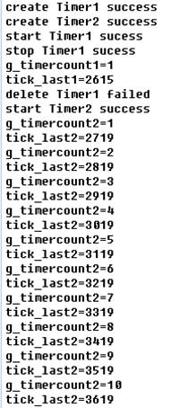

<h3 id="4.10">4.10 Doubly Linked List</h3>

### 4.10.1 Overview

**Basic Concept**

A doubly linked list is a linked data structure that consists of a set of
sequentially linked records called nodes. Each node in a doubly linked list
contains two pointers that reference to the previous and to the next node in the
sequence of nodes. The head of the doubly linked list is deterministic and
immediately accessible.

Any node of a doubly linked list, once obtained, can be used to begin a new
traversal of the list in either direction (towards the beginning or end) from
the given node. This allows a lot of data to be quickly traversed. Because of
the symmetric nature of a doubly linked list, nodes can easily be inserted into
or removed from the list.

### 4.10.2 Development Guidelines

**Functions**

The doubly linked list module provides the following functions:

| Function Category                     | API                | Description                                                                               |
|---------------------------------------|--------------------|-------------------------------------------------------------------------------------------|
| List initialization                   | LOS_InitList       | Initializes a doubly linked list                                                          |
| Node insertion                        | LOS_ListAdd        | Inserts a node to a doubly linked list                                                    |
|                                       | LOS_ListTailInsert | Inserts a node to the tail of a doubly linked list                                        |
| Node deletion                         | LOS_ListDelete     | Deletes a node from a doubly linked list                                                  |
| List status determination             | LOS_ListEmpty      | Determines whether a doubly linked list is empty                                          |
| Node deletion and list initialization | LOS_ListDelInit    | Deletes a node from a doubly linked list Uses the node to initialize a doubly linked list |

**Development Process**

Doubly linked list development process:

1 Call the LOS_InitList API to initialize a doubly linked list.

2 Call the LOS_ListAdd API to insert a node into the list.

3 Call the LOS_ListTailInsert API to insert a node into the tail of the list.

4 Call the LOS_ListDelete API to delete a node from the list.

5 Call the LOS_ListEmpty API to determine whether the doubly linked list is empty.

6 Call the LOS_ListDelInit API to delete a node and use the node to initialize the doubly linked list.

### 4.10.3 Precautions

* While inserting or deleting a node from a doubly linked list, ensure that the direction of pointers of adjacent nodes is correct.

### 4.10.4 Programming Example

**Example Description**

Before using a doubly linked list, ensure that sufficient memory space is
available to store the list. After deleting a node from the list, do not forget
to free up the memory occupied by the node.

In the programming example, the following steps will be performed:

1 Initialize a doubly linked list.

2 Insert a node into the list.

3 Delete a node from the list.

4 Check whether the insertion and deletion was successful.

**Example Code**

The code is as follows:

```
#include "los_list.h" 
 #include<stdio.h> 

 VOID list_test(void) 
 { 
  /*Initialize the doubly linked list and determine whether it is an empty list.*/ 
  printf("initial......\n"); 
  LOS_DL_LIST* head; 
  head = (LOS_DL_LIST*)malloc(sizeof(LOS_DL_LIST)); 

  LOS_InitList(head); 
  if (!ListEmpty(head)) 
  { 
   printf("initial failed\n"); 
   return; 
  } 

  /*Insert a node into the tail of the list.*/ 
  printf("node add and tail add......\n"); 
  LOS_DL_LIST* node1 = (LOS_DL_LIST*)malloc(sizeof(LOS_DL_LIST)); 
  LOS_DL_LIST* node2 = (LOS_DL_LIST*)malloc(sizeof(LOS_DL_LIST)); 
  LOS_DL_LIST* tail = (LOS_DL_LIST*)malloc(sizeof(LOS_DL_LIST)); 
  LOS_ListAdd(node1,head); 
  LOS_ListAdd(node2,node1); 
  if((node1->pstPrev == head) || (node2->pstPrev == node1)){  
   printf("add node success\n"); 
  } 
  LOS_ListTailInsert(tail,head); 
  if(tail->pstPrev == node2){ 
   printf("add tail success\n"); 
 } 


  /*Delete a node from the list.*/ 
  printf("delete node......\n"); 
  LOS_ListDelete(node1); 
  free(node1); 
  if(head->pstNext == node2){ 
   printf("delete node success\n"); 
  } 

 }  
```  

**Verification**

The verification result is as follows:

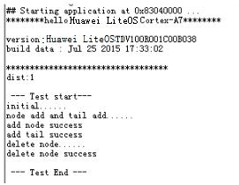

<h2 id="5">5 AgentTiny</h2>

### 5.1 Overview

AgentTiny is a lightweight interconnection middleware deployed on terminal
devices that have wide area network (WAN) capabilities and strict restrictions
on power consumption, storage, and computing resources. You only need to call
several simple APIs to quickly connect devices to the Huawei IoT cloud platform
(OceanConnect), report data, and receive commands.

Take the lantern application as an example. The following figure shows the
working principle of AgentTiny.

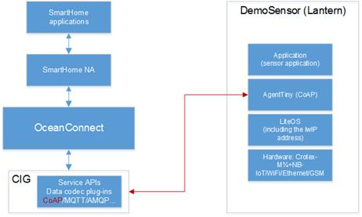

### 5.2 Development Guidelines

**Usage Scenarios**

You only need to implement the platform abstract layer API to connect to
OceanConncet.

**Functions**

The following table lists the API categories provided by AgentTiny.

| Category                 | API                | Description                                                                                                                                                                                                                                                                                                                                                                   |
|--------------------------|--------------------|-------------------------------------------------------------------------------------------------------------------------------------------------------------------------------------------------------------------------------------------------------------------------------------------------------------------------------------------------------------------------------|
| AgentTiny dependent APIs | atiny_cmd_ioctl    | This API is stated and called by AgentTiny, and is implemented by you. This API is a unified entry for the LWM2M standard object to deliver commands to devices, such as reading and writing device data, and issuing reset and upgrade commands. To avoid deadlocks, this API cannot be used to call AgentTiny external APIs.                                                |
|                          | atiny_event_notify | This API is stated and called by AgentTiny, and is implemented by you. AgentTiny notifies the user of the key status of the registration process and key events during the running process. In this way, the user can flexibly perform reliability processing based on the application scenario. To avoid deadlocks, this API cannot be used to call AgentTiny external APIs. |
| AgentTiny external APIs  | atiny_init         | AgentTiny initialization API, which is implemented by AgentTiny and called by you.                                                                                                                                                                                                                                                                                            |
|                          | atiny_bind         | Main function body of AgentTiny, which is implemented by AgentTiny and called by you. The API is not returned after the call is successful. This API is the main loop body of AgentTiny. It implements the LWM2M protocol processing, registration status machine, retransmission queue, and subscription reporting.                                                          |
|                          | atiny_deinit       | AgentTiny deinitialization API, which is implemented by AgentTiny and called by you. This API is a block API. When this API is called, the API exits only after the AgentTiny main task exits and resources are released.                                                                                                                                                     |
|                          | atiny_data_report  | AgentTiny data reporting API, which is implemented by AgentTiny and called by you. This API is called to report user application data. This API is a block API and cannot be used in interrupts.                                                                                                                                                                              |

**Development Process**

The development process of AgentTiny in typical scenarios is as follows:

1 Implement the atiny_cmd_ioctl API based on the header file provided by AgentTiny. This API contains three parameters. The **cmd** parameter indicates the command type. The memory space of the **arg** parameter is allocated by AgentTiny. The content of the **arg** parameter varies according to the cmd parameter. For example, the command for reading data is filled by the device side and is used by AgentTiny. The command for writing data is filled by AgentTiny and used by the device side. The **len** parameter indicates the length of the memory space pointed to by the **arg** parameter. When the device side fills or reads the parameter, prevent overflows.

2 Implement the atiny_event_notify API based on the header file provided by AgentTiny. This API contains three parameters. The **stat** parameter indicates the event type. The **arg** parameter indicates the event information that AgentTiny sends to the device side based on the event type. The **len** parameter indicates the length of **arg**. When the device side uses this parameter, prevent overflows.

3 Call atiny_init to initialize AgentTiny and obtain the corresponding AgentTiny handle. You should process the return value of the API. If an error is returned, the handle is invalid.

4 Create a task. The stack size should be greater than or equal to 4 KB. Call atiny_bind to start AgentTiny. After atiny_bind is called successfully, the API is not returned. The atiny_bind API internally implements the main task of AgentTiny.

5 To stop AgentTiny, call atiny_deinit. This API is returned after AgentTiny exits and resources are released.

The atiny_data_report API can be called in any task of the developer service.

**Mutex Error Codes**

The following table lists the error codes of AgentTiny external and dependent
APIs.

| No. | Definition                 | Actual Value | Description                         | Suggestion                                                                                                                                            |
|-----|----------------------------|--------------|-------------------------------------|-------------------------------------------------------------------------------------------------------------------------------------------------------|
| 1   | ATINY_OK                   | 0            | Normal response code                |                                                                                                                                                       |
| 2   | ATINY_ARG_INVALID          | \-1          | Invalid parameter                   | Check that the input parameter is valid.                                                                                                              |
| 3   | ATINY_BUF_OVERFLOW         | \-2          | Buffer overflow                     | Check that the buffer is sufficient.                                                                                                                  |
| 4   | ATINY_MSG_CONGEST          | \-3          | Message congestion                  | Suspend data reporting.                                                                                                                               |
| 5   | ATINY_MALLOC_FAILED        | \-4          | Memory request failure              | Check for memory leakages.                                                                                                                            |
| 6   | ATINY_RESOURCE_NOT_FOUND   | \-5          | Invalid data type in data reporting | Check that the data type is valid.                                                                                                                    |
| 7   | ATINY_RESOURCE_NOT_ENOUGH  | \-6          | Insufficient system resources       | Check the system resources, such as the semaphore and the number of sockets. Check whether the resource is insufficient or a resource leakage occurs. |
| 8   | ATINY_CLIENT_UNREGISTERED  | \-7          | AgentTiny registration failure      | Check that PSK and server information is correctly configured.                                                                                        |
| 9   | ATINY_SOCKET_CREATE_FAILED | \-8          | Network socket creation failure     | Check that the network is correctly configured.                                                                                                       |

**Platform Differences**

None.

### 5.3 Precautions

* The atiny_cmd_ioctl and atiny_event_notify APIs cannot be used to call the atiny_deinit, atiny_data_report, atiny_init, and atiny_bind external APIs. Otherwise, a deadlock may occur or other exceptions may occur.

* Before calling atiny_deinit, ensure that atiny_bin has been called. Otherwise, atiny_deinit will be blocked, and after atiny_deinit is called, the corresponding AgentTiny handle becomes invalid and cannot be used again.

* It is recommended that the size of the task stack that carries the atiny_bind API be greater than or equal to 4 KB. The task priority depends on the system condition. If the task stack size is too small, the packet loss or sending delay may occur.

### 5.4 Programming Example

**Example Description**

The programming example implements the following process:

1 Implement the atiny_cmd_ioctl and atiny_event_notify APIs.

2 Create a data reporting task.

3 Call the atiny_init API to initialize AgentTiny.

4 Call the atiny_bind API to start AgentTiny.

**Example Code**

**Prerequisites:**

* The **WITH_DTLS** compilation option in project configuration has beenenabled.

The code is as follows:

```
#define MAX_PSK_LEN 16
#define DEFAULT_SERVER_IPV4 "192.168.0.5"
#define DEFAULT_SERVER_PORT "5684"
#define LWM2M_LIFE_TIME     50000
char *  g_endpoint_name_s = "11110001";
unsigned char g_psk_value[MAX_PSK_LEN] = {0xef,0xe8,0x18,0x45,0xa3,0x53,0xc1,0x3c,0x0c,0x89,0x92,0xb3,0x1d,0x6b,0x6a,0x33};
 
UINT32 TskHandle;
 
static void* g_phandle = NULL;
static atiny_device_info_t g_device_info;
static atiny_param_t g_atiny_params;
 
 
int atiny_cmd_ioctl(atiny_cmd_e cmd, char* arg, int len)
{
    int result = ATINY_OK;
    switch(cmd)
    {
        case ATINY_DO_DEV_REBOOT:
             result = atiny_do_dev_reboot();
            break;
        case ATINY_GET_MIN_VOLTAGE:
            result = atiny_get_min_voltage((int*)arg);
            break;
         default:
            result = ATINY_RESOURCE_NOT_FOUND;
            break;
        }
 
    return result; 
}
 
void atiny_event_notify(atiny_event_e stat, char* arg, int len)
{
    (void)atiny_printf("notify:stat:%d\r\n", stat);
}
 
void ack_callback(atiny_report_type_e type, int cookie, data_send_status_e status)
{
    printf("ack type:%d cookie:%d status:%d\n", type,cookie, status);
}
 
void app_data_report(void)
{
    uint8_t buf[5] = {0,1,6,5,9};
    data_report_t report_data;
    int cnt = 0;
        
    report_data.buf = buf;
    report_data.callback = ack_callback;
    report_data.cookie = 0;
    report_data.len = sizeof(buf);
    report_data.type = APP_DATA;
    while(1)
    {
        report_data.cookie = cnt;
        cnt++;
        (void)atiny_data_report(g_phandle, &report_data);
        (void)LOS_TaskDelay(2000);
    }
}
 
UINT32 creat_report_task()
{
    UINT32 uwRet = LOS_OK;
    TSK_INIT_PARAM_S task_init_param;
 
    task_init_param.usTaskPrio = 1;
    task_init_param.pcName = "app_data_report";
    task_init_param.pfnTaskEntry = (TSK_ENTRY_FUNC)app_data_report;
    task_init_param.uwStackSize = 0x1000;
 
    uwRet = LOS_TaskCreate(&TskHandle, &task_init_param);
    if(LOS_OK != uwRet)
    {
        return uwRet;
    }
    return uwRet;
 
}
 
void agent_tiny_entry(void)
{
    UINT32 uwRet = LOS_OK;
    atiny_param_t* atiny_params;
    atiny_security_param_t  *security_param = NULL;
    atiny_device_info_t *device_info = &g_device_info;
 
    device_info->endpoint_name = g_endpoint_name_s;
    device_info->manufacturer = "test";
 
    atiny_params = &g_atiny_params;
    atiny_params->server_params.binding = "UQ";
    atiny_params->server_params.life_time = LWM2M_LIFE_TIME;
    atiny_params->server_params.storing_cnt = 0;
 
    security_param = &(atiny_params->security_params[0]);
    security_param->is_bootstrap = FALSE;
    security_param->server_ip = DEFAULT_SERVER_IPV4;
    security_param->server_port = DEFAULT_SERVER_PORT;
    security_param->psk_Id = g_endpoint_name_s;
    security_param->psk = (char*)g_psk_value;
    security_param->psk_len = sizeof(g_psk_value);
 
 
    if(ATINY_OK != atiny_init(atiny_params, &g_phandle))
    {
        return;
    }
 
    uwRet = creat_report_task();
    if(LOS_OK != uwRet)
    {
        return;
    }
 
(void)atiny_bind(device_info, g_phandle);
}  
```  

**Verification**

1 Log in to OceanConncet.

<https://192.168.0.5:8843/index.html#/device>

Register an OceanConnect account in advance.

2 Select **Device**.

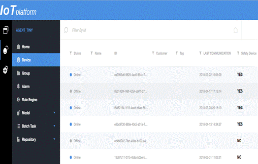

3 Click the first device. If the device ID is 11110002, the device is
successfully registered.

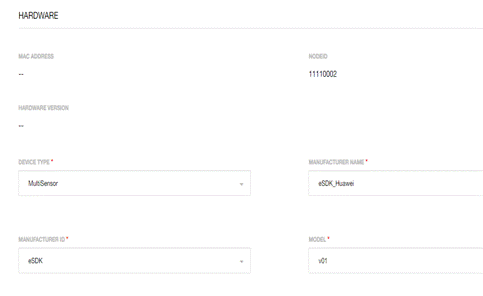

