# Device-Cloud Interconnect Components

## Terms<a name="section65276441"></a>

<a name="table63286273"></a>
<table><thead align="left"><tr id="row38255654"><th class="cellrowborder" valign="top" width="7.07070707070707%" id="mcps1.1.4.1.1"><p id="p11700254"><a name="p11700254"></a><a name="p11700254"></a>No.</p>
</th>
<th class="cellrowborder" valign="top" width="21.21212121212121%" id="mcps1.1.4.1.2"><p id="p8196494"><a name="p8196494"></a><a name="p8196494"></a>Term</p>
</th>
<th class="cellrowborder" valign="top" width="71.71717171717171%" id="mcps1.1.4.1.3"><p id="p59936287"><a name="p59936287"></a><a name="p59936287"></a>Description</p>
</th>
</tr>
</thead>
<tbody><tr id="row23001080"><td class="cellrowborder" valign="top" width="7.07070707070707%" headers="mcps1.1.4.1.1 "><p id="p51148226"><a name="p51148226"></a><a name="p51148226"></a>1</p>
</td>
<td class="cellrowborder" valign="top" width="21.21212121212121%" headers="mcps1.1.4.1.2 "><p id="p49365669"><a name="p49365669"></a><a name="p49365669"></a>LiteOS SDK</p>
</td>
<td class="cellrowborder" valign="top" width="71.71717171717171%" headers="mcps1.1.4.1.3 "><p id="OLE_LINK11"><a name="OLE_LINK11"></a><a name="OLE_LINK11"></a>Huawei LiteOS Software Development Kit, including device-cloud interconnect components, FOTA, JavaScript engine, and sensor framework.</p>
</td>
</tr>
<tr id="row17221769"><td class="cellrowborder" valign="top" width="7.07070707070707%" headers="mcps1.1.4.1.1 "><p id="p52786031"><a name="p52786031"></a><a name="p52786031"></a>2</p>
</td>
<td class="cellrowborder" valign="top" width="21.21212121212121%" headers="mcps1.1.4.1.2 "><p id="p47810155"><a name="p47810155"></a><a name="p47810155"></a>Southbound devices</p>
</td>
<td class="cellrowborder" valign="top" width="71.71717171717171%" headers="mcps1.1.4.1.3 "><p id="OLE_LINK13"><a name="OLE_LINK13"></a><a name="OLE_LINK13"></a>Embedded devices used to collect data, such as STM32 development boards or temperature and humidity collection sensors.</p>
</td>
</tr>
<tr id="row24102648"><td class="cellrowborder" valign="top" width="7.07070707070707%" headers="mcps1.1.4.1.1 "><p id="p6157494"><a name="p6157494"></a><a name="p6157494"></a>3</p>
</td>
<td class="cellrowborder" valign="top" width="21.21212121212121%" headers="mcps1.1.4.1.2 "><p id="p28994980"><a name="p28994980"></a><a name="p28994980"></a>Northbound application</p>
</td>
<td class="cellrowborder" valign="top" width="71.71717171717171%" headers="mcps1.1.4.1.3 "><p id="OLE_LINK43"><a name="OLE_LINK43"></a><a name="OLE_LINK43"></a>Mobile phone or PC application that receives data from or delivers control commands to southbound devices on OceanConnect.</p>
</td>
</tr>
<tr id="row65157182"><td class="cellrowborder" valign="top" width="7.07070707070707%" headers="mcps1.1.4.1.1 "><p id="p43240380"><a name="p43240380"></a><a name="p43240380"></a>4</p>
</td>
<td class="cellrowborder" valign="top" width="21.21212121212121%" headers="mcps1.1.4.1.2 "><p id="p12809895"><a name="p12809895"></a><a name="p12809895"></a>Device profile</p>
</td>
<td class="cellrowborder" valign="top" width="71.71717171717171%" headers="mcps1.1.4.1.3 "><p id="OLE_LINK14"><a name="OLE_LINK14"></a><a name="OLE_LINK14"></a>A group of JSON files that describe the formats of data reported by southbound devices and southbound device capabilities. These files need to be uploaded to OceanConnect.</p>
</td>
</tr>
<tr id="row10281497"><td class="cellrowborder" valign="top" width="7.07070707070707%" headers="mcps1.1.4.1.1 "><p id="p27494898"><a name="p27494898"></a><a name="p27494898"></a>5</p>
</td>
<td class="cellrowborder" valign="top" width="21.21212121212121%" headers="mcps1.1.4.1.2 "><p id="p12494227"><a name="p12494227"></a><a name="p12494227"></a>Codec plug-in</p>
</td>
<td class="cellrowborder" valign="top" width="71.71717171717171%" headers="mcps1.1.4.1.3 "><p id="OLE_LINK45"><a name="OLE_LINK45"></a><a name="OLE_LINK45"></a>A JAR file. The file can be used to resolve private data reported by southbound devices into data that is described in the device profile and can be identified and stored on OceanConnect. In addition, it can encode commands delivered by northbound applications into a group of functions in formats that can be identified by southbound devices. In short, codec plug-ins are a data conversion program between southbound devices and OceanConnect.</p>
</td>
</tr>
<tr id="row48595151"><td class="cellrowborder" valign="top" width="7.07070707070707%" headers="mcps1.1.4.1.1 "><p id="p43893197"><a name="p43893197"></a><a name="p43893197"></a>6</p>
</td>
<td class="cellrowborder" valign="top" width="21.21212121212121%" headers="mcps1.1.4.1.2 "><p id="p65688079"><a name="p65688079"></a><a name="p65688079"></a>AT instruction set</p>
</td>
<td class="cellrowborder" valign="top" width="71.71717171717171%" headers="mcps1.1.4.1.3 "><p id="OLE_LINK49"><a name="OLE_LINK49"></a><a name="OLE_LINK49"></a>An instruction set that is sent from a Terminal Equipment (TE) or a Data Terminal Equipment (DTE) to a Terminal Adapter (TA) or a Data Circuit Terminal Equipment (DCE). In this guide, AT instructions are used to operate the Wi-Fi or GSM module.</p>
</td>
</tr>
<tr id="row37990129"><td class="cellrowborder" valign="top" width="7.07070707070707%" headers="mcps1.1.4.1.1 "><p id="p57301646"><a name="p57301646"></a><a name="p57301646"></a>7</p>
</td>
<td class="cellrowborder" valign="top" width="21.21212121212121%" headers="mcps1.1.4.1.2 "><p id="p10921739"><a name="p10921739"></a><a name="p10921739"></a>Device-cloud interconnect component</p>
</td>
<td class="cellrowborder" valign="top" width="71.71717171717171%" headers="mcps1.1.4.1.3 "><p id="OLE_LINK15"><a name="OLE_LINK15"></a><a name="OLE_LINK15"></a>Important component specified in the Huawei IoT solution for connecting devices with limited resources to OceanConnect.</p>
</td>
</tr>
<tr id="row43101974"><td class="cellrowborder" valign="top" width="7.07070707070707%" headers="mcps1.1.4.1.1 "><p id="p1598971"><a name="p1598971"></a><a name="p1598971"></a>8</p>
</td>
<td class="cellrowborder" valign="top" width="21.21212121212121%" headers="mcps1.1.4.1.2 "><p id="p62407804"><a name="p62407804"></a><a name="p62407804"></a>OceanConnect</p>
</td>
<td class="cellrowborder" valign="top" width="71.71717171717171%" headers="mcps1.1.4.1.3 "><p id="OLE_LINK16"><a name="OLE_LINK16"></a><a name="OLE_LINK16"></a>Huawei IoT Connection Management Platform, a unified and open cloud platform provided for carriers, enterprises, and industry partners. It supports management of connections from devices with or without SIM cards.</p>
</td>
</tr>
</tbody>
</table>

> **NOTE:**   
>A device profile can correspond to only one codec plug-in. However, an application can associate with multiple codec plug-ins.  

## Overview

<h3 id="background-introduction.md">Background Introduction</h3>

LiteOS SDK consists of device-cloud interconnect components, FOTA, JavaScript engine, and sensor framework.

Device-cloud interconnect components are critical to connect devices with limited resources to OceanConnect in the Huawei IoT solution. Device-cloud interconnect components enable device-cloud synergy and integrate a full set of IoT interconnection protocol stacks, such as Lightweight M2M \(LWM2M\), Constrained Application Protocol \(CoAP\), mbed TLS, and lightweight IP \(lwIP\). Based on LWM2M, device-cloud interconnect components provide packaged open APIs for you to quickly and reliably connect applications to OceanConnect. In addition, they help you improve service development efficiency and quickly build products.

**Figure  1**  Huawei LiteOS architecture<a name="fig62337060"></a>  


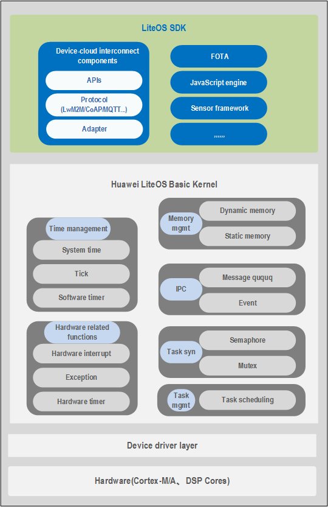

<h3 id="system-plan.md">System Plan</h3>

Device-cloud interconnect components provide the following two types of software architectures.

**Figure  1**  Architecture for single module or MCU<a name="fig66654698"></a>  


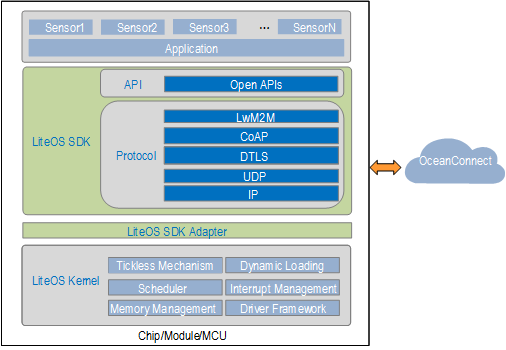

**Figure  2**  Architecture for external MCUs + chips/modules<a name="fig30321421"></a>  


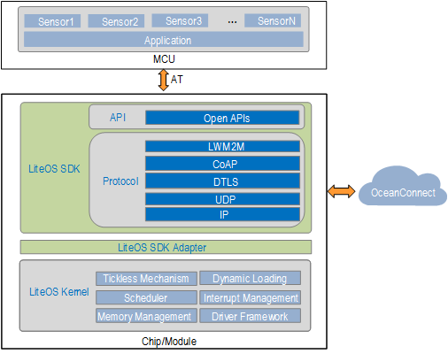

Device-cloud interconnect components are divided into the following three layers:

-   **Open API layer**: The device-cloud interconnect components provide open APIs for applications. Devices quickly connect OceanConnect, report service data, and process delivered commands by invoking these APIs. In the external MCUs + chips/modules scenario, device-cloud interconnect components also provides the AT instruction adaptation layer for parsing AT instructions.

-   **Protocol layer**: Device-cloud interconnect components integrate protocols, such as LWM2M, CoAP, Datagram Transport Layer Security \(DTLS\), TLS, and UDP.
-   **Driver and network adapter layer**: This layer facilitates device integration and porting. You can adapt to APIs related to the hardware random number, memory management, logs, data storage, and network sockets based on the API list of the adaptation layer provided by SDK and specific hardware platform.

LiteOS basic kernel provides RTOS features for devices.

<h2 id="integration-strategies.md">Integration Strategies</h2>

<h3 id="integrability.md">Integrability</h3>

Device-cloud interconnect components can be easily integrated with various types of communications modules, such as NB-IoT, eMTC, Wi-Fi, GSM, and Ethernet hardware modules without considering the specific chip architecture and network hardware type.

<h3 id="portability.md">Portability</h3>

The adapter layer of device-cloud interconnect components provides common hardware and network adapter APIs. Device or module vendors can complete the porting of device-cloud interconnect components after adapting their hardware to these APIs. The following table lists the to-be-ported APIs and related functions.

**Table  1**  APIs to which the to-be-ported device-cloud interconnect components need adapt

<a name="table20330987"></a>
<table><thead align="left"><tr id="row16965623"><th class="cellrowborder" valign="top" width="33.33333333333333%" id="mcps1.2.4.1.1"><p id="p32038241"><a name="p32038241"></a><a name="p32038241"></a>API Category</p>
</th>
<th class="cellrowborder" valign="top" width="33.33333333333333%" id="mcps1.2.4.1.2"><p id="p44960719"><a name="p44960719"></a><a name="p44960719"></a>API</p>
</th>
<th class="cellrowborder" valign="top" width="33.33333333333333%" id="mcps1.2.4.1.3"><p id="p17939626"><a name="p17939626"></a><a name="p17939626"></a>Description</p>
</th>
</tr>
</thead>
<tbody><tr id="row43823577"><td class="cellrowborder" rowspan="5" valign="top" width="33.33333333333333%" headers="mcps1.2.4.1.1 "><p id="p60048837"><a name="p60048837"></a><a name="p60048837"></a>Network socket API</p>
</td>
<td class="cellrowborder" valign="top" width="33.33333333333333%" headers="mcps1.2.4.1.2 "><p id="p32117589"><a name="p32117589"></a><a name="p32117589"></a>atiny_net_connect</p>
</td>
<td class="cellrowborder" valign="top" width="33.33333333333333%" headers="mcps1.2.4.1.3 "><p id="p1961031531013"><a name="p1961031531013"></a><a name="p1961031531013"></a>Creates a socket network connection.</p>
</td>
</tr>
<tr id="row59837824"><td class="cellrowborder" valign="top" headers="mcps1.2.4.1.1 "><p id="p15025562"><a name="p15025562"></a><a name="p15025562"></a>atiny_net_recv</p>
</td>
<td class="cellrowborder" valign="top" headers="mcps1.2.4.1.2 "><p id="p861001512108"><a name="p861001512108"></a><a name="p861001512108"></a>Receives packets.</p>
</td>
</tr>
<tr id="row14890402"><td class="cellrowborder" valign="top" headers="mcps1.2.4.1.1 "><p id="p65271937"><a name="p65271937"></a><a name="p65271937"></a>atiny_net_send</p>
</td>
<td class="cellrowborder" valign="top" headers="mcps1.2.4.1.2 "><p id="p176101815181018"><a name="p176101815181018"></a><a name="p176101815181018"></a>Sends packets.</p>
</td>
</tr>
<tr id="row3057817"><td class="cellrowborder" valign="top" headers="mcps1.2.4.1.1 "><p id="p46356614"><a name="p46356614"></a><a name="p46356614"></a>atiny_net_recv_timeout</p>
</td>
<td class="cellrowborder" valign="top" headers="mcps1.2.4.1.2 "><p id="p9610151514104"><a name="p9610151514104"></a><a name="p9610151514104"></a>Receives packets in a blocking manner.</p>
</td>
</tr>
<tr id="row38213209"><td class="cellrowborder" valign="top" headers="mcps1.2.4.1.1 "><p id="p8262190"><a name="p8262190"></a><a name="p8262190"></a>atiny_net_close</p>
</td>
<td class="cellrowborder" valign="top" headers="mcps1.2.4.1.2 "><p id="p1361011521013"><a name="p1361011521013"></a><a name="p1361011521013"></a>Closes a socket network connection.</p>
</td>
</tr>
<tr id="row50447774"><td class="cellrowborder" rowspan="7" valign="top" width="33.33333333333333%" headers="mcps1.2.4.1.1 "><p id="p59737926"><a name="p59737926"></a><a name="p59737926"></a>Hardware API</p>
</td>
<td class="cellrowborder" valign="top" width="33.33333333333333%" headers="mcps1.2.4.1.2 "><p id="p6933822"><a name="p6933822"></a><a name="p6933822"></a>atiny_gettime_ms</p>
</td>
<td class="cellrowborder" valign="top" width="33.33333333333333%" headers="mcps1.2.4.1.3 "><p id="p24768686"><a name="p24768686"></a><a name="p24768686"></a>Obtains the system time (ms).</p>
</td>
</tr>
<tr id="row21591587"><td class="cellrowborder" valign="top" headers="mcps1.2.4.1.1 "><p id="p4088123"><a name="p4088123"></a><a name="p4088123"></a>atiny_usleep</p>
</td>
<td class="cellrowborder" valign="top" headers="mcps1.2.4.1.2 "><p id="p62702560"><a name="p62702560"></a><a name="p62702560"></a>Delay function, measured in μs.</p>
</td>
</tr>
<tr id="row27452130"><td class="cellrowborder" valign="top" headers="mcps1.2.4.1.1 "><p id="p9030085"><a name="p9030085"></a><a name="p9030085"></a>atiny_random</p>
</td>
<td class="cellrowborder" valign="top" headers="mcps1.2.4.1.2 "><p id="p60348264"><a name="p60348264"></a><a name="p60348264"></a>Hardware random number function.</p>
</td>
</tr>
<tr id="row6263465"><td class="cellrowborder" valign="top" headers="mcps1.2.4.1.1 "><p id="p37578639"><a name="p37578639"></a><a name="p37578639"></a>atiny_malloc</p>
</td>
<td class="cellrowborder" valign="top" headers="mcps1.2.4.1.2 "><p id="p23970955"><a name="p23970955"></a><a name="p23970955"></a>Applies for dynamic memory.</p>
</td>
</tr>
<tr id="row14412003"><td class="cellrowborder" valign="top" headers="mcps1.2.4.1.1 "><p id="p26521624"><a name="p26521624"></a><a name="p26521624"></a>atiny_free</p>
</td>
<td class="cellrowborder" valign="top" headers="mcps1.2.4.1.2 "><p id="p767958"><a name="p767958"></a><a name="p767958"></a>Releases dynamic memory.</p>
</td>
</tr>
<tr id="row6911623"><td class="cellrowborder" valign="top" headers="mcps1.2.4.1.1 "><p id="p22970596"><a name="p22970596"></a><a name="p22970596"></a>atiny_snprintf</p>
</td>
<td class="cellrowborder" valign="top" headers="mcps1.2.4.1.2 "><p id="p48679006"><a name="p48679006"></a><a name="p48679006"></a>Formats character strings.</p>
</td>
</tr>
<tr id="row35457873"><td class="cellrowborder" valign="top" headers="mcps1.2.4.1.1 "><p id="p53515456"><a name="p53515456"></a><a name="p53515456"></a>atiny_printf</p>
</td>
<td class="cellrowborder" valign="top" headers="mcps1.2.4.1.2 "><p id="p39784704"><a name="p39784704"></a><a name="p39784704"></a>Outputs logs.</p>
</td>
</tr>
<tr id="row22518022"><td class="cellrowborder" rowspan="4" valign="top" width="33.33333333333333%" headers="mcps1.2.4.1.1 "><p id="p12020482"><a name="p12020482"></a><a name="p12020482"></a>API for resource exclusion</p>
</td>
<td class="cellrowborder" valign="top" width="33.33333333333333%" headers="mcps1.2.4.1.2 "><p id="p34134946"><a name="p34134946"></a><a name="p34134946"></a>atiny_mutex_create</p>
</td>
<td class="cellrowborder" valign="top" width="33.33333333333333%" headers="mcps1.2.4.1.3 "><p id="p1332137111"><a name="p1332137111"></a><a name="p1332137111"></a>Creates a mutual exclusion lock.</p>
</td>
</tr>
<tr id="row54096069"><td class="cellrowborder" valign="top" headers="mcps1.2.4.1.1 "><p id="p19705455"><a name="p19705455"></a><a name="p19705455"></a>atiny_mutex_destroy</p>
</td>
<td class="cellrowborder" valign="top" headers="mcps1.2.4.1.2 "><p id="p93171316112"><a name="p93171316112"></a><a name="p93171316112"></a>Destroy a mutual exclusion lock.</p>
</td>
</tr>
<tr id="row3980335"><td class="cellrowborder" valign="top" headers="mcps1.2.4.1.1 "><p id="p53971742"><a name="p53971742"></a><a name="p53971742"></a>atiny_mutex_lock</p>
</td>
<td class="cellrowborder" valign="top" headers="mcps1.2.4.1.2 "><p id="p103121317119"><a name="p103121317119"></a><a name="p103121317119"></a>Obtains a mutual exclusion lock.</p>
</td>
</tr>
<tr id="row19605934"><td class="cellrowborder" valign="top" headers="mcps1.2.4.1.1 "><p id="p44576811"><a name="p44576811"></a><a name="p44576811"></a>atiny_mutex_unlock</p>
</td>
<td class="cellrowborder" valign="top" headers="mcps1.2.4.1.2 "><p id="p44181319116"><a name="p44181319116"></a><a name="p44181319116"></a>Releases a mutual exclusion lock.</p>
</td>
</tr>
</tbody>
</table>

> **NOTE:**   
>Device-cloud interconnect components can be ported in OS and non-OS modes. The OS mode is recommended.  

Device-cloud interconnect components support firmware upgrade. The components need to adapt to the  **atiny\_storage\_device\_s**  object.

```
atiny_storage_device_s *atiny_get_hal_storage_device(void); 
struct atiny_storage_device_tag_s; 
typedef struct atiny_storage_device_tag_s  atiny_storage_device_s; 
struct atiny_storage_device_tag_s 
{ 
//Device initialization
int (*init)( storage_device_s *this); 
//Begin to write
int (*begin_software_download)( storage_device_s *this); 
//Write software, and start from offset. buffer indicates the content, and len indicates the length.
int (*write_software)( storage_device_s *this , uint32_t offset, const char *buffer, uint32_t len); 

//Download completed
int (*end_software_download)( storage_device_s *this); 
//Activate software
int (*active_software)( storage_device_s *this); 
//Activated results are obtained. O indicates successful. 1 indicates failed.
int (*get_active_result)( storage_device_s *this); 
//Write update_info, and start from offset. buffer indicates the content, and len indicates the length.
int (*write_update_info)( storage_device_s *this, long offset, const char *buffer, uint32_t len); 
//Read update_info, and start from offset. buffer indicates the content, and len indicates the length.
int (*read_update_info)( storage_device_s *this, long offset, char *buffer, uint32_t len); 
};
```

<h3 id="integration-restrictions.md">Integration Restrictions</h3>

To integrate with device-cloud interconnect components, the following hardware specifications requirements must be met:

-   Modules or chips are supported by physical network hardware and support the UDP protocol stack.

-   Modules or chips provide sufficient Flash and RAM resources to integrate with protocol stacks for device-cloud interconnect components. The following table lists the recommended hardware specifications.

**Table  1**  Recommended hardware specifications

<a name="table48016815"></a>
<table><tbody><tr id="row47152427"><td class="cellrowborder" valign="top" width="36.48393194706994%"><p id="p61250238"><a name="p61250238"></a><a name="p61250238"></a>RAM</p>
</td>
<td class="cellrowborder" valign="top" width="63.51606805293005%"><p id="p62322254"><a name="p62322254"></a><a name="p62322254"></a>Flash</p>
</td>
</tr>
<tr id="row24029376"><td class="cellrowborder" valign="top" width="36.48393194706994%"><p id="p222421"><a name="p222421"></a><a name="p222421"></a>&gt; 32 KB</p>
</td>
<td class="cellrowborder" valign="top" width="63.51606805293005%"><p id="p18016155"><a name="p18016155"></a><a name="p18016155"></a>&gt; 128 KB</p>
</td>
</tr>
</tbody>
</table>

> **NOTE:**   
>The recommended hardware specifications are determined based on resources \(including open APIs, IoT protocol stacks, security protocols, SDK driver and network adapter layer\) used by device-cloud interconnect components and resources \(including chip drivers, sensor drivers, and basic service processes\) minimally used by user service demos. The preceding specifications are for reference only. The specific hardware specifications need to be evaluated based on user service requirements.  

<h3 id="security.md">Security</h3>

Device-cloud interconnect components support DTLS. Currently, the pre-shared key \(PSK\) mode is supported. Other modes will be supported.

After the components first complete the handshake process with OceanConnect, the subsequent application data will be encrypted, as shown in the following figure.

**Figure  1**  DTLS interaction process<a name="fig17547868"></a>  


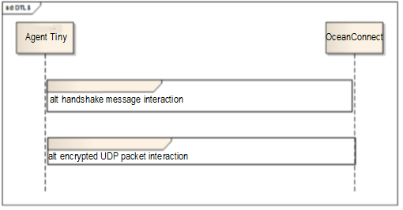

<h3 id="upgrade.md">Upgrade</h3>

Device-cloud interconnect components support the remote firmware upgrade of OceanConnect and feature resumable data transfer and firmware package integrity protection.

The following figure shows the firmware upgrade functions and process.

**Figure  1**  Firmware upgrade Diagram<a name="fig60127369"></a>  


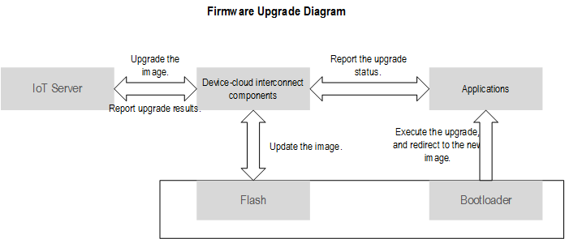

## IPD Process for Connecting Devices to OceanConnect

This chapter describes the development process of device-cloud interconnect components in detail from the OceanConnect side and the device side to help developers integrate LiteOS SDK device-cloud interconnect components with IoT devices for IoT application development and commissioning. By default, LiteOS SDK device-cloud interconnect components connect OceanConnect through Ethernet, that is, interconnecting the Ethernet port driver, lwIP network protocol stack, LWM2M protocol, and LiteOS SDK device-cloud interconnect components with OceanConnect. In addition, LiteOS SDK device-cloud interconnect components can connect OceanConnect using Wi-Fi, GSM, and NB-IoT.

OceanConnect is a unified and open cloud platform provided for carriers, enterprises, and industry partners. It supports management of connections from devices with or without SIM cards. OceanConnect integrates diverse industry applications upward and connects multiple sensors, devices, and gateways downward through APIs, helping the preceding users quickly access various types of industrial devices and integrate multiple industry applications. In addition, OceanConnect enables industry innovation by providing secure and reliable full-connection management to build an IoT ecosystem.


<h2 id="creating-a-codec-plug-in.md">Creating a Codec Plug-in</h2>

<h3 id="preparing-an-environment.md">Preparing an Environment</h3>

The information to be obtained before development is as follows:

-   URL, account, and password for logging in to the OceanConnect developer portal.Apply to OceanConnect for them.

-   Device interconnection address and port number

<h3 id="creating-an-application.md">Creating an Application</h3>

By creating applications, you can select different platform service suites based on application characteristics to make application development easier.

1.  Log in to the OceanConnect developer portal.

    The URL, account, and password for logging in to the OceanConnect developer portal must be applied to the OceanConnect service provider.

2.  In the displayed dialog box where the "Current account has no application！"Please create an app first！" is displayed, click** Create Application**.

    **Figure  1**  Creating an application<a name="fig36928311"></a>  
    

    

3.  In the dialog box that is displayed, configure application information and click  **Confirm**.

    The following figure shows a configuration example. After you click  **Confirm**, OceanConnect returns the application ID and application key. Keep the application key properly for the application server to connect OceanConnect. If you forget the key, choose docking information \> Reset Key to reset the key.

    **Figure  2**  Configuring application information<a name="fig46645784"></a>  
    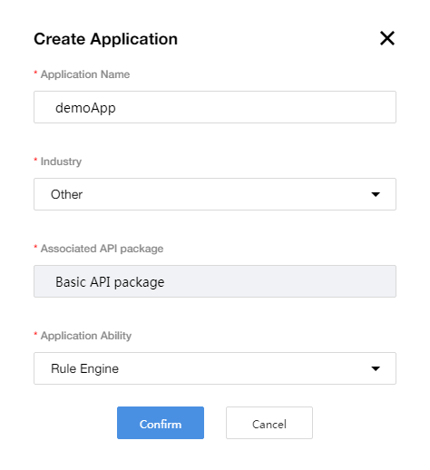

    > **NOTE:**   
    >The preceding configurations are for reference only. The configurations may vary based on the site requirements.  

    **Figure  3**  Successfully creating an application<a name="fig4879118"></a>  
    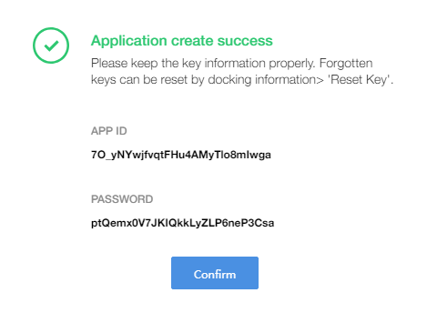


<h3 id="creating-a-device-profile.md">Creating a Device Profile</h3>

The device profile is used to describe the device type and service capabilities. It defines the device service capabilities and the attributes, commands, and command parameters of each service.

1.  Log in to the OceanConnect developer portal.

    The URL, account, and password for logging in to the OceanConnect developer portal must be applied to the OceanConnect service provider.

2.  Choose  **Profile Development**  \>  **Profile Online Development**  \>  **Custom Product**. On the  **Custom Product**  page, click  **Create New Product**  in the upper right corner.

    OceanConnect provides the profile template library. You can select proper templates as required. If a profile you need is not found in the profile template library, define the profile as follows.

    **Figure  1**  Creating a profile<a name="fig40981025"></a>  
    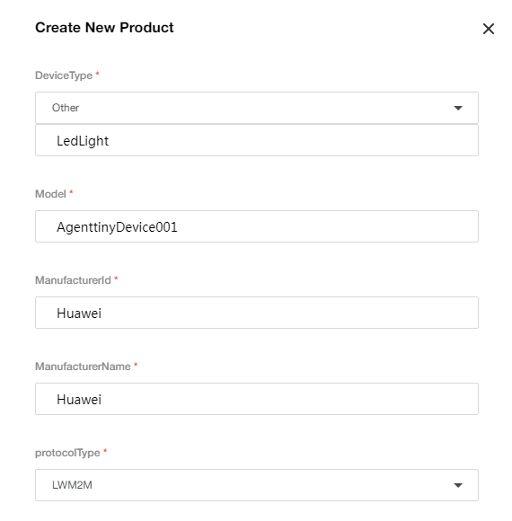

    > **NOTE:**   
    >The preceding configurations are for reference only. The configurations may vary based on the site requirements.  

3.  Select the created profile, click  **Create New Service**, and configure device service capabilities.

    For details about how to configure, see  **Product Templates**  in  **Profile Development**  \>  **Profile Online Development**. For example, create the LightControl service, including an attribute \(shows that the indicator is on or off\) and a command \(sets the indicator to  **on**  or  **off**\).

    **Figure  2**  Creating the LightControl service<a name="fig33940009"></a>  
    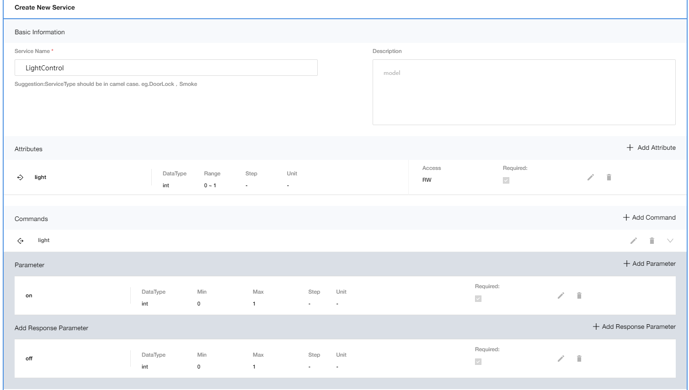

4.  \(Optional\) The OceanConnect developer portal supports the export of profile. Choose  **Profile Development**  \>  **Profile Online Development**  \>  **Newly Created Profile File**  . On the** Newly Created Profile File**  page, click  **Export Profile**  in the upper right corner to export the profile created online.

    **Figure  3**  Exporting the profile<a name="fig17250524"></a>  
    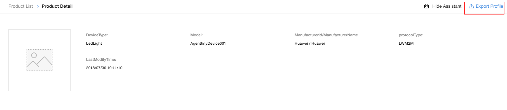


<h3 id="creating-a-codec-plug-in-0.md">Creating a Codec Plug-in</h3>

IoT devices communicate with OceanConnect based on LWM2M. Data in LWM2M messages is application-layer data, whose format is defined by device vendors. IoT devices have high requirements on power saving. Therefore, application-layer data is generally in the binary format. When parsing the application-layer data, OceanConnect converts the binary format to the JSON format for application servers to use. To convert messages from the binary format to the JSON format, OceanConnect needs to use codec plug-ins.

1.  Choose  **Plugin Development **\>  **Plugin Development**  \>  **Start Design**. On the  **Start Design**  page, click +**Creat New Plugin**  in the upper right corner. In the dialog box that is displayed, select a profile.

    OceanConnect provides the profile template library. You can select proper templates as required. If a profile you need is not found in the profile template library, define the profile as follows.

    **Figure  1**  Creating a codec plug-in<a name="fig24737142"></a>  
    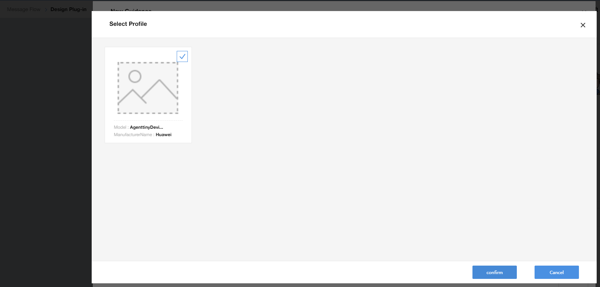

2.  Click  **Add Message**  and configure the mapping between the binary code stream and the profile attribute, command, or command response.

    For details about how to configure, see "**Beginner Guide**" and "**Plugin Template**" in "** Plugin Development**  " \>  **Plugin Development**  \>** Start Design**.

    **Figure  2**  Creating a plug-in \(for creating data reporting messages\)<a name="fig13027827"></a>  
    .png "creating-a-plug-in-(for-creating-data-reporting-messages)")

    **Figure  3**  Creating a plug-in \(for adding fields\)<a name="fig34936641"></a>  
    .png "creating-a-plug-in-(for-adding-fields)")

    **Figure  4** Creating a plug-in \(for creating command delivering messages\)<a name="fig1045212185511"></a>  
    

    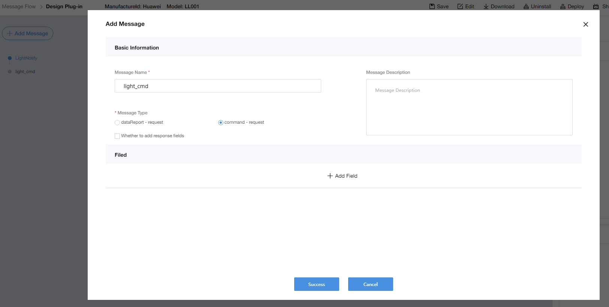

    **Figure  5** Creating a plug-in \(for adding fields\)<a name="fig178592052652"></a>  
    

    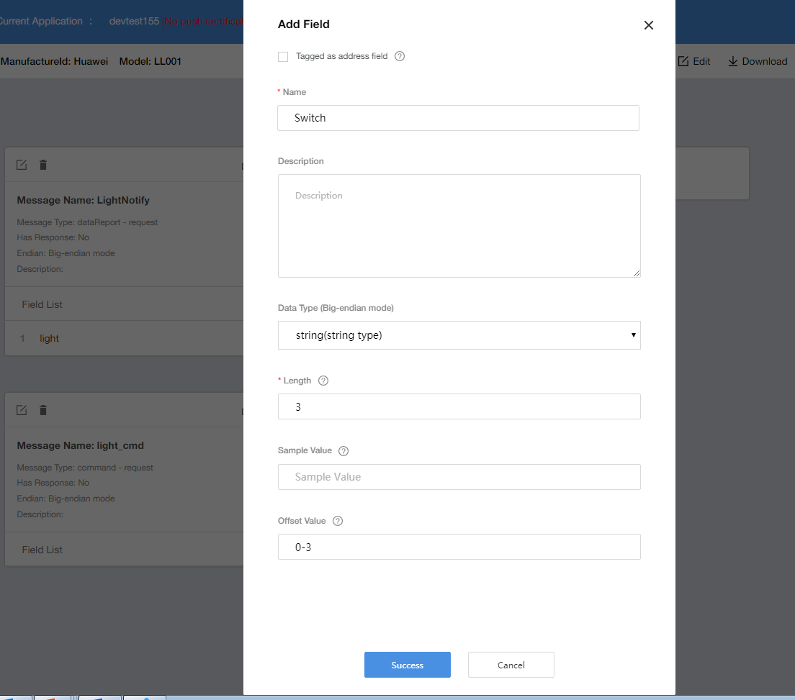

    To create a codec plug-in, define the following contents:

    -   Define the location of profile attributes or responses at the binary code stream reported by devices for OceanConnect to decode the reported data and command response.
    -   Define the location of profile commands delivered by OceanConnect at the binary code stream for OceanConnect to decode the delivered commands.

    **Figure  6**  Mapping between the binary code stream and the profile<a name="fig22384874"></a>  
    

3.  Click** Deploy **in the upper right corner of this page and click  **Save**  to save the codec plug-in.

    The deployment takes less than 60 seconds.

    **Figure  7**  Saving the codec plug-in<a name="fig25946716"></a>  
    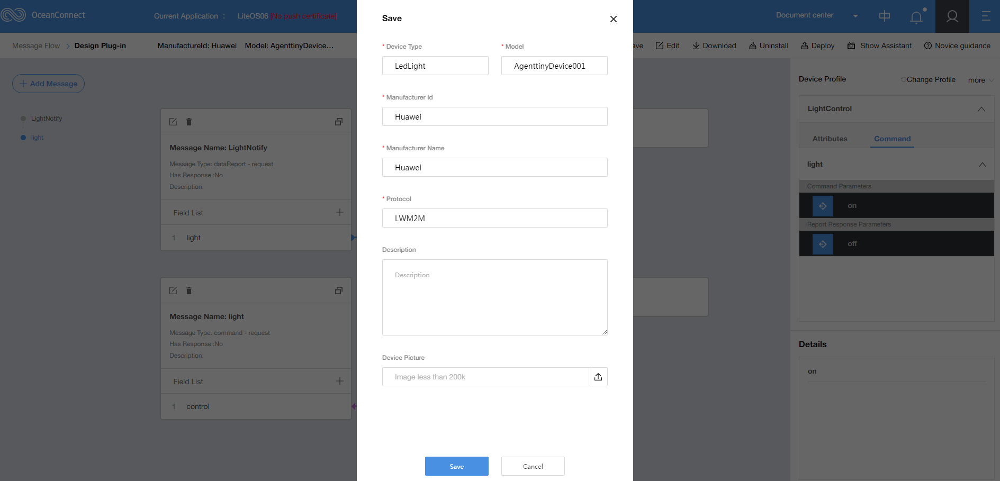

    **Figure  8**  Deploying the codec plug-in<a name="fig48328480"></a>  
    

    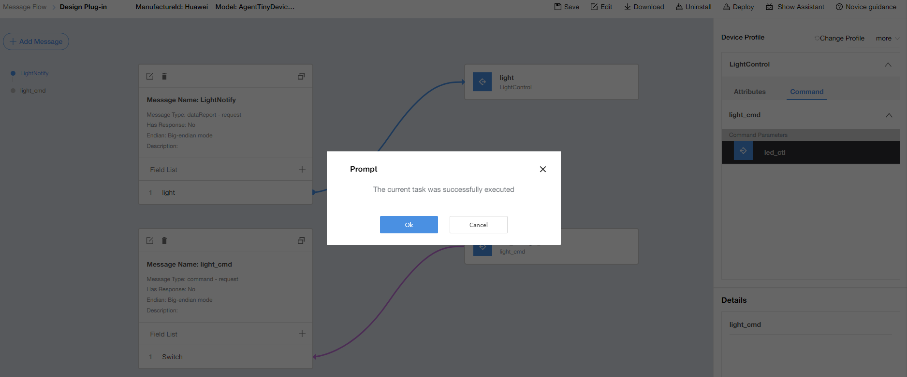

4.  \(Optional\) The OceanConnect developer portal supports the downloading of codec plug-ins. Choose  **Plugin Development**  \>  **Plugin Development**  \>  **Newly Developed Codec Plugin**. On the  **Newly Developed Codec Plugin**  page, click  **Download **in the upper right corner to export the codec plug-in created online.

<h3 id="registering-a-device.md">Registering a Device</h3>

When adding devices to OceanConnect, use an application server to invoke the API for registering devices on OceanConnect.

OceanConnect provides application simulators to simulate scenarios where application servers are used to register devices on OceanConnect. When using an application simulator to register a device, select the profile of the to-be-registered device to associate the device with the profile. In other words, using an application simulator to register a device is to use an application server to register a device and modify device information on OceanConnect. This section describes how to register a device using an application simulator.

1.  Choose** My Devices **\>** Register Device**  \> Profile of the device to be registered. On the Profile page of the device to be registered, enter the device name and verifyCode, and click  **Register.**

    **Figure  1** Profile of the device to be registered<a name="fig7364620161217"></a>  
    

    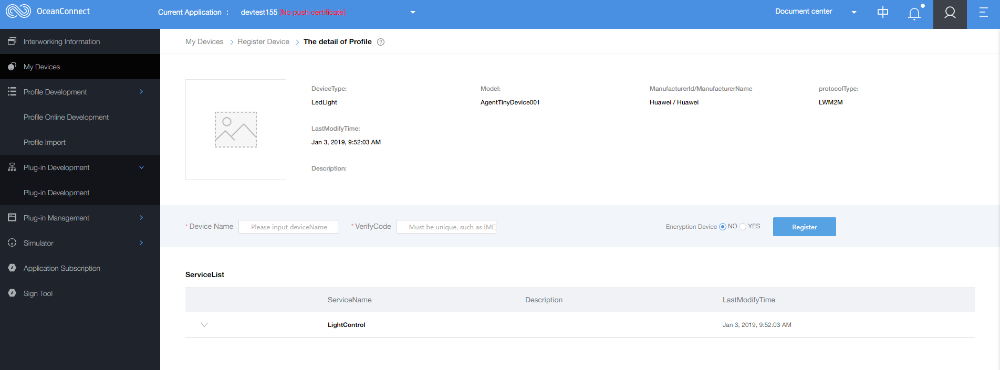

    After a device is registered, OceanConnect returns the device ID and PSK. Keep the device ID and PSK properly. The status of the newly registered device is  **not bound**.

    **Figure  2**  Registering a device<a name="fig17914201231217"></a>  
    

    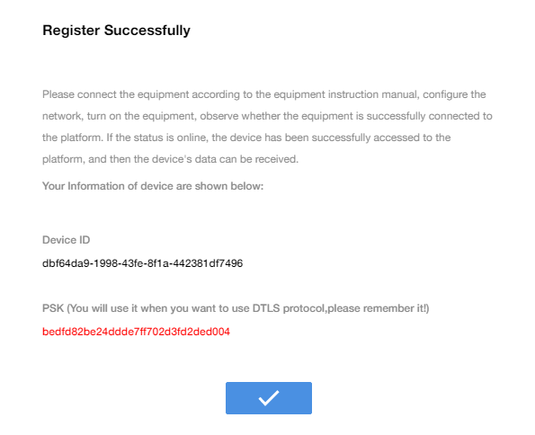


<h2 id="processfor-connecting-devices-to-oceanconnect-on-the-device-side.md">Process for Connecting Devices to OceanConnect on the Device Side</h2>

When connecting a device to OceanConnect, ensure that the device has been registered and the device applications have been deployed on OceanConnect. After the device has been connected, OceanConnect can manage it. This section describes how to connect device-side devices to OceanConnect using device-cloud interconnect components. The following figure shows the general diagram of connecting device-side devices to OceanConnect.

**Figure  1** General diagram of connecting device-side devices to OceanConnect<a name="fig1256145122914"></a>  


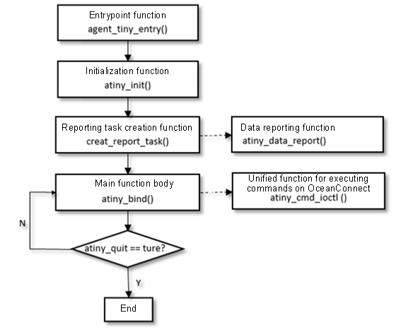


<h3 id="preparations.md">Preparations</h3>

The information to be obtained before development is as follows:

-   Huawei LiteOS and LiteOS SDK source code. The general project architecture is as follows:

├── arch         //Architecture-related files

│   ├── arm

│   └── msp430

├── build

│   └── Makefile

├── components   //Various LiteOS components

│   ├── connectivity

│   ├── fs

│   ├── lib

│   ├── log

│   ├── net

│   ├── ota

│   └── security

├── demos      //Sample programs

│   ├── agenttiny\_lwm2m     //All sample programs listed in this chapter are from the  **agent\_tiny\_demo.c**  file in this directory.

│   ├── agenttiny\_mqtt

│   ├── dtls\_server

│   ├── fs

│   ├── kernel

│   └── nbiot\_without\_atiny

├── doc        //Documents

│   ├── Huawei\_LiteOS\_Developer\_Guide\_en.md

│   ├── Huawei\_LiteOS\_Developer\_Guide\_zh.md

│   ├── Huawei\_LiteOS\_SDK\_Developer\_Guide.md

│   ├── LiteOS\_Code\_Info.md

│   ├── LiteOS\_Commit\_Message.md

│   ├── LiteOS\_Contribute\_Guide\_GitGUI.md

│   ├── LiteOS\_Supported\_board\_list.md

│   └── meta

├── include    //Header files required by projects

│   ├── at\_device

│   ├── at\_frame

│   ├── atiny\_lwm2m

│   ├── atiny\_mqtt

│   ├── fs

│   ├── log

│   ├── nb\_iot

│   ├── osdepends

│   ├── ota

│   ├── sal

│   └── sota

├── kernel     //System kernels

│   ├── base

│   ├── extended

│   ├── include

│   ├── los\_init.c

│   └── Makefile

├── LICENSE    //Licenses

├── osdepends  //Dependencies

│   └── liteos

├── README.md

├── targets    //BSP projects

│   ├── Cloud\_STM32F429IGTx\_FIRE

│   ├── Mini\_Project

│   ├── NXP\_LPC51U68

│   └── STM32F103VET6\_NB\_GCC

└── tests      //Test cases

├── cmockery

├── test\_agenttiny

├── test\_main.c

├── test\_sota

└── test\_suit

To obtain the source code, visit  [https://github.com/LiteOS/LiteOS](https://github.com/LiteOS/LiteOS).

-   Integration development tools:
    -   MDK 5.18 or later, which can be downloaded from http://www2.keil.com/mdk5
    -   MDK packages


> **NOTE:**   
>The licenses for MDK tools can be obtained from http://www2.keil.com/mdk5.  

<h3 id="entrypoint-function-for-liteos-sdk-device-cloud-interconnect-components.md">Entrypoint Function for LiteOS SDK Device-Cloud Interconnect Components</h3>

To connect the LiteOS SDK device-cloud interconnect component Agent Tiny to OceanConnect, create an entrypoint function  **agent\_tiny\_entry\(\)**.

<a name="table18576155151914"></a>
<table><tbody><tr id="row105992555191"><td class="cellrowborder" valign="top" width="50%"><p id="p3599155171914"><a name="p3599155171914"></a><a name="p3599155171914"></a>Function</p>
</td>
<td class="cellrowborder" valign="top" width="50%"><p id="p2599105514199"><a name="p2599105514199"></a><a name="p2599105514199"></a>Description</p>
</td>
</tr>
<tr id="row2059915515195"><td class="cellrowborder" valign="top" width="50%"><p id="p20599175511198"><a name="p20599175511198"></a><a name="p20599175511198"></a>void agent_tiny_entry(void)</p>
</td>
<td class="cellrowborder" valign="top" width="50%"><p id="p359925591917"><a name="p359925591917"></a><a name="p359925591917"></a>Entrypoint function for LiteOS SDK device-cloud interconnect components. This function can be used to initialize Agent Tiny, create report tasks, and call the main function body of Agent Tiny.</p>
<p id="p8599655121910"><a name="p8599655121910"></a><a name="p8599655121910"></a>Parameter list: N/A</p>
<p id="p13599185571916"><a name="p13599185571916"></a><a name="p13599185571916"></a>Return value: null</p>
</td>
</tr>
</tbody>
</table>

Based on the task mechanism provided by the LiteOS kernel, a developer can create a main task  **main\_task**, and call the entrypoint function  **agent\_tiny\_entry\(\)**  in the main task to enable the Agent Tiny workflow.

```
 UINT32 creat_main_task()
     {
         UINT32 uwRet = LOS_OK;
         TSK_INIT_PARAM_S task_init_param;
         task_init_param.usTaskPrio = 0;
         task_init_param.pcName = "main_task";
         task_init_param.pfnTaskEntry = (TSK_ENTRY_FUNC)main_task;
         task_init_param.uwStackSize = 0x1000;
         uwRet = LOS_TaskCreate(&g_TskHandle, &task_init_param);
         if(LOS_OK != uwRet)
         {
             return uwRet;
         }
         return uwRet;
     }
```

<h3 id="initializing-liteos-sdk-device-cloud-interconnect-components.md">Initializing LiteOS SDK Device-Cloud Interconnect Components</h3>

Call the  **atiny\_init\(\)**  function in the entrypoint function to initialize Agent Tiny.

<a name="table19063256"></a>
<table><thead align="left"><tr id="row40463332"><th class="cellrowborder" valign="top" width="46.339999999999996%" id="mcps1.1.3.1.1"><p id="p64364759"><a name="p64364759"></a><a name="p64364759"></a>Function</p>
</th>
<th class="cellrowborder" valign="top" width="53.66%" id="mcps1.1.3.1.2"><p id="p46163024"><a name="p46163024"></a><a name="p46163024"></a>Description</p>
</th>
</tr>
</thead>
<tbody><tr id="row64466762"><td class="cellrowborder" valign="top" width="46.339999999999996%" headers="mcps1.1.3.1.1 "><p id="p46366207"><a name="p46366207"></a><a name="p46366207"></a>int atiny_init(atiny_param_t* atiny_params, void** phandle);</p>
</td>
<td class="cellrowborder" valign="top" width="53.66%" headers="mcps1.1.3.1.2 "><p id="p64675252"><a name="p64675252"></a><a name="p64675252"></a>Function for initializing device-cloud interconnect components, which is implemented by device-cloud interconnect components and invoked by devices. The parameters involved are as follows:</p>
<a name="ul45206357"></a><a name="ul45206357"></a><ul id="ul45206357"><li><strong id="b37836340"><a name="b37836340"></a><a name="b37836340"></a>atiny_params</strong>. For details about the parameter, see the description of the <strong id="b4982748"><a name="b4982748"></a><a name="b4982748"></a>atiny_param_t</strong> data structure.</li><li><strong id="b949406"><a name="b949406"></a><a name="b949406"></a>phandle</strong>, an output parameter, which represents the handle of the currently created device-cloud interconnect component.<p id="p4781143104111"><a name="p4781143104111"></a><a name="p4781143104111"></a>Return value: Integer variable, indicating that the initialization is successful or failed.</p>
</li></ul>
</td>
</tr>
</tbody>
</table>

The input parameter  **atiny\_params**  needs to be set based on specific services. Developers can set the parameter by the following code:

```
#ifdef CONFIG_FEATURE_FOTA
     hal_init_ota();   //To define the FOTA functions, perform FOTA-related initialization.
 #endif

 #ifdef WITH_DTLS
     device_info->endpoint_name = g_endpoint_name_s;  //Encrypted device verification code
 #else
     device_info->endpoint_name = g_endpoint_name;    //Unencrypted device verification code
 #endif
 #ifdef CONFIG_FEATURE_FOTA
     device_info->manufacturer = "Lwm2mFota";    //Unencrypted device verification code
     device_info->dev_type = "Lwm2mFota";        //Device type
 #else
     device_info->manufacturer = "Agent_Tiny";   
 #endif
     atiny_params = &g_atiny_params;
     atiny_params->server_params.binding = "UQ";   //Binding mode
     atiny_params->server_params.life_time = 20;   //Life cycle
     atiny_params->server_params.storing_cnt = 0;  //Number of cached data packets

     atiny_params->server_params.bootstrap_mode = BOOTSTRAP_FACTORY;   //Boot mode
     atiny_params->server_params.hold_off_time = 10;    //Waiting latency

     //pay attention: index 0 for iot server, index 1 for bootstrap server.
     iot_security_param = &(atiny_params->security_params[0]);
     bs_security_param = &(atiny_params->security_params[1]);

     iot_security_param->server_ip = DEFAULT_SERVER_IPV4;  //Server address
     bs_security_param->server_ip = DEFAULT_SERVER_IPV4;

 #ifdef WITH_DTLS
     iot_security_param->server_port = "5684";   //Encrypted device port number
     bs_security_param->server_port = "5684";

     iot_security_param->psk_Id = g_endpoint_name_iots;         //Encrypted device verification
     iot_security_param->psk = (char *)g_psk_iot_value;         //PSK password
     iot_security_param->psk_len = sizeof(g_psk_iot_value);     //PSK password length

     bs_security_param->psk_Id = g_endpoint_name_bs;
     bs_security_param->psk = (char *)g_psk_bs_value;
     bs_security_param->psk_len = sizeof(g_psk_bs_value);
 #else
     iot_security_param->server_port = "5683";    //Unencrypted device port number
     bs_security_param->server_port = "5683";

     iot_security_param->psk_Id = NULL;    //No PSK-related parameter setting for unencrypted devices
     iot_security_param->psk = NULL;
     iot_security_param->psk_len = 0;

     bs_security_param->psk_Id = NULL;
     bs_security_param->psk = NULL;
     bs_security_param->psk_len = 0;
 #endif
```

After setting the  **atiny\_params**  parameter, initialize Agent Tiny based on the set parameter.

```
   if(ATINY_OK != atiny_init(atiny_params, &g_phandle))
    {
        return;
    }
```

After setting the  **atiny\_params**  parameter, initialize Agent Tiny based on the set parameter.

<h3 id="creating-a-data-reporting-task.md">Creating a Data Reporting Task</h3>

After initializing Agent Tiny, create a data reporting task function  **app\_data\_report\(\)**  by calling the  **creat\_report\_task\(\)**  function.

```
    UINT32 creat_report_task()
     {
         UINT32 uwRet = LOS_OK;
         TSK_INIT_PARAM_S task_init_param;
         UINT32 TskHandle;
         task_init_param.usTaskPrio = 1;
         task_init_param.pcName = "app_data_report";
         task_init_param.pfnTaskEntry = (TSK_ENTRY_FUNC)app_data_report;
         task_init_param.uwStackSize = 0x400;
         uwRet = LOS_TaskCreate(&TskHandle, &task_init_param);
         if(LOS_OK != uwRet)
         {
             return uwRet;
         }
         return uwRet;
     }
```

In the  **app\_data\_report\(\)**  function, assign a value to the reported data structure  **data\_report\_t**, including the data buffer address  **buf**, callback function  **callback**  called after the ACK response is received from a platform, data  **cookie**, data length  **len**, and data reporting type  **type**  \(set to  **APP\_DATA**  by default\).

```
    uint8_t buf[5] = {0, 1, 6, 5, 9};
     data_report_t report_data;
     int ret = 0;
     int cnt = 0;
     report_data.buf = buf;
     report_data.callback = ack_callback;
     report_data.cookie = 0;
     report_data.len = sizeof(buf);
     report_data.type = APP_DATA;
```

After a value is assigned to the  **report\_data**  parameter, data can be reported by calling the  **atiny\_data\_report\(\)**  function.

<a name="table16535236194717"></a>
<table><tbody><tr id="row1360513361470"><td class="cellrowborder" valign="top" width="24.26%"><p id="p43101344125214"><a name="p43101344125214"></a><a name="p43101344125214"></a><strong id="b143101044125215"><a name="b143101044125215"></a><a name="b143101044125215"></a>Function</strong></p>
</td>
<td class="cellrowborder" valign="top" width="75.74%"><p id="p14310744115214"><a name="p14310744115214"></a><a name="p14310744115214"></a><strong id="b1310194419522"><a name="b1310194419522"></a><a name="b1310194419522"></a>Description</strong></p>
</td>
</tr>
<tr id="row760517361471"><td class="cellrowborder" valign="top" width="24.26%"><p id="p76051036204713"><a name="p76051036204713"></a><a name="p76051036204713"></a>int atiny_data_report(void* phandle, data_report_t* report_data)</p>
</td>
<td class="cellrowborder" valign="top" width="75.74%"><p id="p1756570"><a name="p1756570"></a><a name="p1756570"></a>Function for reporting data of device-cloud interconnect components, which is implemented by device-cloud interconnect components and invoked by devices. This function is used to report device application data. The function is blocked and cannot be used when being interrupted. The parameters involved are as follows:</p>
<p id="p914918725318"><a name="p914918725318"></a><a name="p914918725318"></a>Parameter list: <strong id="b1314957115313"><a name="b1314957115313"></a><a name="b1314957115313"></a>phandle</strong> is the Agent Tiny handle obtained by calling the initialization function <strong id="b1514997105320"><a name="b1514997105320"></a><a name="b1514997105320"></a>atiny_init()</strong>. <strong id="b14149677538"><a name="b14149677538"></a><a name="b14149677538"></a>report_data</strong> is the reported data structure.</p>
<p id="p4149572537"><a name="p4149572537"></a><a name="p4149572537"></a>Return value: Integer variable, indicating that the data reporting is successful or failed.</p>
</td>
</tr>
</tbody>
</table>

The implementation method of a report task in the sample code is as follows:

```
    while(1)
     {
         report_data.cookie = cnt;
         cnt++;
         ret = atiny_data_report(g_phandle, &report_data);   //Data reporting function
         ATINY_LOG(LOG_DEBUG, "data report ret: %d\n", ret);
         (void)LOS_TaskDelay(250 * 8);
     }
```

<h3 id="command-processing-function-for-liteos-sdk-device-cloud-interconnect-components.md">Command Processing Function for LiteOS SDK Device-Cloud Interconnect Components</h3>

All commands delivered by OceanConnect are executed by calling the  **atiny\_cmd\_ioctl\(\)**  function.

<a name="table153881641135515"></a>
<table><tbody><tr id="row1857454165517"><td class="cellrowborder" valign="top" width="27.250000000000004%"><p id="p17291164125815"><a name="p17291164125815"></a><a name="p17291164125815"></a><strong id="b182911241165815"><a name="b182911241165815"></a><a name="b182911241165815"></a>Function</strong></p>
</td>
<td class="cellrowborder" valign="top" width="72.75%"><p id="p12291194185818"><a name="p12291194185818"></a><a name="p12291194185818"></a><strong id="b629120415583"><a name="b629120415583"></a><a name="b629120415583"></a>Description</strong></p>
</td>
</tr>
<tr id="row25741641175511"><td class="cellrowborder" valign="top" width="27.250000000000004%"><p id="p957494116555"><a name="p957494116555"></a><a name="p957494116555"></a>int atiny_cmd_ioctl (atiny_cmd_e cmd, char* arg, int len);</p>
</td>
<td class="cellrowborder" valign="top" width="72.75%"><p id="p25913808"><a name="p25913808"></a><a name="p25913808"></a>Implemented by developers to declare and invoke device-cloud interconnect components. This API is a unified portal for LWM2M standard objects to deliver commands to devices. The parameters involved are as follows:</p>
<a name="ul31897681"></a><a name="ul31897681"></a><ul id="ul31897681"><li><strong id="b33575386"><a name="b33575386"></a><a name="b33575386"></a>cmd</strong>, a specific command word, such as commands for delivering service data and resetting and upgrade.</li><li><strong id="b35251715"><a name="b35251715"></a><a name="b35251715"></a>arg</strong>, a specific command parameter; <strong id="b48829979"><a name="b48829979"></a><a name="b48829979"></a>len</strong>, the parameter length.<p id="p1339714592580"><a name="p1339714592580"></a><a name="p1339714592580"></a>Return value: null</p>
</li></ul>
</td>
</tr>
</tbody>
</table>

The  **atiny\_cmd\_ioctl**  API is a universal extensible API defined by device-cloud interconnect components. The command word of this API is defined by referring to the enumerated type  **atiny\_cmd\_e**. Users can implement or extend this API based on respective requirements. The following table lists common APIs. Each API corresponds to an enumerated value of the  **atiny\_cmd\_e**  API.

<a name="table524573"></a>
<table><thead align="left"><tr id="row13982536"><th class="cellrowborder" valign="top" width="27.22%" id="mcps1.1.3.1.1"><p id="p58843661"><a name="p58843661"></a><a name="p58843661"></a>Callback Function</p>
</th>
<th class="cellrowborder" valign="top" width="72.78%" id="mcps1.1.3.1.2"><p id="p1607259"><a name="p1607259"></a><a name="p1607259"></a>Description</p>
</th>
</tr>
</thead>
<tbody><tr id="row63079129"><td class="cellrowborder" valign="top" width="27.22%" headers="mcps1.1.3.1.1 "><p id="p9135791"><a name="p9135791"></a><a name="p9135791"></a>int atiny_get_manufacturer(char* manufacturer,int len)</p>
</td>
<td class="cellrowborder" valign="top" width="72.78%" headers="mcps1.1.3.1.2 "><p id="p1801606"><a name="p1801606"></a><a name="p1801606"></a>Obtains the vendor name. The memory specified by the <strong id="b16214457"><a name="b16214457"></a><a name="b16214457"></a>manufacturer</strong> parameter is allocated by device-cloud interconnect components. A user can specify the parameter. The parameter length cannot exceed the value of <strong id="b11712389"><a name="b11712389"></a><a name="b11712389"></a>len</strong>.</p>
</td>
</tr>
<tr id="row38302644"><td class="cellrowborder" valign="top" width="27.22%" headers="mcps1.1.3.1.1 "><p id="p15506435"><a name="p15506435"></a><a name="p15506435"></a>int atiny_get_dev_type(char * dev_type,int len)</p>
</td>
<td class="cellrowborder" valign="top" width="72.78%" headers="mcps1.1.3.1.2 "><p id="p48061711"><a name="p48061711"></a><a name="p48061711"></a>Obtains the device type. The memory specified by the <strong id="b29902215"><a name="b29902215"></a><a name="b29902215"></a>dev_type</strong> parameter is allocated by device-cloud interconnect components. A user can specify the parameter. The parameter length cannot exceed the value of <strong id="b684479"><a name="b684479"></a><a name="b684479"></a>len</strong>.</p>
</td>
</tr>
<tr id="row6160312"><td class="cellrowborder" valign="top" width="27.22%" headers="mcps1.1.3.1.1 "><p id="p29223258"><a name="p29223258"></a><a name="p29223258"></a>int atiny_get_model_number((char * model_numer, int len)</p>
</td>
<td class="cellrowborder" valign="top" width="72.78%" headers="mcps1.1.3.1.2 "><p id="p18273684"><a name="p18273684"></a><a name="p18273684"></a>Obtains the device model number. The memory specified by the <strong id="b30245434"><a name="b30245434"></a><a name="b30245434"></a>model_number</strong> parameter is allocated by device-cloud interconnect components. A user can specify the parameter. The parameter length cannot exceed the value of <strong id="b3773455"><a name="b3773455"></a><a name="b3773455"></a>len</strong>.</p>
</td>
</tr>
<tr id="row33961100"><td class="cellrowborder" valign="top" width="27.22%" headers="mcps1.1.3.1.1 "><p id="p66494603"><a name="p66494603"></a><a name="p66494603"></a>int atiny_get_serial_number(char* num,int len)</p>
</td>
<td class="cellrowborder" valign="top" width="72.78%" headers="mcps1.1.3.1.2 "><p id="p17353758"><a name="p17353758"></a><a name="p17353758"></a>Obtains the device SN. The memory specified by the <strong id="b21966099"><a name="b21966099"></a><a name="b21966099"></a>number</strong> parameter is allocated by device-cloud interconnect components. A user can specify the parameter. The parameter length cannot exceed the value of <strong id="b63477166"><a name="b63477166"></a><a name="b63477166"></a>len</strong>.</p>
</td>
</tr>
<tr id="row34423584"><td class="cellrowborder" valign="top" width="27.22%" headers="mcps1.1.3.1.1 "><p id="p36846901"><a name="p36846901"></a><a name="p36846901"></a>int atiny_get_dev_err(int* arg，int len)</p>
</td>
<td class="cellrowborder" valign="top" width="72.78%" headers="mcps1.1.3.1.2 "><p id="p31809019"><a name="p31809019"></a><a name="p31809019"></a>Obtains the device status, such as used-up memory, low battery, and low signal strength. The <strong id="b17845720"><a name="b17845720"></a><a name="b17845720"></a>arg</strong> parameter is allocated by device-cloud interconnect components. A user can specify the parameter. The parameter length cannot exceed the value of <strong id="b26393753"><a name="b26393753"></a><a name="b26393753"></a>len</strong>.</p>
</td>
</tr>
<tr id="row36217193"><td class="cellrowborder" valign="top" width="27.22%" headers="mcps1.1.3.1.1 "><p id="p47911552"><a name="p47911552"></a><a name="p47911552"></a>int atiny_do_dev_reboot(void)</p>
</td>
<td class="cellrowborder" valign="top" width="72.78%" headers="mcps1.1.3.1.2 "><p id="p55630466"><a name="p55630466"></a><a name="p55630466"></a>Resets devices.</p>
</td>
</tr>
<tr id="row30912152"><td class="cellrowborder" valign="top" width="27.22%" headers="mcps1.1.3.1.1 "><p id="p20856360"><a name="p20856360"></a><a name="p20856360"></a>int atiny_do_factory_reset(void)</p>
</td>
<td class="cellrowborder" valign="top" width="72.78%" headers="mcps1.1.3.1.2 "><p id="p11643609"><a name="p11643609"></a><a name="p11643609"></a>Resets vendors.</p>
</td>
</tr>
<tr id="row37683621"><td class="cellrowborder" valign="top" width="27.22%" headers="mcps1.1.3.1.1 "><p id="p32474474"><a name="p32474474"></a><a name="p32474474"></a>int atiny_get_baterry_level(int* voltage)</p>
</td>
<td class="cellrowborder" valign="top" width="72.78%" headers="mcps1.1.3.1.2 "><p id="p13186723"><a name="p13186723"></a><a name="p13186723"></a>Obtains remaining battery level.</p>
</td>
</tr>
<tr id="row51571647"><td class="cellrowborder" valign="top" width="27.22%" headers="mcps1.1.3.1.1 "><p id="p16553858"><a name="p16553858"></a><a name="p16553858"></a>int atiny_get_memory_free(int* size)</p>
</td>
<td class="cellrowborder" valign="top" width="72.78%" headers="mcps1.1.3.1.2 "><p id="p65794093"><a name="p65794093"></a><a name="p65794093"></a>Obtains available memory size.</p>
</td>
</tr>
<tr id="row55275929"><td class="cellrowborder" valign="top" width="27.22%" headers="mcps1.1.3.1.1 "><p id="p48165301"><a name="p48165301"></a><a name="p48165301"></a>int atiny_get_total_memory(int* size)</p>
</td>
<td class="cellrowborder" valign="top" width="72.78%" headers="mcps1.1.3.1.2 "><p id="p9075276"><a name="p9075276"></a><a name="p9075276"></a>Obtains total memory size.</p>
</td>
</tr>
<tr id="row14568626"><td class="cellrowborder" valign="top" width="27.22%" headers="mcps1.1.3.1.1 "><p id="p39208080"><a name="p39208080"></a><a name="p39208080"></a>int atiny_get_signal_strength(int* singal_strength)</p>
</td>
<td class="cellrowborder" valign="top" width="72.78%" headers="mcps1.1.3.1.2 "><p id="p21737886"><a name="p21737886"></a><a name="p21737886"></a>Obtains signal strength.</p>
</td>
</tr>
<tr id="row61423246"><td class="cellrowborder" valign="top" width="27.22%" headers="mcps1.1.3.1.1 "><p id="p9227048"><a name="p9227048"></a><a name="p9227048"></a>int atiny_get_cell_id(long* cell_id)</p>
</td>
<td class="cellrowborder" valign="top" width="72.78%" headers="mcps1.1.3.1.2 "><p id="p9193414"><a name="p9193414"></a><a name="p9193414"></a>Obtains the cell ID.</p>
</td>
</tr>
<tr id="row15631866"><td class="cellrowborder" valign="top" width="27.22%" headers="mcps1.1.3.1.1 "><p id="p58221658"><a name="p58221658"></a><a name="p58221658"></a>int atiny_get_link_quality(int* quality)</p>
</td>
<td class="cellrowborder" valign="top" width="72.78%" headers="mcps1.1.3.1.2 "><p id="p18333875"><a name="p18333875"></a><a name="p18333875"></a>Obtains the channel quality.</p>
</td>
</tr>
<tr id="row30787148"><td class="cellrowborder" valign="top" width="27.22%" headers="mcps1.1.3.1.1 "><p id="p10731020"><a name="p10731020"></a><a name="p10731020"></a>int atiny_write_app_write(void* user_data, int len)</p>
</td>
<td class="cellrowborder" valign="top" width="72.78%" headers="mcps1.1.3.1.2 "><p id="p63906264"><a name="p63906264"></a><a name="p63906264"></a>Delivers service data.</p>
</td>
</tr>
<tr id="row38285471"><td class="cellrowborder" valign="top" width="27.22%" headers="mcps1.1.3.1.1 "><p id="p14115433"><a name="p14115433"></a><a name="p14115433"></a>int atiny_update_psk(char* psk_id, int len)</p>
</td>
<td class="cellrowborder" valign="top" width="72.78%" headers="mcps1.1.3.1.2 "><p id="p2499444"><a name="p2499444"></a><a name="p2499444"></a>Updates PSKs.</p>
</td>
</tr>
</tbody>
</table>

A developer needs to make a command response by calling the  **atiny\_write\_app\_write\(\)**  function based on site services.

```
    int atiny_write_app_write(void* user_data, int len)
     {
         (void)atiny_printf("write num19 object success\r\n");
         return ATINY_OK;
     }
```

<h3 id="main-function-body-for-liteos-sdk-device-cloud-interconnect-components.md">Main Function Body for LiteOS SDK Device-Cloud Interconnect Components</h3>

After creating the data reporting task and implementing the command processing function, call the  **atiny\_bind\(\)**  function.

<a name="table451118281586"></a>
<table><tbody><tr id="row13711192810588"><td class="cellrowborder" valign="top" width="35.589999999999996%"><p id="p4846320608"><a name="p4846320608"></a><a name="p4846320608"></a><strong id="b684615201010"><a name="b684615201010"></a><a name="b684615201010"></a>Function</strong></p>
</td>
<td class="cellrowborder" valign="top" width="64.41%"><p id="p78461620402"><a name="p78461620402"></a><a name="p78461620402"></a><strong id="b284632016012"><a name="b284632016012"></a><a name="b284632016012"></a>Description</strong></p>
</td>
</tr>
<tr id="row771112845813"><td class="cellrowborder" valign="top" width="35.589999999999996%"><p id="p171172815816"><a name="p171172815816"></a><a name="p171172815816"></a>int atiny_bind(atiny_device_info_t* device_info, void* phandle)</p>
</td>
<td class="cellrowborder" valign="top" width="64.41%"><p id="p10711228195816"><a name="p10711228195816"></a><a name="p10711228195816"></a>Main function body of a device-cloud interconnect component, which is implemented by device-cloud interconnect components and invoked by devices. However, no value is returned after the function is successfully called. This function is the main loop body of a device-cloud interconnect component, which implements LWM2M processing, state machine registration, queue retransmission, and subscription reporting.</p>
<p id="p16933337807"><a name="p16933337807"></a><a name="p16933337807"></a>Parameter list: <strong id="b13933143715010"><a name="b13933143715010"></a><a name="b13933143715010"></a>device_info</strong> is the device parameter structure. <strong id="b7933737103"><a name="b7933737103"></a><a name="b7933737103"></a>phandle</strong> is the Agent Tiny handle obtained by calling the initialization function <strong id="b109336375019"><a name="b109336375019"></a><a name="b109336375019"></a>atiny_init()</strong>.</p>
<p id="p59339371906"><a name="p59339371906"></a><a name="p59339371906"></a>Return value: Integer variable, indicating the execution status of the main function body for LiteOS SDK device-cloud interconnect components. This value can be returned only when the execution failed or the deinitialization function <strong id="b393313710011"><a name="b393313710011"></a><a name="b393313710011"></a>atiny_deinit()</strong> for LiteOS SDK device-cloud interconnect components is called.</p>
</td>
</tr>
</tbody>
</table>

The  **atiny\_bind\(\)**  function can be used to create and register the LwM2M client based on the LwM2M protocol, send the data reported in the data reporting task creation function  **app\_data\_report\(\)**  to OceanConnect through communication modules, receive and parse commands delivered by OceanConnect, and submit the parsed commands to the command processing function  **atiny\_cmd\_ioctl\(\)**  for unified processing. Similar to the  **atiny\_init\(\)**  function, the  **atiny\_bind\(\)**  function does not need to be modified by developers.

> **NOTE:**   
>For details about the LWM2M protocol, see the appendix.  
>LiteOS SDK device-cloud interconnect components continuously report data and process commands through the main function body. When calling the deinitialization function  **atiny\_deinit\(\)**  for LiteOS SDK device-cloud interconnect components, exit the main function body.  

<a name="table957692845818"></a>
<table><tbody><tr id="row271262875811"><td class="cellrowborder" valign="top" width="34.9%"><p id="p13820193317"><a name="p13820193317"></a><a name="p13820193317"></a><strong id="b0810191039"><a name="b0810191039"></a><a name="b0810191039"></a>Function</strong></p>
</td>
<td class="cellrowborder" valign="top" width="65.10000000000001%"><p id="p12814197312"><a name="p12814197312"></a><a name="p12814197312"></a><strong id="b188119935"><a name="b188119935"></a><a name="b188119935"></a>Description</strong></p>
</td>
</tr>
<tr id="row1671262812589"><td class="cellrowborder" valign="top" width="34.9%"><p id="p16712228165813"><a name="p16712228165813"></a><a name="p16712228165813"></a>void atiny_deinit(void* phandle);</p>
</td>
<td class="cellrowborder" valign="top" width="65.10000000000001%"><p id="p42743653"><a name="p42743653"></a><a name="p42743653"></a>Function for deinitializing device-cloud interconnect components, which is implemented by device-cloud interconnect components and invoked by devices. This function is blocked. It cannot stop being invoking until the main task of Agent Tiny quits and resources are completely released.</p>
<p id="p1360915407319"><a name="p1360915407319"></a><a name="p1360915407319"></a>Parameter list: <strong id="b1460914408314"><a name="b1460914408314"></a><a name="b1460914408314"></a>phandle</strong> is the LiteOS SDK device-cloud interconnect component handle obtained by calling the <strong id="b12609184011310"><a name="b12609184011310"></a><a name="b12609184011310"></a>atiny_init()</strong> function.</p>
<p id="p1760994019320"><a name="p1760994019320"></a><a name="p1760994019320"></a>Return value: null</p>
</td>
</tr>
</tbody>
</table>

<h3 id="data-structure.md">Data Structure</h3>

-   Enumerated type of commands delivered by OceanConnect

```
 typedef enum   
  {   
      ATINY_GET_MANUFACTURER,         /*Obtain the manufacturer name.*/ 
      ATINY_GET_MODEL_NUMBER,         /*Obtain device models defined and used by the manufacturer.*/ 
      ATINY_GET_SERIAL_NUMBER,        /*Obtain the device SN.*/ 
      ATINY_GET_FIRMWARE_VER,         /*Obtain the firmware version number.*/ 
      ATINY_DO_DEV_REBOOT,            /*Deliver device resetting commands.*/  
      ATINY_DO_FACTORY_RESET,         /*Restore factory resetting.*/ 
      ATINY_GET_POWER_SOURCE,         /*Obtain power supplies.*/ 
      ATINY_GET_SOURCE_VOLTAGE,       /*Obtain device voltage.*/ 
      ATINY_GET_POWER_CURRENT,        /*Obtain device current.*/ 
      ATINY_GET_BATERRY_LEVEL,        /*Obtain the battery level.*/ 
      ATINY_GET_MEMORY_FREE,          /*Obtain idle memory.*/ 
      ATINY_GET_DEV_ERR,              /*Obtain the device status, such as used-up memory and low battery level.*/ 
      ATINY_DO_RESET_DEV_ERR,         /*Obtain the device resetting status.*/ 
      ATINY_GET_CURRENT_TIME,         /*Obtain the current time.*/ 
      ATINY_SET_CURRENT_TIME,         /*Set the current time.*/ 
      ATINY_GET_UTC_OFFSET,           /*Obtain the UTC difference.*/ 
      ATINY_SET_UTC_OFFSET,           /*Set the UTC difference.*/ 
      ATINY_GET_TIMEZONE,             /*Obtain the time zone.*/ 
      ATINY_SET_TIMEZONE,             /*Set the time zone.*/ 
      ATINY_GET_BINDING_MODES,        /*Obtain the binding mode.*/ 
      ATINY_GET_FIRMWARE_STATE,       /*Obtain the firmware upgrade status.*/ 
      ATINY_GET_NETWORK_BEARER,       /*Obtain the network bearer type, such as GSM and WCDMA. */ 
      ATINY_GET_SIGNAL_STRENGTH,      /*Obtain the network signal strength.*/ 
      ATINY_GET_CELL_ID,              /*Obtain the network cell ID.*/ 
      ATINY_GET_LINK_QUALITY,         /*Obtain network link quality.*/  
      ATINY_GET_LINK_UTILIZATION,     /*Obtain network link usage.*/ 
      ATINY_WRITE_APP_DATA,           /*Write command words delivering service data.*/ 
      ATINY_UPDATE_PSK,               /*Update PSK command words.*/ 
      ATINY_GET_LATITUDE,             /*Obtain device latitude.*/ 
      ATINY_GET_LONGITUDE,            /*Obtain device longitude.*/ 
      ATINY_GET_ALTITUDE,             /*Obtain device height.*/ 
      ATINY_GET_SPEED,                /*Obtain device running speed.*/ 
      ATINY_GET_TIMESTAMP,            /*Obtain timestamp.*/ 
  } atiny_cmd_e;
```

-   Enumerated type of key events

This enumerated type is used to notify users of the statuses of LiteOS SDK device-cloud interconnect components.

```
typedef enum  
 {  
     ATINY_REG_OK,              /*Device registration successful*/ 
     ATINY_REG_FAIL,            /*Device registration failed*/ 
     ATINY_DATA_SUBSCRIBLE,     /*Starting data subscription. Devices allow to report data */ 
     ATINY_DATA_UNSUBSCRIBLE,   /*Canceling data subscription. Devices stop reporting data*/ 
     ATINY_FOTA_STATE           /*Firmware upgrade status*/
 } atiny_event_e;
```

-   LwM2M parameter structure

```
typedef struct  
 {  
     char* binding;                             /*U or UQ is currently supported.*/
     int   life_time;                           /*LwM2M protocol life cycle, which is set to 50000 by default.*/
     unsigned int  storing_cnt;                 /*Number of LwM2M cache data packets*/
 } atiny_server_param_t;
```

-   Security and server parameter structure

```
typedef struct  
 {  
     bool  is_bootstrap;      /*Whether the bootstrap server is used.*/ 
     char* server_ip;         /*Server IP address, which can be represented by character strings and supports IPv4 and IPv6.*/ 
     char* server_port;       /*Server port number.*/ 
     char* psk_Id;            /*PSK ID.*/ 
     char* psk;               /*PSK*/ 
     unsigned short psk_len;  /*PSK length*/ 
 } atiny_security_param_t;
```

-   Enumerated type of reported data

Type of data reported by users, which can be expanded based on users' applications.

```
typedef enum  
 {  
     FIRMWARE_UPDATE_STATE = 0，  /*LWM2M protocol life cycle, which is set to 50000 by default.*/ 
     APP_DATA                     /*User data*/ 
 } atiny_report_type_e;
```

-   Server parameter structure

```
typedef struct  
 {  
     atiny_server_param_t   server_params;  
     atiny_security_param_t security_params[2];  /*One IoT server and one bootstrap server are supported.*/ 
 } atiny_param_t;
```

-   Device parameter structure

```
typedef struct   
 {   
     char* endpoint_name;    /*Device ID generated for northbound application*/  
     char* manufacturer;     /*Manufacturer name generated for northbound application*/ 
     char* dev_type;         /*Device type generated for northbound application*/ 
 } atiny_device_info_t;
```

-   Reported data structure

The following enumerated values indicate user data types. For example, data is sent successfully; data has been sent but is not acknowledged. The specific information is as follows:

```
typedef enum  
 {  
     NOT_SENT = 0,        /*To-be-reported data has not been sent.*/ 
     SENT_WAIT_RESPONSE,  /*To-be-reported data has been sent and is waiting for response.*/ 
     SENT_FAIL,           /*To-be-reported data sending failed.*/ 
     SENT_TIME_OUT,       /*To-be-reported data has been sent and waiting for response times out.*/ 
     SENT_SUCCESS,        /*To-be-reported data sending successful.*/ 
     SENT_GET_RST,        /*To-be-reported data has been sent but the receiver sends an RST packet.*/ 
     SEND_PENDING,        /*To-be-reported data is waiting for sending.*/ 
 } data_send_status_e;  
```

//Users can use the following data structure to report data:

```
  typedef struct _data_report_t  
 {  
     atiny_report_type_e type;    /*Reported data type, such as service data and remaining battery level.*/  
     int cookie;                  /*Data cookie, which is used to distinguish data during ACK callback.*/  
     int len;                     /*Data length, which must be not greater than MAX_REPORT_DATA_LEN.*/  
     uint8_t* buf;                /*First address of the data buffer.*/  
     atiny_ack_callback callback; /*ACK callback, whose value is data_send_status_e.*/  
 } data_report_t;
```

<h2 id="summary.md">Summary</h2>

This chapter describes the development process of device-cloud interconnect components in detail from the cloud side and the device side based on the process of connecting devices to OceanConnect. On the cloud side, this chapter describes how to create applications and profiles, deploy codec plug-ins, and register devices. On the device side, this chapter introduces the entrypoint function for LiteOS SDK device-cloud interconnect components. Developers can connect LiteOS SDK device-cloud interconnect components to OceanConnect only by implementing data reporting tasks and command response APIs based on site services and through APIs provided by the components.

```
    if(ATINY_OK != atiny_init(atiny_params, &g_phandle))  //Initialization 
     { 
         return; 
     } 
     uwRet = creat_report_task();   //Create a data reporting task. 
     if(LOS_OK != uwRet) 
     { 
         return; 
     } 
     (void)atiny_bind(device_info, g_phandle);   //Main function body
```

This chapter helps developers master the development process of LiteOS SDK device-cloud interconnect components for developing and commissioning IoT applications.

## Configuring LiteOS SDK Device-Cloud Interconnect Components

LiteOS SDK device-cloud interconnect components can be connected to OceanConnect through the Ethernet or wireless methods including Wi-Fi, GSM, and NB-IoT. This chapter describes how to configure LiteOS SDK device-cloud interconnect components based on the development environment and connect the components to OceanConnect in the preceding two types of ways. In addition, this chapter briefly introduces concepts related to the AT framework.

<h2 id="preparing-a-development-environment.md">Preparing a Development Environment</h2>

-   Codes for LiteOS SDK device-cloud interconnect components:

https://github.com/LiteOS/LiteOS

-   Hardware devices: wildfire STM32F429 development boards, debug downloaders \(such as J-Link and ST-Link\), network cables, and routers

> **NOTE:**   
>This guide uses the wildfire STM32F429IG development board as an example. To obtain details about the development board, visit http://www.firebbs.cn/forum.php.  

**Figure  1**  STM32F429IG development board peripherals<a name="fig22894455"></a>  


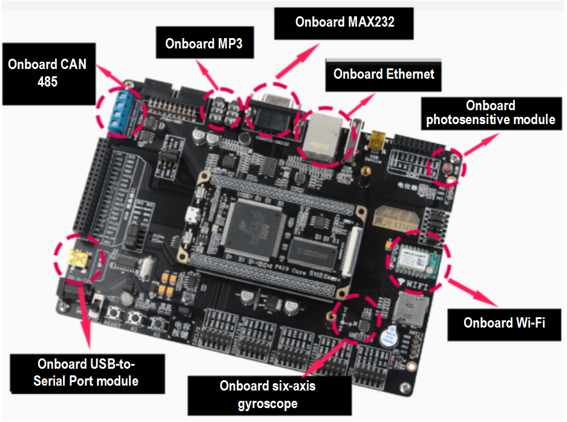

<h2 id="(reference)-connecting-device-cloud-interconnect-components-to-oceanconnect-through-the-ethernet.md">(Reference) Connecting Device-Cloud Interconnect Components to OceanConnect Through the Ethernet</h2>

<h2 id="connecting-to-oceanconnect.md">Connecting to OceanConnect</h2>

1.  Connect the network port of the development board to the router through a network cable.
2.  Set the local IP address.

    Change the IP address of the LAN to which devices connect in the  **sys\_init.c**  file.  Currently, demo programs use the static IP address. If the DHCP mode is required, add the DHCP header file at the top of the **main.c** file and define the **USE\_DHCP** macro.

    ```
    void net_init(void) 
    { 
        /* IP addresses initialization */ 
        IP_ADDRESS[0] = 192; 
        IP_ADDRESS[1] = 168; 
        IP_ADDRESS[2] = 0; 
        IP_ADDRESS[3] = 115; 
        NETMASK_ADDRESS[0] = 255; 
        NETMASK_ADDRESS[1] = 255; 
        NETMASK_ADDRESS[2] = 255; 
        NETMASK_ADDRESS[3] = 0; 
        GATEWAY_ADDRESS[0] = 192; 
        GATEWAY_ADDRESS[1] = 168; 
        GATEWAY_ADDRESS[2] = 0; 
        GATEWAY_ADDRESS[3] = 1;
    ```

    Before calling the Agent Tiny entrypoint function  **agent\_tiny\_entry\(\)**, call the  **net\_init\(\)**  function to complete initialization related to the lwIP protocol.

    The  **sys\_init.c**  file is stored in the  **LiteOS/targets/Cloud\_STM32F429IGTx\_FIRE/Src**  directory.

3.  Change the MAC address of the network port.

    Change the values of  **MAC\_ADDR0**  to  **MAC\_ADDR5**  to the actual MAC addresses. Ensure that the MAC addresses are unique.

    ```
    static int8_t eth_init(struct netif* netif) 
    { 
        HAL_StatusTypeDef hal_eth_init_status; 
        MACAddr[0] = 0x00; 
        MACAddr[1] = 0x80; 
        MACAddr[2] = 0xE1; 
        MACAddr[3] = 0x00; 
        MACAddr[4] = 0x00; 
        MACAddr[5] = 0x00;
    ```

    > **NOTICE:**   
    >The  **eth\_init\(\)**  function contained in the  **net\_init\(\)**  function in step 2 is called. The  **eth.c**  file is stored in the  **LiteOS/targets/Cloud\_STM32F429IGTx\_FIRE/Src**  directory.  

4.  Set the IP address for logging in to OceanConnect and the device EP Name and PSK.

    Relevant configuration parameters need to be set. These parameters are imported to the  **atiny\_init\(\)**  function as input parameters to initialize LiteOS SDK device-cloud interconnect components. Endpoint name is the unique verification code set when developers register devices with OceanConnect. PSK is used to encrypt data transmission. The following uses the  **agent\_tiny\_demo.c**  file as an example:

    ```
    #define DEFAULT_SERVER_IPV4 "192.168.0.5" 
    char * g_endpoint_name = "44440003";  
    #ifdef WITH_DTLS  
    char *g_endpoint_name_s = "11110006";  
    unsigned char g_psk_value[16] = {0xef,0xe8,0x18,0x45,0xa3,0x53,0xc1,0x3c,0x0c,0x89,0x92,0xb3,0x1d,0x6b,0x6a,0x96};   
    #endif
    ```

    The  **agent\_tiny\_demo.c**  file is stored in the  **LiteOS/demos/agenttiny\_lwm2m**  directory.

5.  Compile and run a program.
6.  View the device status.

    Log in to the OceanConnect portal, click  **My Device**, and view the device status in the device list. If the device status is  **bound**, the device has been successfully connected to OceanConnect.

    **Figure  1**  Viewing the device status<a name="fig31098113"></a>  
    

    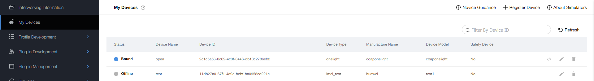


<h2 id="reporting-data.md">Reporting Data</h2>

Chapter 4 describes the data reporting process of LiteOS SDK device-cloud interconnect components in detail. Developers only need to obtain and report sensor data to the reported data structure  **report\_data**  by calling the  **app\_data\_report\(\)**  function. The specific commissioning process is as follows:

1.  On the device side, execute the  **app\_data\_report**  function to enable the device to report data.

    Modify the  **app\_data\_report**  function in the  **agent\_tiny\_demo.c**  file as follows:

    ```
    struct Led_Light
    {
    uint8_t lightvalue;
    …
    };
    extern get_led_lightvalue (void);//Obtain sensor data.
    void app_data_report(void)
    {
    struct Led_Light light;
    data_report_t report_data;
        int ret;
        int cnt = 0;
        report_data.buf = (uint8_t *)&light;
        report_data.callback = ack_callback;
        report_data.cookie = 0;
        report_data.len = sizeof(struct Led_Light);
        report_data.type = APP_DATA;
        while(1)
        {
            report_data.cookie = cnt;
            cnt++;
            ret = atiny_data_report(g_phandle, &report_data);
            printf("report ret:%d\n",ret);
            (void)LOS_TaskDelay(250*8);
    }
    }
    ```

    The  **agent\_tiny\_demo.c**  file is stored in the  **LiteOS/demos/agenttiny\_lwm2m**  directory.

2.  View the device status.

    Log in to the OceanConnect portal, and click  **My Device**. In the device list on the  **My Device**  page, select the device that reports data, and click** Historical Data**  to view data reporting results.

    **Figure  1**  Process for IoT devices with device-cloud interconnect components to report data<a name="ole_link24"></a>  
    

    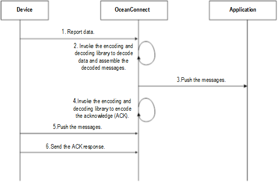

    **Figure  2**  Viewing data reporting results<a name="fig45453455"></a>  
    

    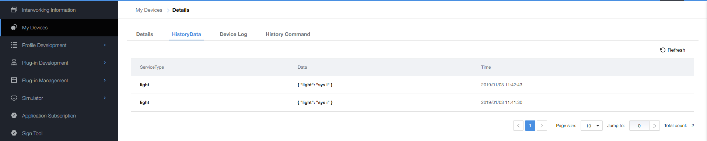


<h2 id="delivering-commands.md">Delivering Commands</h2>

Commands can be delivered in either of the following two modes: immediate delivery and cached delivery.

-   **Immediate delivery**: OceanConnect immediately sends the received commands to devices. If devices are offline or do not receive the commands, the delivery fails. This delivery mode applies to any scenario that has a high requirement on real-time command execution, such as switch lamps for street lamps and gas valves. During immediate delivery, an application server must deliver commands at a correct time.

**Figure  1**  Immediate delivery of commands<a name="fig58964617"></a>  


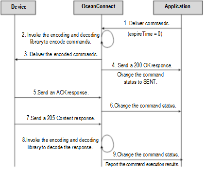

-   **Cached delivery**: After receiving commands, OceanConnect writes them into queues. When a device goes online, OceanConnect successively delivers the commands from queues to the device. This delivery mode applies to any scenario that has a relatively low requirement on real-time command execution, such as configuring water meter parameters. OceanConnect provides different solutions based on power saving modes of devices.

**Figure  2**  Cached delivery of commands<a name="fig35533540"></a>  


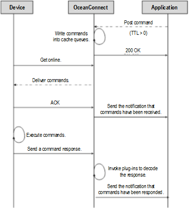

When delivering commands to OceanConnect, an application server has  **expireTime**  configured.  **expireTime**  is TTL for short, which means the maximum cache time. If  **expireTime**  is not configured, the default value is 48 hours.

expireTime = 0: indicates the immediate delivery of commands.

expireTime \> 0: indicates the cached delivery of commands.

To deliver commands, perform the following steps:

1.  Log in to the OceanConnect portal.

    The URL, account, and password for logging in to the OceanConnect portal must be applied to the OceanConnect service provider.

2.  In the device list on the  **My Device**  page, select the device that receives commands and click Commond deliever. （</\>\).

    In the dialog box that is displayed, configure the parameters of commands delivered to the device.

    **Figure  3**  Delivering commands<a name="fig35652807"></a>  
    

    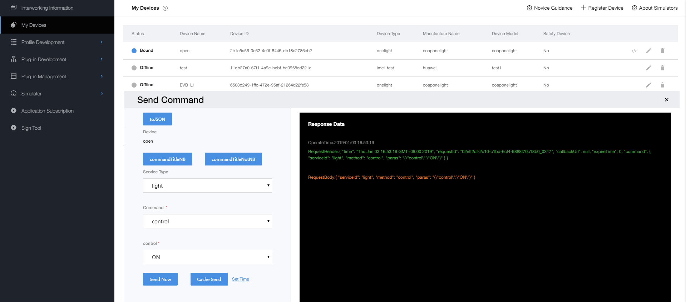

3.  In the device list on the  **My Device**  page, select the device that receives commands and click Historical Command to view information in the Status column.

    **Figure  4**  Viewing the command delivering status<a name="fig48477641"></a>  
    

    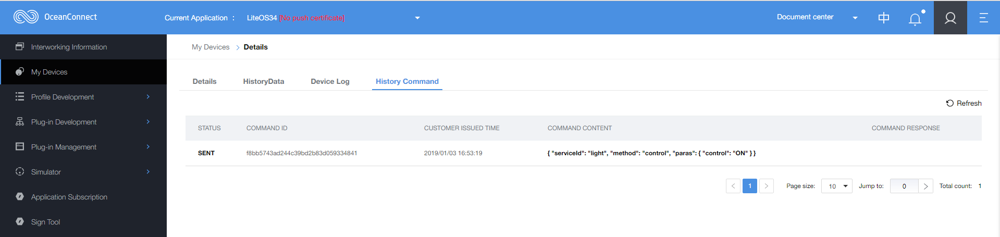

    Status description is as follows:

    -   **Overdue**: Commands have not been delivered to devices in the cache time specified by OceanConnect.

    -   **Success**: OceanConnect has delivered commands to devices and received the command execution results from devices.

    -   **Fail**: The codec plug-in parsing is empty, or the execution results contain  **ERROR CODE**.

    -   **Timeout**: It is timed out that OceanConnect waits for an ACK response.

    -   **Cancel**: Command delivering has been canceled on the application side.

    -   **Waiting**: Commands are cached on OceanConnect and have not been delivered to devices.

    -   **Sent**: OceanConnect has delivered commands to devices.

    -   **Arrived**: OceanConnect has delivered commands to devices and received an ACK response from devices.

4.  LiteOS SDK device-cloud interconnect components obtain and parse the message code stream from the message cache. Call the  **atiny\_write\_app\_write\(\)**  function of the  **atiny\_cmd\_ioctl\(\)**  function in the  **agent\_tiny\_cmd\_ioctl.c**  file to process the parsed message code stream..

    ```
    int atiny_write_app_write(void* user_data, int len)
    {
        int i;
            uint8_t cmd_data[len];
            memcpy(cmd_data, user_data, len);
            for(i=0;i<len;i++)
            {
                printf("######## %d",cmd_data[i]);//Print the delivered commands. Users can process the delivered commands.
                                                 //Control hardware devices using specific commands.
            }
        (void)atiny_printf("write num19 object success\r\n");
        return ATINY_OK;
    }
    ```

    agent\_tiny\_cmd\_ioctl.c位于 LiteOS/demos/agenttiny\_lwm2m。


<h2 id="(optional)-wireless-access-to-device-cloud-interconnect-components.md">(Optional) Wireless Access to Device-Cloud Interconnect Components</h2>

<h2 id="overview-1.md">Overview</h2>

Wireless access modes include Wi-Fi, GSM, NB-IoT, Zigbee, and Bluetooth. This guide describes the Wi-Fi and GSM \(GPRS\) access modes. For IoT developers, Wi-Fi or GSM just likes an independent module. Device-cloud interconnect components running on MCUs can use Wi-Fi or GSM network services after passing serial port AT instructions, as shown in the following figure. ESP8266 is Espressif's Wi-Fi module. SIM900A is SIMCom's GSM/GPRS module.

**Figure  1**  Wireless access to device-cloud interconnect components<a name="fig8070236"></a>  


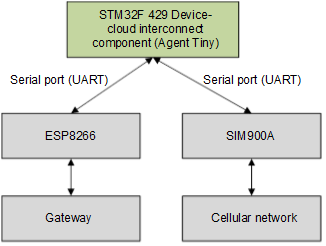

An instruction set is sent from a TE or a DTE to a TA or a DCE. A TE manages the functions of the mobile station \(MS\) and interacts with GSM network services by sending AT instructions to a TA. Users can manage calls, short messages, phonebooks, data services, and faxes by invoking AT instructions.

<h2 id="at-framework.md">AT Framework</h2>

In most scenarios, both ESP8266 and SIM900A can be accessed using the AT+UART mode. The difference lies in specific AT instructions. Device-cloud interconnect components provide an AT framework \(also called AT template\) for users to complete the porting of different serial port communications modules. Such modules support the TCP/IP protocol stack. The following figure shows the AT framework.

In the figure, AT Socket, similar to the posix socket, adapts to Atiny Socket. AT Send calls the at\_cmd function to send AT instructions. AT Recv helps users receive Post messages from queues using AT Analyse Task. AT Analyse Task parses messages from serial ports, including user data and command responses. The serial port \(USART\) receives data in interrupt or direct memory access \(DMA\) mode. AT API Register provides the API function for registering device modules.

**Figure  1**  AT framework<a name="fig23810358"></a>  


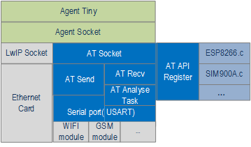

In the preceding figure, codes in the public part are in dark blue, and users do not need to modify them. Device codes are in light blue, and users need to compile the corresponding device codes. Based on the definition of the  **at\_api\_interface.h**  file, users only need to implement the following APIs.

```
typedef struct { 
  int32_t  (*init)(void);  /*Initialization: Initializing serial port and IP networks*/ 
  int8_t (*get_localmac)(int8_t *mac);/*Obtaining local MAC address*/ 
  int8_t (*get_localip)(int8_t *ip, int8_t * gw, int8_t * mask);/*Obtaining local IP address*/ 
  /*Establishing TCP- or UDP-based connection*/ 
  int32_t  (*connect)(const int8_t * host, const int8_t *port, int32_t proto); 
  /*Send: After a command is sent, if the receiver has not received the command request in a period, an error will be returned.*/ 
  int32_t  (*send)(int32_t id , const uint8_t  *buf, uint32_t len); 
  int32_t  (*recv_timeout)(int32_t id , int8_t  *buf, uint32_t len, int32_t timeout); 
  int32_t  (*recv)(int32_t id , int8_t  *buf, uint32_t len); 

  int32_t  (*close)(int32_t id);/*Disconnecting*/ 
  int32_t  (*recv_cb)(int32_t id);/*Handling events, which is not implemented*/ 
  int32_t  (*deinit)(void); 
}at_adaptor_api;
```

The  **at\_api.h**  file is stored in the  **LiteOS/include/at\_frame**  directory.

<h2 id="porting-the-wi-fi-module-esp8266.md">Porting the Wi-Fi Module ESP8266</h2>

The previous section briefly introduces the AT framework. Developers need to implement the APIs defined in the **at\_api.h** file, and then register the APIs through AT API Register for the upper-layer Agent Socket to call. This section uses the Wi-Fi module ESP8266 as an example to help developers for porting.

1.  Connect the serial port Wi-Fi module ESP8266 to the STM32F429 development board, as shown in the following figure.

    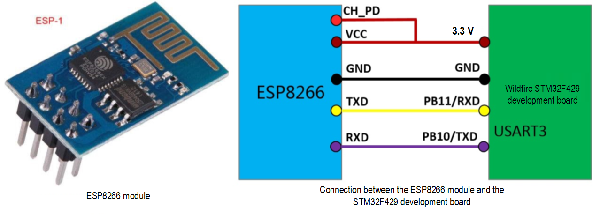

2.  Define the API structure in the  **esp8266.c**  .

    ```
    at_adaptor_api at_interface = {  
         .init = esp8266_init,     
         .get_localmac = esp8266_get_localmac, /*get local MAC*/ 
         .get_localip = esp8266_get_localip,/*get local IP*/ 
         /*build TCP or UDP connection*/ 
         .connect = esp8266_connect, 
         .send = esp8266_send, 
         .recv_timeout = esp8266_recv_timeout, 
         .recv = esp8266_recv, 
         .close = esp8266_close,/*close connection*/ 
         .recv_cb = esp8266_recv_cb,/* operation for events, not implements yet */ 
         .deinit = esp8266_deinit, 
    };
    ```

    The  **esp8266.c**  file is stored in the  **LiteOS/components/net/at\_device/wifi\_esp8266**  directory.

3.  Add the following codes to the  **main.c**  file :

    ```
    #elif defined(WITH_AT_FRAMEWORK) && (defined(USE_ESP8266) || defined(USE_SIM900A))        extern at_adaptor_api at_interface;        at_api_register(&at_interface); //Register functions defined by developers.
         agent_tiny_entry(); 
    #endif 
    ```

    The  **main.c**  file is stored in the  **LiteOS/targets/Cloud\_STM32F429IGTx\_FIRE/Src**  directory.

4.  Check that the compilation macro is enabled.

    **Figure  1**  Global macro containing WITH\_AT\_FRAMEWORK and USE\_ESP8266<a name="fig10784294"></a>  
    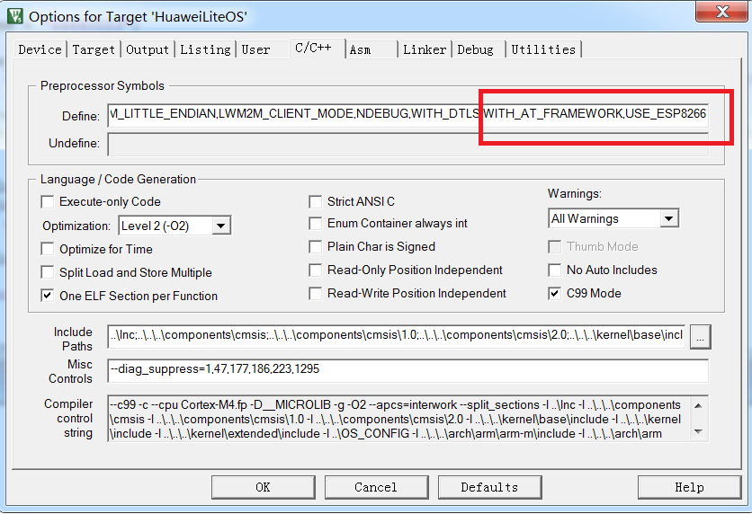

5.  Implement a specific device API in the  **esp8266.c**  file.

    An example of initializing the demo program is as follows:

    ```
    int32_t esp8266_init() 
    { 
         at.init(); 
         at.oob_register(AT_DATAF_PREFIX, strlen(AT_DATAF_PREFIX), esp8266_data_handler); 
     #ifdef  USE_USARTRX_DMA HAL_UART_Receive_DMA(&at_usart,&at.recv_buf[at_user_conf.user_buf_len*0],at_user_conf.user_buf_len); 
    #endif 
         esp8266_reset(); 
         esp8266_echo_off(); 
         esp8266_choose_net_mode(STA); 
         while(AT_FAILED == esp8266_joinap(WIFI_SSID, WIFI_PASSWD)) 
         { 
             AT_LOG("connect ap failed, repeat..."); 
         }; 
         esp8266_set_mux_mode(at.mux_mode); 
         static int8_t ip[32]; 
         static int8_t gw[32]; 
         static int8_t mac[32]; 
         esp8266_get_localip(ip, gw, NULL); 
         esp8266_get_localmac(mac); 
         AT_LOG("get ip:%s, gw:%s mac:%s", ip, gw, mac); 
         return AT_OK; 
    }
    ```

    To implement other APIs, refer to the preceding method. The macro defined by the AT instructions for the ESP8266 module is defined in the  **esp8266.h**  file . For details, see the ESP8266 official manual. Moreover, users need to change the Wi-Fi SSID and password in the  **esp8266.h**  file.

    ```
    #define AT_CMD_RST           "AT+RST" 
    #define AT_CMD_ECHO_OFF     "ATE0" 
    #define AT_CMD_CWMODE       "AT+CWMODE_CUR" 
    #define AT_CMD_JOINAP       "AT+CWJAP_CUR" 
    #define AT_CMD_MUX      "AT+CIPMUX" 
    #define AT_CMD_CONN     "AT+CIPSTART" 
    #define AT_CMD_SEND     "AT+CIPSEND" 
    #define AT_CMD_CLOSE        "AT+CIPCLOSE" 
    #define AT_CMD_CHECK_IP     "AT+CIPSTA_CUR?" 
    #define AT_CMD_CHECK_MAC    "AT+CIPSTAMAC_CUR?"
    ```

    The  **esp8266.h**  file is stored in the  **LiteOS/components/net/at\_device/wifi\_esp8266**  directory.


<h2 id="porting-the-gsm-module-sim900a.md">Porting the GSM Module SIM900A</h2>

The porting method of SIM900A is similar to that of ESP8266. Only the AT instructions are slightly different.

1.  Connect the serial port GSM module SIM900A to the STM32F429 development board, as shown in the following figure.

    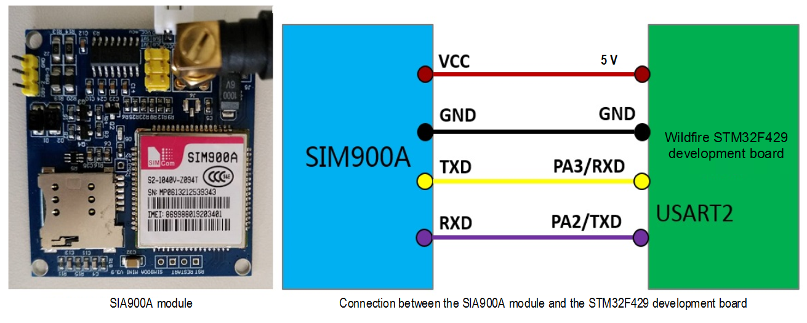

2.  Define the API structure in the  **sim900a.c**  file.

    ```
    at_adaptor_api at_interface = { 
        .init = sim900a_ini, 
        /*TCP or UDP connect*/ 
        .connect = sim900a_connect, 
        /*send data, if no response, retrun error*/ 
        .send = sim900a_send, 
        .recv_timeout = sim900a_recv_timeout, 
        .recv = sim900a_recv, 
        .close = sim900a_close,/*close connect*/ 
        .recv_cb = sim900a_recv_cb,/*receive event handle, no available by now */ 
    .deinit = sim900a_deinit, 
    };
    ```

    The  **sim900a.c**  file is stored in the  **LiteOS/components/net/at\_device/gprs\_sim900a**  directory.

3.  Add the following codes to the  **main.c**  file:

    ```
    #elif defined(WITH_AT_FRAMEWORK) && (defined(USE_ESP8266) || defined(USE_SIM900A)) 
         extern at_adaptor_api at_interface; 
         at_api_register(&at_interface); 
         agent_tiny_entry(); 
    #endif
    ```

4.  Check that the compilation macro is enabled.

    **Figure  1**  Global macro containing WITH\_AT\_FRAMEWORK and USE\_SIM900A<a name="fig61983920"></a>  
    

5.  Implement a specific device API in the  **sim900a.c**  file.

    The function for sending and receiving the demo program is as follows:

    ```
    int32_t  sim900a_recv_timeout(int32_t id, int8_t * buf, uint32_t len, int32_t timeout) 
    { 
    uint32_t qlen = sizeof(QUEUE_BUFF); 
        QUEUE_BUFF  qbuf = {0, NULL}; 
        printf("****at.linkid[id].qid=%d***\n",at.linkid[id].qid); 
        int ret = LOS_QueueReadCopy(at.linkid[id].qid, &qbuf, &qlen, timeout); 
        AT_LOG("ret = %x, len = %d, id = %d", ret, qbuf.len, id); 
        if (qbuf.len){ 
            memcpy(buf, qbuf.addr, qbuf.len); 
            atiny_free(qbuf.addr); 
        } 
        return qbuf.len; 
    } 
    int32_t sim900a_send(int32_t id , const uint8_t  *buf, uint32_t len) 
    { 
        int32_t ret = -1; 
        char cmd[64] = {0}; 
        if (AT_MUXMODE_SINGLE == at.mux_mode) 
        { 
            snprintf(cmd, 64, "%s=%d", AT_CMD_SEND, len); 
        } 
        else 
        { 
            snprintf(cmd, 64, "%s=%d,%d", AT_CMD_SEND, id, len); 
        } 
        ret = at.write((int8_t *)cmd, "SEND OK", (int8_t*)buf, len); 
        return ret; 
    }
    ```

    The macro defined by the AT instructions for the SIM900A module is defined in the  **sim900a.h**  file. For details, see the SIM900A official manual.

    ```
    #define AT_CMD_AT            "AT" 
    #define AT_CMD_CPIN          "AT+CPIN?"//check sim card 
    #define AT_CMD_COPS          "AT+COPS?"//check register network 
    #define AT_CMD_CLOSE         "AT+CIPCLOSE" 
    #define AT_CMD_SHUT          "AT+CIPSHUT" 
    #define AT_CMD_ECHO_OFF      "ATE0" 
    #define AT_CMD_ECHO_ON       "ATE1" 
    #define AT_CMD_MUX          "AT+CIPMUX" 
    #define AT_CMD_CLASS        "AT+CGCLASS"//set MS type 
    #define AT_CMD_PDP_CONT     "AT+CGDCONT"//configure pdp context #define #defineAT_CMD_PDP_ATT        "AT+CGATT"//pdp attach network 
    #define AT_CMD_PDP_ACT      "AT+CGACT"//active pdp context 
    #define AT_CMD_CSTT         "AT+CSTT"//start task 
    #define AT_CMD_CIICR       "AT+CIICR"//start gprs connect 
    #define AT_CMD_CIFSR       "AT+CIFSR"//get local ip 
    #define AT_CMD_CIPHEAD     "AT+CIPHEAD" 
    #define AT_CMD_CONN        "AT+CIPSTART" 
    #define AT_CMD_SEND        "AT+CIPSEND" 
    #define AT_CMD_CLOSE       "AT+CIPCLOSE"
    ```

    The  **sim900a.h**  file is stored in the  **LiteOS/components/net/at\_device/gprs\_sim900a**  directory.


<h2 id="precautions.md">Precautions</h2>

The message receiving API with the timeout mechanism must be used because sending messages to and receiving messages from a device-cloud interconnect component belong to the same task. The API  **int32\_t  \(\*recv\_timeout\)\(int32\_t id , int8\_t  \*buf, uint32\_t len, int32\_t timeout\)**  must be used. The receiving timeout period is 10 seconds \(implemented by  **\#define BIND\_TIMEOUT \(10\)**\).

If sending messages to and receiving messages from a user-designed application belong to different tasks, the blocking API  **int32\_t  \(\*recv\)\(int32\_t id , int8\_t  \*buf, uint32\_t len\)**  can be used.

<h2 id="(optional)-connecting-a-device-simulator-to-oceanconnect.md">(Optional) Connecting a Device Simulator to OceanConnect</h2>


<h2 id="overview-2.md">Overview</h2>

After the device has been connected, OceanConnect can manage it.

OceanConnect provides a device simulator to simulate the scenario where a real device is connected to OceanConnect. This section describes how to connect a device simulator to OceanConnect.

1.  Choose Simulator -\> NB Device Simulator-\> Binding Device. On the Binding Device page, enter the verification code, and click OK.

    The verifyCode must be the same as that used during device registration.

    **Figure  1**  Device simulator<a name="fig51933553"></a>  
    

    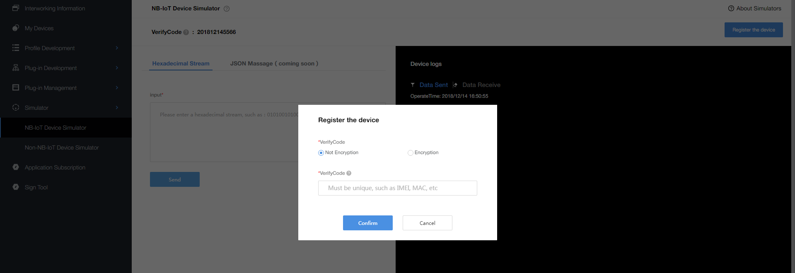

2.  Click  **My Device**. On the  **My Device**  page, view the device status in the device list. If the device status is  **bound**, the device has been successfully connected to OceanConnect.

    **Figure  2**  Viewing the device status<a name="fig8932771"></a>  
    

    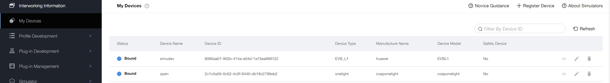


<h2 id="the-device-simulator-reports-data.md">The Device Simulator Reports Data</h2>

After receiving a command or resource subscription message from OceanConnect, a device reports a command response or resource subscription message. OceanConnect pushes the message to the application server or subscribed address. If the southbound device that reports data is an NB-IoT device or a device integrated with device-cloud interconnect components, OceanConnect invokes codec plug-ins to parse the message before pushing the message to the application server or subscribed address.

OceanConnect provides a device simulator to simulate the scenario where a real device reports data. This section describes how to use the NB device simulator to report data. The NB device simulator can also simulate the data reporting of device-cloud interconnect components.

1.  Log in to the OceanConnect portal.

    The URL, account, and password for logging in to the OceanConnect portal must be applied to the OceanConnect service provider.

2.  Choose Simulator \> NB Device Simulator. On the NB Device Simulator page, enter the code stream to be reported, and click  **Send**.

    View data reporting information by choosing  Log Information \> Data Send.

    View data reporting response information by choosing Log Information \> Data Reception.

    **Figure  1**  Simulating data reporting<a name="fig58546668"></a>  
    

    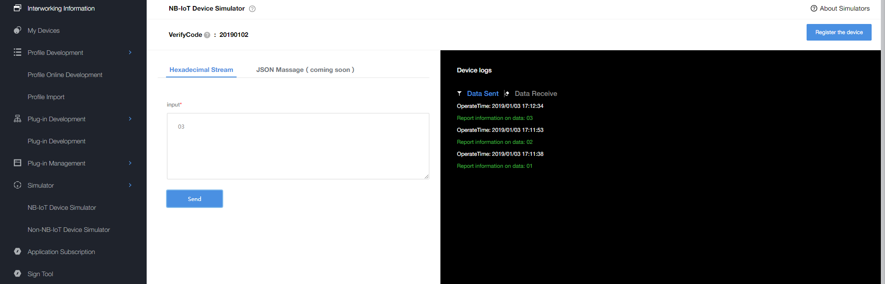

3.  In the device list on the My Device page, select a device that reports data and click Historical Data to check whether codec plug-ins can parse the reported data.

    **Figure  2**  Viewing data reporting results<a name="fig9089262"></a>  
    

    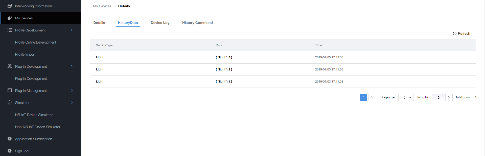

    The following uses the codec plug-in of an LED lamp device as an example. The device includes the LightControl service. The setting method is applicable to multiple services containing attributes and commands.

    LightControl: Contains the  **light**  attribute \(the indicator is on or off\) and the command \(for setting the indicator to  **on**  or  **off**\).

    After the hexadecimal code stream 01 reported by the device simulator is used, the result decoded by codec plug-ins in Historical Data is as follows:

    LightControl: \{ "light": 1 \}

4.  In the device list on the My Device page, select a device that reports data and click Historical Data to check data reporting information.

    Click Historical Data to view results parsed by codec plug-ins.


<h2 id="the-application-simulator-delivers-commands.md">The Application Simulator Delivers Commands</h2>

An application server needs to invoke the command delivery API of OceanConnect before delivering commands to a device. If the device that receives commands is an NB-IoT device or a southbound device integrated with device-cloud interconnect components, OceanConnect invokes codec plug-ins to decode the commands sent by the application server and sends the decoded commands to the device.

OceanConnect provides the application simulator to simulate scenarios where an application server delivers commands. This section describes how to use the application simulator to deliver commands.

1.  In the device list on the My Device page, select the device that receives commands and click Command Delivery（</\>\).

    In the dialog box that is displayed, configure the parameters of commands delivered to the device.

    **Figure  1**  Delivering commands<a name="fig10476011"></a>  
    

    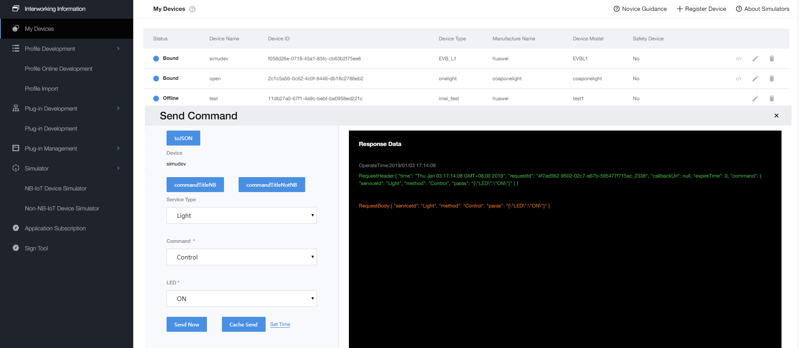

2.  In the device list on the My Device page, select the device that receives commands and click Historical Command to view information in the status column.

    **Figure  2**  Viewing the command delivering status<a name="fig55620298"></a>  
    

    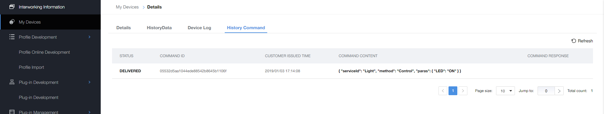

    Status description is as follows:

    -   **Overdue**: Commands have not been delivered to devices in the cache time specified by OceanConnect.
    -   **Success**: OceanConnect has delivered commands to devices and received the command execution results from devices.
    -   **Fail**: The codec plug-in parsing is empty, or the execution results contain  **ERROR CODE**.
    -   **Timeout**: It is timed out that OceanConnect waits for an ACK response.
    -   **Cancel**: Command delivering has been canceled on the application side.
    -   **Waiting**: Commands are cached on OceanConnect and have not been delivered to devices.
    -   **Sent**: OceanConnect has delivered commands to devices.
    -   **Arrived**: OceanConnect has delivered commands to devices and received an ACK response from devices.

3.  Choose “Simulator-\>“NB Device Simulator”-\>“Device Log Information”-\>“Data Reception”. On the Data Reception page, view the command information received by the device simulator.

**Figure  3**  Viewing command receiving information<a name="fig39186158"></a>  


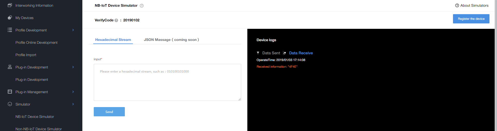

**----End**

## Appendix 1 LWM2M


<h2 id="definition.md">Definition</h2>

LWM2M is a lightweight, standard, and general-purpose IoT device management protocol developed by the Open Mobile Alliance \(OMA\). It can be used to quickly deploy IoT services in client or server mode.

In addition, LWM2M provides a set of standards for the management and application of IoT devices. It supports small and portable security communications APIs and efficient data models to implement M2M device management and service support.

<h2 id="features.md">Features</h2>

LWM2M supports the following features:

-   Simple objects based on resource models
-   Resource operations including creation, retrieval, update, deletion, and attribute configuration
    -   Resource observation or notification


-   Data formats including TLV, JSON, plain text, and opaque
-   Transport layer protocols including UDP and SMS
-   DTLS
-   NAT or firewall solution — queue mode
-   Multiple LWM2M Servers
-   Basic M2M functions including LWM2M Server, Access Control, Devices, Connectivity Monitoring, Firmware, Location, and Connectivity Statistics

<h2 id="system-architecture.md">System Architecture</h2>

The following figure shows the system architecture of LWM2M.

**Figure  1**  System architecture of LWM2M<a name="fig2748271"></a>  


<h2 id="object-defined-by-lwm2m.md">Object Defined by LWM2M</h2>

<h3> Object Concept</h3>

An object is a collection of resources that are logically used for specific purposes. For example, firmware upgrade. The object includes all resources used for firmware upgrade, such as firmware packages, firmware URLs, upgrade execution, and upgrade results.

Before using the functions of an object, instantiate the object. An object can have multiple instances, which are numbered from 0 in ascending order.

LWM2M has defined fixed IDs for the standard objects defined by the OMA. For example, the ID of the firmware upgrade object is 5. The object includes eight types of resources, which are numbered from 0 to 7. The ID of the firmware package name is 6. Therefore, URI 5/0/6 represents the firmware package name of instance 0 of the firmware upgrade object.

<h3>Object Format</h3>

<a name="table32822723"></a>
<table><thead align="left"><tr id="row41343656"><th class="cellrowborder" valign="top" width="14.285714285714285%" id="mcps1.1.6.1.1"><p id="p60501853"><a name="p60501853"></a><a name="p60501853"></a>Name</p>
</th>
<th class="cellrowborder" valign="top" width="16.3265306122449%" id="mcps1.1.6.1.2"><p id="p1703046"><a name="p1703046"></a><a name="p1703046"></a>Object ID</p>
</th>
<th class="cellrowborder" valign="top" width="19.387755102040817%" id="mcps1.1.6.1.3"><p id="p3729036"><a name="p3729036"></a><a name="p3729036"></a>Instance</p>
</th>
<th class="cellrowborder" valign="top" width="24.489795918367346%" id="mcps1.1.6.1.4"><p id="p33616470"><a name="p33616470"></a><a name="p33616470"></a>Mandatory</p>
</th>
<th class="cellrowborder" valign="top" width="25.510204081632654%" id="mcps1.1.6.1.5"><p id="p38579532"><a name="p38579532"></a><a name="p38579532"></a>Object URN</p>
</th>
</tr>
</thead>
<tbody><tr id="row37934424"><td class="cellrowborder" valign="top" width="14.285714285714285%" headers="mcps1.1.6.1.1 "><p id="p52789471"><a name="p52789471"></a><a name="p52789471"></a>Object Name</p>
</td>
<td class="cellrowborder" valign="top" width="16.3265306122449%" headers="mcps1.1.6.1.2 "><p id="p48088779"><a name="p48088779"></a><a name="p48088779"></a>16-bit Unsigned Integer</p>
</td>
<td class="cellrowborder" valign="top" width="19.387755102040817%" headers="mcps1.1.6.1.3 "><p id="p2877060"><a name="p2877060"></a><a name="p2877060"></a>Multiple/Single</p>
</td>
<td class="cellrowborder" valign="top" width="24.489795918367346%" headers="mcps1.1.6.1.4 "><p id="p31715313"><a name="p31715313"></a><a name="p31715313"></a>Mandatory/Optional</p>
</td>
<td class="cellrowborder" valign="top" width="25.510204081632654%" headers="mcps1.1.6.1.5 "><p id="p18803579"><a name="p18803579"></a><a name="p18803579"></a>urn:oma:LwM2M:{oma,ext,x}:{Object ID}</p>
</td>
</tr>
</tbody>
</table>

<h3>Standard Object Defined by OMA</h3>

The OMA LWM2M specifications define the following seven standard objects.

<a name="table17601109"></a>
<table><thead align="left"><tr id="row49492823"><th class="cellrowborder" valign="top" width="21.21212121212121%" id="mcps1.1.4.1.1"><p id="p49495688"><a name="p49495688"></a><a name="p49495688"></a>Object</p>
</th>
<th class="cellrowborder" valign="top" width="16.161616161616163%" id="mcps1.1.4.1.2"><p id="p49727786"><a name="p49727786"></a><a name="p49727786"></a>Object ID</p>
</th>
<th class="cellrowborder" valign="top" width="62.62626262626263%" id="mcps1.1.4.1.3"><p id="p1418852"><a name="p1418852"></a><a name="p1418852"></a>description</p>
</th>
</tr>
</thead>
<tbody><tr id="row47818207"><td class="cellrowborder" valign="top" width="21.21212121212121%" headers="mcps1.1.4.1.1 "><p id="p48069571"><a name="p48069571"></a><a name="p48069571"></a>LwM2M Security</p>
</td>
<td class="cellrowborder" valign="top" width="16.161616161616163%" headers="mcps1.1.4.1.2 "><p id="p1321142"><a name="p1321142"></a><a name="p1321142"></a>0</p>
</td>
<td class="cellrowborder" valign="top" width="62.62626262626263%" headers="mcps1.1.4.1.3 "><p id="p39903715"><a name="p39903715"></a><a name="p39903715"></a>Includes the URI and payload security mode of an LWM2M bootstrap server and information about partial algorithms or keys and short server IDs.</p>
</td>
</tr>
<tr id="row23589118"><td class="cellrowborder" valign="top" width="21.21212121212121%" headers="mcps1.1.4.1.1 "><p id="p31670386"><a name="p31670386"></a><a name="p31670386"></a>LwM2M Server</p>
</td>
<td class="cellrowborder" valign="top" width="16.161616161616163%" headers="mcps1.1.4.1.2 "><p id="p15164467"><a name="p15164467"></a><a name="p15164467"></a>1</p>
</td>
<td class="cellrowborder" valign="top" width="62.62626262626263%" headers="mcps1.1.4.1.3 "><p id="p20362280"><a name="p20362280"></a><a name="p20362280"></a>Includes the short ID of a server, registration life cycle, minimum or maximum period of observation, and binding models.</p>
</td>
</tr>
<tr id="row49042793"><td class="cellrowborder" valign="top" width="21.21212121212121%" headers="mcps1.1.4.1.1 "><p id="p13043336"><a name="p13043336"></a><a name="p13043336"></a>Access Control</p>
</td>
<td class="cellrowborder" valign="top" width="16.161616161616163%" headers="mcps1.1.4.1.2 "><p id="p49877328"><a name="p49877328"></a><a name="p49877328"></a>2</p>
</td>
<td class="cellrowborder" valign="top" width="62.62626262626263%" headers="mcps1.1.4.1.3 "><p id="p13531752"><a name="p13531752"></a><a name="p13531752"></a>Includes the access control permission of each object.</p>
</td>
</tr>
<tr id="row54676905"><td class="cellrowborder" valign="top" width="21.21212121212121%" headers="mcps1.1.4.1.1 "><p id="p66753213"><a name="p66753213"></a><a name="p66753213"></a>Device</p>
</td>
<td class="cellrowborder" valign="top" width="16.161616161616163%" headers="mcps1.1.4.1.2 "><p id="p38301173"><a name="p38301173"></a><a name="p38301173"></a>3</p>
</td>
<td class="cellrowborder" valign="top" width="62.62626262626263%" headers="mcps1.1.4.1.3 "><p id="p15387322"><a name="p15387322"></a><a name="p15387322"></a>Includes the device manufacturer, model, serial number, power, and memory.</p>
</td>
</tr>
<tr id="row4268172"><td class="cellrowborder" valign="top" width="21.21212121212121%" headers="mcps1.1.4.1.1 "><p id="p10177679"><a name="p10177679"></a><a name="p10177679"></a>Connectivity Monitoring</p>
</td>
<td class="cellrowborder" valign="top" width="16.161616161616163%" headers="mcps1.1.4.1.2 "><p id="p19085650"><a name="p19085650"></a><a name="p19085650"></a>4</p>
</td>
<td class="cellrowborder" valign="top" width="62.62626262626263%" headers="mcps1.1.4.1.3 "><p id="p2433789"><a name="p2433789"></a><a name="p2433789"></a>Includes the network standard, link quality, and IP address.</p>
</td>
</tr>
<tr id="row21904105"><td class="cellrowborder" valign="top" width="21.21212121212121%" headers="mcps1.1.4.1.1 "><p id="p29402117"><a name="p29402117"></a><a name="p29402117"></a>Firmware</p>
</td>
<td class="cellrowborder" valign="top" width="16.161616161616163%" headers="mcps1.1.4.1.2 "><p id="p32761244"><a name="p32761244"></a><a name="p32761244"></a>5</p>
</td>
<td class="cellrowborder" valign="top" width="62.62626262626263%" headers="mcps1.1.4.1.3 "><p id="p36415128"><a name="p36415128"></a><a name="p36415128"></a>Includes the firmware package and its URI, status, and upgrade results.</p>
</td>
</tr>
<tr id="row59300704"><td class="cellrowborder" valign="top" width="21.21212121212121%" headers="mcps1.1.4.1.1 "><p id="p38627694"><a name="p38627694"></a><a name="p38627694"></a>Location</p>
</td>
<td class="cellrowborder" valign="top" width="16.161616161616163%" headers="mcps1.1.4.1.2 "><p id="p41835476"><a name="p41835476"></a><a name="p41835476"></a>6</p>
</td>
<td class="cellrowborder" valign="top" width="62.62626262626263%" headers="mcps1.1.4.1.3 "><p id="p33230395"><a name="p33230395"></a><a name="p33230395"></a>Includes the latitude, longitude, altitude, and time stamp.</p>
</td>
</tr>
<tr id="row30638102"><td class="cellrowborder" valign="top" width="21.21212121212121%" headers="mcps1.1.4.1.1 "><p id="p65767201"><a name="p65767201"></a><a name="p65767201"></a>Connectivity Statistics</p>
</td>
<td class="cellrowborder" valign="top" width="16.161616161616163%" headers="mcps1.1.4.1.2 "><p id="p25543040"><a name="p25543040"></a><a name="p25543040"></a>7</p>
</td>
<td class="cellrowborder" valign="top" width="62.62626262626263%" headers="mcps1.1.4.1.3 "><p id="p55720348"><a name="p55720348"></a><a name="p55720348"></a>Includes the data volume sent and received during data collection and package size.</p>
</td>
</tr>
</tbody>
</table>

Device-cloud interconnect components match OceanConnect capabilities and support the following LWM2M APPDATA with the object ID of 19.

<a name="table17054300"></a>
<table><thead align="left"><tr id="row33811719"><th class="cellrowborder" valign="top" width="27.27272727272727%" id="mcps1.1.4.1.1"><p id="p54394729"><a name="p54394729"></a><a name="p54394729"></a>Object</p>
</th>
<th class="cellrowborder" valign="top" width="14.14141414141414%" id="mcps1.1.4.1.2"><p id="p43896952"><a name="p43896952"></a><a name="p43896952"></a>Object ID</p>
</th>
<th class="cellrowborder" valign="top" width="58.58585858585859%" id="mcps1.1.4.1.3"><p id="p65992219"><a name="p65992219"></a><a name="p65992219"></a>Description</p>
</th>
</tr>
</thead>
<tbody><tr id="row43769531"><td class="cellrowborder" valign="top" width="27.27272727272727%" headers="mcps1.1.4.1.1 "><p id="p55671103"><a name="p55671103"></a><a name="p55671103"></a>LwM2M APPDATA</p>
</td>
<td class="cellrowborder" valign="top" width="14.14141414141414%" headers="mcps1.1.4.1.2 "><p id="p13065488"><a name="p13065488"></a><a name="p13065488"></a>19</p>
</td>
<td class="cellrowborder" valign="top" width="58.58585858585859%" headers="mcps1.1.4.1.3 "><p id="p51671573"><a name="p51671573"></a><a name="p51671573"></a>Includes application service data on LWM2M servers, such as water meter data.</p>
</td>
</tr>
</tbody>
</table>

> **NOTE:**   
>For details about other common objects defined by the OMA, see  [http://www.openmobilealliance.org/wp/OMNA/LwM2M/LwM2MRegistry.html](http://www.openmobilealliance.org/wp/OMNA/LwM2M/LwM2MRegistry.html).  

<h2 id="resource-defined-by-lwm2m.md">Resource Defined by LWM2M</h2>

<h3>Resource Model</h3>

LWM2M defines a resource model. In this resource model, all information can be abstracted and accessed as resources. An object includes resources. An LWM2M Client can have a large amount of resources. Like an object, a resource can have multiple instances.

The following figure shows the relationship among the LWM2M Client, objects, and resources.

**Figure  1**  Relationship among the LWM2M Client, objects, and resources<a name="fig37001625"></a>  
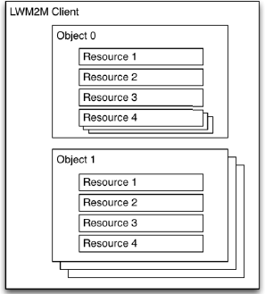

<h3>Resource Format</h3>

<a name="table45707320"></a>
<table><tbody><tr id="row54390367"><th class="firstcol" valign="top" width="23.20754716981132%" id="mcps1.1.3.1.1"><p id="p43543621"><a name="p43543621"></a><a name="p43543621"></a>ID</p>
</th>
<td class="cellrowborder" valign="top" width="76.79245283018868%" headers="mcps1.1.3.1.1 "><p id="p37372419"><a name="p37372419"></a><a name="p37372419"></a>0</p>
</td>
</tr>
<tr id="row807459"><th class="firstcol" valign="top" width="23.20754716981132%" id="mcps1.1.3.2.1"><p id="p65404250"><a name="p65404250"></a><a name="p65404250"></a>Name</p>
</th>
<td class="cellrowborder" valign="top" width="76.79245283018868%" headers="mcps1.1.3.2.1 "><p id="p63252860"><a name="p63252860"></a><a name="p63252860"></a>Resource Name</p>
</td>
</tr>
<tr id="row32404834"><th class="firstcol" valign="top" width="23.20754716981132%" id="mcps1.1.3.3.1"><p id="p7545874"><a name="p7545874"></a><a name="p7545874"></a>Operation</p>
</th>
<td class="cellrowborder" valign="top" width="76.79245283018868%" headers="mcps1.1.3.3.1 "><p id="p7236067"><a name="p7236067"></a><a name="p7236067"></a>R (Read), W (Write), E (Execute)</p>
</td>
</tr>
<tr id="row65124607"><th class="firstcol" valign="top" width="23.20754716981132%" id="mcps1.1.3.4.1"><p id="p40601828"><a name="p40601828"></a><a name="p40601828"></a>Instance</p>
</th>
<td class="cellrowborder" valign="top" width="76.79245283018868%" headers="mcps1.1.3.4.1 "><p id="p413757"><a name="p413757"></a><a name="p413757"></a>Multiple/Single</p>
</td>
</tr>
<tr id="row3723817"><th class="firstcol" valign="top" width="23.20754716981132%" id="mcps1.1.3.5.1"><p id="p33193740"><a name="p33193740"></a><a name="p33193740"></a>Mandatory</p>
</th>
<td class="cellrowborder" valign="top" width="76.79245283018868%" headers="mcps1.1.3.5.1 "><p id="p4338391"><a name="p4338391"></a><a name="p4338391"></a>Mandatory/Optional</p>
</td>
</tr>
<tr id="row39045523"><th class="firstcol" valign="top" width="23.20754716981132%" id="mcps1.1.3.6.1"><p id="p8570831"><a name="p8570831"></a><a name="p8570831"></a>Type</p>
</th>
<td class="cellrowborder" valign="top" width="76.79245283018868%" headers="mcps1.1.3.6.1 "><p id="p23148678"><a name="p23148678"></a><a name="p23148678"></a>String,</p>
<p id="p7011516"><a name="p7011516"></a><a name="p7011516"></a>Integer,</p>
<p id="p63103650"><a name="p63103650"></a><a name="p63103650"></a>Float,</p>
<p id="p31061946"><a name="p31061946"></a><a name="p31061946"></a>Boolean,</p>
<p id="p11122059"><a name="p11122059"></a><a name="p11122059"></a>Opaque,</p>
<p id="p32989672"><a name="p32989672"></a><a name="p32989672"></a>Time,</p>
<p id="p28471592"><a name="p28471592"></a><a name="p28471592"></a>Objlnk none</p>
</td>
</tr>
<tr id="row54917742"><th class="firstcol" valign="top" width="23.20754716981132%" id="mcps1.1.3.7.1"><p id="p19152117"><a name="p19152117"></a><a name="p19152117"></a>Range or Enumeration</p>
</th>
<td class="cellrowborder" valign="top" width="76.79245283018868%" headers="mcps1.1.3.7.1 "><p id="p7817636"><a name="p7817636"></a><a name="p7817636"></a>If any</p>
</td>
</tr>
<tr id="row3249867"><th class="firstcol" valign="top" width="23.20754716981132%" id="mcps1.1.3.8.1"><p id="p61912650"><a name="p61912650"></a><a name="p61912650"></a>Unit</p>
</th>
<td class="cellrowborder" valign="top" width="76.79245283018868%" headers="mcps1.1.3.8.1 "><p id="p48868742"><a name="p48868742"></a><a name="p48868742"></a>If any</p>
</td>
</tr>
<tr id="row37165494"><th class="firstcol" valign="top" width="23.20754716981132%" id="mcps1.1.3.9.1"><p id="p57614999"><a name="p57614999"></a><a name="p57614999"></a>Description</p>
</th>
<td class="cellrowborder" valign="top" width="76.79245283018868%" headers="mcps1.1.3.9.1 "><p id="p36303337"><a name="p36303337"></a><a name="p36303337"></a>Description</p>
</td>
</tr>
</tbody>
</table>

<h2 id="api-defined-by-lwm2m.md">API Defined by LWM2M</h2>

<h3>Overview</h3>

The LWM2M Enabler consists of two components: LWM2M Server and LWM2M Client. LWM2M designs the following four types of APIs for the interaction between the two components:

-   API for device discovery and registration
-   Bootstrap API
-   API for device management and service enablement
-   Information reporting API

<h3>API Model</h3>

The following figure shows an API model defined by LWM2M.

**Figure  1**  API model defined by LWM2M<a name="fig48637721"></a>  
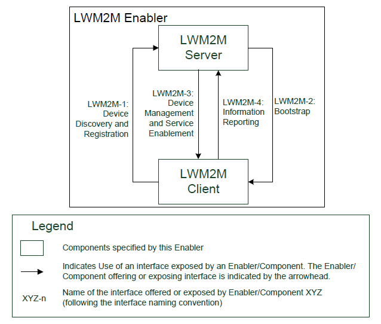

<h3>Message Interaction Process</h3>

The following figure shows the message interaction process defined by LWM2M.

**Figure  2**  Message interaction process defined by LWM2M<a name="fig26749244"></a>  


<h3>API for Device Management and Service Enablement</h3>

Each type of LWM2M APIs represents a type of functions. The API for device management and service implementation is one of the four types of APIs defined by LWM2M. 

The functions of the four types of APIs are implemented by the following two operations:

-   Upstream operation: LWM2M Client –\> LWM2M Server
-   Downstream operation: LWM2M Server –\> LWM2M Client

LWM2M Server accesses object instances and resources of the LWM2M Client through the API for device management and service enablement. This API implements seven operations including create, read, write, delete, execute, write attributes, and discover.

**Figure  3**  Operations implemented by the API for device management and service enablement<a name="fig62831106"></a>  


<a name="table35631460"></a>
<table><thead align="left"><tr id="row44938909"><th class="cellrowborder" valign="top" width="20.2020202020202%" id="mcps1.1.4.1.1"><p id="p16173052"><a name="p16173052"></a><a name="p16173052"></a>API</p>
</th>
<th class="cellrowborder" valign="top" width="56.56565656565656%" id="mcps1.1.4.1.2"><p id="p34948868"><a name="p34948868"></a><a name="p34948868"></a>Operation</p>
</th>
<th class="cellrowborder" valign="top" width="23.232323232323232%" id="mcps1.1.4.1.3"><p id="p12286044"><a name="p12286044"></a><a name="p12286044"></a>Direction</p>
</th>
</tr>
</thead>
<tbody><tr id="row55645484"><td class="cellrowborder" valign="top" width="20.2020202020202%" headers="mcps1.1.4.1.1 "><p id="p10990365"><a name="p10990365"></a><a name="p10990365"></a>Device management and service enablement</p>
</td>
<td class="cellrowborder" valign="top" width="56.56565656565656%" headers="mcps1.1.4.1.2 "><p id="p17804374"><a name="p17804374"></a><a name="p17804374"></a>Create, read, write, delete, execute, write attributes, and discover</p>
</td>
<td class="cellrowborder" valign="top" width="23.232323232323232%" headers="mcps1.1.4.1.3 "><p id="p32868224"><a name="p32868224"></a><a name="p32868224"></a>Downstream</p>
</td>
</tr>
</tbody>
</table>

The following figure shows the interaction process implemented by the API for device management and service enablement.

**Figure  4**  Interaction process implemented by the API for device management and service enablement<a name="fig45080515"></a>  


**Figure  5**  Creating and deleting an object<a name="fig47461111"></a>  


<h2 id="firmware-upgrade.md">Firmware Upgrade</h2>

The firmware upgrade object makes it possible for users to manage the firmware upgrade. The firmware upgrade objects include installing the firmware package, updating the firmware, and other actions. After the firmware is successfully upgraded, the corresponding device must be restarted to make the new firmware take effect.

Before the device is restarted, values related to the upgrade results must be saved.

After the device is restarted, if the  **Packet**  resource contains a valid but uninstalled firmware package, the  **State**  resource must be in the downloaded state. Otherwise, it must be in the idle state.

<h3> Object Definition</h3>

<a name="table3646793"></a>
<table><thead align="left"><tr id="row35777825"><th class="cellrowborder" valign="top" width="23.46938775510204%" id="mcps1.1.6.1.1"><p id="p12322678"><a name="p12322678"></a><a name="p12322678"></a>Name</p>
</th>
<th class="cellrowborder" valign="top" width="16.3265306122449%" id="mcps1.1.6.1.2"><p id="p58612839"><a name="p58612839"></a><a name="p58612839"></a>Object ID</p>
</th>
<th class="cellrowborder" valign="top" width="9.285714285714285%" id="mcps1.1.6.1.3"><p id="p50019550"><a name="p50019550"></a><a name="p50019550"></a>Instance</p>
</th>
<th class="cellrowborder" valign="top" width="7.346938775510203%" id="mcps1.1.6.1.4"><p id="p25051712"><a name="p25051712"></a><a name="p25051712"></a>Mandatory</p>
</th>
<th class="cellrowborder" valign="top" width="43.57142857142857%" id="mcps1.1.6.1.5"><p id="p15922807"><a name="p15922807"></a><a name="p15922807"></a>Object URN</p>
</th>
</tr>
</thead>
<tbody><tr id="row14679019"><td class="cellrowborder" valign="top" width="23.46938775510204%" headers="mcps1.1.6.1.1 "><p id="p48149891"><a name="p48149891"></a><a name="p48149891"></a>Firmware Update</p>
</td>
<td class="cellrowborder" valign="top" width="16.3265306122449%" headers="mcps1.1.6.1.2 "><p id="p7827112"><a name="p7827112"></a><a name="p7827112"></a>5</p>
</td>
<td class="cellrowborder" valign="top" width="9.285714285714285%" headers="mcps1.1.6.1.3 "><p id="p30016321"><a name="p30016321"></a><a name="p30016321"></a>Single</p>
</td>
<td class="cellrowborder" valign="top" width="7.346938775510203%" headers="mcps1.1.6.1.4 "><p id="p15402935"><a name="p15402935"></a><a name="p15402935"></a>Optional</p>
</td>
<td class="cellrowborder" valign="top" width="43.57142857142857%" headers="mcps1.1.6.1.5 "><p id="p39678193"><a name="p39678193"></a><a name="p39678193"></a>rn:oma:LwM2M:oma:5</p>
</td>
</tr>
</tbody>
</table>

<h3>Resource Definition</h3>

<a name="table59817047"></a>
<table><thead align="left"><tr id="row37195666"><th class="cellrowborder" valign="top" width="5.263157894736842%" id="mcps1.1.9.1.1"><p id="p60058969"><a name="p60058969"></a><a name="p60058969"></a>ID</p>
</th>
<th class="cellrowborder" valign="top" width="6.578947368421053%" id="mcps1.1.9.1.2"><p id="p32938312"><a name="p32938312"></a><a name="p32938312"></a>Name</p>
</th>
<th class="cellrowborder" valign="top" width="8.684210526315791%" id="mcps1.1.9.1.3"><p id="p50757640"><a name="p50757640"></a><a name="p50757640"></a>Operation</p>
</th>
<th class="cellrowborder" valign="top" width="6.578947368421053%" id="mcps1.1.9.1.4"><p id="p17728193"><a name="p17728193"></a><a name="p17728193"></a>Instance</p>
</th>
<th class="cellrowborder" valign="top" width="8.684210526315791%" id="mcps1.1.9.1.5"><p id="p26697498"><a name="p26697498"></a><a name="p26697498"></a>Mandatory</p>
</th>
<th class="cellrowborder" valign="top" width="8.421052631578947%" id="mcps1.1.9.1.6"><p id="p15013691"><a name="p15013691"></a><a name="p15013691"></a>Type</p>
</th>
<th class="cellrowborder" valign="top" width="9.736842105263156%" id="mcps1.1.9.1.7"><p id="p8149453"><a name="p8149453"></a><a name="p8149453"></a>Range or Enumeration</p>
</th>
<th class="cellrowborder" valign="top" width="46.052631578947366%" id="mcps1.1.9.1.8"><p id="p56125943"><a name="p56125943"></a><a name="p56125943"></a>Description</p>
</th>
</tr>
</thead>
<tbody><tr id="row49907554"><td class="cellrowborder" valign="top" width="5.263157894736842%" headers="mcps1.1.9.1.1 "><p id="p15980086"><a name="p15980086"></a><a name="p15980086"></a>0</p>
</td>
<td class="cellrowborder" valign="top" width="6.578947368421053%" headers="mcps1.1.9.1.2 "><p id="p19318553"><a name="p19318553"></a><a name="p19318553"></a>Package</p>
</td>
<td class="cellrowborder" valign="top" width="8.684210526315791%" headers="mcps1.1.9.1.3 "><p id="p21298998"><a name="p21298998"></a><a name="p21298998"></a>W</p>
</td>
<td class="cellrowborder" valign="top" width="6.578947368421053%" headers="mcps1.1.9.1.4 "><p id="p47497267"><a name="p47497267"></a><a name="p47497267"></a>Single</p>
</td>
<td class="cellrowborder" valign="top" width="8.684210526315791%" headers="mcps1.1.9.1.5 "><p id="p22073400"><a name="p22073400"></a><a name="p22073400"></a>Mandatory</p>
</td>
<td class="cellrowborder" valign="top" width="8.421052631578947%" headers="mcps1.1.9.1.6 "><p id="p43114990"><a name="p43114990"></a><a name="p43114990"></a>Opaque</p>
</td>
<td class="cellrowborder" valign="top" width="9.736842105263156%" headers="mcps1.1.9.1.7 ">&nbsp;&nbsp;</td>
<td class="cellrowborder" valign="top" width="46.052631578947366%" headers="mcps1.1.9.1.8 "><p id="p13591435"><a name="p13591435"></a><a name="p13591435"></a>Firmware package.</p>
</td>
</tr>
<tr id="row55214059"><td class="cellrowborder" valign="top" width="5.263157894736842%" headers="mcps1.1.9.1.1 "><p id="p43153757"><a name="p43153757"></a><a name="p43153757"></a>1</p>
</td>
<td class="cellrowborder" valign="top" width="6.578947368421053%" headers="mcps1.1.9.1.2 "><p id="p5793444"><a name="p5793444"></a><a name="p5793444"></a>Package URI</p>
</td>
<td class="cellrowborder" valign="top" width="8.684210526315791%" headers="mcps1.1.9.1.3 "><p id="p66615848"><a name="p66615848"></a><a name="p66615848"></a>W</p>
</td>
<td class="cellrowborder" valign="top" width="6.578947368421053%" headers="mcps1.1.9.1.4 "><p id="p27174608"><a name="p27174608"></a><a name="p27174608"></a>Single</p>
</td>
<td class="cellrowborder" valign="top" width="8.684210526315791%" headers="mcps1.1.9.1.5 "><p id="p53659653"><a name="p53659653"></a><a name="p53659653"></a>Mandatory</p>
</td>
<td class="cellrowborder" valign="top" width="8.421052631578947%" headers="mcps1.1.9.1.6 "><p id="p51464622"><a name="p51464622"></a><a name="p51464622"></a>String</p>
</td>
<td class="cellrowborder" valign="top" width="9.736842105263156%" headers="mcps1.1.9.1.7 "><p id="p7884852"><a name="p7884852"></a><a name="p7884852"></a>0-255 bytes</p>
</td>
<td class="cellrowborder" valign="top" width="46.052631578947366%" headers="mcps1.1.9.1.8 "><p id="p34693246"><a name="p34693246"></a><a name="p34693246"></a>URI for downloading the firmware package.</p>
</td>
</tr>
<tr id="row43803760"><td class="cellrowborder" valign="top" width="5.263157894736842%" headers="mcps1.1.9.1.1 "><p id="p58443676"><a name="p58443676"></a><a name="p58443676"></a>2</p>
</td>
<td class="cellrowborder" valign="top" width="6.578947368421053%" headers="mcps1.1.9.1.2 "><p id="p36317312"><a name="p36317312"></a><a name="p36317312"></a>Update</p>
</td>
<td class="cellrowborder" valign="top" width="8.684210526315791%" headers="mcps1.1.9.1.3 "><p id="p56021189"><a name="p56021189"></a><a name="p56021189"></a>E</p>
</td>
<td class="cellrowborder" valign="top" width="6.578947368421053%" headers="mcps1.1.9.1.4 "><p id="p41422483"><a name="p41422483"></a><a name="p41422483"></a>Single</p>
</td>
<td class="cellrowborder" valign="top" width="8.684210526315791%" headers="mcps1.1.9.1.5 "><p id="p66886801"><a name="p66886801"></a><a name="p66886801"></a>Mandatory</p>
</td>
<td class="cellrowborder" valign="top" width="8.421052631578947%" headers="mcps1.1.9.1.6 "><p id="p49121767"><a name="p49121767"></a><a name="p49121767"></a>none</p>
</td>
<td class="cellrowborder" valign="top" width="9.736842105263156%" headers="mcps1.1.9.1.7 "><p id="p19440190"><a name="p19440190"></a><a name="p19440190"></a>no argument</p>
</td>
<td class="cellrowborder" valign="top" width="46.052631578947366%" headers="mcps1.1.9.1.8 "><p id="p31151549"><a name="p31151549"></a><a name="p31151549"></a>Updating the firmware.</p>
<p id="p11928492"><a name="p11928492"></a><a name="p11928492"></a>The resource is executable only when the <strong id="b40247565"><a name="b40247565"></a><a name="b40247565"></a>State</strong> resource is in the downloaded state.</p>
</td>
</tr>
<tr id="row26683771"><td class="cellrowborder" valign="top" width="5.263157894736842%" headers="mcps1.1.9.1.1 "><p id="p13901831"><a name="p13901831"></a><a name="p13901831"></a>3</p>
</td>
<td class="cellrowborder" valign="top" width="6.578947368421053%" headers="mcps1.1.9.1.2 "><p id="p52306487"><a name="p52306487"></a><a name="p52306487"></a>State</p>
</td>
<td class="cellrowborder" valign="top" width="8.684210526315791%" headers="mcps1.1.9.1.3 "><p id="p8967027"><a name="p8967027"></a><a name="p8967027"></a>R</p>
</td>
<td class="cellrowborder" valign="top" width="6.578947368421053%" headers="mcps1.1.9.1.4 "><p id="p55240612"><a name="p55240612"></a><a name="p55240612"></a>Single</p>
</td>
<td class="cellrowborder" valign="top" width="8.684210526315791%" headers="mcps1.1.9.1.5 "><p id="p45304626"><a name="p45304626"></a><a name="p45304626"></a>Mandatory</p>
</td>
<td class="cellrowborder" valign="top" width="8.421052631578947%" headers="mcps1.1.9.1.6 "><p id="p45796100"><a name="p45796100"></a><a name="p45796100"></a>Integer</p>
</td>
<td class="cellrowborder" valign="top" width="9.736842105263156%" headers="mcps1.1.9.1.7 "><p id="p18496643"><a name="p18496643"></a><a name="p18496643"></a>0-3</p>
</td>
<td class="cellrowborder" valign="top" width="46.052631578947366%" headers="mcps1.1.9.1.8 "><p id="p21833110"><a name="p21833110"></a><a name="p21833110"></a>Firmware upgrade status. The value is set by the LWM2M Client. 0: Four statuses of the firmware are as follows: <strong id="b62280267"><a name="b62280267"></a><a name="b62280267"></a>Idle</strong>, <strong id="b23651494"><a name="b23651494"></a><a name="b23651494"></a>Downloading</strong>, <strong id="b11536856"><a name="b11536856"></a><a name="b11536856"></a>Downloaded</strong>, and <strong id="b36722842"><a name="b36722842"></a><a name="b36722842"></a>Updating</strong>. If the <strong id="b62070125"><a name="b62070125"></a><a name="b62070125"></a>Resource Update</strong> command is executed, the status changes from <strong id="b21760219"><a name="b21760219"></a><a name="b21760219"></a>Downloaded</strong> to <strong id="b61624243"><a name="b61624243"></a><a name="b61624243"></a>Updating</strong>. </p>
<p id="p17747280"><a name="p17747280"></a><a name="p17747280"></a>If the upgrade is successful, the status changes to <strong id="b25507793"><a name="b25507793"></a><a name="b25507793"></a>Idle</strong>. If the upgrade fails, the status changes to <strong id="b28243553"><a name="b28243553"></a><a name="b28243553"></a>Downloaded</strong>.</p>
</td>
</tr>
<tr id="row52865392"><td class="cellrowborder" valign="top" width="5.263157894736842%" headers="mcps1.1.9.1.1 "><p id="p54238392"><a name="p54238392"></a><a name="p54238392"></a>4</p>
</td>
<td class="cellrowborder" valign="top" width="6.578947368421053%" headers="mcps1.1.9.1.2 "><p id="p31233616"><a name="p31233616"></a><a name="p31233616"></a>Update Supported Objects</p>
</td>
<td class="cellrowborder" valign="top" width="8.684210526315791%" headers="mcps1.1.9.1.3 "><p id="p46894944"><a name="p46894944"></a><a name="p46894944"></a>RW</p>
</td>
<td class="cellrowborder" valign="top" width="6.578947368421053%" headers="mcps1.1.9.1.4 "><p id="p40394129"><a name="p40394129"></a><a name="p40394129"></a>Single</p>
</td>
<td class="cellrowborder" valign="top" width="8.684210526315791%" headers="mcps1.1.9.1.5 "><p id="p50699018"><a name="p50699018"></a><a name="p50699018"></a>Optional</p>
</td>
<td class="cellrowborder" valign="top" width="8.421052631578947%" headers="mcps1.1.9.1.6 "><p id="p12979828"><a name="p12979828"></a><a name="p12979828"></a>Boolean</p>
</td>
<td class="cellrowborder" valign="top" width="9.736842105263156%" headers="mcps1.1.9.1.7 ">&nbsp;&nbsp;</td>
<td class="cellrowborder" valign="top" width="46.052631578947366%" headers="mcps1.1.9.1.8 "><p id="p66617402"><a name="p66617402"></a><a name="p66617402"></a>The default value is <strong id="b62685707"><a name="b62685707"></a><a name="b62685707"></a>false</strong>.</p>
<p id="p27300453"><a name="p27300453"></a><a name="p27300453"></a>If the value is set to <strong id="b44377489"><a name="b44377489"></a><a name="b44377489"></a>true</strong>, the LWM2M Client must notify the LWM2M Server of the <strong id="b63853089"><a name="b63853089"></a><a name="b63853089"></a>Object</strong> parameter value change by sending the upgrade message or registration message after the firmware is successfully upgraded.</p>
<p id="p37806893"><a name="p37806893"></a><a name="p37806893"></a>If the upgrade fails, the <strong id="b4717717"><a name="b4717717"></a><a name="b4717717"></a>Object</strong> parameter value change is reported by sending the upgrade message in the next phase.</p>
</td>
</tr>
<tr id="row42459460"><td class="cellrowborder" valign="top" width="5.263157894736842%" headers="mcps1.1.9.1.1 "><p id="p16664256"><a name="p16664256"></a><a name="p16664256"></a>5</p>
</td>
<td class="cellrowborder" valign="top" width="6.578947368421053%" headers="mcps1.1.9.1.2 "><p id="p7627529"><a name="p7627529"></a><a name="p7627529"></a>Update Result</p>
</td>
<td class="cellrowborder" valign="top" width="8.684210526315791%" headers="mcps1.1.9.1.3 "><p id="p13850118"><a name="p13850118"></a><a name="p13850118"></a>R</p>
</td>
<td class="cellrowborder" valign="top" width="6.578947368421053%" headers="mcps1.1.9.1.4 "><p id="p48117792"><a name="p48117792"></a><a name="p48117792"></a>Single</p>
</td>
<td class="cellrowborder" valign="top" width="8.684210526315791%" headers="mcps1.1.9.1.5 "><p id="p5227070"><a name="p5227070"></a><a name="p5227070"></a>Mandatory</p>
</td>
<td class="cellrowborder" valign="top" width="8.421052631578947%" headers="mcps1.1.9.1.6 "><p id="p20739529"><a name="p20739529"></a><a name="p20739529"></a>Integer</p>
</td>
<td class="cellrowborder" valign="top" width="9.736842105263156%" headers="mcps1.1.9.1.7 "><p id="p2180264"><a name="p2180264"></a><a name="p2180264"></a>0-8</p>
</td>
<td class="cellrowborder" valign="top" width="46.052631578947366%" headers="mcps1.1.9.1.8 "><p id="p42383684"><a name="p42383684"></a><a name="p42383684"></a>The results of downloading or upgrading the firmware are as follows:0: Initial value. When upgrade or downloading starts, the resource value must be set to <strong id="b45908836"><a name="b45908836"></a><a name="b45908836"></a>0</strong>.</p>
<p id="p10526340"><a name="p10526340"></a><a name="p10526340"></a>1: The firmware is successfully upgraded; 2: The space for storing the new firmware package is insufficient; 3: The memory is insufficient in the downloading process; 4: The connection breaks in the downloading process; 5: Failed to check the integrity of the newly downloaded package; 6: Unsupported package types; 7: Invalid URI;</p>
<p id="p27628197"><a name="p27628197"></a><a name="p27628197"></a>8: The firmware upgrade fails, and this resource can be reported by executing the <strong id="b47327184"><a name="b47327184"></a><a name="b47327184"></a>Observe</strong> command.</p>
</td>
</tr>
<tr id="row23291479"><td class="cellrowborder" valign="top" width="5.263157894736842%" headers="mcps1.1.9.1.1 "><p id="p7561633"><a name="p7561633"></a><a name="p7561633"></a>6</p>
</td>
<td class="cellrowborder" valign="top" width="6.578947368421053%" headers="mcps1.1.9.1.2 "><p id="p8512556"><a name="p8512556"></a><a name="p8512556"></a>PkgName</p>
</td>
<td class="cellrowborder" valign="top" width="8.684210526315791%" headers="mcps1.1.9.1.3 "><p id="p18428448"><a name="p18428448"></a><a name="p18428448"></a>R</p>
</td>
<td class="cellrowborder" valign="top" width="6.578947368421053%" headers="mcps1.1.9.1.4 "><p id="p16309283"><a name="p16309283"></a><a name="p16309283"></a>Single</p>
</td>
<td class="cellrowborder" valign="top" width="8.684210526315791%" headers="mcps1.1.9.1.5 "><p id="p45983584"><a name="p45983584"></a><a name="p45983584"></a>Optional</p>
</td>
<td class="cellrowborder" valign="top" width="8.421052631578947%" headers="mcps1.1.9.1.6 "><p id="p33682813"><a name="p33682813"></a><a name="p33682813"></a>String</p>
</td>
<td class="cellrowborder" valign="top" width="9.736842105263156%" headers="mcps1.1.9.1.7 "><p id="p43953314"><a name="p43953314"></a><a name="p43953314"></a>0-255 bytes</p>
</td>
<td class="cellrowborder" valign="top" width="46.052631578947366%" headers="mcps1.1.9.1.8 "><p id="p3448696"><a name="p3448696"></a><a name="p3448696"></a>Name of the firmware package.</p>
</td>
</tr>
<tr id="row31038269"><td class="cellrowborder" valign="top" width="5.263157894736842%" headers="mcps1.1.9.1.1 "><p id="p31071838"><a name="p31071838"></a><a name="p31071838"></a>7</p>
</td>
<td class="cellrowborder" valign="top" width="6.578947368421053%" headers="mcps1.1.9.1.2 "><p id="p33790981"><a name="p33790981"></a><a name="p33790981"></a>PkgVersion</p>
</td>
<td class="cellrowborder" valign="top" width="8.684210526315791%" headers="mcps1.1.9.1.3 "><p id="p52714903"><a name="p52714903"></a><a name="p52714903"></a>R</p>
</td>
<td class="cellrowborder" valign="top" width="6.578947368421053%" headers="mcps1.1.9.1.4 "><p id="p42048766"><a name="p42048766"></a><a name="p42048766"></a>Single</p>
</td>
<td class="cellrowborder" valign="top" width="8.684210526315791%" headers="mcps1.1.9.1.5 "><p id="p50506914"><a name="p50506914"></a><a name="p50506914"></a>Optional</p>
</td>
<td class="cellrowborder" valign="top" width="8.421052631578947%" headers="mcps1.1.9.1.6 "><p id="p64528234"><a name="p64528234"></a><a name="p64528234"></a>String</p>
</td>
<td class="cellrowborder" valign="top" width="9.736842105263156%" headers="mcps1.1.9.1.7 "><p id="p59404479"><a name="p59404479"></a><a name="p59404479"></a>0-255 bytes</p>
</td>
<td class="cellrowborder" valign="top" width="46.052631578947366%" headers="mcps1.1.9.1.8 "><p id="p47033480"><a name="p47033480"></a><a name="p47033480"></a>Version of the firmware package.</p>
</td>
</tr>
</tbody>
</table>

<h3>Status Mechanism</h3>

The following figure shows the firmware upgrade status mechanism.

**Figure  1**  Firmware upgrade status mechanism<a name="fig61886623"></a>  


<h3>Flowchart</h3>

The following figure shows the firmware upgrade flowchart.

**Figure  2**  Firmware upgrade flowchart<a name="fig41276074"></a>  
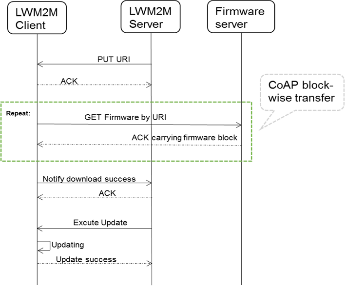

