# LiteOS SDK 介绍


LiteOS SDK是Huawei LiteOS软件开发工具包（Software Development Kit），包括端云互通组件、FOTA、JS引擎、传感框架等内容。

本文档介绍的LiteOS SDK包括了LiteOS SDK端云互通组件。端云互通组件是华为物联网解决方案中，资源受限终端对接到 IoT云平台的重要组件。端云互通组件提供端云协同能力，集成了 LwM2M、CoAP、mbed TLS、LwIP 等全套 IoT 互联互通协议栈，且在 LwM2M 的基础上，提供端云互通组件开放API，用户只需关注自身的应用，而不必关注 LwM2M 实现细节，直接使用 LiteOS SDK端云互通组件封装的 API，通过四个步骤就能简单快速地实现与华为 OceanConnect IoT平台安全可靠连接。使用 LiteOS SDK端云互通组件，用户可以大大减少开发周期，聚焦自己的业务开发，快速构建自己的产品。


**Huawei LiteOS架构图**


# 端云互通组件-CoAP/LwM2M开发指南

## 系统方案

Huawei LiteOS SDK端云互通组件针对“单模组、单MCU”和“外置MCU+模组”两种应用场景，提供了不同的软件架构：

**图 1**  单模组/单MCU软件架构<a name="fig5968939"></a>  
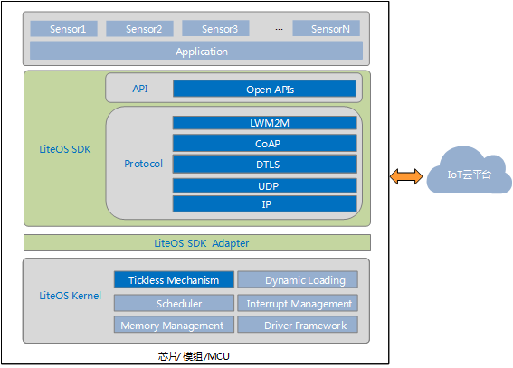

**图 2**  MCU+芯片/模组软件架构<a name="fig13722030"></a>  
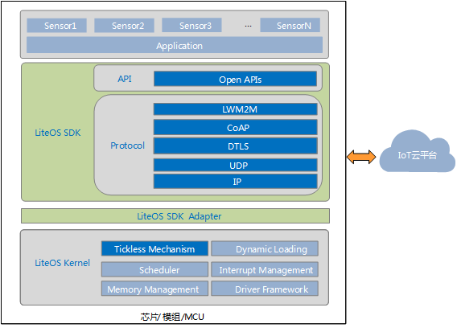

LiteOS SDK 端云互通组件软件主要由三个层次构成：

-   **开放API层：** LiteOS SDK端云互通组件的开放API为应用程序定义了通用接口，终端设备调用开放API能快速完成华为OceanConnect IoT平台的接入、业务数据上报、下发命令处理等。对于外置MCU+模组的场景，LiteOS SDK端云互通组件还提供了AT 命令适配层，用于对AT命令做解析。
-   **协议层：** LiteOS SDK端云互通组件集成了LwM2M/CoAP/DTLS/TLS/UDP等协议。
-   **驱动及网络适配层：** LiteOS SDK端云互通组件为了方便终端设备进行集成和移植，提供了驱动及网络适配层，用户可以基于SDK提供的适配层接口列表，根据具体的硬件平台适配硬件随机数、内存管理、日志、数据存储以及网络Socket等接口。

**LiteOS基础内核 ：** 为用户终端设备提供RTOS特性。

<h3 id="集成策略.md">集成策略</h3>

<h4 id="可集成性.md">可集成性</h4>

LiteOS SDK端云互通组件作为独立的组件，不依赖特定的芯片架构和网络硬件类型，可以轻松地集成到各种通信模组上，如NB-IoT模组、eMTC模组、WIFI模组、GSM模组、以太网硬件等。

<h4 id="可移植性.md">可移植性</h4>

LiteOS SDK端云互通组件的Adapter层提供了常用的硬件及网络适配接口，终端或者模组厂家可以根据自己的硬件实现这些接口后，即可完成LiteOS SDK端云互通组件的移植。需要移植的接口列表及相关函数如下：

**表 1**  LiteOS SDK端云互通组件需要移植适配的接口列表

<a name="table50324903"></a>
<table><thead align="left"><tr id="row25383117"><th class="cellrowborder" valign="top" width="26.490000000000002%" id="mcps1.2.4.1.1"><p id="p42766607"><a name="p42766607"></a><a name="p42766607"></a>接口分类</p>
</th>
<th class="cellrowborder" valign="top" width="35.589999999999996%" id="mcps1.2.4.1.2"><p id="p41543166"><a name="p41543166"></a><a name="p41543166"></a>接口名</p>
</th>
<th class="cellrowborder" valign="top" width="37.92%" id="mcps1.2.4.1.3"><p id="p9553281"><a name="p9553281"></a><a name="p9553281"></a>说明</p>
</th>
</tr>
</thead>
<tbody><tr id="row35618305"><td class="cellrowborder" rowspan="5" valign="top" width="26.490000000000002%" headers="mcps1.2.4.1.1 "><p id="p66510437"><a name="p66510437"></a><a name="p66510437"></a>网络Socket相关接口</p>
</td>
<td class="cellrowborder" valign="top" width="35.589999999999996%" headers="mcps1.2.4.1.2 "><p id="p18636310"><a name="p18636310"></a><a name="p18636310"></a>atiny_net_connect</p>
</td>
<td class="cellrowborder" valign="top" width="37.92%" headers="mcps1.2.4.1.3 "><p id="p33146107"><a name="p33146107"></a><a name="p33146107"></a>创建socket网络连接</p>
</td>
</tr>
<tr id="row29879508"><td class="cellrowborder" valign="top" headers="mcps1.2.4.1.1 "><p id="p4321123"><a name="p4321123"></a><a name="p4321123"></a>atiny_net_recv</p>
</td>
<td class="cellrowborder" valign="top" headers="mcps1.2.4.1.2 "><p id="p14466715"><a name="p14466715"></a><a name="p14466715"></a>接收函数</p>
</td>
</tr>
<tr id="row63091573"><td class="cellrowborder" valign="top" headers="mcps1.2.4.1.1 "><p id="p10143804"><a name="p10143804"></a><a name="p10143804"></a>atiny_net_send</p>
</td>
<td class="cellrowborder" valign="top" headers="mcps1.2.4.1.2 "><p id="p16341824"><a name="p16341824"></a><a name="p16341824"></a>发送函数</p>
</td>
</tr>
<tr id="row12858692"><td class="cellrowborder" valign="top" headers="mcps1.2.4.1.1 "><p id="p34921133"><a name="p34921133"></a><a name="p34921133"></a>atiny_net_recv_timeout</p>
</td>
<td class="cellrowborder" valign="top" headers="mcps1.2.4.1.2 "><p id="p10039559"><a name="p10039559"></a><a name="p10039559"></a>阻塞式接收函数</p>
</td>
</tr>
<tr id="row23247174"><td class="cellrowborder" valign="top" headers="mcps1.2.4.1.1 "><p id="p3972940"><a name="p3972940"></a><a name="p3972940"></a>atiny_net_close</p>
</td>
<td class="cellrowborder" valign="top" headers="mcps1.2.4.1.2 "><p id="p53372694"><a name="p53372694"></a><a name="p53372694"></a>关闭socket网络连接</p>
</td>
</tr>
<tr id="row10592200"><td class="cellrowborder" rowspan="7" valign="top" width="26.490000000000002%" headers="mcps1.2.4.1.1 "><p id="p52661876"><a name="p52661876"></a><a name="p52661876"></a>硬件相关接口</p>
</td>
<td class="cellrowborder" valign="top" width="35.589999999999996%" headers="mcps1.2.4.1.2 "><p id="p37753560"><a name="p37753560"></a><a name="p37753560"></a>atiny_gettime_ms</p>
</td>
<td class="cellrowborder" valign="top" width="37.92%" headers="mcps1.2.4.1.3 "><p id="p38139549"><a name="p38139549"></a><a name="p38139549"></a>获取系统时间，单位ms</p>
</td>
</tr>
<tr id="row7711627"><td class="cellrowborder" valign="top" headers="mcps1.2.4.1.1 "><p id="p20662084"><a name="p20662084"></a><a name="p20662084"></a>atiny_usleep</p>
</td>
<td class="cellrowborder" valign="top" headers="mcps1.2.4.1.2 "><p id="p63016113"><a name="p63016113"></a><a name="p63016113"></a>延时函数，单位us</p>
</td>
</tr>
<tr id="row30274111"><td class="cellrowborder" valign="top" headers="mcps1.2.4.1.1 "><p id="p36283926"><a name="p36283926"></a><a name="p36283926"></a>atiny_random</p>
</td>
<td class="cellrowborder" valign="top" headers="mcps1.2.4.1.2 "><p id="p53316885"><a name="p53316885"></a><a name="p53316885"></a>硬件随机数函数</p>
</td>
</tr>
<tr id="row10089924"><td class="cellrowborder" valign="top" headers="mcps1.2.4.1.1 "><p id="p11977491"><a name="p11977491"></a><a name="p11977491"></a>atiny_malloc</p>
</td>
<td class="cellrowborder" valign="top" headers="mcps1.2.4.1.2 "><p id="p30652703"><a name="p30652703"></a><a name="p30652703"></a>动态内存申请</p>
</td>
</tr>
<tr id="row7438871"><td class="cellrowborder" valign="top" headers="mcps1.2.4.1.1 "><p id="p65677640"><a name="p65677640"></a><a name="p65677640"></a>atiny_free</p>
</td>
<td class="cellrowborder" valign="top" headers="mcps1.2.4.1.2 "><p id="p18288618"><a name="p18288618"></a><a name="p18288618"></a>动态内存释放</p>
</td>
</tr>
<tr id="row30379836"><td class="cellrowborder" valign="top" headers="mcps1.2.4.1.1 "><p id="p44847690"><a name="p44847690"></a><a name="p44847690"></a>atiny_snprintf</p>
</td>
<td class="cellrowborder" valign="top" headers="mcps1.2.4.1.2 "><p id="p8784284"><a name="p8784284"></a><a name="p8784284"></a>格式化字符串</p>
</td>
</tr>
<tr id="row11949699"><td class="cellrowborder" valign="top" headers="mcps1.2.4.1.1 "><p id="p28401526"><a name="p28401526"></a><a name="p28401526"></a>atiny_printf</p>
</td>
<td class="cellrowborder" valign="top" headers="mcps1.2.4.1.2 "><p id="p18822307"><a name="p18822307"></a><a name="p18822307"></a>日志输出</p>
</td>
</tr>
<tr id="row35183038"><td class="cellrowborder" rowspan="4" valign="top" width="26.490000000000002%" headers="mcps1.2.4.1.1 "><p id="p31253810"><a name="p31253810"></a><a name="p31253810"></a>资源互斥相关接口</p>
</td>
<td class="cellrowborder" valign="top" width="35.589999999999996%" headers="mcps1.2.4.1.2 "><p id="p48530675"><a name="p48530675"></a><a name="p48530675"></a>atiny_mutex_create</p>
</td>
<td class="cellrowborder" valign="top" width="37.92%" headers="mcps1.2.4.1.3 "><p id="p38670568"><a name="p38670568"></a><a name="p38670568"></a>创建互斥锁</p>
</td>
</tr>
<tr id="row12490793"><td class="cellrowborder" valign="top" headers="mcps1.2.4.1.1 "><p id="p5121352"><a name="p5121352"></a><a name="p5121352"></a>atiny_mutex_destroy</p>
</td>
<td class="cellrowborder" valign="top" headers="mcps1.2.4.1.2 "><p id="p12176400"><a name="p12176400"></a><a name="p12176400"></a>销毁互斥锁</p>
</td>
</tr>
<tr id="row42478738"><td class="cellrowborder" valign="top" headers="mcps1.2.4.1.1 "><p id="p18225769"><a name="p18225769"></a><a name="p18225769"></a>atiny_mutex_lock</p>
</td>
<td class="cellrowborder" valign="top" headers="mcps1.2.4.1.2 "><p id="p67001213"><a name="p67001213"></a><a name="p67001213"></a>获取互斥锁</p>
</td>
</tr>
<tr id="row66140009"><td class="cellrowborder" valign="top" headers="mcps1.2.4.1.1 "><p id="p55740514"><a name="p55740514"></a><a name="p55740514"></a>atiny_mutex_unlock</p>
</td>
<td class="cellrowborder" valign="top" headers="mcps1.2.4.1.2 "><p id="p18687820"><a name="p18687820"></a><a name="p18687820"></a>释放互斥锁</p>
</td>
</tr>
</tbody>
</table>

> **说明：**   
>LiteOS SDK端云互通组件支持OS方式移植，也支持无OS方式移植，推荐使用支持OS方式移植。  

LiteOS SDK端云互通组件支持固件升级，需要适配atiny\_storage\_devcie\_s对象，供组件使用。

```
atiny_storage_devcie_s *atiny_get_hal_storage_device(void); 

struct atiny_storage_device_tag_s;  
struct atiny_storage_device_tag_s;  
typedef struct atiny_storage_device_tag_s  atiny_storage_device_s;  
struct atiny_storage_device_tag_s  
{  
   //设备初始化  
   int (*init)( storage_device_s *this);  
   //准备开始写 
   int (*begin_software_download)( storage_device_s *this);  
   //写软件，从offset写，buffer为内容，长度为len  
   int (*write_software)( storage_device_s *this , uint32_t offset, const char *buffer, uint32_t len);  

   //下载结束  
   int (*end_software_download)( storage_device_s *this);  
   //激活软件  
   int (*active_software)( storage_device_s *this);  
   //得到激活的结果, 0成功，1失败  
   int (*get_active_result)( storage_device_s *this);  
   //写update_info, 从offset写，buffer为内容，长度为len  
   int (*write_update_info)( storage_device_s *this, long offset, const char *buffer, uint32_t len);  
   //读update_info, 从offset写，buffer为内容，长度为len  
   int (*read_update_info)( storage_device_s *this, long offset, char *buffer, uint32_t len);  
};
```

<h4 id="集成约束.md">集成约束</h4>

LiteOS SDK端云互通组件集成需要满足一定的硬件规格：

-   要求模组/芯片有物理网络硬件支持，能支持UDP协议栈。
-   模组/芯片有足够的Flash和RAM资源供LiteOS SDK端云互通组件协议栈做集成。建议的硬件选型规格如下表所示：

**表 1**  硬件选型规格建议

<a name="table39022190"></a>
<table><thead align="left"><tr id="row59846864"><th class="cellrowborder" valign="top" width="50%" id="mcps1.2.3.1.1"><p id="p15757807"><a name="p15757807"></a><a name="p15757807"></a>RAM</p>
</th>
<th class="cellrowborder" valign="top" width="50%" id="mcps1.2.3.1.2"><p id="p1314015"><a name="p1314015"></a><a name="p1314015"></a>Flash</p>
</th>
</tr>
</thead>
<tbody><tr id="row39326408"><td class="cellrowborder" valign="top" width="50%" headers="mcps1.2.3.1.1 "><p id="p31322449"><a name="p31322449"></a><a name="p31322449"></a>&gt;32K</p>
</td>
<td class="cellrowborder" valign="top" width="50%" headers="mcps1.2.3.1.2 "><p id="p54090402"><a name="p54090402"></a><a name="p54090402"></a>&gt;128K</p>
</td>
</tr>
</tbody>
</table>

> **说明：**   
>推荐的硬件选型规格考虑LiteOS SDK端云互通组件本身占用的资源（开放API+物联网协议栈+安全协议+SDK驱动及网络适配层），也考虑用户业务demo的最小实现占用的资源（芯片驱动程序、传感器驱动程序、基本业务流程等）。该规格仅为推荐规格，具体选型需要用户根据自身业务再做评估。  

<h3 id="安全.md">安全</h3>

LiteOS SDK端云互通组件支持DTLS\(Datagram Transport Layer Security\)，即数据包传输层安全性协议。目前支持PSK\(Pre-Shared Keys\)预共享密钥模式，后续会扩展支持其他模式。

LiteOS SDK端云互通组件首先和物联网开放平台完成握手流程，后续的应用数据将全部为加密数据，如图所示：

**图 1**  DTLS协议交流互动<a name="fig10069247"></a>  
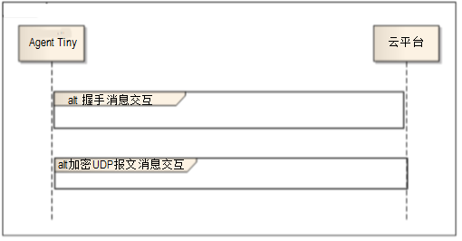

<h3 id="升级.md">升级</h3>

LiteOS SDK端云互通组件支持物联网开放平台的远程固件升级，且具备断点续传、固件包完整性保护等特性。

固件升级功能和流程如图所示：

**图 1**  固件升级功能示意图<a name="fig49571392"></a>  
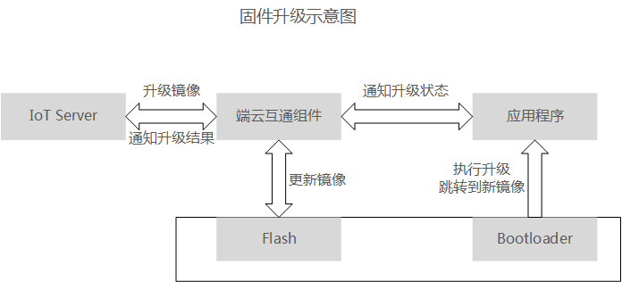

## 设备接入OceanConnect集成开发流程

本章将分别从IoT平台侧和端侧详细地阐述端云互通组件的开发流程，旨在帮助开发者在IoT设备上集成LiteOS SDK端云互通组件，进行IoT应用开发和调测。LiteOS SDK端云互通组件接入华为OceanConnect IoT云平台默认采用的是以太网方式（即以太网口驱动+LwIP网络协议栈+LwM2M协议+LiteOS SDK端云互通组件对接云平台），同时也支持WIFI、GSM、NB-IoT等无线方式。

OceanConnect即华为IoT联接管理平台（IoT Connection Management Platform）是面向运营商和企业/行业领域的统一开放云平台，支持SIM和非SIM场景的各种联接和联接管理。通过开放的APIs，向上集成各种行业应用，向下接入各种传感器、终端和网关，帮助运营商和企业/行业客户实现多种行业终端的快速接入，多种行业应用的快速集成。华为IoT联接管理平台提供安全可控的全联接管理，使能行业革新，构建IoT生态（本章中提到的IoT平台指OceanConnect）。


<h3 id="云侧配置流程.md">云侧配置流程</h3>

<h4 id="环境准备.md">环境准备</h4>

在开发之前，需要提前获取如下信息：

-   开发者Portal的访问地址/账号/密码，需要向OceanConnect IoT平台申请
-   设备对接地址/端口号

<h4 id="创建应用.md">创建应用</h4>

通过创建应用，开发者可以根据自身应用的特征，选择不同的平台服务套件，降低应用开发难度。

1.  登录OceanConnect IoT平台的开发者Portal。开发者Portal的访问地址、账号和密码需要向IoT平台服务商申请。
2.  登录界面会跳出弹框，提示“当前账号没有应用！请先创建应用！”，点击“创建应用”。

    **图 1**  创建应用<a name="fig43098736"></a>  
    

3.  在新弹出窗口中，配置应用信息，点击“确定”。

    配置示例如下图，点击“确定”后，IoT平台会返回应用ID和应用密钥，请妥善保存应用密钥，以便于应用服务器接入平台时使用。如果遗忘密钥，需要通过“对接信息”-\>"重置密钥”进行重置。

    **图 2**  配置应用<a name="fig46257266"></a>  
    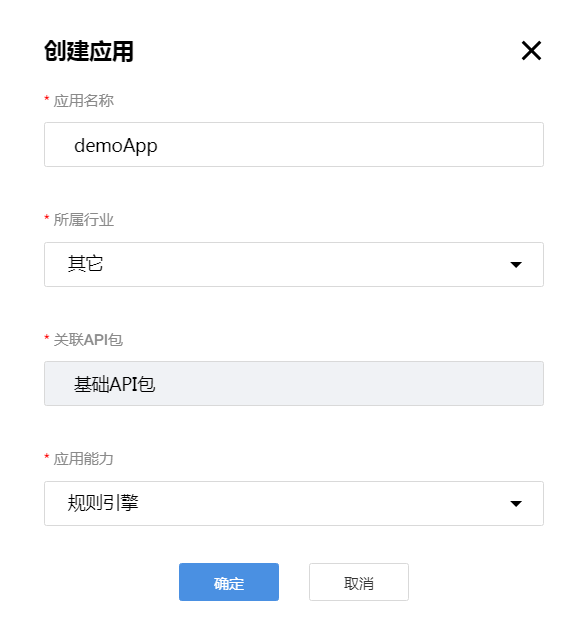

    > **说明：**   
    >如上配置仅为参考举例，具体配置请以现网需求为准。  

    **图 3**  应用创建成功<a name="fig24567157"></a>  
    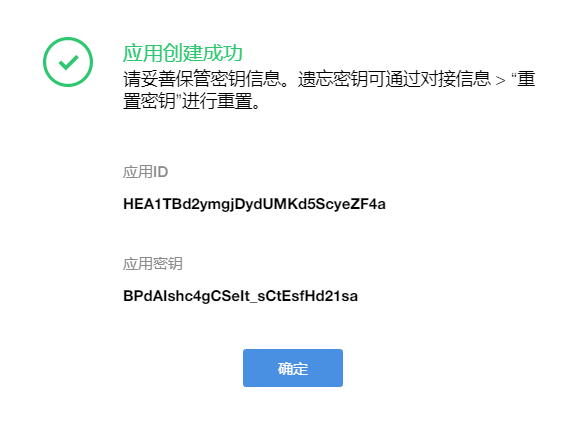


<h4 id="开发Profile文件.md">开发Profile文件</h4>

Profile文件用来描述设备类型和设备服务能力。它定义了设备具备的服务能力，每个服务具备的属性、命令以及命令参数。

1.  登录IoT平台的开发者Portal。开发者Portal的访问地址、账号和密码需要向IoT平台服务商申请。
2.  选择“Profile开发”-\>“Profile在线开发”-\>“自定义产品”，点击右上角“+创建全新产品”。

    IoT平台提供了Profile模板库，开发者可以根据自己需要，选择合适的模板直接使用。如果在模板库中未找到需要的Profile，再自己定义，示例如下。

    **图 1**  创建Profile文件<a name="fig8361117"></a>  
    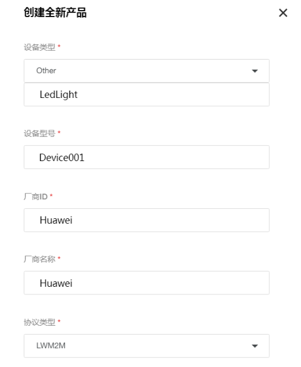

    > **说明：**   
    >如上配置仅为参考举例，具体配置请以现网需求为准。  

3.  选择新创建的Profile文件，点击“新建服务”，配置设备的服务能力。

    可参考“Profile开发”-\>“Profile在线开发”中的“产品模板”进行配置。例如新建一个名为LightControl的服务，包含一种属性light（灯的亮灭状态）和一种命令（设置灯亮on或者灭off）

    **图 2**  新建LightControl服务<a name="fig41058489"></a>  
    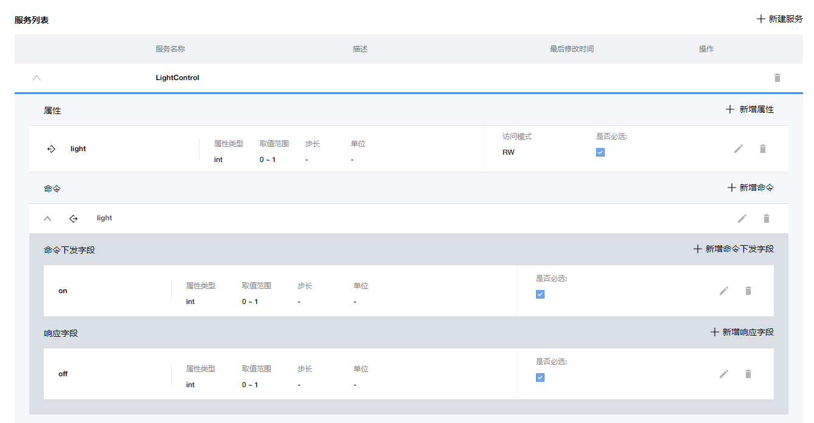

4.  （可选）开发者Portal提供了Profile文件的导出功能。

    选择“Profile开发”-\>“Profile在线开发”-\>新创建的Profile文件，点击右上角“导出该产品Profile”，可以对线上开发的Profile文件进行导出。

    **图 3**  导出Profile文件<a name="fig53067697"></a>  
    


<h4 id="开发编解码插件.md">开发编解码插件</h4>

IoT设备和IoT平台之间采用LwM2M协议通信，LwM2M消息的数据为应用层数据，应用层数据的格式由设备厂商自行定义。由于IoT设备对省电要求较高，所以应用层数据一般采用二进制格式。IoT平台在对应用层数据进行协议解析时，会转换成统一的json格式，以方便应用服务器使用。要实现二进制消息与json格式消息的转换，IoT平台需要使用编解码插件。

1.  选择“插件开发”-\>“插件开发”-\>“开始设计”，点击右上角“+新建插件”。在弹出框中，选择Profile文件。

    IoT平台提供了插件模板库，开发者可以根据自己需要，选择合适的模板直接使用。如果在模板库中未找到需要的插件，再自己定义。

    **图 1**  创建插件<a name="fig27941066"></a>  
    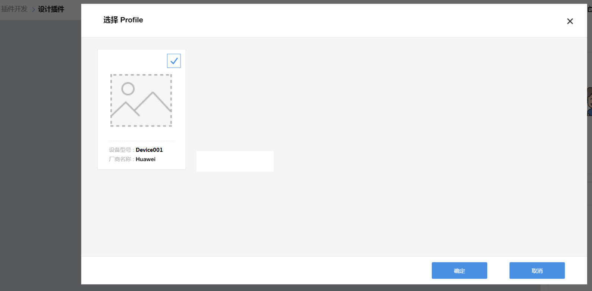

2.  点击“新增消息”，配置二进制码流和Profile属性/命令/命令响应的映射关系。

    可参考“插件开发”-\>“插件开发”-\>“开始设计”中的“新手指导”和“插件模板”进行配置。

    **图 2**  开发插件（新建数据上报消息）<a name="fig51445036"></a>  
    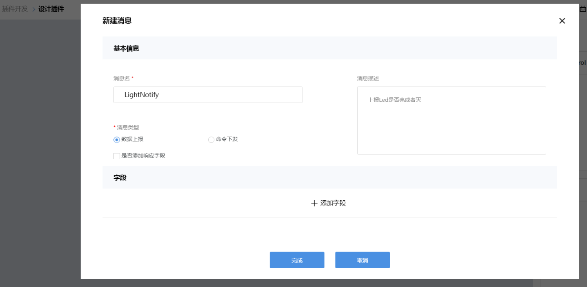

    **图 3**  开发插件（添加字段）<a name="fig40408868"></a>  
    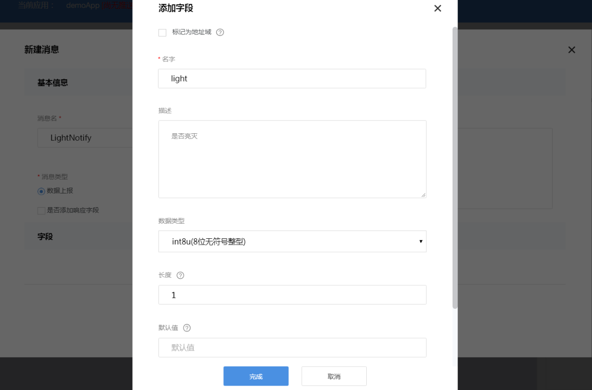

    **图 4**  开发插件（新建命令下发消息）<a name="fig4851111218718"></a>  
    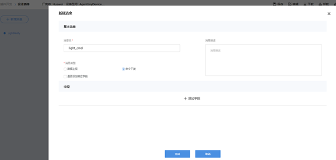

    **图 5**  开发插件（添加字段）<a name="fig12652191383"></a>  
    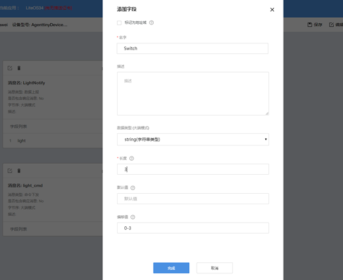

    编解码插件的开发，即定义：

    -   Profile文件定义的属性/响应在设备上报的二进制码流中的位置，以便于平台对设备上报数据和命令响应进行解码。
    -   Profile文件定义的命令在平台下发的二进制码流中的位置，以便于平台对下发命令进行编码。

    **图 6**  二进制码流和Profile文件的映射关系<a name="fig18601706"></a>  
    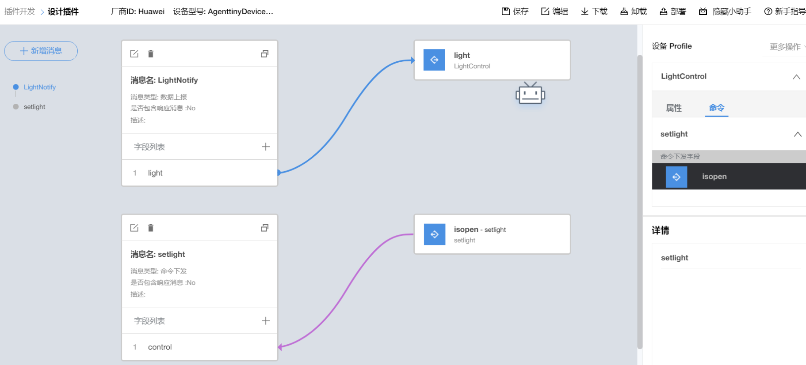

3.  点击右上角“部署”。

    点击部署后，需要先“保存”插件，之后才开始部署。部署需要等待时间小于60s。

    **图 7**  保存插件<a name="fig36784309"></a>  
    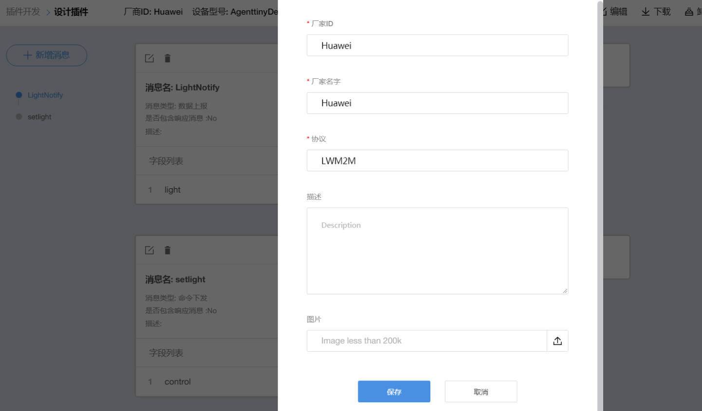

    **图 8**  部署插件<a name="fig18380518"></a>  
    

4.  （可选）开发者Portal提供了编解码插件的下载功能。

    选择“插件开发”-\>“插件开发”-\>新开发的编解码插件，点击右上角“下载”，可以对线上开发的编解码插件进行导出。


<h4 id="注册设备.md">注册设备</h4>

应用服务器需要调用IoT平台的注册设备接口，在IoT平台添加设备。

1.  选择“我的设备”-\>“注册设备”-\>“需要注册设备的Profile”，输入设备名称和验证码（verifyCode），并根据业务需求选择是否加密设备。最后点击“注册”。

    **图 1**  需要注册设备的Profile<a name="fig094004411363"></a>  
    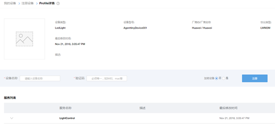

    注册设备后，IoT平台会返回设备ID和PSK码，请妥善保存。新增注册的设备状态为“未绑定（not bound）”。

    **图 2**  注册设备<a name="fig86891238143614"></a>  
    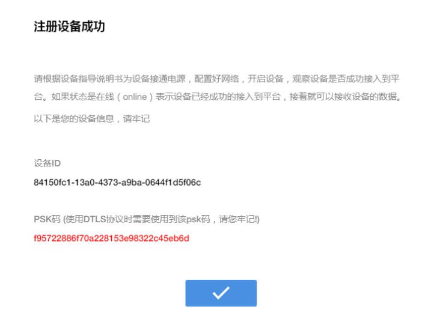


<h3 id="端侧对接流程.md">端侧对接流程</h3>

设备接入IoT平台后，IoT平台才可以对设备进行管理。设备接入平台时，需要保证IoT平台已经有对应应用，并且已经在该应用下注册了此设备。本节介绍端侧设备是如何通过端云互通组件与IoT平台实现对接的。首先给出端侧设备对接IoT平台的整体示意图。

**图 1**  端侧设备对接IoT平台的整体示意图<a name="fig12588104034318"></a>  


本小节将根据上图所示的流程，向开发者介绍终端设备是如何一步步地接入IoT平台，并进行数据上报与命令执行的。


<h4 id="环境准备-0.md">环境准备</h4>

在开发之前，需要提前获取如下信息：

-   Huawei LiteOS及LiteOS SDK源代码。工程整体结构如下。

├── arch         //架构相关文件

│   ├── arm

│   └── msp430

├── build

│   └── Makefile

├── components   //LiteOS各类组件

│   ├── connectivity

│   ├── fs

│   ├── lib

│   ├── log

│   ├── net

│   ├── ota

│   └── security

├── demos      //示例程序

│   ├── agenttiny\_lwm2m     //本章中列出的所有示例程序，均来自该目录下的agent\_tiny\_demo.c文件

│   ├── agenttiny\_mqtt

│   ├── dtls\_server

│   ├── fs

│   ├── kernel

│   └── nbiot\_without\_atiny

├── doc        //说明文档

│   ├── Huawei\_LiteOS\_Developer\_Guide\_en.md

│   ├── Huawei\_LiteOS\_Developer\_Guide\_zh.md

│   ├── Huawei\_LiteOS\_SDK\_Developer\_Guide.md

│   ├── LiteOS\_Code\_Info.md

│   ├── LiteOS\_Commit\_Message.md

│   ├── LiteOS\_Contribute\_Guide\_GitGUI.md

│   ├── LiteOS\_Supported\_board\_list.md

│   └── meta

├── include    //工程需要的头文件

│   ├── at\_device

│   ├── at\_frame

│   ├── atiny\_lwm2m

│   ├── atiny\_mqtt

│   ├── fs

│   ├── log

│   ├── nb\_iot

│   ├── osdepends

│   ├── ota

│   ├── sal

│   └── sota

├── kernel     //系统内核

│   ├── base

│   ├── extended

│   ├── include

│   ├── los\_init.c

│   └── Makefile

├── LICENSE    //许可

├── osdepends  //依赖项

│   └── liteos

├── README.md

├── targets    //BSP工程

│   ├── Cloud\_STM32F429IGTx\_FIRE

│   ├── Mini\_Project

│   ├── NXP\_LPC51U68

│   └── STM32F103VET6\_NB\_GCC

└── tests      //测试用例

├── cmockery

├── test\_agenttiny

├── test\_main.c

├── test\_sota

└── test\_suit

源代码托管在GitHub，地址为[https://github.com/LiteOS/LiteOS](https://github.com/LiteOS/LiteOS)。

-   集成开发工具:
    -   MDK 5.18版本或者以上版本，从MDK官方网站下载。
    -   MDK依赖的pack包

        > **说明：**   
        >MDK工具需要license，请从MDK官方获取。  


<h4 id="LiteOS-SDK端云互通组件入口函数.md">LiteOS SDK端云互通组件入口函数</h4>

使用LiteOS SDK端云互通组件agent tiny对接IoT平台，首先需要一个入口函数agent\_tiny\_entry\(\)。

<a name="table186359114013"></a>
<table><thead align="left"></thead>
<tbody><tr id="row13101182117403"><td class="cellrowborder" valign="top" width="50%"><p id="p11103421174019"><a name="p11103421174019"></a><a name="p11103421174019"></a>接口名</p>
</td>
<td class="cellrowborder" valign="top" width="50%"><p id="p10103152113406"><a name="p10103152113406"></a><a name="p10103152113406"></a>描述</p>
</td>
</tr>
<tr id="row178969194010"><td class="cellrowborder" valign="top" width="50%"><p id="p8893910400"><a name="p8893910400"></a><a name="p8893910400"></a>void agent_tiny_entry(void)</p>
</td>
<td class="cellrowborder" valign="top" width="50%"><p id="p168919124013"><a name="p168919124013"></a><a name="p168919124013"></a>LiteOS SDK端云互通组件的入口函数。该接口将进行agent tiny的初始化相关操作，创建上报任务，并调用agent tiny主函数体。</p>
<p id="p68912934012"><a name="p68912934012"></a><a name="p68912934012"></a>参数列表：空</p>
<p id="p98916916402"><a name="p98916916402"></a><a name="p98916916402"></a>返回值：空</p>
</td>
</tr>
</tbody>
</table>

开发者可以通过LiteOS内核提供的任务机制，创建一个主任务main\_task。在主任务中调用入口函数agent\_tiny\_entry\(\)，开启agent tiny工作流程。

```
    UINT32 creat_main_task()
     {
         UINT32 uwRet = LOS_OK;
         TSK_INIT_PARAM_S task_init_param;
         task_init_param.usTaskPrio = 0;
         task_init_param.pcName = "main_task";
         task_init_param.pfnTaskEntry = (TSK_ENTRY_FUNC)main_task;
         task_init_param.uwStackSize = 0x1000;
         uwRet = LOS_TaskCreate(&g_TskHandle, &task_init_param);
         if(LOS_OK != uwRet)
         {
             return uwRet;
         }
         return uwRet;
     }
```

<h4 id="LiteOS-SDK端云互通组件初始化.md">LiteOS SDK端云互通组件初始化</h4>

在入口函数中，需要调用atiny\_init\(\)进行agent tiny的初始化相关操作。

<a name="table12513914425"></a>
<table><tbody><tr id="row54671939144216"><td class="cellrowborder" valign="top" width="50%"><p id="p24671139134220"><a name="p24671139134220"></a><a name="p24671139134220"></a>接口名</p>
</td>
<td class="cellrowborder" valign="top" width="50%"><p id="p1146717395425"><a name="p1146717395425"></a><a name="p1146717395425"></a>描述</p>
</td>
</tr>
<tr id="row746710393424"><td class="cellrowborder" valign="top" width="50%"><p id="p346743913420"><a name="p346743913420"></a><a name="p346743913420"></a>int atiny_init(atiny_param_t* atiny_params, void** phandle)</p>
</td>
<td class="cellrowborder" valign="top" width="50%"><p id="p1546733924211"><a name="p1546733924211"></a><a name="p1546733924211"></a>LiteOS SDK端云互通组件的初始化接口，由LiteOS SDK端云互通组件实现，设备调用。</p>
<p id="p84675395428"><a name="p84675395428"></a><a name="p84675395428"></a>参数列表：参数atiny_params为入参，包含初始化操作所需的各个变量，具体请参考服务器参数结构体atiny_param_t；参数phandle为出参，表示当前创建的agent tiny的句柄。</p>
<p id="p114671839194218"><a name="p114671839194218"></a><a name="p114671839194218"></a>返回值：整形变量，标识初始化成功或失败的状态。</p>
</td>
</tr>
</tbody>
</table>

对于入参atiny\_params的设定，要根据具体的业务来进行。开发者可以参考下面的代码。

```
#ifdef CONFIG_FEATURE_FOTA
     hal_init_ota();   //若定义FOTA功能，则需进行FOTA相关初始化
 #endif

 #ifdef WITH_DTLS
     device_info->endpoint_name = g_endpoint_name_s;  //加密设备验证码
 #else
     device_info->endpoint_name = g_endpoint_name;    //非加密设备验证码
 #endif
 #ifdef CONFIG_FEATURE_FOTA
     device_info->manufacturer = "Lwm2mFota";    //设备厂商
     device_info->dev_type = "Lwm2mFota";        //设备类型
 #else
     device_info->manufacturer = "Agent_Tiny";   
 #endif
     atiny_params = &g_atiny_params;
     atiny_params->server_params.binding = "UQ";   //绑定方式
     atiny_params->server_params.life_time = 20;   //生命周期
     atiny_params->server_params.storing_cnt = 0;  //缓存数据报文个数

     atiny_params->server_params.bootstrap_mode = BOOTSTRAP_FACTORY;   //引导模式
     atiny_params->server_params.hold_off_time = 10;    //等待时延

     //pay attention: index 0 for iot server, index 1 for bootstrap server.
     iot_security_param = &(atiny_params->security_params[0]);
     bs_security_param = &(atiny_params->security_params[1]);

     iot_security_param->server_ip = DEFAULT_SERVER_IPV4;  //服务器地址
     bs_security_param->server_ip = DEFAULT_SERVER_IPV4;

 #ifdef WITH_DTLS
     iot_security_param->server_port = "5684";   //加密设备端口号
     bs_security_param->server_port = "5684";

     iot_security_param->psk_Id = g_endpoint_name_iots;         //加密设备验证码
     iot_security_param->psk = (char *)g_psk_iot_value;         //PSK码
     iot_security_param->psk_len = sizeof(g_psk_iot_value);     //PSK码长度

     bs_security_param->psk_Id = g_endpoint_name_bs;
     bs_security_param->psk = (char *)g_psk_bs_value;
     bs_security_param->psk_len = sizeof(g_psk_bs_value);
 #else
     iot_security_param->server_port = "5683";    //非加密设备端口号
     bs_security_param->server_port = "5683";

     iot_security_param->psk_Id = NULL;    //非加密设备，无需PSK相关参数设置
     iot_security_param->psk = NULL;
     iot_security_param->psk_len = 0;

     bs_security_param->psk_Id = NULL;
     bs_security_param->psk = NULL;
     bs_security_param->psk_len = 0;
 #endif
```

设定好atiny\_params后，即可根据设定的参数对agent tiny进行初始化。

```
   if(ATINY_OK != atiny_init(atiny_params, &g_phandle))
    {
        return;
    }
```

对于初始化接口atiny\_init\(\)内部，主要进行入参合法性的检验，agent tiny所需资源的创建等工作，一般不需要开发者进行修改。

<h4 id="创建数据上报任务.md">创建数据上报任务</h4>

在完成agent tiny的初始化后，需要通过调用creat\_report\_task\(\)创建一个数据上报的任务app\_data\_report\(\)。

```
    UINT32 creat_report_task()
     {
         UINT32 uwRet = LOS_OK;
         TSK_INIT_PARAM_S task_init_param;
         UINT32 TskHandle;
         task_init_param.usTaskPrio = 1;
         task_init_param.pcName = "app_data_report";
         task_init_param.pfnTaskEntry = (TSK_ENTRY_FUNC)app_data_report;
         task_init_param.uwStackSize = 0x400;
         uwRet = LOS_TaskCreate(&TskHandle, &task_init_param);
         if(LOS_OK != uwRet)
         {
             return uwRet;
         }
         return uwRet;
     }
```

在app\_data\_report\(\)中应该完成对数据上报数据结构data\_report\_t的赋值，包括数据缓冲区地址buf，收到平台ack响应后的回调函数callback，数据cookie，数据长度len，以及数据上报类型type（在这里固定为APP\_DATA）。

```
    uint8_t buf[5] = {0, 1, 6, 5, 9};
     data_report_t report_data;
     int ret = 0;
     int cnt = 0;
     report_data.buf = buf;
     report_data.callback = ack_callback;
     report_data.cookie = 0;
     report_data.len = sizeof(buf);
     report_data.type = APP_DATA;
```

完成对report\_data的赋值后，即可通过接口atiny\_data\_report\(\)上报数据。

<a name="table16535236194717"></a>
<table><tbody><tr id="row1360513361470"><td class="cellrowborder" valign="top" width="50%"><p id="p10605336104711"><a name="p10605336104711"></a><a name="p10605336104711"></a>接口名</p>
</td>
<td class="cellrowborder" valign="top" width="50%"><p id="p18605193612477"><a name="p18605193612477"></a><a name="p18605193612477"></a>描述</p>
</td>
</tr>
<tr id="row760517361471"><td class="cellrowborder" valign="top" width="50%"><p id="p76051036204713"><a name="p76051036204713"></a><a name="p76051036204713"></a>int atiny_data_report(void* phandle, data_report_t* report_data)</p>
</td>
<td class="cellrowborder" valign="top" width="50%"><p id="p3605163624716"><a name="p3605163624716"></a><a name="p3605163624716"></a>LiteOS SDK端云互通组件数据上报接口，由LiteOS SDK端云互通组件实现，设备调用，设备应用数据使用该接口上报。该接口为阻塞接口，不允许在中断中使用。</p>
<p id="p20605736184712"><a name="p20605736184712"></a><a name="p20605736184712"></a>参数列表：参数phandle为调用初始化接口atiny_init()得到的agent tiny的句柄；参数report_data为数据上报数据结构。</p>
<p id="p176051836154711"><a name="p176051836154711"></a><a name="p176051836154711"></a>返回值：整形变量，标识数据上报成功或失败的状态。</p>
</td>
</tr>
</tbody>
</table>

示例代码中的上报任务实现方法如下。

```
    while(1)
     {
         report_data.cookie = cnt;
         cnt++;
         ret = atiny_data_report(g_phandle, &report_data);   //数据上报接口
         ATINY_LOG(LOG_DEBUG, "data report ret: %d\n", ret);
         (void)LOS_TaskDelay(250 * 8);
     }
```

<h3 id="LiteOS-SDK端云互通组件命令处理接口.md">LiteOS SDK端云互通组件命令处理接口</h3>

IoT平台下发的各类命令，都通过接口atiny\_cmd\_ioctl\(\)来具体执行。

<a name="table153881641135515"></a>
<table><tbody><tr id="row1857454165517"><td class="cellrowborder" valign="top" width="50%"><p id="p205744414557"><a name="p205744414557"></a><a name="p205744414557"></a>接口名</p>
</td>
<td class="cellrowborder" valign="top" width="50%"><p id="p13574164155517"><a name="p13574164155517"></a><a name="p13574164155517"></a>描述</p>
</td>
</tr>
<tr id="row25741641175511"><td class="cellrowborder" valign="top" width="50%"><p id="p957494116555"><a name="p957494116555"></a><a name="p957494116555"></a>int atiny_cmd_ioctl (atiny_cmd_e cmd, char* arg, int len);</p>
</td>
<td class="cellrowborder" valign="top" width="50%"><p id="p1657464185514"><a name="p1657464185514"></a><a name="p1657464185514"></a>LiteOS SDK端云互通组件申明和调用，由开发者实现。该接口是LwM2M标准对象向设备下发命令的统一入口。</p>
<p id="p4574441115511"><a name="p4574441115511"></a><a name="p4574441115511"></a>参数列表：参数cmd为具体命令字，比如下发业务数据，下发复位，升级命令等；参数arg为存放命令参数的缓存；参数len为缓存大小。</p>
<p id="p057444115556"><a name="p057444115556"></a><a name="p057444115556"></a>返回值：空。</p>
</td>
</tr>
</tbody>
</table>

atiny\_cmd\_ioctl\(\)是LiteOS SDK端云互通组件定义的一个通用可扩展的接口，其命令字如atiny\_cmd\_e所定义，用户根据自身需求进行选择性实现，也可以根据自身需求进行扩展。常用的接口定义如下表所示，每一个接口都和atiny\_cmd\_e的枚举值一一对应：

<a name="table1414144113558"></a>
<table><tbody><tr id="row05747414553"><td class="cellrowborder" valign="top" width="42.05%"><p id="p857404119558"><a name="p857404119558"></a><a name="p857404119558"></a>回调接口函数</p>
</td>
<td class="cellrowborder" valign="top" width="57.95%"><p id="p1257434195516"><a name="p1257434195516"></a><a name="p1257434195516"></a>描述</p>
</td>
</tr>
<tr id="row155741041155518"><td class="cellrowborder" valign="top" width="42.05%"><p id="p10574174111552"><a name="p10574174111552"></a><a name="p10574174111552"></a>int atiny_get_manufacturer(char* manufacturer,int len)</p>
</td>
<td class="cellrowborder" valign="top" width="57.95%"><p id="p2057424145514"><a name="p2057424145514"></a><a name="p2057424145514"></a>获取厂商名字，参数manufacturer指向的内存由LiteOS SDK端云互通组件分配，户填充自身的厂商名字，长度不能超过参数len。</p>
</td>
</tr>
<tr id="row1657416410554"><td class="cellrowborder" valign="top" width="42.05%"><p id="p10574841125515"><a name="p10574841125515"></a><a name="p10574841125515"></a>int atiny_get_dev_type(char * dev_type,int len)</p>
</td>
<td class="cellrowborder" valign="top" width="57.95%"><p id="p19574134119556"><a name="p19574134119556"></a><a name="p19574134119556"></a>获取设备类型，参数dev_type指向的内存由LiteOS SDK端云互通组件分配，户填充自身的设备类型，长度不能超过参数len。</p>
</td>
</tr>
<tr id="row1057484165520"><td class="cellrowborder" valign="top" width="42.05%"><p id="p3574154119553"><a name="p3574154119553"></a><a name="p3574154119553"></a>int atiny_get_model_number((char * model_numer, int len)</p>
</td>
<td class="cellrowborder" valign="top" width="57.95%"><p id="p1357424118552"><a name="p1357424118552"></a><a name="p1357424118552"></a>获取设备模型号，参数model_numer指向的内存由LiteOS SDK端云互通组件分配，户填充自身的设备模型号，长度不能超过参数len。</p>
</td>
</tr>
<tr id="row1857484125519"><td class="cellrowborder" valign="top" width="42.05%"><p id="p19574941115512"><a name="p19574941115512"></a><a name="p19574941115512"></a>int atiny_get_serial_number(char* num,int len)</p>
</td>
<td class="cellrowborder" valign="top" width="57.95%"><p id="p6574441115513"><a name="p6574441115513"></a><a name="p6574441115513"></a>获取设备序列号，参数numer指向的内存由LiteOS SDK端云互通组件分配，户填充自身的设备序列号，长度不能超过参数len。</p>
</td>
</tr>
<tr id="row1757414105510"><td class="cellrowborder" valign="top" width="42.05%"><p id="p1157474115554"><a name="p1157474115554"></a><a name="p1157474115554"></a>int atiny_get_dev_err(int* arg，int len)</p>
</td>
<td class="cellrowborder" valign="top" width="57.95%"><p id="p1457494112559"><a name="p1457494112559"></a><a name="p1457494112559"></a>获取设备状态，比如内存耗尽、电池不足、信号强度低等，参数arg由LiteOS SDK端云互通组件分配，用户填充，长度不能超过len。</p>
</td>
</tr>
<tr id="row1757424113552"><td class="cellrowborder" valign="top" width="42.05%"><p id="p165749412555"><a name="p165749412555"></a><a name="p165749412555"></a>int atiny_do_dev_reboot(void)</p>
</td>
<td class="cellrowborder" valign="top" width="57.95%"><p id="p757416419553"><a name="p757416419553"></a><a name="p757416419553"></a>设备复位。</p>
</td>
</tr>
<tr id="row1957424135517"><td class="cellrowborder" valign="top" width="42.05%"><p id="p175744417553"><a name="p175744417553"></a><a name="p175744417553"></a>int atiny_do_factory_reset(void)</p>
</td>
<td class="cellrowborder" valign="top" width="57.95%"><p id="p5574141135510"><a name="p5574141135510"></a><a name="p5574141135510"></a>厂商复位。</p>
</td>
</tr>
<tr id="row18574194117558"><td class="cellrowborder" valign="top" width="42.05%"><p id="p5574141125515"><a name="p5574141125515"></a><a name="p5574141125515"></a>int atiny_get_baterry_level(int* voltage)</p>
</td>
<td class="cellrowborder" valign="top" width="57.95%"><p id="p10574184135517"><a name="p10574184135517"></a><a name="p10574184135517"></a>获取电池剩余电量。</p>
</td>
</tr>
<tr id="row957454185513"><td class="cellrowborder" valign="top" width="42.05%"><p id="p457494117559"><a name="p457494117559"></a><a name="p457494117559"></a>int atiny_get_memory_free(int* size)</p>
</td>
<td class="cellrowborder" valign="top" width="57.95%"><p id="p1557413419556"><a name="p1557413419556"></a><a name="p1557413419556"></a>获取空闲内存大小。</p>
</td>
</tr>
<tr id="row18574341195511"><td class="cellrowborder" valign="top" width="42.05%"><p id="p1057454120553"><a name="p1057454120553"></a><a name="p1057454120553"></a>int atiny_get_total_memory(int* size)</p>
</td>
<td class="cellrowborder" valign="top" width="57.95%"><p id="p125741141195515"><a name="p125741141195515"></a><a name="p125741141195515"></a>获取总共内存大小。</p>
</td>
</tr>
<tr id="row1157484195513"><td class="cellrowborder" valign="top" width="42.05%"><p id="p557417412552"><a name="p557417412552"></a><a name="p557417412552"></a>int atiny_get_signal_strength(int* singal_strength)</p>
</td>
<td class="cellrowborder" valign="top" width="57.95%"><p id="p185741241145514"><a name="p185741241145514"></a><a name="p185741241145514"></a>获取信号强度。</p>
</td>
</tr>
<tr id="row257412418557"><td class="cellrowborder" valign="top" width="42.05%"><p id="p8574154195510"><a name="p8574154195510"></a><a name="p8574154195510"></a>int atiny_get_cell_id(long* cell_id)</p>
</td>
<td class="cellrowborder" valign="top" width="57.95%"><p id="p145741541175516"><a name="p145741541175516"></a><a name="p145741541175516"></a>获取小区ID。</p>
</td>
</tr>
<tr id="row145741241185517"><td class="cellrowborder" valign="top" width="42.05%"><p id="p5574104195510"><a name="p5574104195510"></a><a name="p5574104195510"></a>int atiny_get_link_quality(int* quality)</p>
</td>
<td class="cellrowborder" valign="top" width="57.95%"><p id="p45741541165518"><a name="p45741541165518"></a><a name="p45741541165518"></a>获取信道质量。</p>
</td>
</tr>
<tr id="row457474111554"><td class="cellrowborder" valign="top" width="42.05%"><p id="p16574174145511"><a name="p16574174145511"></a><a name="p16574174145511"></a>int atiny_write_app_write(void* user_data, int len)</p>
</td>
<td class="cellrowborder" valign="top" width="57.95%"><p id="p1757414115550"><a name="p1757414115550"></a><a name="p1757414115550"></a>业务数据下发。</p>
</td>
</tr>
<tr id="row9574144110552"><td class="cellrowborder" valign="top" width="42.05%"><p id="p1257410416553"><a name="p1257410416553"></a><a name="p1257410416553"></a>int atiny_update_psk(char* psk_id, int len)</p>
</td>
<td class="cellrowborder" valign="top" width="57.95%"><p id="p1157494113556"><a name="p1157494113556"></a><a name="p1157494113556"></a>预置共享密钥更新。</p>
</td>
</tr>
</tbody>
</table>

其中，开发者需要根据自身的业务，在接口atiny\_write\_app\_write\(\)中实现自己的命令响应。

```
    int atiny_write_app_write(void* user_data, int len)
     {
         (void)atiny_printf("write num19 object success\r\n");
         return ATINY_OK;
     }
```

<h3 id="LiteOS-SDK端云互通组件主函数体.md">LiteOS SDK端云互通组件主函数体</h3>

完成了数据上报任务的创建与命令处理接口的实现，agent tiny进入到对接IoT平台的核心步骤atiny\_bind\(\)。

<a name="table451118281586"></a>
<table><tbody><tr id="row13711192810588"><td class="cellrowborder" valign="top" width="35.589999999999996%"><p id="p197117285583"><a name="p197117285583"></a><a name="p197117285583"></a>接口名</p>
</td>
<td class="cellrowborder" valign="top" width="64.41%"><p id="p1171110281588"><a name="p1171110281588"></a><a name="p1171110281588"></a>描述</p>
</td>
</tr>
<tr id="row771112845813"><td class="cellrowborder" valign="top" width="35.589999999999996%"><p id="p171172815816"><a name="p171172815816"></a><a name="p171172815816"></a>int atiny_bind(atiny_device_info_t* device_info, void* phandle)</p>
</td>
<td class="cellrowborder" valign="top" width="64.41%"><p id="p10711228195816"><a name="p10711228195816"></a><a name="p10711228195816"></a>LiteOS SDK端云互通组件的主函数体，由LiteOS SDK端云互通组件实现，设备调用，调用成功后，不会返回。该接口是LiteOS SDK端云互通组件主循环体，实现了LwM2M协议处理，注册状态机，重传队列，订阅上报。</p>
<p id="p97111128145813"><a name="p97111128145813"></a><a name="p97111128145813"></a>参数列表：参数device_info为终端设备参数结构体；参数phandle为调用初始化接口atiny_init()得到的agent tiny的句柄。</p>
<p id="p67119282585"><a name="p67119282585"></a><a name="p67119282585"></a>返回值：整形变量，标识LiteOS SDK端云互通组件主函数体执行的状态。只有执行失败或者调用了LiteOS SDK端云互通组件去初始化接口atiny_deinit()才会返回。</p>
</td>
</tr>
</tbody>
</table>

atiny\_bind\(\)会根据LwM2M协议标准，进行LwM2M客户端创建与注册，并将数据上报任务app\_data\_report\(\)中上报的数据递交给通信模块发送到IoT平台，同时接受IoT平台下发的命令消息，解析后由命令处理接口atiny\_cmd\_ioctl\(\)统一进行处理。与atiny\_init\(\)一样，atiny\_bind\(\)内部一般不需要开发者进行修改。

说明：关于LwM2M协议相关内容，请开发者参考附录。

LiteOS SDK端云互通组件通过主函数体，不断地进行数据上报与命令处理。当调用LiteOS SDK端云互通组件去初始化接口atiny\_deinit\(\)时，退出主函数体。

<a name="table957692845818"></a>
<table><tbody><tr id="row271262875811"><td class="cellrowborder" valign="top" width="34.9%"><p id="p117121285589"><a name="p117121285589"></a><a name="p117121285589"></a>接口名</p>
</td>
<td class="cellrowborder" valign="top" width="65.10000000000001%"><p id="p20712122812583"><a name="p20712122812583"></a><a name="p20712122812583"></a>描述</p>
</td>
</tr>
<tr id="row1671262812589"><td class="cellrowborder" valign="top" width="34.9%"><p id="p16712228165813"><a name="p16712228165813"></a><a name="p16712228165813"></a>void atiny_deinit(void* phandle);</p>
</td>
<td class="cellrowborder" valign="top" width="65.10000000000001%"><p id="p1271232820588"><a name="p1271232820588"></a><a name="p1271232820588"></a>LiteOS SDK端云互通组件的去初始化接口，由LiteOS SDK端云互通组件实现，设备调用。该接口为阻塞式接口，调用该接口时，会直到agent tiny主任务退出，资源释放完毕，该接口才会退出。</p>
<p id="p197121828175816"><a name="p197121828175816"></a><a name="p197121828175816"></a>参数列表：参数phandle为调用atiny_init()获取到的LiteOS SDK端云互通组件句柄。</p>
<p id="p1671212288581"><a name="p1671212288581"></a><a name="p1671212288581"></a>返回值：空</p>
</td>
</tr>
</tbody>
</table>

<h3 id="数据结构介绍.md">数据结构介绍</h3>

-   平台下发命令枚举类型

```
 typedef enum  
 {  
     ATINY_GET_MANUFACTURER,         /*获取厂商名字*/
     ATINY_GET_MODEL_NUMBER,         /*获取设备模型，由厂商定义和使用*/
     ATINY_GET_SERIAL_NUMBER,        /*获取设备序列号*/
     ATINY_GET_FIRMWARE_VER,         /*获取固件版本号*/
     ATINY_DO_DEV_REBOOT,            /*下发设备复位命令*/ 
     ATINY_DO_FACTORY_RESET,         /*厂商复位*/
     ATINY_GET_POWER_SOURCE,         /*获取电源*/
     ATINY_GET_SOURCE_VOLTAGE,       /*获取设备电压*/
     ATINY_GET_POWER_CURRENT,        /*获取设备电流*/
     ATINY_GET_BATERRY_LEVEL,        /*获取电池剩余电量*/
     ATINY_GET_MEMORY_FREE,          /*获取空闲内存*/
     ATINY_GET_DEV_ERR,              /*获取设备状态，比如内存耗尽、电池不足等*/
     ATINY_DO_RESET_DEV_ERR,         /*获取设备复位状态*/
     ATINY_GET_CURRENT_TIME,         /*获取当前时间*/
     ATINY_SET_CURRENT_TIME,         /*设置当前时间*/
     ATINY_GET_UTC_OFFSET,           /*获取UTC时差*/
     ATINY_SET_UTC_OFFSET,           /*设置UTC时差*/
     ATINY_GET_TIMEZONE,             /*获取时区*/
     ATINY_SET_TIMEZONE,             /*设置时区*/
     ATINY_GET_BINDING_MODES,        /*获取绑定模式*/
     ATINY_GET_FIRMWARE_STATE,       /*获取固件升级状态*/
     ATINY_GET_NETWORK_BEARER,       /*获取网络通信承载类型，比如GSM、WCDMA等*/
     ATINY_GET_SIGNAL_STRENGTH,      /*获取网络信号强度*/
     ATINY_GET_CELL_ID,              /*获取网络小区ID*/
     ATINY_GET_LINK_QUALITY,         /*获取网络链路质量*/ 
     ATINY_GET_LINK_UTILIZATION,     /*获取网络链路利用率*/
     ATINY_WRITE_APP_DATA,           /*业务数据下发命令字*/
     ATINY_UPDATE_PSK,               /*更新psk命令字*/
     ATINY_GET_LATITUDE,             /*获取设备所处纬度*/
     ATINY_GET_LONGITUDE,            /*获取设备所处经度*/
     ATINY_GET_ALTITUDE,             /*获取设备所处高度*/
     ATINY_GET_SPEED,                /*获取设备运行速度*/
     ATINY_GET_TIMESTAMP,            /*获取时间戳*/
 } atiny_cmd_e;
```

-   关键事件枚举类型

该枚举类型用于LiteOS SDK端云互通组件把自身状态通知用户

```
typedef enum  
 {  
     ATINY_REG_OK,              /*设备注册成功*/ 
     ATINY_REG_FAIL,            /*设备注册失败*/ 
     ATINY_DATA_SUBSCRIBLE,     /*数据开始订阅，设备侧允许上报数据 */ 
     ATINY_DATA_UNSUBSCRIBLE,   /*数据取消订阅，设备侧停止上报数据*/ 
     ATINY_FOTA_STATE           /*固件升级状态*/
 } atiny_event_e;
```

-   LwM2M协议参数结构体

```
typedef struct  
 {  
     char* binding;                             /*目前支持U或者UQ*/
     int   life_time;                           /*LwM2M协议生命周期，默认50000*/
     unsigned int  storing_cnt;                 /*LwM2M缓存区总字节个数*/
 } atiny_server_param_t;
```

-   安全及服务器参数结构体

```
typedef struct  
 {  
     bool  is_bootstrap;      /*是否bootstrap服务器*/ 
     char* server_ip;         /*服务器ip，字符串表示，支持ipv4和ipv6*/ 
     char* server_port;       /*服务器端口号*/ 
     char* psk_Id;            /*预置共享密钥ID*/ 
     char* psk;               /*预置共享密钥*/ 
     unsigned short psk_len;  /*预置共享密钥长度*/ 
 } atiny_security_param_t;
```

-   上报数据的枚举类型

用户上报数据的数据类型，用户根据自身应用扩展

```
typedef enum  
 {  
     FIRMWARE_UPDATE_STATE = 0，  /*设备固件升级状态*/ 
     APP_DATA                     /*用户数据*/ 
 } atiny_report_type_e;
```

-   服务器参数结构体

```
typedef struct  
 {  
     atiny_server_param_t   server_params;  
     atiny_security_param_t security_params[2];  /*支持一个IOT服务器，一个bootstrap服务器*/ 
 } atiny_param_t;
```

-   终端设备参数结构体

```
typedef struct  
 {  
     char* endpoint_name;    /*北向申请产生的设备标识码*/ 
     char* manufacturer;     /*北向申请产生的厂商名称*/
     char* dev_type;         /*北向申请产生的设备类型*/
 } atiny_device_info_t;
```

-   数据上报数据结构

以下枚举值，表述了用户上报的数据，最终的反馈类型，比如数据发送成功，数据发送但未得到确认，具体定义如下：

```
typedef enum  
 {  
     NOT_SENT = 0,        /*待上报的数据未发送*/ 
     SENT_WAIT_RESPONSE,  /*待上报的数据已发送，等待响应*/ 
     SENT_FAIL,           /*待上报的数据发送失败*/ 
     SENT_TIME_OUT,       /*待上报的数据已发送，等待响应超时*/ 
     SENT_SUCCESS,        /*待上报的数据发送成功*/ 
     SENT_GET_RST,        /*待上报的数据已发送，但对端响应RST报文*/ 
     SEND_PENDING,        /*待上报的数据等待发送*/ 
 } data_send_status_e;  
```

//用户使用以下数据结构上报数据：

```
  typedef struct _data_report_t  
 {  
     atiny_report_type_e type;    /*数据上报类型，比如业务数据，电池剩余电量等 */  
     int cookie;                  /*数据cookie,用以在ack回调中，区分不同的数据*/  
     int len;                     /*数据长度，不应大于MAX_REPORT_DATA_LEN*/  
     uint8_t* buf;                /*数据缓冲区首地址*/  
     atiny_ack_callback callback; /*ack回调，其入参取值data_send_status_e类型 */  
 } data_report_t;
```

<h3 id="小结.md">小结</h3>

本章从终端设备对接IoT平台的具体流程出发，分别从云侧和端侧详细地阐述了端云互通组件的开发流程。在云侧，本章介绍了创建应用，制作profile，部署编解码插件，注册设备的具体步骤；在端侧，本章从LiteOS SDK端云互通组件的入口函数开始介绍，开发者只需要根据自己的具体业务，实现数据上报任务与命令响应接口，通过LiteOS SDK端云互通组件提供的接口，可以很容易地对接到IoT平台：

```
    if(ATINY_OK != atiny_init(atiny_params, &g_phandle))  //初始化
     {
         return;
     }
     uwRet = creat_report_task();   //创建数据上报任务
     if(LOS_OK != uwRet)
     {
         return;
     }
     (void)atiny_bind(device_info, g_phandle);   //主函数体
```

通过本章的内容，希望开发者能够掌握LiteOS SDK端云互通组件开发流程，进行IoT应用开发和调测。

## LiteOS端云互通组件实战演练

LiteOS SDK端云互通组件接入华为OceanConnect IoT云平台既可以通过以太网方式，同时也支持WIFI、GSM、NB-IoT等无线方式。对于这两种不同的方式，本章将通过具体的实例，指导开发者针对自身的开发环境，对LiteOS SDK端云互通组件进行配置，并最终对接IoT平台。对于其中涉及的AT框架相关概念，本章中也会进行简单的介绍。


<h3 id="开发环境准备.md">开发环境准备</h3>

-   LiteOS SDK端云互通组件代码：

```
获取地址：https://github.com/LiteOS/LiteOS.git
```

-   硬件设备：野火STM32F429开发板，调试下载器（J-Link、ST-Link等）、网线、路由器。

> **说明：**   
>本章以野火STM32F429IG开发板为例进行介绍，板子的详细资料可以从[http://www.firebbs.cn/forum.php](http://www.firebbs.cn/forum.php)下载。  

1.  STM32F429IG\_FIRE开发板外设

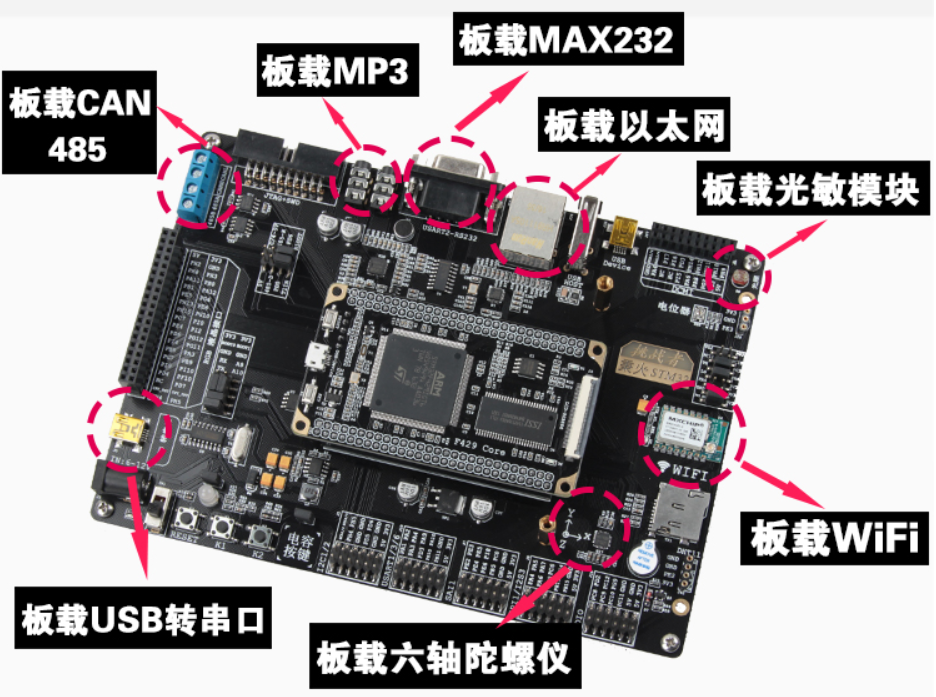

<h2 id="（参考）端云互通组件以太网接入实例.md">（参考）端云互通组件以太网接入实例</h2>

<h3 id="接入IoT平台.md">接入IoT平台</h3>

1.  开发板的网口通过网线连接到路由器。
2.  设置本地IP。

    在sys\_init.c中修改device接入的局域网的IP地址值。目前demo程序采用的是静态IP地址的方式，如果需要使用DHCP方式，请在main.c中顶部头文件包含之后定义USE\_DHCP宏即可。

    ```
    void net_init(void) 
    
     {
         /* IP addresses initialization */ 
         IP_ADDRESS[0] = 192; 
         IP_ADDRESS[1] = 168; 
         IP_ADDRESS[2] = 0; 
         IP_ADDRESS[3] = 115; 
         NETMASK_ADDRESS[0] = 255; 
         NETMASK_ADDRESS[1] = 255; 
         NETMASK_ADDRESS[2] = 255; 
         NETMASK_ADDRESS[3] = 0; 
         GATEWAY_ADDRESS[0] = 192; 
         GATEWAY_ADDRESS[1] = 168; 
         GATEWAY_ADDRESS[2] = 0; 
         GATEWAY_ADDRESS[3] = 1;
     }
    ```

    接口net\_init\(\)的调用在agent tiny入口函数agent\_tiny\_entry\(\)之前，作用是完成lwip协议相关的初始化。

    sys\_init.c位于 LiteOS/targets/Cloud\_STM32F429IGTx\_FIRE/Src。

3.  网口的mac地址修改。

    在eth.c中将MAC\_ADDR0\~MAC\_ADDR5修改成真实的mac地址值保证不重复。

    ```
    static int8_t eth_init(struct netif* netif) 
    
     {
         HAL_StatusTypeDef hal_eth_init_status; 
         MACAddr[0] = 0x00; 
         MACAddr[1] = 0x80; 
         MACAddr[2] = 0xE1; 
         MACAddr[3] = 0x00; 
         MACAddr[4] = 0x00; 
         MACAddr[5] = 0x00;
     } 
    ```

    > **注意：**   
    >接口eth\_init\(\)将在步骤2中的net\_init\(\)中被调用。eth.c位于 LiteOS/targets/Cloud\_STM32F429IGTx\_FIRE/Src。  

4.  设置云平台IP以及设备EP Name和PSK。

    现在需要设定相关配置参数。这些参数将作为入参传入atiny\_init\(\)以对LiteOS端云互通组件进行初始化。EP Name就是在云平台上注册设备时开发者设定的验证码，必须保证是唯一的；而PSK（预共享密钥）是用来加密传输的秘钥，agent\_tiny\_demo.c中示例如下：

    ```
    #define DEFAULT_SERVER_IPV4 "139.159.140.34"  //OC
     char * g_endpoint_name = "44440003";   //与IoT平台上一致
     #ifdef WITH_DTLS 
     char *g_endpoint_name_s = "11110006"; 
     unsigned char g_psk_value[16] = {0xef,0xe8,0x18,0x45,0xa3,0x53,0xc1,0x3c,0x0c,0x89,0x92,0xb3,0x1d,0x6b,0x6a,0x96};  
     #endif
    ```

    agent\_tiny\_demo.c位于 LiteOS/demos/agenttiny\_lwm2m。

5.  编译并运行程序。
6.  查看设备状态。

    登录IoT平台开发者Portal，选择“我的设备”，在设备列表中查看对应设备的状态。如果状态为“绑定（bound）”，则表示设备已经成功接入IoT平台。

    **图 1**  查看设备状态<a name="fig17343259182620"></a>  
    


<h3 id="数据上报.md">数据上报</h3>

本文档在 第4章 中详细介绍了LiteOS SDK端云互通组件设备进行数据上报的完整流程。对于开发者来说，只需要获取传感器数据，并在接口app\_data\_report\(\)中将其传递给数据上报结构体report\_data即可。具体调测过程如下：

1.  在设备侧执行app\_data\_report函数，使设备上报数据。

    修改agent\_tiny\_demo.c中的函数app\_data\_report如下：

    ```
    struct Led_Light
     {
    uint8_t lightvalue;
     …
     };
     extern get_led_lightvalue (void);  //获取传感器数据
     void app_data_report(void)
     {
         struct Led_Light light;
         data_report_t report_data;
         int ret;
         int cnt = 0;
         report_data.buf = (uint8_t *)&light;
         report_data.callback = ack_callback;
         report_data.cookie = 0;
         report_data.len = sizeof(struct Led_Light);
         report_data.type = APP_DATA;
         while(1)
         {
             report_data.cookie = cnt;
             cnt++;
             ret = atiny_data_report(g_phandle, &report_data);
             printf("report ret:%d\n",ret);
             (void)LOS_TaskDelay(250*8);
         }
     }
    ```

    agent\_tiny\_demo.c位于 LiteOS/demos/agenttiny\_lwm2m。

2.  查看设备状态

    登录IoT平台的开发者Portal，在“我的设备”界面的设备列表中，选择上报数据的设备，查看“历史数据”，验证设备数据上报的情况。

    **图 1**  使用LiteOS SDK端云互通组件的IoT设备数据上报业务流程<a name="fig179076307444"></a>  
    

    **图 2**  查看数据上报结果<a name="fig13872847174416"></a>  
    


<h3 id="命令下发.md">命令下发</h3>

命令下发一般分为两种形式：立即下发和缓存下发。

-   **立即下发：** IoT平台立即发送收到的命令，如果设备不在线或者设备没收到指令则下发失败。立即下发适合对命令实时性有要求的场景，比如路灯开关灯，燃气表开关阀。使用立即下发时，应用服务器需要自己保证命令下发的时机。

**图 1**  命令立即下发流程<a name="fig47270993"></a>  
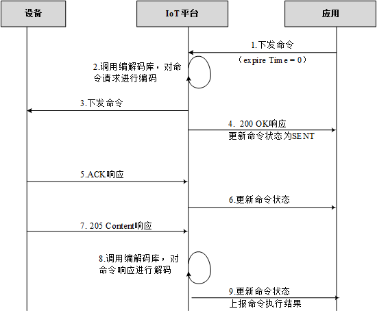

-   **缓存下发：** 平台收到命令后放入队列。在设备上线的时候，平台依次下发命令队列中的命令。缓存下发适合对命令实时性要求不高的场景，比如配置水表的参数。缓存下发平台根据设备的省电模式进行不同处理。

**图 2**  命令缓存下发流程<a name="fig33707270"></a>  
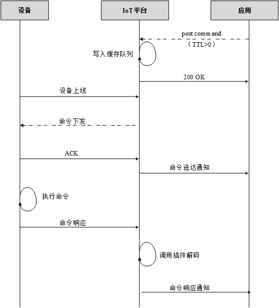

应用服务器向IoT平台下发命令时，携带参数expireTime（简称TTL，表示最大缓存时间）。如果不带expireTime，则默认expireTime为48小时。

expireTime=0：命令立即下发。

expireTime\>0：命令缓存下发。

LiteOS SDK端云互通组件场景命令下发的调测过程，命令下发步骤如下：

1.  登录IoT平台的开发者Portal。开发者Portal的访问地址、账号和密码需要向IoT平台服务商申请。
2.  在“我的设备”界面的设备列表中，选择接收命令的设备，点击“命令下发（</\>\)”。在弹出界面中，配置下发给设备的命令参数。

    **图 3**  命令下发<a name="fig35602328"></a>  
    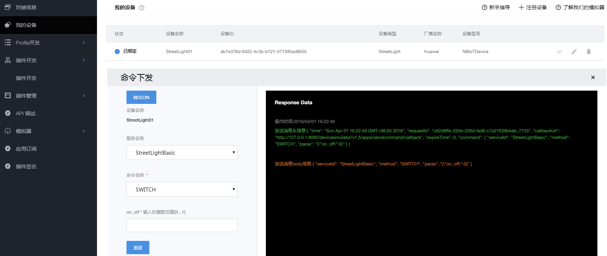

3.  在“我的设备”界面的设备列表中，选择接收命令的设备-\>“历史命令”，查看“状态”栏的显示。

    **图 4**  命令下发状态<a name="fig29598981"></a>  
    

    状态说明如下：

    -   **超期：** 表示命令在IoT平台缓存时间超期，未向设备下发。
    -   **成功：** 表示IoT平台已经将命令下发给设备，且收到设备上报的命令执行结果。
    -   **失败：** 表示编解码插件解析为空，或执行结果响应里面有“ERROR CODE”等。
    -   **超时：** 表示IoT平台等待ACK响应超时。
    -   **取消：** 表示应用侧已经取消命令下发。
    -   **等待：** 表示命令在IoT平台缓存，还未下发给设备。
    -   **已发送：** 表示IoT平台已经将命令下发给设备。
    -   **已送达：** 表示IoT平台已经将命令下发给设备，且收到设备返回的ACK消息。

4.  LiteOS SDK端云互通组件从消息缓存中获取消息码流并解析，agent\_tiny\_cmd\_ioctl.c中atiny\_cmd\_ioctl\(\)接口对应的回调函数（实际调用atiny\_write\_app\_write\(\)处理下发命令）。

    ```
    int atiny_write_app_write(void* user_data, int len) 
    { 
       int i; 
       uint8_t cmd_data[len]; 
       memcpy(cmd_data, user_data, len); 
       for(i=0;i<len;i++) 
       { 
           //打印下发的命令数据，用户可以处理下发的命令，根据具体的命令控制硬件设备
           printf("########   %d",cmd_data[i]); 
        } 
        (void)atiny_printf("write num19 object success\r\n"); 
        return ATINY_OK; 
    }
    ```

    agent\_tiny\_cmd\_ioctl.c位于 LiteOS/demos/agenttiny\_lwm2m。


<h2 id="（参考）端云互通组件无线接入实例.md">（参考）端云互通组件无线接入实例</h2>


<h3 id="无线接入介绍.md">无线接入介绍</h3>

无线的接入方式包括WIFI、GSM、NB-IoT、Zigbee、蓝牙等，本文主要讲解WIFI和GSM（GPRS）的接入方式。对物联网开发者来说，WIFI或者GSM一般都是一个单独的模块，运行在MCU上的LiteOS SDK端云互通组件需要使用WIFI或者GSM提供的网络服务时，需要通过串口AT指令就可以了，如下图所示，ESP8266是乐鑫的WIFI模组，SIM900A是SIMCom芯讯通推出的GSM/GPRS模组。

**图 1**  Huawei LiteOS SDK端云互通组件无线接入方案示意图<a name="fig64072812"></a>  


AT 即Attention，AT指令集是从终端设备 \(Terminal Equipment，TE\)或者数据终端设备 \(Data Terminal Equipment，DTE\)向终端适配器\(Terminal Adapter， TA\)或数据电路终端设备 \(Data Circuit Terminal Equipment，DCE\)发送的。通过TA，TE发送AT指令来控制移动台\(Mobile Station，MS\)的功能，与GSM 网络业务进行交互。用户可以通过AT指令进行呼叫、短信、电话本、数据业务、传真等方面的控制。

<h3 id="AT框架介绍.md">AT框架介绍</h3>

不论使用ESP8266还是SIM900A，都可以使用AT+UART方式接入，主要的差别在于具体的AT指令，但很多情况下都是类似的，LiteOS SDK端云互通组件提供了一种AT框架，也可以称之为AT模板，方便用户移植不同串口通信模块（需要支持TCP/IP协议栈），AT框架的方案如下图所示。

**图 1**  AT框架方案结构图<a name="fig37420188"></a>  
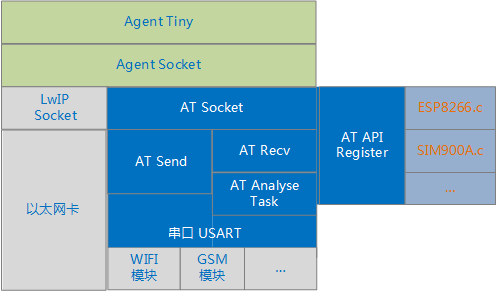

结构图中AT Socket用于适配Atiny Socket接口，类似posix socket，AT Send用于调用at\_cmd发送AT命令，AT Recv用于AT Analyse Task，通过LiteOS消息队列Post消息到用户接收任务。AT Analyse Task的主要功能是解析来自串口的消息，包括用户数据和命令的响应，串口USART主要是在中断或者DMA模式下接收数据，AT API Register是提供设备模块注册的API函数。

结构图中深蓝色的部分是AT框架公共部分代码，开发者不需要修改；浅蓝色的部分是设备相关代码，开发者需要编写相应的设备代码，根据at\_api.h文件的定义，开发者只要实现以下函数接口即可：

```
typedef struct { 
     int32_t  (*init)(void);  /*初始化，初始化串口、IP网络等*/ 
     int8_t (*get_localmac)(int8_t *mac);/*获取本地MAC*/ 
     int8_t (*get_localip)(int8_t *ip, int8_t * gw, int8_t * mask);/*获取本地IP*/ 
     /*建立TCP或者UDP连接*/ 
     int32_t  (*connect)(const int8_t * host, const int8_t *port, int32_t proto); 
     /*发送，当命令发送后，如果超过一定的时间没收到应答，要返回错误*/ 
     int32_t  (*send)(int32_t id , const uint8_t  *buf, uint32_t len); 
     int32_t  (*recv_timeout)(int32_t id , int8_t  *buf, uint32_t len, int32_t timeout); 
     int32_t  (*recv)(int32_t id , int8_t  *buf, uint32_t len); 
      
     int32_t  (*close)(int32_t id);/*关闭连接*/ 
     int32_t  (*recv_cb)(int32_t id);/*收到各种事件处理，暂不实现 */ 
     int32_t  (*deinit)(void); 
 }at_adaptor_api;
```

at\_api.h位于 LiteOS/include/at\_frame。

<h3 id="移植WIFI模块-ESP8266.md">移植WIFI模块-ESP8266</h3>

上一小节中，本文对AT框架进行了简单的介绍。其中需要开发者实现at\_api\_interface.h中所定义的接口，之后通过AT API Register进行注册，供上层的Agent Socket调用。本节给出WIFI模块ESP8266的具体例子，帮助开发者进行移植。

1.  STM32F429开发板上连接ESP8266 串口wifi模块，如下图所示：

    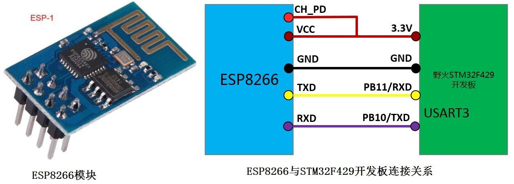

2.  首先在设备文件esp8266.c定义API结构体。

    ```
    at_adaptor_api at_interface = {   
         .init = esp8266_init,      
         .get_localmac = esp8266_get_localmac, /*get local MAC*/  
         .get_localip = esp8266_get_localip,/*get local IP*/  
         /*build TCP or UDP connection*/  
         .connect = esp8266_connect,  
         .send = esp8266_send,  
         .recv_timeout = esp8266_recv_timeout,  
         .recv = esp8266_recv,  
         .close = esp8266_close,/*close connection*/  
         .recv_cb = esp8266_recv_cb,/* operation for events, not implements yet */  
         .deinit = esp8266_deinit,  
    };
    ```

    esp8266.c位于 LiteOS/components/net/at\_device/wifi\_esp8266

3.  在main.c文件中，代码如下：

    ```
    #elif defined(WITH_AT_FRAMEWORK) && (defined(USE_ESP8266) || defined(USE_SIM900A)) 
         extern at_adaptor_api at_interface; 
         at_api_register(&at_interface); //注册开发者定义的接口
         agent_tiny_entry();
     #endif
    ```

    main.c位于 LiteOS/targets/Cloud\_STM32F429IGTx\_FIRE/Src。

4.  确保打开了编译宏。

    **图 1**  全局宏包含WITH\_AT\_FRAMEWORK和USE\_ESP8266<a name="fig20864651"></a>  
    

5.  在esp8266.c实现具体设备API接口。

    例如demo例程初始化如下：

    ```
    int32_t esp8266_init() 
    
     {
          at.init(); 
          at.oob_register(AT_DATAF_PREFIX, strlen(AT_DATAF_PREFIX), esp8266_data_handler); 
      #ifdef     USE_USARTRX_DMA   HAL_UART_Receive_DMA(&at_usart,&at.recv_buf[at_user_conf.user_buf_len*0],at_user_conf.user_buf_len); 
     #endif 
         esp8266_reset();   
         esp8266_echo_off(); 
         esp8266_choose_net_mode(STA); 
         while(AT_FAILED == esp8266_joinap(WIFI_SSID, WIFI_PASSWD)) 
    
         { 
            AT_LOG("connect ap failed, repeat..."); 
    
    
         }; 
        esp8266_set_mux_mode(at.mux_mode); 
         static int8_t ip[32]; 
         static int8_t gw[32]; 
         static int8_t mac[32]; 
         esp8266_get_localip(ip, gw, NULL); 
         esp8266_get_localmac(mac); 
         AT_LOG("get ip:%s, gw:%s mac:%s", ip, gw, mac); 
         return AT_OK; 
     }
    ```

    其它几个接口参考esp8266.c即可，而ESP8266模块AT命令定义的宏在esp8266.h，具体含义可以查看ESP8266官方手册，另外用户需要在esp8266.h中修改自己连接的wifi的ssid和密码。

    ```
    #define AT_CMD_RST              "AT+RST"  
    #define AT_CMD_ECHO_OFF         "ATE0"  
    #define AT_CMD_CWMODE           "AT+CWMODE_CUR"  
    #define AT_CMD_JOINAP           "AT+CWJAP_CUR"  
    #define AT_CMD_MUX              "AT+CIPMUX"  
    #define AT_CMD_CONN             "AT+CIPSTART"  
    #define AT_CMD_SEND             "AT+CIPSEND"  
    #define AT_CMD_CLOSE            "AT+CIPCLOSE"  
    #define AT_CMD_CHECK_IP         "AT+CIPSTA_CUR?"  
    #define AT_CMD_CHECK_MAC        "AT+CIPSTAMAC_CUR?"
    ```

    esp8266.h位于 LiteOS/components/net/at\_device/wifi\_esp8266。


<h3 id="移植GSM模块-SIM900A.md">移植GSM模块-SIM900A</h3>

与ESP8266非常类似，只不过具体AT命令有稍微差异。

1.  STM32F429开发板上连接SIM900A串口GSM模块，如下图所示

    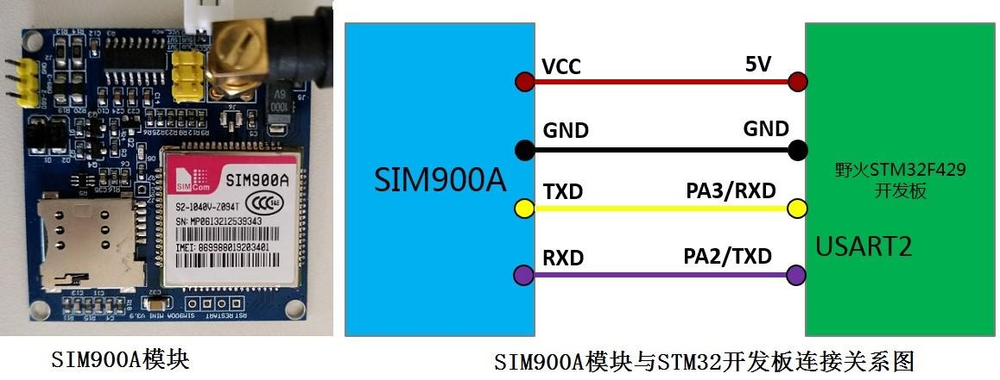

2.  在设备文件sim900a.c定义API结构体。

    ```
    at_adaptor_api at_interface = {  
        .init = sim900a_ini,  
        /*TCP or UDP connect*/  
        .connect = sim900a_connect,  
        /*send data, if no response, retrun error*/  
        .send = sim900a_send,  
        .recv_timeout = sim900a_recv_timeout,  
        .recv = sim900a_recv,  
        .close = sim900a_close,/*close connect*/  
        .recv_cb = sim900a_recv_cb,/*receive event handle, no available by now */  
    .deinit = sim900a_deinit,  
    };
    ```

    sim900a.c位于 LiteOS/components/net/at\_device/gprs\_sim900a。

3.  在main.c文件中，代码如下：

    ```
    #elif defined(WITH_AT_FRAMEWORK) && (defined(USE_ESP8266) || defined(USE_SIM900A))  
         extern at_adaptor_api at_interface;  
         at_api_register(&at_interface);  
         agent_tiny_entry();  
    #endif
    ```

4.  确保打开了编译宏

    **图 1**  全局宏包含WITH\_AT\_FRAMEWORK和USE\_SIM900A<a name="fig40367921"></a>  
    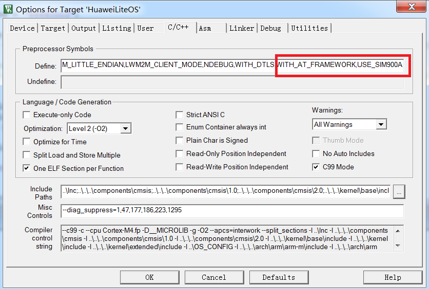

5.  在sim900a.c实现具体设备API接口。

    例如demo例程发送和接收函数如下：

    ```
    int32_t  sim900a_recv_timeout(int32_t id, int8_t * buf, uint32_t len, int32_t timeout)  
    {  
        uint32_t qlen = sizeof(QUEUE_BUFF);  
        QUEUE_BUFF  qbuf = {0, NULL};  
        printf("****at.linkid[id].qid=%d***\n",at.linkid[id].qid);  
        int ret = LOS_QueueReadCopy(at.linkid[id].qid, &qbuf, &qlen, timeout);  
        AT_LOG("ret = %x, len = %d, id = %d", ret, qbuf.len, id);  
        if (qbuf.len){  
            memcpy(buf, qbuf.addr, qbuf.len);  
            atiny_free(qbuf.addr);  
        }  
        return qbuf.len;  
    }  
    int32_t sim900a_send(int32_t id , const uint8_t  *buf, uint32_t len)  
    {  
        int32_t ret = -1;  
        char cmd[64] = {0};  
        if (AT_MUXMODE_SINGLE == at.mux_mode)  
        {  
            snprintf(cmd, 64, "%s=%d", AT_CMD_SEND, len);  
        }  
        else  
        {  
            snprintf(cmd, 64, "%s=%d,%d", AT_CMD_SEND, id, len);  
        }  
        ret = at.write((int8_t *)cmd, "SEND OK", (int8_t*)buf, len);  
        return ret;  
    }
    ```

    而SIM900A模块AT命令定义的宏在sim900a.h定义如下，具体含义可以查看SIM900A官方手册。

    ```
    #define AT_CMD_AT           "AT" 
     #define AT_CMD_CPIN         "AT+CPIN?"//check sim card 
     #define AT_CMD_COPS         "AT+COPS?"//check register network 
     #define AT_CMD_CLOSE        "AT+CIPCLOSE" 
     #define AT_CMD_SHUT         "AT+CIPSHUT" 
     #define AT_CMD_ECHO_OFF     "ATE0" 
     #define AT_CMD_ECHO_ON      "ATE1" 
     #define AT_CMD_MUX          "AT+CIPMUX" 
     #define AT_CMD_CLASS        "AT+CGCLASS"//set MS type 
     #define AT_CMD_PDP_CONT     "AT+CGDCONT"//configure pdp context
     
    #define  AT_CMD_PDP_ATT        "AT+CGATT"//pdp attach network
     #define AT_CMD_PDP_ACT      "AT+CGACT"//active pdp context 
     #define AT_CMD_CSTT         "AT+CSTT"//start task 
     #define AT_CMD_CIICR        "AT+CIICR"//start gprs connect 
     #define AT_CMD_CIFSR        "AT+CIFSR"//get local ip 
     #define AT_CMD_CIPHEAD      "AT+CIPHEAD" 
     #define AT_CMD_CONN         "AT+CIPSTART" 
     #define AT_CMD_SEND         "AT+CIPSEND" 
     #define AT_CMD_CLOSE        "AT+CIPCLOSE"
    ```

    sim900a.h位于 LiteOS/components/net/at\_device/gprs\_sim900a。


<h3 id="注意事项.md">注意事项</h3>

由于LiteOS SDK端云互通组件的发送和接收在同一个任务中，接收消息的接口不能一直是阻塞的，而必须使用带有超时机制的接收接口，即我们总是实现int32\_t \(\\\*recv\_timeout\)\(int32\_t id , int8\_t \\\*buf, uint32\_t len, int32\_t timeout\)这个接口，且接收超时时间目前是10秒（\#define BIND\_TIMEOUT \(10\)）。

如果用户设计的应用发送消息和接收消息在不同的任务中，那么可以使用阻塞接口int32\_t \(\\\*recv\)\(int32\_t id , int8\_t \\\*buf, uint32\_t len\)。

<h2 id="（参考）设备模拟器接入平台.md">（参考）设备模拟器接入平台</h2>


<h3 id="设备模拟器接入平台.md">设备模拟器接入平台</h3>

设备接入IoT平台后，IoT平台才可以对设备进行管理。

IoT平台提供了设备模拟器，可以模拟真实设备接入IoT平台的场景。本节基于设备模拟器进行操作。

1.  选择“模拟器”-\>“NB设备模拟器”-\>“绑定设备”，输入验证码，点击“确定”。

    输入的验证码需要和注册设备时使用的验证码（verifyCode）一致。

    **图 1**  设备模拟器<a name="fig1368137"></a>  
    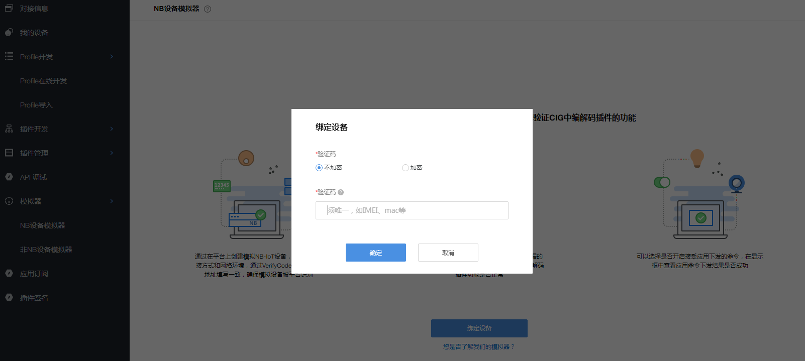

2.  选择“我的设备”，在设备列表中查看对应设备的状态。如果状态为“绑定（bound）”，则表示设备已经成功接入IoT平台。

    **图 2**  查看设备状态<a name="fig55191651"></a>  
    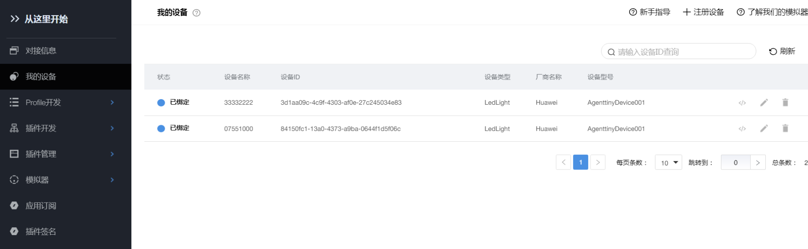


<h3 id="设备模拟器数据上报.md">设备模拟器数据上报</h3>

设备在收到平台下发命令或者资源订阅后，会上报命令响应或资源订阅消息，由IoT平台将设备上报的消息推送到应用服务器或订阅的地址。如果上报数据的南向设备是NB-IoT设备或者使用LiteOS SDK端云互通组件集成的设备，IoT平台在将消息推送到应用服务器或订阅的地址之前，会先调用编解码插件对消息进行解析。

IoT平台提供了设备模拟器，可以模拟真实设备上报数据的场景。本节基于NB设备模拟器（NB设备模拟器也可以模拟LiteOS SDK端云互通组件 的数据上报功能）进行操作。

1.  登录IoT平台的开发者Portal。开发者Portal的访问地址、账号和密码需要向IoT平台服务商申请。
2.  选择“模拟器”-\>“NB设备模拟器”，输入需要上报的码流，点击“发送”。

    在“设备日志信息”-\>“数据发送”中，可以查看数据上报信息。

    在“设备日志信息”-\>“数据接收”中，可以查看数据上报响应信息。

    **图 1**  模拟数据上报<a name="fig17220058"></a>  
    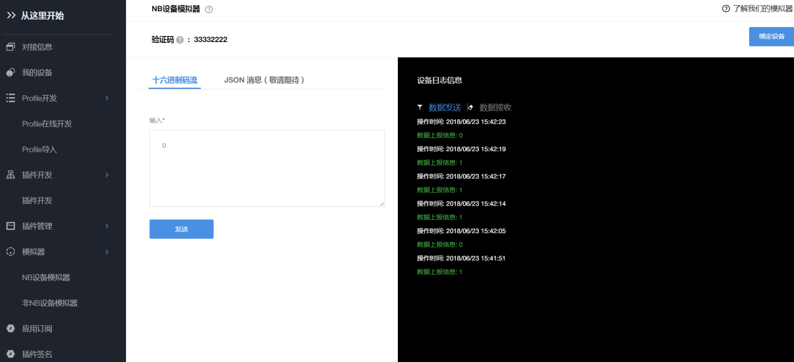

3.  在“我的设备”界面的设备列表中，选择上报数据的设备，查看“历史数据”，验证编解码插件是否可以对上报数据进行解析。

    **图 2**  查看数据上报结果<a name="fig60857238"></a>  
    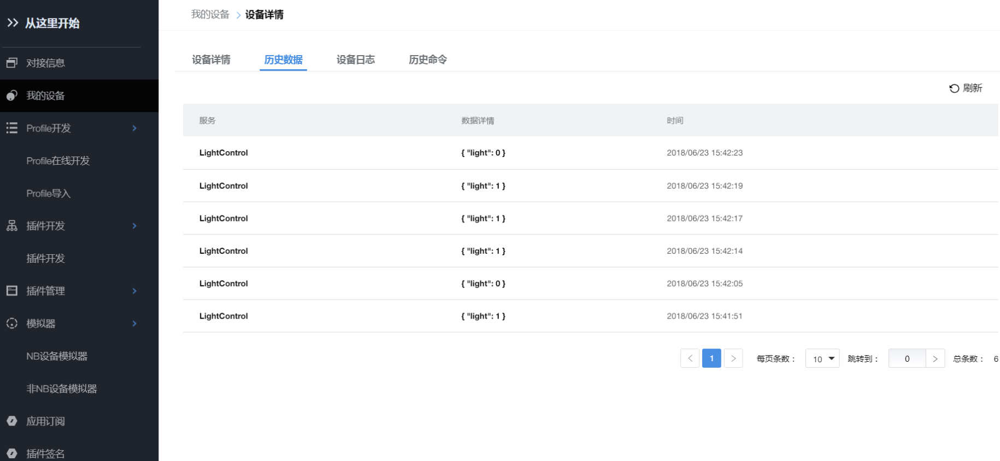

    以一款Led灯设备的编解码插件为例进行说明，该款设备包含一种服务LightControl（设置多种服务包含多种属性、多种命令类似）：

    -   LightControl服务：包含light一种属性（灯亮或者灭）和一种命令（设置灯亮或者灭）。

        使用设备模拟器中上报“01”的十六进制码流后，在“历史数据中”获得的编解码插件解码结果将会为：

        LightControl：\{ "light": 1 \}


4.  在“我的设备”界面的设备列表中，选择上报数据的设备，查看“历史数据”，验证设备数据上报的情况。

    “历史数据”中显示为经过编解码插件解析后的结果。


<h3 id="应用模拟器命令下发.md">应用模拟器命令下发</h3>

应用服务器需要调用IoT平台的命令下发接口，对设备下发控制指令。如果接收命令的设备是NB-IoT设备（或者集成LiteOS SDK端云互通组件的南向设备），IoT平台收到应用服务器下发的命令后，会先调用编解码插件进行转换，再发送给设备。

IoT平台提供了应用模拟器，可以模拟应用服务器下发命令的场景。本节基于应用模拟器进行操作。

1.  在“我的设备”界面的设备列表中，选择接收命令的设备，点击“命令下发（</\>\)”。

    在弹出界面中，配置下发给设备的命令参数。

    **图 1**  命令下发<a name="fig3270823"></a>  
    

2.  在“我的设备”界面的设备列表中，选择接收命令的设备-\>“历史命令”，查看“状态”栏的显示。

    **图 2**  命令下发状态<a name="fig66631250"></a>  
    

    状态说明如下：

    -   **超期：** 表示命令在IoT平台缓存时间超期，未向设备下发。
    -   **成功：** 表示IoT平台已经将命令下发给设备，且收到设备上报的命令执行结果。
    -   **失败：** 表示编解码插件解析为空，或执行结果响应里面有“ERROR CODE”等。
    -   **超时：** 表示IoT平台等待ACK响应超时。
    -   **取消：** 表示应用侧已经取消命令下发。
    -   **等待：** 表示命令在IoT平台缓存，还未下发给设备。
    -   **已发送：** 表示IoT平台已经将命令下发给设备。
    -   **已送达：** 表示IoT平台已经将命令下发给设备，且收到设备返回的ACK消息。

3.  选择“模拟器”-\>“NB设备模拟器”-\>“设备日志信息”-\>“数据接收”，查看设备模拟器收到的命令信息。

    **图 3**  命令接收信息<a name="fig21540555"></a>  
    


## 附录 LwM2M协议介绍


<h3 id="LwM2M协议是什么.md">LwM2M协议是什么</h3>

LwM2M（Lightweight M2M，轻量级M2M），由开发移动联盟（OMA）提出，是一种轻量级的、标准通用的物联网设备管理协议，可用于快速部署客户端/服务器模式的物联网业务。

LwM2M为物联网设备的管理和应用建立了一套标准，它提供了轻便小巧的安全通信接口及高效的数据模型，以实现M2M设备管理和服务支持。

<h3 id="LwM2M协议特性.md">LwM2M协议特性</h3>

LwM2M协议主要特性包括：

-   基于资源模型的简单对象
-   资源操作：创建/检索/更新/删除/属性配置
-   资源的观察/通知
-   支持的数据格式：TLV/JSON/Plain Text/Opaque
-   传输层协议：UDP/SMS
-   安全协议：DTLS
-   NAT/防火墙应对方案: Queue模式
-   支持多LwM2M Server
-   基本的M2M功能：LwM2M Server，访问控制，设备，网络连接监测，固件更新，位置和定位服务，统计

<h3 id="LwM2M体系架构.md">LwM2M体系架构</h3>

LwM2M体系架构如图所示：

**图 1**  LwM2M体系架构<a name="fig18527620"></a>  
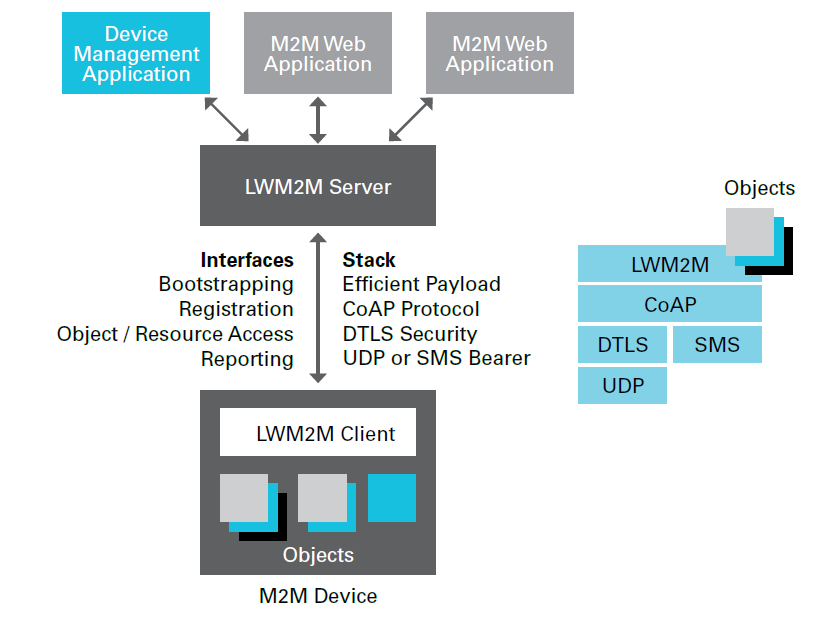

<h3 id="LwM2M对象定义.md">LwM2M对象定义</h3>

#### 对象概念<a name="section39141319"></a>

对象是逻辑上用于特定目的的一组资源的集合。例如固件更新对象，它就包含了用于固件更新目的的所有资源，例如固件包、固件URL、执行更新、更新结果等。

使用对象的功能之前，必须对该对象进行实例化，对象可以有多个对象实例，对象实例的编号从0开始递增。

OMA定义了一些标准对象，LwM2M协议为这些对象及其资源已经定义了固定的ID。例如：固件更新对象的对象ID为5，该对象内部有8个资源，资源ID分别为0\~7，其中“固件包名字”这个资源的ID为6。因此，URI 5/0/6表示：固件更新对象第0个实例的固件包名字这个资源。

#### 对象定义的格式<a name="section16727552"></a>

<a name="table44378991"></a>
<table><thead align="left"><tr id="row29222574"><th class="cellrowborder" valign="top" width="17.17171717171717%" id="mcps1.1.6.1.1"><p id="p18218283"><a name="p18218283"></a><a name="p18218283"></a>Name</p>
</th>
<th class="cellrowborder" valign="top" width="20.2020202020202%" id="mcps1.1.6.1.2"><p id="p66394800"><a name="p66394800"></a><a name="p66394800"></a>Object ID</p>
</th>
<th class="cellrowborder" valign="top" width="13.131313131313133%" id="mcps1.1.6.1.3"><p id="p9269734"><a name="p9269734"></a><a name="p9269734"></a>Instances</p>
</th>
<th class="cellrowborder" valign="top" width="24.242424242424242%" id="mcps1.1.6.1.4"><p id="p12650996"><a name="p12650996"></a><a name="p12650996"></a>Mandatory</p>
</th>
<th class="cellrowborder" valign="top" width="25.252525252525253%" id="mcps1.1.6.1.5"><p id="p18097795"><a name="p18097795"></a><a name="p18097795"></a>Object URN</p>
</th>
</tr>
</thead>
<tbody><tr id="row56635323"><td class="cellrowborder" valign="top" width="17.17171717171717%" headers="mcps1.1.6.1.1 "><p id="p24058435"><a name="p24058435"></a><a name="p24058435"></a>Object Name</p>
</td>
<td class="cellrowborder" valign="top" width="20.2020202020202%" headers="mcps1.1.6.1.2 "><p id="p2576195"><a name="p2576195"></a><a name="p2576195"></a>16-bit Unsigned Integer</p>
</td>
<td class="cellrowborder" valign="top" width="13.131313131313133%" headers="mcps1.1.6.1.3 "><p id="p7345252"><a name="p7345252"></a><a name="p7345252"></a>Multiple/ Single</p>
</td>
<td class="cellrowborder" valign="top" width="24.242424242424242%" headers="mcps1.1.6.1.4 "><p id="p58094541"><a name="p58094541"></a><a name="p58094541"></a>Mandatory/Optional</p>
</td>
<td class="cellrowborder" valign="top" width="25.252525252525253%" headers="mcps1.1.6.1.5 "><p id="p8037415"><a name="p8037415"></a><a name="p8037415"></a>urn:oma:LwM2M:{oma,ext,x}:{Object ID}</p>
</td>
</tr>
</tbody>
</table>

#### OMA定义的标准对象<a name="section16330246"></a>

OMA的LwM2M规范中定义了7个标准对象：

<a name="table20804972"></a>
<table><thead align="left"><tr id="row27194936"><th class="cellrowborder" valign="top" width="26.262626262626267%" id="mcps1.1.4.1.1"><p id="p55306175"><a name="p55306175"></a><a name="p55306175"></a>Object</p>
</th>
<th class="cellrowborder" valign="top" width="10.1010101010101%" id="mcps1.1.4.1.2"><p id="p50615211"><a name="p50615211"></a><a name="p50615211"></a>object id</p>
</th>
<th class="cellrowborder" valign="top" width="63.63636363636363%" id="mcps1.1.4.1.3"><p id="p6191460"><a name="p6191460"></a><a name="p6191460"></a>description</p>
</th>
</tr>
</thead>
<tbody><tr id="row31746257"><td class="cellrowborder" valign="top" width="26.262626262626267%" headers="mcps1.1.4.1.1 "><p id="p21310043"><a name="p21310043"></a><a name="p21310043"></a>LwM2M Security</p>
</td>
<td class="cellrowborder" valign="top" width="10.1010101010101%" headers="mcps1.1.4.1.2 "><p id="p48391913"><a name="p48391913"></a><a name="p48391913"></a>0</p>
</td>
<td class="cellrowborder" valign="top" width="63.63636363636363%" headers="mcps1.1.4.1.3 "><p id="p27430884"><a name="p27430884"></a><a name="p27430884"></a>LwM2M (bootstrap) server的URI，payload的安全模式，一些算法/密钥，server的短ID等信息。</p>
</td>
</tr>
<tr id="row45551365"><td class="cellrowborder" valign="top" width="26.262626262626267%" headers="mcps1.1.4.1.1 "><p id="p65781966"><a name="p65781966"></a><a name="p65781966"></a>LwM2M Server</p>
</td>
<td class="cellrowborder" valign="top" width="10.1010101010101%" headers="mcps1.1.4.1.2 "><p id="p26738999"><a name="p26738999"></a><a name="p26738999"></a>1</p>
</td>
<td class="cellrowborder" valign="top" width="63.63636363636363%" headers="mcps1.1.4.1.3 "><p id="p18375272"><a name="p18375272"></a><a name="p18375272"></a>server的短ID，注册的生命周期，observe的最小/最大周期， 绑定模型等。</p>
</td>
</tr>
<tr id="row31159723"><td class="cellrowborder" valign="top" width="26.262626262626267%" headers="mcps1.1.4.1.1 "><p id="p40909660"><a name="p40909660"></a><a name="p40909660"></a>Access Control</p>
</td>
<td class="cellrowborder" valign="top" width="10.1010101010101%" headers="mcps1.1.4.1.2 "><p id="p25348202"><a name="p25348202"></a><a name="p25348202"></a>2</p>
</td>
<td class="cellrowborder" valign="top" width="63.63636363636363%" headers="mcps1.1.4.1.3 "><p id="p39938492"><a name="p39938492"></a><a name="p39938492"></a>每个Object的访问控制权限。</p>
</td>
</tr>
<tr id="row23902115"><td class="cellrowborder" valign="top" width="26.262626262626267%" headers="mcps1.1.4.1.1 "><p id="p57023126"><a name="p57023126"></a><a name="p57023126"></a>Device</p>
</td>
<td class="cellrowborder" valign="top" width="10.1010101010101%" headers="mcps1.1.4.1.2 "><p id="p55470531"><a name="p55470531"></a><a name="p55470531"></a>3</p>
</td>
<td class="cellrowborder" valign="top" width="63.63636363636363%" headers="mcps1.1.4.1.3 "><p id="p63928016"><a name="p63928016"></a><a name="p63928016"></a>设备的制造商，型号，序列号，电量，内存等信息。</p>
</td>
</tr>
<tr id="row38481234"><td class="cellrowborder" valign="top" width="26.262626262626267%" headers="mcps1.1.4.1.1 "><p id="p29972243"><a name="p29972243"></a><a name="p29972243"></a>Connectivity Monitoring</p>
</td>
<td class="cellrowborder" valign="top" width="10.1010101010101%" headers="mcps1.1.4.1.2 "><p id="p11832584"><a name="p11832584"></a><a name="p11832584"></a>4</p>
</td>
<td class="cellrowborder" valign="top" width="63.63636363636363%" headers="mcps1.1.4.1.3 "><p id="p18915225"><a name="p18915225"></a><a name="p18915225"></a>网络制式，链路质量，IP地址等信息。</p>
</td>
</tr>
<tr id="row36019304"><td class="cellrowborder" valign="top" width="26.262626262626267%" headers="mcps1.1.4.1.1 "><p id="p31882544"><a name="p31882544"></a><a name="p31882544"></a>Firmware</p>
</td>
<td class="cellrowborder" valign="top" width="10.1010101010101%" headers="mcps1.1.4.1.2 "><p id="p32349256"><a name="p32349256"></a><a name="p32349256"></a>5</p>
</td>
<td class="cellrowborder" valign="top" width="63.63636363636363%" headers="mcps1.1.4.1.3 "><p id="p3044056"><a name="p3044056"></a><a name="p3044056"></a>固件包，包的URI，状态，更新结果等。</p>
</td>
</tr>
<tr id="row27396509"><td class="cellrowborder" valign="top" width="26.262626262626267%" headers="mcps1.1.4.1.1 "><p id="p4524757"><a name="p4524757"></a><a name="p4524757"></a>Location</p>
</td>
<td class="cellrowborder" valign="top" width="10.1010101010101%" headers="mcps1.1.4.1.2 "><p id="p30961050"><a name="p30961050"></a><a name="p30961050"></a>6</p>
</td>
<td class="cellrowborder" valign="top" width="63.63636363636363%" headers="mcps1.1.4.1.3 "><p id="p24817107"><a name="p24817107"></a><a name="p24817107"></a>经纬度，海拔，时间戳等。</p>
</td>
</tr>
<tr id="row22027375"><td class="cellrowborder" valign="top" width="26.262626262626267%" headers="mcps1.1.4.1.1 "><p id="p39386930"><a name="p39386930"></a><a name="p39386930"></a>Connectivity Statistics</p>
</td>
<td class="cellrowborder" valign="top" width="10.1010101010101%" headers="mcps1.1.4.1.2 "><p id="p36224733"><a name="p36224733"></a><a name="p36224733"></a>7</p>
</td>
<td class="cellrowborder" valign="top" width="63.63636363636363%" headers="mcps1.1.4.1.3 "><p id="p48522265"><a name="p48522265"></a><a name="p48522265"></a>收集期间的收发数据量，包大小等信息。</p>
</td>
</tr>
</tbody>
</table>

LiteOS SDK端云互通组件配合Huawei Ocean Connect物联网开发平台能力，还支持的19号LwM2M APPDATA对象：

<a name="table37989389"></a>
<table><thead align="left"><tr id="row21582670"><th class="cellrowborder" valign="top" width="27.27272727272727%" id="mcps1.1.4.1.1"><p id="p3365812"><a name="p3365812"></a><a name="p3365812"></a>Object</p>
</th>
<th class="cellrowborder" valign="top" width="14.14141414141414%" id="mcps1.1.4.1.2"><p id="p4195355"><a name="p4195355"></a><a name="p4195355"></a>object id</p>
</th>
<th class="cellrowborder" valign="top" width="58.58585858585859%" id="mcps1.1.4.1.3"><p id="p4279466"><a name="p4279466"></a><a name="p4279466"></a>description</p>
</th>
</tr>
</thead>
<tbody><tr id="row11092490"><td class="cellrowborder" valign="top" width="27.27272727272727%" headers="mcps1.1.4.1.1 "><p id="p26076515"><a name="p26076515"></a><a name="p26076515"></a>LwM2M APPDATA</p>
</td>
<td class="cellrowborder" valign="top" width="14.14141414141414%" headers="mcps1.1.4.1.2 "><p id="p31822940"><a name="p31822940"></a><a name="p31822940"></a>19</p>
</td>
<td class="cellrowborder" valign="top" width="58.58585858585859%" headers="mcps1.1.4.1.3 "><p id="p27521309"><a name="p27521309"></a><a name="p27521309"></a>此LwM2M对象提供LWM2M 服务器相关的应用业务数据，例如水表数据。</p>
</td>
</tr>
</tbody>
</table>

> **说明：**   
>OMA组织定义的其它常用对象，详见[http://www.openmobilealliance.org/wp/OMNA/LwM2M/LwM2MRegistry.html](http://www.openmobilealliance.org/wp/OMNA/LwM2M/LwM2MRegistry.html)。  

<h2 id="LwM2M资源定义.md">LwM2M资源定义</h2>

### 资源模型<a name="section4742541"></a>

LwM2M定义了一个资源模型，所有信息都可以抽象为资源以提供访问。资源是对象的内在组成，隶属于对象，LwM2M客户端可以拥有任意数量的资源。和对象一样，资源也可以有多个实例。

LwM2M客户端、对象以及资源的关系如图所示：

**图 1**  LwM2M客户端、对象、资源关系图<a name="fig58087711"></a>  


### 资源定义的格式<a name="section42682873"></a>

<a name="table20104586"></a>
<table><thead align="left"><tr id="row15780973"><th class="cellrowborder" valign="top" width="5.434782608695652%" id="mcps1.1.10.1.1"><p id="p3190406"><a name="p3190406"></a><a name="p3190406"></a>ID</p>
</th>
<th class="cellrowborder" valign="top" width="8.695652173913043%" id="mcps1.1.10.1.2"><p id="p57096295"><a name="p57096295"></a><a name="p57096295"></a>Name</p>
</th>
<th class="cellrowborder" valign="top" width="13.043478260869565%" id="mcps1.1.10.1.3"><p id="p61397177"><a name="p61397177"></a><a name="p61397177"></a>Operations</p>
</th>
<th class="cellrowborder" valign="top" width="10.869565217391305%" id="mcps1.1.10.1.4"><p id="p7115427"><a name="p7115427"></a><a name="p7115427"></a>Instance</p>
</th>
<th class="cellrowborder" valign="top" width="11.956521739130435%" id="mcps1.1.10.1.5"><p id="p39478734"><a name="p39478734"></a><a name="p39478734"></a>Mandator</p>
</th>
<th class="cellrowborder" valign="top" width="11.956521739130435%" id="mcps1.1.10.1.6"><p id="p43660898"><a name="p43660898"></a><a name="p43660898"></a>Type</p>
</th>
<th class="cellrowborder" valign="top" width="17.391304347826086%" id="mcps1.1.10.1.7"><p id="p46871813"><a name="p46871813"></a><a name="p46871813"></a>Range or Enumeratio</p>
</th>
<th class="cellrowborder" valign="top" width="7.608695652173914%" id="mcps1.1.10.1.8"><p id="p38520546"><a name="p38520546"></a><a name="p38520546"></a>Units</p>
</th>
<th class="cellrowborder" valign="top" width="13.043478260869565%" id="mcps1.1.10.1.9"><p id="p33156511"><a name="p33156511"></a><a name="p33156511"></a>Description</p>
</th>
</tr>
</thead>
<tbody><tr id="row1322852"><td class="cellrowborder" valign="top" width="5.434782608695652%" headers="mcps1.1.10.1.1 "><p id="p40042202"><a name="p40042202"></a><a name="p40042202"></a>0</p>
</td>
<td class="cellrowborder" valign="top" width="8.695652173913043%" headers="mcps1.1.10.1.2 "><p id="p22192936"><a name="p22192936"></a><a name="p22192936"></a>Resource Name</p>
</td>
<td class="cellrowborder" valign="top" width="13.043478260869565%" headers="mcps1.1.10.1.3 "><p id="p52797431"><a name="p52797431"></a><a name="p52797431"></a>R (Read), W (Write), E (Execute)</p>
</td>
<td class="cellrowborder" valign="top" width="10.869565217391305%" headers="mcps1.1.10.1.4 "><p id="p48733551"><a name="p48733551"></a><a name="p48733551"></a>Multiple/ Single</p>
</td>
<td class="cellrowborder" valign="top" width="11.956521739130435%" headers="mcps1.1.10.1.5 "><p id="p55103543"><a name="p55103543"></a><a name="p55103543"></a>Mandatory/Optional</p>
</td>
<td class="cellrowborder" valign="top" width="11.956521739130435%" headers="mcps1.1.10.1.6 "><p id="p34201975"><a name="p34201975"></a><a name="p34201975"></a>String,</p>
<p id="p39382324"><a name="p39382324"></a><a name="p39382324"></a>Integer,</p>
<p id="p18896600"><a name="p18896600"></a><a name="p18896600"></a>Float,</p>
<p id="p35851676"><a name="p35851676"></a><a name="p35851676"></a>Boolean,</p>
<p id="p54229633"><a name="p54229633"></a><a name="p54229633"></a>Opaque,</p>
<p id="p18304657"><a name="p18304657"></a><a name="p18304657"></a>Time,</p>
<p id="p30524187"><a name="p30524187"></a><a name="p30524187"></a>Objlnk none</p>
</td>
<td class="cellrowborder" valign="top" width="17.391304347826086%" headers="mcps1.1.10.1.7 "><p id="p56540110"><a name="p56540110"></a><a name="p56540110"></a>If any</p>
</td>
<td class="cellrowborder" valign="top" width="7.608695652173914%" headers="mcps1.1.10.1.8 "><p id="p16346177"><a name="p16346177"></a><a name="p16346177"></a>If any</p>
</td>
<td class="cellrowborder" valign="top" width="13.043478260869565%" headers="mcps1.1.10.1.9 "><p id="p48971932"><a name="p48971932"></a><a name="p48971932"></a>Description</p>
</td>
</tr>
</tbody>
</table>

<h2 id="LwM2M接口定义.md">LwM2M接口定义</h2>

### 概述<a name="section54369929"></a>

LwM2M引擎主要有两个组件：LwM2M服务器和LwM2M客户端。LwM2M标准为两个组件之间的交互设计了4种主要的接口：

-   设备发现和注册
-   引导程序
-   设备管理和服务实现
-   信息上报

### 接口模型图<a name="section19567319"></a>

LwM2M接口模型如图所示：

**图 1**  LwM2M接口模型<a name="fig6124070"></a>  


### 消息流程示例<a name="section41888143"></a>

LwM2M的消息交互流程如图所示：

**图 2**  LwM2M消息流程<a name="fig3798422"></a>  
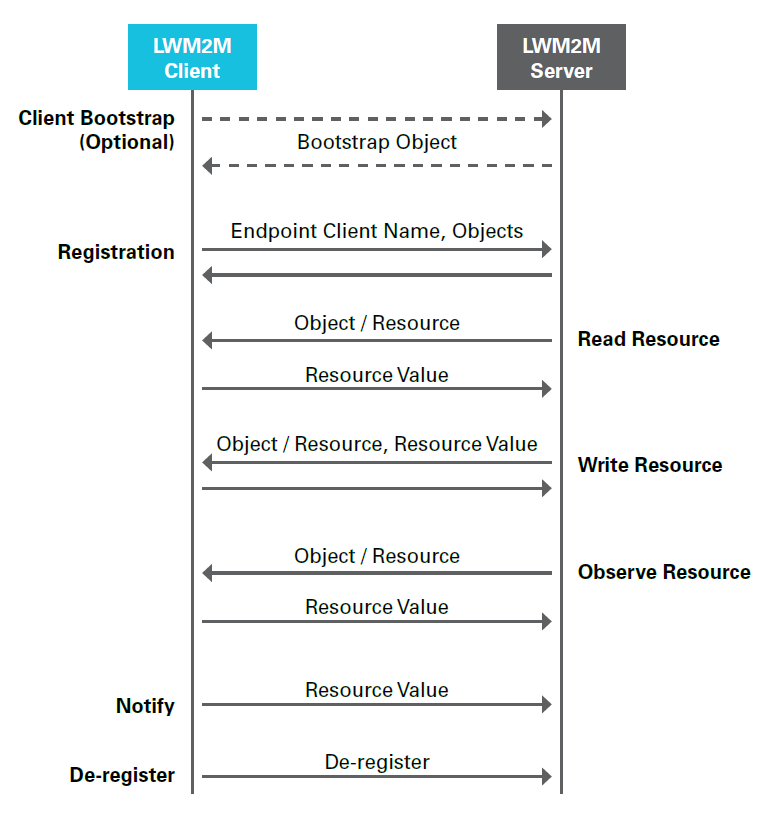

### 设备管理和服务实现接口<a name="section41448972"></a>

LwM2M的接口表示一类功能，**设备管理和服务实现**接口是LwM2M的四种接口之一。

接口的具体功能是由一系列的操作来实现的，LwM2M的4种接口被分为上行操作和下行操作。

-   上行操作：LwM2M Client -\> LwM2M Server
-   下行操作：LwM2M Server -\> LwM2M Client

LwM2M Server使用**设备管理和服务实现**接口来访问LwM2M Client的对象实例和资源。该接口包括7种操作：“Create”、“Read”、“Write”、“Delete”、“Execute”、“Write Attributes”和“Discover”。

**图 3**  设备管理和服务实现接口操作<a name="fig5753538"></a>  


<a name="table33785978"></a>
<table><thead align="left"><tr id="row9219008"><th class="cellrowborder" valign="top" width="20%" id="mcps1.1.4.1.1"><p id="p8542144"><a name="p8542144"></a><a name="p8542144"></a>接口</p>
</th>
<th class="cellrowborder" valign="top" width="67%" id="mcps1.1.4.1.2"><p id="p20825036"><a name="p20825036"></a><a name="p20825036"></a>操作</p>
</th>
<th class="cellrowborder" valign="top" width="13%" id="mcps1.1.4.1.3"><p id="p9106381"><a name="p9106381"></a><a name="p9106381"></a>方向</p>
</th>
</tr>
</thead>
<tbody><tr id="row66528299"><td class="cellrowborder" valign="top" width="20%" headers="mcps1.1.4.1.1 "><p id="p20083149"><a name="p20083149"></a><a name="p20083149"></a>设备管理和服务实现</p>
</td>
<td class="cellrowborder" valign="top" width="67%" headers="mcps1.1.4.1.2 "><p id="p16122396"><a name="p16122396"></a><a name="p16122396"></a>Create，Read，Write，Delete，Execute，Write Attributes，Discover</p>
</td>
<td class="cellrowborder" valign="top" width="13%" headers="mcps1.1.4.1.3 "><p id="p30845695"><a name="p30845695"></a><a name="p30845695"></a>下行</p>
</td>
</tr>
</tbody>
</table>

**设备管理和服务实现**接口的交互过程如图所示：

**图 4**  设备管理&服务使能接口示例<a name="fig5042649"></a>  
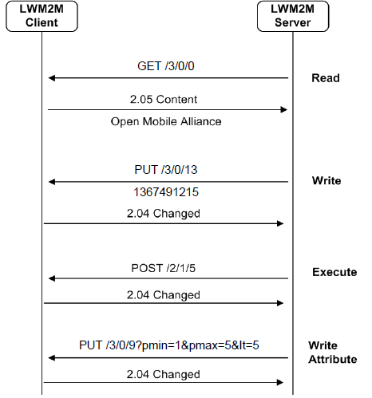

**图 5**  对象创建和删除示例<a name="fig151892"></a>  
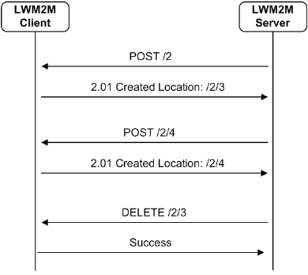

<h2 id="固件升级.md">固件升级</h2>

LwM2M的固件升级对象使得固件升级的管理成为可能。固件升级对象包括安装固件包、更新固件、以及更新固件之后执行的其它动作。成功进行了固件升级后，device必须要重启，以使新的固件生效。

在设备重启之后，如果“Packet”资源包含了一个合法的但还未被安装的固件包，“State”资源必须为<Downloaded\>状态， 否则须为<Idle\>状态。

在设备重启之前，标识更新结果的相关数值必须保存。

### 固件升级对象定义<a name="section66904166"></a>

<a name="table35718945"></a>
<table><thead align="left"><tr id="row1022179"><th class="cellrowborder" valign="top" width="14.285714285714285%" id="mcps1.1.6.1.1"><p id="p15687689"><a name="p15687689"></a><a name="p15687689"></a>Name</p>
</th>
<th class="cellrowborder" valign="top" width="14.285714285714285%" id="mcps1.1.6.1.2"><p id="p62743303"><a name="p62743303"></a><a name="p62743303"></a>Object ID</p>
</th>
<th class="cellrowborder" valign="top" width="14.285714285714285%" id="mcps1.1.6.1.3"><p id="p49042822"><a name="p49042822"></a><a name="p49042822"></a>Instances</p>
</th>
<th class="cellrowborder" valign="top" width="17.346938775510203%" id="mcps1.1.6.1.4"><p id="p13045678"><a name="p13045678"></a><a name="p13045678"></a>Mandatory</p>
</th>
<th class="cellrowborder" valign="top" width="39.795918367346935%" id="mcps1.1.6.1.5"><p id="p50066982"><a name="p50066982"></a><a name="p50066982"></a>Object URN</p>
</th>
</tr>
</thead>
<tbody><tr id="row28893718"><td class="cellrowborder" valign="top" width="14.285714285714285%" headers="mcps1.1.6.1.1 "><p id="p58689831"><a name="p58689831"></a><a name="p58689831"></a>Firmware Update</p>
</td>
<td class="cellrowborder" valign="top" width="14.285714285714285%" headers="mcps1.1.6.1.2 "><p id="p56255872"><a name="p56255872"></a><a name="p56255872"></a>5</p>
</td>
<td class="cellrowborder" valign="top" width="14.285714285714285%" headers="mcps1.1.6.1.3 "><p id="p60431818"><a name="p60431818"></a><a name="p60431818"></a>Single</p>
</td>
<td class="cellrowborder" valign="top" width="17.346938775510203%" headers="mcps1.1.6.1.4 "><p id="p63139117"><a name="p63139117"></a><a name="p63139117"></a>Optional</p>
</td>
<td class="cellrowborder" valign="top" width="39.795918367346935%" headers="mcps1.1.6.1.5 "><p id="p13994832"><a name="p13994832"></a><a name="p13994832"></a>rn:oma:LwM2M:oma:5</p>
</td>
</tr>
</tbody>
</table>

### 固件升级对象的资源定义<a name="section65266585"></a>

<a name="table59839579"></a>
<table><thead align="left"><tr id="row44979980"><th class="cellrowborder" valign="top" width="4.25531914893617%" id="mcps1.1.9.1.1"><p id="p19499782"><a name="p19499782"></a><a name="p19499782"></a><strong id="b41280313"><a name="b41280313"></a><a name="b41280313"></a>ID</strong></p>
</th>
<th class="cellrowborder" valign="top" width="11.702127659574469%" id="mcps1.1.9.1.2"><p id="p55371048"><a name="p55371048"></a><a name="p55371048"></a>Name</p>
</th>
<th class="cellrowborder" valign="top" width="9.574468085106384%" id="mcps1.1.9.1.3"><p id="p55869928"><a name="p55869928"></a><a name="p55869928"></a>Operations</p>
</th>
<th class="cellrowborder" valign="top" width="8.51063829787234%" id="mcps1.1.9.1.4"><p id="p29170337"><a name="p29170337"></a><a name="p29170337"></a>Instances</p>
</th>
<th class="cellrowborder" valign="top" width="9.574468085106384%" id="mcps1.1.9.1.5"><p id="p13987066"><a name="p13987066"></a><a name="p13987066"></a>Mandatory</p>
</th>
<th class="cellrowborder" valign="top" width="7.446808510638298%" id="mcps1.1.9.1.6"><p id="p59210523"><a name="p59210523"></a><a name="p59210523"></a>Type</p>
</th>
<th class="cellrowborder" valign="top" width="18.085106382978726%" id="mcps1.1.9.1.7"><p id="p31323053"><a name="p31323053"></a><a name="p31323053"></a>Range or Enumeration</p>
</th>
<th class="cellrowborder" valign="top" width="30.851063829787233%" id="mcps1.1.9.1.8"><p id="p54139351"><a name="p54139351"></a><a name="p54139351"></a>Description</p>
</th>
</tr>
</thead>
<tbody><tr id="row23211330"><td class="cellrowborder" valign="top" width="4.25531914893617%" headers="mcps1.1.9.1.1 "><p id="p1069590"><a name="p1069590"></a><a name="p1069590"></a>0</p>
</td>
<td class="cellrowborder" valign="top" width="11.702127659574469%" headers="mcps1.1.9.1.2 "><p id="p19527929"><a name="p19527929"></a><a name="p19527929"></a>Package</p>
</td>
<td class="cellrowborder" valign="top" width="9.574468085106384%" headers="mcps1.1.9.1.3 "><p id="p38258454"><a name="p38258454"></a><a name="p38258454"></a>W</p>
</td>
<td class="cellrowborder" valign="top" width="8.51063829787234%" headers="mcps1.1.9.1.4 "><p id="p11927059"><a name="p11927059"></a><a name="p11927059"></a>Single</p>
</td>
<td class="cellrowborder" valign="top" width="9.574468085106384%" headers="mcps1.1.9.1.5 "><p id="p26567704"><a name="p26567704"></a><a name="p26567704"></a>Mandatory</p>
</td>
<td class="cellrowborder" valign="top" width="7.446808510638298%" headers="mcps1.1.9.1.6 "><p id="p4500430"><a name="p4500430"></a><a name="p4500430"></a>Opaque</p>
</td>
<td class="cellrowborder" valign="top" width="18.085106382978726%" headers="mcps1.1.9.1.7 "><p id="p28990556"><a name="p28990556"></a><a name="p28990556"></a>-</p>
</td>
<td class="cellrowborder" valign="top" width="30.851063829787233%" headers="mcps1.1.9.1.8 "><p id="p66533739"><a name="p66533739"></a><a name="p66533739"></a>固件包。</p>
</td>
</tr>
<tr id="row61932747"><td class="cellrowborder" valign="top" width="4.25531914893617%" headers="mcps1.1.9.1.1 "><p id="p50496573"><a name="p50496573"></a><a name="p50496573"></a>1</p>
</td>
<td class="cellrowborder" valign="top" width="11.702127659574469%" headers="mcps1.1.9.1.2 "><p id="p63690628"><a name="p63690628"></a><a name="p63690628"></a>Package URI</p>
</td>
<td class="cellrowborder" valign="top" width="9.574468085106384%" headers="mcps1.1.9.1.3 "><p id="p58667272"><a name="p58667272"></a><a name="p58667272"></a>W</p>
</td>
<td class="cellrowborder" valign="top" width="8.51063829787234%" headers="mcps1.1.9.1.4 "><p id="p54428592"><a name="p54428592"></a><a name="p54428592"></a>Single</p>
</td>
<td class="cellrowborder" valign="top" width="9.574468085106384%" headers="mcps1.1.9.1.5 "><p id="p46639845"><a name="p46639845"></a><a name="p46639845"></a>Mandatory</p>
</td>
<td class="cellrowborder" valign="top" width="7.446808510638298%" headers="mcps1.1.9.1.6 "><p id="p19731086"><a name="p19731086"></a><a name="p19731086"></a>String</p>
</td>
<td class="cellrowborder" valign="top" width="18.085106382978726%" headers="mcps1.1.9.1.7 "><p id="p54714132"><a name="p54714132"></a><a name="p54714132"></a>0-255 bytes</p>
</td>
<td class="cellrowborder" valign="top" width="30.851063829787233%" headers="mcps1.1.9.1.8 "><p id="p2659678"><a name="p2659678"></a><a name="p2659678"></a>固件包的下载URI。</p>
</td>
</tr>
<tr id="row23937104"><td class="cellrowborder" valign="top" width="4.25531914893617%" headers="mcps1.1.9.1.1 "><p id="p59857276"><a name="p59857276"></a><a name="p59857276"></a>2</p>
</td>
<td class="cellrowborder" valign="top" width="11.702127659574469%" headers="mcps1.1.9.1.2 "><p id="p16601184"><a name="p16601184"></a><a name="p16601184"></a>Update</p>
</td>
<td class="cellrowborder" valign="top" width="9.574468085106384%" headers="mcps1.1.9.1.3 "><p id="p2518693"><a name="p2518693"></a><a name="p2518693"></a>E</p>
</td>
<td class="cellrowborder" valign="top" width="8.51063829787234%" headers="mcps1.1.9.1.4 "><p id="p2687603"><a name="p2687603"></a><a name="p2687603"></a>Single</p>
</td>
<td class="cellrowborder" valign="top" width="9.574468085106384%" headers="mcps1.1.9.1.5 "><p id="p16369265"><a name="p16369265"></a><a name="p16369265"></a>Mandatory</p>
</td>
<td class="cellrowborder" valign="top" width="7.446808510638298%" headers="mcps1.1.9.1.6 "><p id="p50842055"><a name="p50842055"></a><a name="p50842055"></a>none</p>
</td>
<td class="cellrowborder" valign="top" width="18.085106382978726%" headers="mcps1.1.9.1.7 "><p id="p24565790"><a name="p24565790"></a><a name="p24565790"></a>no argument</p>
</td>
<td class="cellrowborder" valign="top" width="30.851063829787233%" headers="mcps1.1.9.1.8 "><p id="p43671965"><a name="p43671965"></a><a name="p43671965"></a>更新固件。</p>
<p id="p57503372"><a name="p57503372"></a><a name="p57503372"></a>只有当State资源是Downloaded状态时，该资源才是可执行的。</p>
</td>
</tr>
<tr id="row47768301"><td class="cellrowborder" valign="top" width="4.25531914893617%" headers="mcps1.1.9.1.1 "><p id="p44027190"><a name="p44027190"></a><a name="p44027190"></a>3</p>
</td>
<td class="cellrowborder" valign="top" width="11.702127659574469%" headers="mcps1.1.9.1.2 "><p id="p9432607"><a name="p9432607"></a><a name="p9432607"></a>State</p>
</td>
<td class="cellrowborder" valign="top" width="9.574468085106384%" headers="mcps1.1.9.1.3 "><p id="p25843664"><a name="p25843664"></a><a name="p25843664"></a>R</p>
</td>
<td class="cellrowborder" valign="top" width="8.51063829787234%" headers="mcps1.1.9.1.4 "><p id="p12962034"><a name="p12962034"></a><a name="p12962034"></a>Single</p>
</td>
<td class="cellrowborder" valign="top" width="9.574468085106384%" headers="mcps1.1.9.1.5 "><p id="p43291820"><a name="p43291820"></a><a name="p43291820"></a>Mandatory</p>
</td>
<td class="cellrowborder" valign="top" width="7.446808510638298%" headers="mcps1.1.9.1.6 "><p id="p16976551"><a name="p16976551"></a><a name="p16976551"></a>Integer</p>
</td>
<td class="cellrowborder" valign="top" width="18.085106382978726%" headers="mcps1.1.9.1.7 "><p id="p32923403"><a name="p32923403"></a><a name="p32923403"></a>0-3</p>
</td>
<td class="cellrowborder" valign="top" width="30.851063829787233%" headers="mcps1.1.9.1.8 "><p id="p49549950"><a name="p49549950"></a><a name="p49549950"></a>固件升级的状态。这个值由客户端设置。0: Idle (下载之前或者成功更新之后)  1: Downloading (下载中)   2: Downloaded (下载已完成)  3: Updating (更新中)在Downloaded状态下，如果执行Resource Update操作，状态则切换为Updating。</p>
<p id="p43296374"><a name="p43296374"></a><a name="p43296374"></a>如果更新成功，状态切换为Idle；如果更新失败，状态切换回Downloaded。</p>
</td>
</tr>
<tr id="row54123051"><td class="cellrowborder" valign="top" width="4.25531914893617%" headers="mcps1.1.9.1.1 "><p id="p21891000"><a name="p21891000"></a><a name="p21891000"></a>4</p>
</td>
<td class="cellrowborder" valign="top" width="11.702127659574469%" headers="mcps1.1.9.1.2 "><p id="p28340557"><a name="p28340557"></a><a name="p28340557"></a>Update Supported Objects</p>
</td>
<td class="cellrowborder" valign="top" width="9.574468085106384%" headers="mcps1.1.9.1.3 "><p id="p13883795"><a name="p13883795"></a><a name="p13883795"></a>RW</p>
</td>
<td class="cellrowborder" valign="top" width="8.51063829787234%" headers="mcps1.1.9.1.4 "><p id="p50845617"><a name="p50845617"></a><a name="p50845617"></a>Single</p>
</td>
<td class="cellrowborder" valign="top" width="9.574468085106384%" headers="mcps1.1.9.1.5 "><p id="p24854352"><a name="p24854352"></a><a name="p24854352"></a>Optional</p>
</td>
<td class="cellrowborder" valign="top" width="7.446808510638298%" headers="mcps1.1.9.1.6 "><p id="p67045528"><a name="p67045528"></a><a name="p67045528"></a>Boolean</p>
</td>
<td class="cellrowborder" valign="top" width="18.085106382978726%" headers="mcps1.1.9.1.7 "><p id="p61978672"><a name="p61978672"></a><a name="p61978672"></a>-</p>
</td>
<td class="cellrowborder" valign="top" width="30.851063829787233%" headers="mcps1.1.9.1.8 "><p id="p54216512"><a name="p54216512"></a><a name="p54216512"></a>默认值是false。</p>
<p id="p18186565"><a name="p18186565"></a><a name="p18186565"></a>如果该值置为true，则固件成功更新了之后，客户端必须通过更新消息或注册消息，向服务器通知Object的变动。</p>
<p id="p29461361"><a name="p29461361"></a><a name="p29461361"></a>如果更新失败了，Object参数通过下一阶段的更新消息报告。</p>
</td>
</tr>
<tr id="row63825661"><td class="cellrowborder" valign="top" width="4.25531914893617%" headers="mcps1.1.9.1.1 "><p id="p2496066"><a name="p2496066"></a><a name="p2496066"></a>5</p>
</td>
<td class="cellrowborder" valign="top" width="11.702127659574469%" headers="mcps1.1.9.1.2 "><p id="p854779"><a name="p854779"></a><a name="p854779"></a>Update Result</p>
</td>
<td class="cellrowborder" valign="top" width="9.574468085106384%" headers="mcps1.1.9.1.3 "><p id="p2128273"><a name="p2128273"></a><a name="p2128273"></a>R</p>
</td>
<td class="cellrowborder" valign="top" width="8.51063829787234%" headers="mcps1.1.9.1.4 "><p id="p38172395"><a name="p38172395"></a><a name="p38172395"></a>Single</p>
</td>
<td class="cellrowborder" valign="top" width="9.574468085106384%" headers="mcps1.1.9.1.5 "><p id="p4956273"><a name="p4956273"></a><a name="p4956273"></a>Mandatory</p>
</td>
<td class="cellrowborder" valign="top" width="7.446808510638298%" headers="mcps1.1.9.1.6 "><p id="p65913869"><a name="p65913869"></a><a name="p65913869"></a>Integer</p>
</td>
<td class="cellrowborder" valign="top" width="18.085106382978726%" headers="mcps1.1.9.1.7 "><p id="p37423140"><a name="p37423140"></a><a name="p37423140"></a>0-8</p>
</td>
<td class="cellrowborder" valign="top" width="30.851063829787233%" headers="mcps1.1.9.1.8 "><p id="p11375520"><a name="p11375520"></a><a name="p11375520"></a>下载/更新固件的结果：  0: 初始值。一旦开始更新流程（下载/更新）开始，该资源的值必须被置为0。</p>
<p id="p35270824"><a name="p35270824"></a><a name="p35270824"></a>1: 固件升级成功  2: 没有足够空间存储新固件包  3: 下载过程中内存不足  4: 下载过程中连接丢失  5: 新下载的包完整性检查失败  6: 不支持的包类型  7: 不合法的URI</p>
<p id="p49001961"><a name="p49001961"></a><a name="p49001961"></a>8: 固件升级失败该资源可以通过Observe操作上报。</p>
</td>
</tr>
<tr id="row38364470"><td class="cellrowborder" valign="top" width="4.25531914893617%" headers="mcps1.1.9.1.1 "><p id="p20514332"><a name="p20514332"></a><a name="p20514332"></a>6</p>
</td>
<td class="cellrowborder" valign="top" width="11.702127659574469%" headers="mcps1.1.9.1.2 "><p id="p51048195"><a name="p51048195"></a><a name="p51048195"></a>PkgName</p>
</td>
<td class="cellrowborder" valign="top" width="9.574468085106384%" headers="mcps1.1.9.1.3 "><p id="p41263122"><a name="p41263122"></a><a name="p41263122"></a>R</p>
</td>
<td class="cellrowborder" valign="top" width="8.51063829787234%" headers="mcps1.1.9.1.4 "><p id="p53978610"><a name="p53978610"></a><a name="p53978610"></a>Single</p>
</td>
<td class="cellrowborder" valign="top" width="9.574468085106384%" headers="mcps1.1.9.1.5 "><p id="p10191307"><a name="p10191307"></a><a name="p10191307"></a>Optional</p>
</td>
<td class="cellrowborder" valign="top" width="7.446808510638298%" headers="mcps1.1.9.1.6 "><p id="p20189508"><a name="p20189508"></a><a name="p20189508"></a>String</p>
</td>
<td class="cellrowborder" valign="top" width="18.085106382978726%" headers="mcps1.1.9.1.7 "><p id="p24737413"><a name="p24737413"></a><a name="p24737413"></a>0-255 bytes</p>
</td>
<td class="cellrowborder" valign="top" width="30.851063829787233%" headers="mcps1.1.9.1.8 "><p id="p57573431"><a name="p57573431"></a><a name="p57573431"></a>固件包的名字。</p>
</td>
</tr>
<tr id="row48398833"><td class="cellrowborder" valign="top" width="4.25531914893617%" headers="mcps1.1.9.1.1 "><p id="p27991439"><a name="p27991439"></a><a name="p27991439"></a>7</p>
</td>
<td class="cellrowborder" valign="top" width="11.702127659574469%" headers="mcps1.1.9.1.2 "><p id="p52714097"><a name="p52714097"></a><a name="p52714097"></a>PkgVersion</p>
</td>
<td class="cellrowborder" valign="top" width="9.574468085106384%" headers="mcps1.1.9.1.3 "><p id="p41983488"><a name="p41983488"></a><a name="p41983488"></a>R</p>
</td>
<td class="cellrowborder" valign="top" width="8.51063829787234%" headers="mcps1.1.9.1.4 "><p id="p45219363"><a name="p45219363"></a><a name="p45219363"></a>Single</p>
</td>
<td class="cellrowborder" valign="top" width="9.574468085106384%" headers="mcps1.1.9.1.5 "><p id="p38889795"><a name="p38889795"></a><a name="p38889795"></a>Optional</p>
</td>
<td class="cellrowborder" valign="top" width="7.446808510638298%" headers="mcps1.1.9.1.6 "><p id="p63065671"><a name="p63065671"></a><a name="p63065671"></a>String</p>
</td>
<td class="cellrowborder" valign="top" width="18.085106382978726%" headers="mcps1.1.9.1.7 "><p id="p8045720"><a name="p8045720"></a><a name="p8045720"></a>0-255 bytes</p>
</td>
<td class="cellrowborder" valign="top" width="30.851063829787233%" headers="mcps1.1.9.1.8 "><p id="p47723549"><a name="p47723549"></a><a name="p47723549"></a>固件包的版本。</p>
</td>
</tr>
</tbody>
</table>

### 固件升级状态机<a name="section50528360"></a>

固件升级状态之间的变换关系如图所示：

**图 1**  固件升级状态图<a name="fig28075829"></a>  
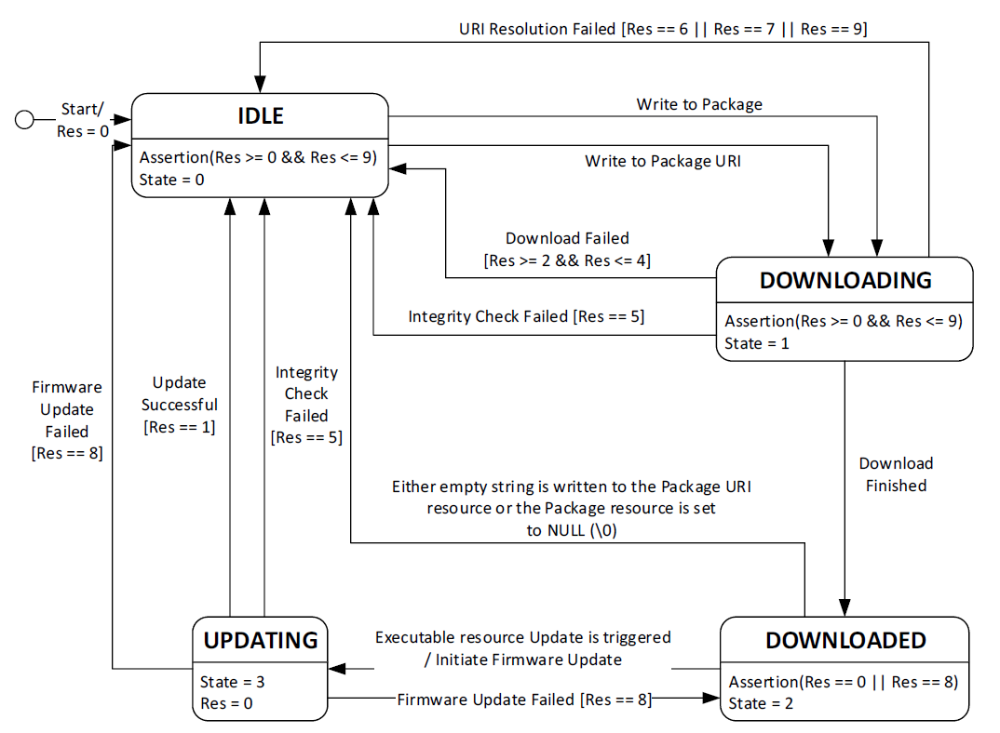

### 固件升级流程<a name="section52102058"></a>

固件升级流程如图所示：

**图 2**  固件升级流程<a name="fig64945365"></a>  


