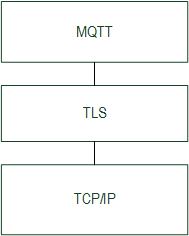
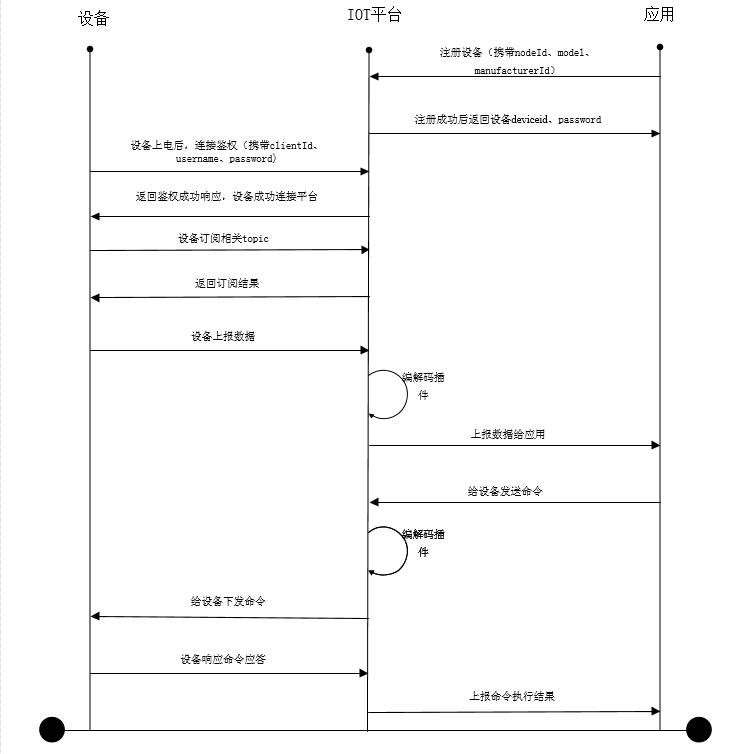
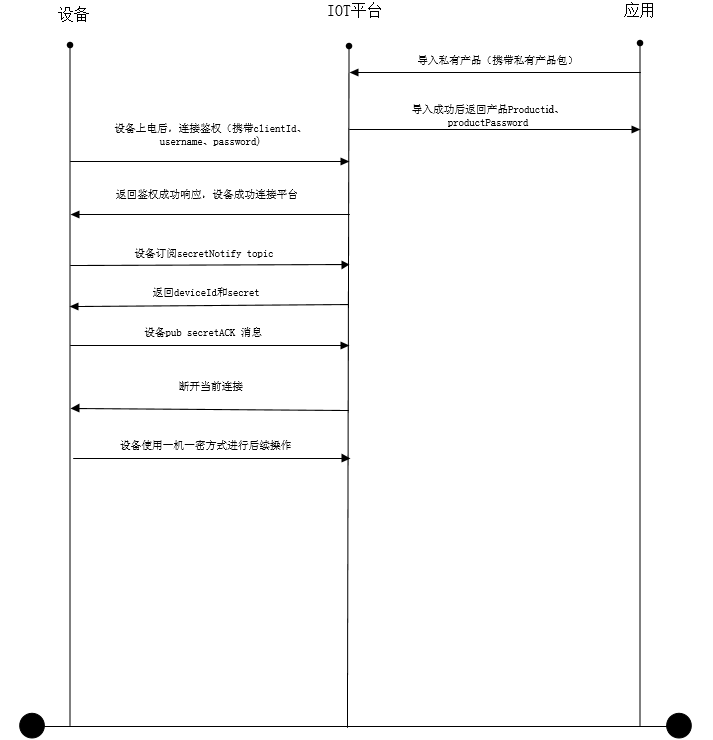
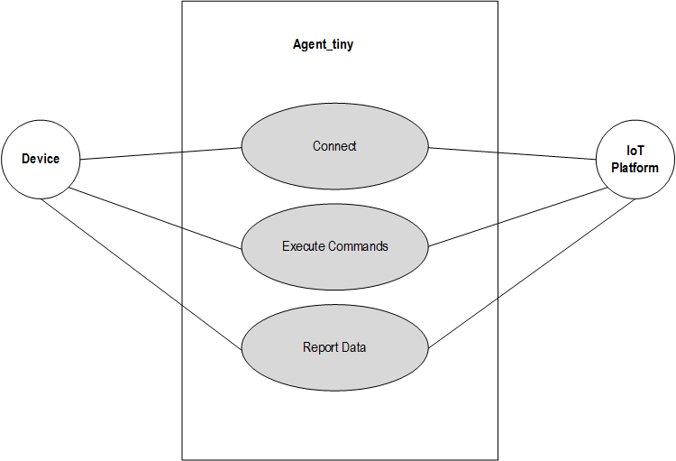
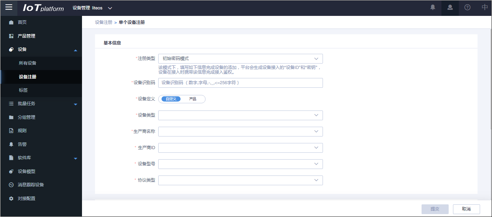
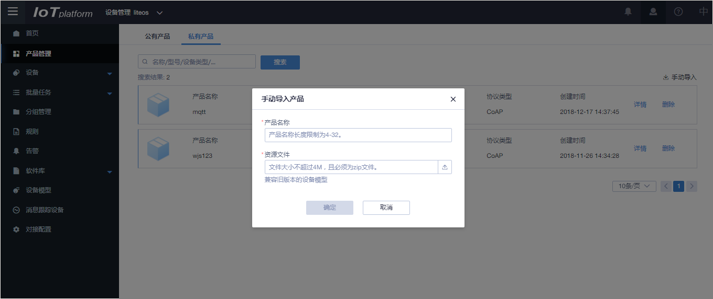
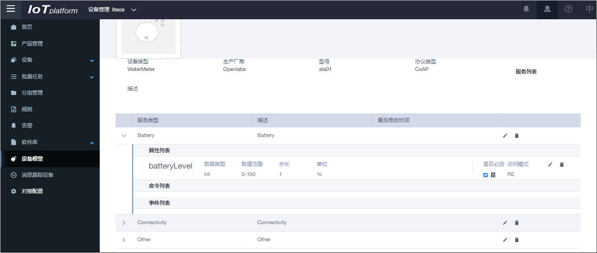
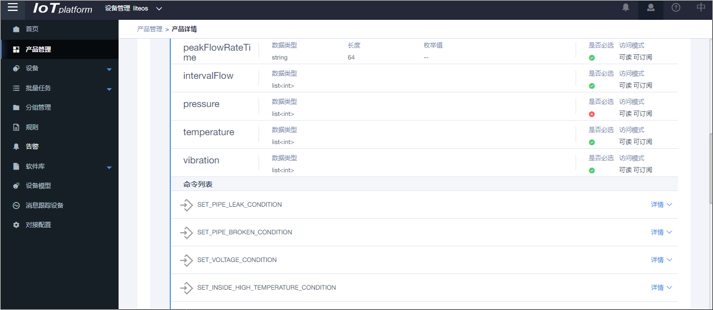

# LiteOS SDK 介绍


LiteOS SDK是Huawei LiteOS软件开发工具包（Software Development Kit），包括端云互通组件、FOTA、JS引擎、传感框架等内容。

本文档介绍的LiteOS SDK包括了LiteOS SDK端云互通组件。端云互通组件是华为物联网解决方案中，资源受限终端对接到 IoT云平台的重要组件。端云互通组件提供端云协同能力，集成了 LwM2M、CoAP、mbed TLS、LwIP 等全套 IoT 互联互通协议栈，且在 LwM2M 的基础上，提供端云互通组件开放API，用户只需关注自身的应用，而不必关注 LwM2M 实现细节，直接使用 LiteOS SDK端云互通组件封装的 API，通过四个步骤就能简单快速地实现与华为 OceanConnect IoT平台安全可靠连接。使用 LiteOS SDK端云互通组件，用户可以大大减少开发周期，聚焦自己的业务开发，快速构建自己的产品。


**Huawei LiteOS架构图**


# 端云互通组件-MQTT 开发指南

## LiteOS端云互通组件-MQTT开发介绍

MQTT（MQ Telemetry Transport）是一种基于发布和订阅（publish/subscribe）的简单的、轻量级的通信协议，它应用于资源受限的设备及低带宽、高延时、不可靠的网络。MQTT3.1.1版本已成为OASIS的标准。

当前LiteOS MQTT的实现承载在传输层安全协议TLS之上，通信的协议层次见下图。




<h2 id="接入IoT平台对接模式.md">接入IoT平台对接模式</h2>

设备使用MQTT很容易和华为OceanConnect IoT平台对接，平台目前支持两种对接模式。

**一机一密模式**，即一个设备在平台申请一个密码，流程图如下所示：



**一型一密模式**，即一种产品在平台申请一个密码，产品的设备唯一标识nodeid由设备厂家分配，设备的密码由设备和平台动态协商，流程图如下所示：



<h2 id="特点.md">特点</h2>

使用LiteOS端云互通MQTT组件很容易和IoT平台实现连接：

1.  支持一机一密即静态连接，及一型一密即动态连接。
2.  支持数据上报到IoT平台。
3.  支持接收执行IoT平台命令。



## 设备接入IoT平台集成开发流程


<h2 id="环境准备.md">环境准备</h2>

**平台侧环境准备**

在开发之前，需要提前获取如下信息：

-   开发者Portal的访问地址/账号/密码，需要向OceanConnect IoT平台申请
-   设备对接地址/端口号

**端侧环境准备**：

LiteOS源代码托管在GitHub，地址为[https://github.com/LiteOS/LiteOS](https://github.com/LiteOS/LiteOS)。

-   集成开发工具:
    -   MDK 5.18版本或者以上版本，从MDK官方网站下载。
    -   MDK依赖的pack包


<h2 id="IoT平台配置.md">IoT平台配置</h2>

IoT平台需要有配置的MQTT设备信息，才能和设备连接。具体请参见IoT平台的操作资料。

<h2 id="一机一密（静态连接）配置.md">一机一密（静态连接）配置</h2>

在平台的设备注册中输入设备信息，提交后保存对应的deviceid和password。



<h2 id="一型一密（动态连接）配置.md">一型一密（动态连接）配置</h2>

在产品管理中导入产品，提交后保存productid和password。



<h2 id="设备使用MQTT组件的适配.md">设备使用MQTT组件的适配</h2>


<h2 id="编译.md">编译</h2>

MQTT组件依赖于cJSON、mbedtls及tcp/ip的实现。tcp/ip可使用lwip实现或者在AT模块实现。详细的编译可参考config\_mqtt.mk及Makefile。

MQTT组件相关代码如下：

<a name="table48398424"></a>
<table><tbody><tr id="row57801875"><td class="cellrowborder" valign="top" width="38.48%"><p id="p51440330"><a name="p51440330"></a><a name="p51440330"></a>目录</p>
</td>
<td class="cellrowborder" valign="top" width="61.519999999999996%"><p id="p5917164"><a name="p5917164"></a><a name="p5917164"></a>描述</p>
</td>
</tr>
<tr id="row53254482"><td class="cellrowborder" valign="top" width="38.48%"><p id="p18645762"><a name="p18645762"></a><a name="p18645762"></a>components/connectivity/mqtt</p>
</td>
<td class="cellrowborder" valign="top" width="61.519999999999996%"><p id="p33911763"><a name="p33911763"></a><a name="p33911763"></a>paho.mqtt.enbedded-c开源组件及适配</p>
</td>
</tr>
<tr id="row36770415"><td class="cellrowborder" valign="top" width="38.48%"><p id="p25613652"><a name="p25613652"></a><a name="p25613652"></a>components/connectivity/agent_tiny/atiny_mqtt</p>
</td>
<td class="cellrowborder" valign="top" width="61.519999999999996%"><p id="p61439917"><a name="p61439917"></a><a name="p61439917"></a>对接IoT平台的实现</p>
</td>
</tr>
</tbody>
</table>

<h2 id="动态连接secret-info信息的存储.md">动态连接secret info信息的存储</h2>

动态连接需要保存IoT平台分配的deviceid及password等secret info。需要使用1056字节保存该信息。该信息需要使用可擦除的不易丢失器件存储。该信息为用户的敏感信息，建议用户使用安全的加密算法如使用CBC模式的AES128算法进行加密存储，保护该信息安全。

<h2 id="动态连接nodeid唯一性要求.md">动态连接nodeid唯一性要求</h2>

动态连接的nodeid需要能唯一标识设备，如使用SN或者MAC地址等等。

<h2 id="设备时间的要求.md">设备时间的要求</h2>

若设备配置的密码校验类型为校验时间戳时，即MQTT\_SIGN\_TYPE\_HMACSHA256\_CHECK\_TIME，设备时间需要和IoT平台时间同步，年月日小时应该保持一致，连接才能校验通过。

否则可带任意时间。

<h2 id="设备配置参数必须和IoT平台配置一致.md">设备配置参数必须和IoT平台配置一致</h2>

设备的连接参数、ca证书需要和IoT平台配置一致，才能连接成功。

数据的上报及命令下发及应答的格式需要和IoT平台配置的profile一致，才能实现数据上报及命令下发、应答。

静态设备平台profile的查询



动态设备profile查询



举例：

数据上报的Json格式要求为：

```
{
"msgType":      "deviceReq",
"hasMore":      0,
"data": [{
"serviceId":    "serviceIdValue",
"data": {
"defineData": "defineValue"
},
"eventTime":    "20161219T114920Z"
}]
}
```

命令下发的Json格式要求为：

```
{
"msgType":"cloudReq",
"serviceId":"serviceIdValue",
"paras":{
"paraName":"paraValue"
},
"cmd":"cmdValue",
"hasMore":0,
"mid":0
}
```

命令响应报文格式为：

```
{
"msgType":"deviceRsp",
"mid":0,
"errcode":0,
"hasMore":0,
"body":{
"bodyParaName":"bodyParaValue"
}
}
```

<h2 id="开发实例.md">开发实例</h2>

请参考开源社区，DEMO代码路径demos/agenttiny\_mqtt/agent\_tiny\_demo.c。

> **说明：**   
>Huawei LiteOS开源社区地址：https://github.com/LiteOS/LiteOS。  

## API参考

**atiny\_mqtt\_init**

<a name="table62894494"></a>
<table><tbody><tr id="row18996311"><td class="cellrowborder" valign="top" width="50%"><p id="p62306224"><a name="p62306224"></a><a name="p62306224"></a>接口1</p>
</td>
<td class="cellrowborder" valign="top" width="50%"><p id="p13639418"><a name="p13639418"></a><a name="p13639418"></a>int  atiny_mqtt_init(const mqtt_param_s* atiny_params, mqtt_client_s** phandle)</p>
</td>
</tr>
<tr id="row55645905"><td class="cellrowborder" valign="top" width="50%"><p id="p11024455"><a name="p11024455"></a><a name="p11024455"></a>功能</p>
</td>
<td class="cellrowborder" valign="top" width="50%"><p id="p20565633"><a name="p20565633"></a><a name="p20565633"></a>初始化MQTT模块，配置必备信息。</p>
</td>
</tr>
<tr id="row50872971"><td class="cellrowborder" valign="top" width="50%"><p id="p27069991"><a name="p27069991"></a><a name="p27069991"></a>入参</p>
</td>
<td class="cellrowborder" valign="top" width="50%"><p id="p45185659"><a name="p45185659"></a><a name="p45185659"></a>atiny_params：MQTT服务器信息、传输层安全信息、用户交互命令钩子。</p>
</td>
</tr>
<tr id="row4017754"><td class="cellrowborder" valign="top" width="50%"><p id="p57002678"><a name="p57002678"></a><a name="p57002678"></a>出参</p>
</td>
<td class="cellrowborder" valign="top" width="50%"><p id="p53814239"><a name="p53814239"></a><a name="p53814239"></a>Phandle：MQTT客户端句柄。</p>
</td>
</tr>
<tr id="row14566108"><td class="cellrowborder" valign="top" width="50%"><p id="p39004066"><a name="p39004066"></a><a name="p39004066"></a>返回值</p>
</td>
<td class="cellrowborder" valign="top" width="50%"><p id="p5212777"><a name="p5212777"></a><a name="p5212777"></a>ATINY_OK表示成功；否则错误码。</p>
</td>
</tr>
</tbody>
</table>

**atiny\_mqtt\_bind**

<a name="table61289235"></a>
<table><tbody><tr id="row29724369"><td class="cellrowborder" valign="top" width="50%"><p id="p58863658"><a name="p58863658"></a><a name="p58863658"></a>接口2</p>
</td>
<td class="cellrowborder" valign="top" width="50%"><p id="p3226955"><a name="p3226955"></a><a name="p3226955"></a>int atiny_mqtt_bind(const mqtt_device_info_s* device_info, mqtt_client_s* phandle)</p>
</td>
</tr>
<tr id="row29042598"><td class="cellrowborder" valign="top" width="50%"><p id="p3640263"><a name="p3640263"></a><a name="p3640263"></a>功能</p>
</td>
<td class="cellrowborder" valign="top" width="50%"><p id="p26425925"><a name="p26425925"></a><a name="p26425925"></a>绑定MQTT设备，并占用该任务一直运行。</p>
</td>
</tr>
<tr id="row36506738"><td class="cellrowborder" valign="top" width="50%"><p id="p4255814"><a name="p4255814"></a><a name="p4255814"></a>入参</p>
</td>
<td class="cellrowborder" valign="top" width="50%"><p id="p9176617"><a name="p9176617"></a><a name="p9176617"></a>device_info：设备配置参数，即静态、动态连接相关参数，连接校验方式，编码方式。</p>
</td>
</tr>
<tr id="row15480697"><td class="cellrowborder" valign="top" width="50%"><p id="p45976953"><a name="p45976953"></a><a name="p45976953"></a>出参</p>
</td>
<td class="cellrowborder" valign="top" width="50%"><p id="p33145693"><a name="p33145693"></a><a name="p33145693"></a>phandle：MQTT客户端句柄。</p>
</td>
</tr>
<tr id="row29875784"><td class="cellrowborder" valign="top" width="50%"><p id="p4019454"><a name="p4019454"></a><a name="p4019454"></a>返回值</p>
</td>
<td class="cellrowborder" valign="top" width="50%"><p id="p57140364"><a name="p57140364"></a><a name="p57140364"></a>返回错误码或者不返回。</p>
</td>
</tr>
</tbody>
</table>

**atiny\_mqtt\_data\_send**

<a name="table65481017"></a>
<table><tbody><tr id="row38857563"><td class="cellrowborder" valign="top" width="50%"><p id="p60454875"><a name="p60454875"></a><a name="p60454875"></a>接口3</p>
</td>
<td class="cellrowborder" valign="top" width="50%"><p id="p65006716"><a name="p65006716"></a><a name="p65006716"></a>int atiny_mqtt_data_send(mqtt_client_s* phandle, const char *msg, uint32_t msg_len, mqtt_qos_e qos)</p>
</td>
</tr>
<tr id="row48189536"><td class="cellrowborder" valign="top" width="50%"><p id="p11038357"><a name="p11038357"></a><a name="p11038357"></a>功能</p>
</td>
<td class="cellrowborder" valign="top" width="50%"><p id="p21691710"><a name="p21691710"></a><a name="p21691710"></a>发送MQTT数据，可用于数据上报或命令下发的应答，数据格式需要和IOT平台定义一致。</p>
</td>
</tr>
<tr id="row61007666"><td class="cellrowborder" valign="top" width="50%"><p id="p42673893"><a name="p42673893"></a><a name="p42673893"></a>入参</p>
</td>
<td class="cellrowborder" valign="top" width="50%"><p id="p34033280"><a name="p34033280"></a><a name="p34033280"></a>phandle：MQTT客户端句柄。</p>
<p id="p37864068"><a name="p37864068"></a><a name="p37864068"></a>Msg：数据的消息。</p>
<p id="p5232300"><a name="p5232300"></a><a name="p5232300"></a>msg_len：消息长度。</p>
<p id="p47090704"><a name="p47090704"></a><a name="p47090704"></a>Qos：发送的服务质量。</p>
</td>
</tr>
<tr id="row21163152"><td class="cellrowborder" valign="top" width="50%"><p id="p36493781"><a name="p36493781"></a><a name="p36493781"></a>出参</p>
</td>
<td class="cellrowborder" valign="top" width="50%"><p id="p3206307"><a name="p3206307"></a><a name="p3206307"></a>无</p>
</td>
</tr>
<tr id="row28856764"><td class="cellrowborder" valign="top" width="50%"><p id="p55696553"><a name="p55696553"></a><a name="p55696553"></a>返回值</p>
</td>
<td class="cellrowborder" valign="top" width="50%"><p id="p15126963"><a name="p15126963"></a><a name="p15126963"></a>ATINY_OK表示成功；否则错误码。</p>
</td>
</tr>
</tbody>
</table>

**atiny\_mqtt\_isconnected**

<a name="table2362167"></a>
<table><tbody><tr id="row50616587"><td class="cellrowborder" valign="top" width="50%"><p id="p6302871"><a name="p6302871"></a><a name="p6302871"></a>接口4</p>
</td>
<td class="cellrowborder" valign="top" width="50%"><p id="p40770503"><a name="p40770503"></a><a name="p40770503"></a>int atiny_mqtt_isconnected(mqtt_client_s* phandle)</p>
</td>
</tr>
<tr id="row31390208"><td class="cellrowborder" valign="top" width="50%"><p id="p59578914"><a name="p59578914"></a><a name="p59578914"></a>功能</p>
</td>
<td class="cellrowborder" valign="top" width="50%"><p id="p61162716"><a name="p61162716"></a><a name="p61162716"></a>MQTT客户端是否已经连接到服务器。</p>
</td>
</tr>
<tr id="row13593538"><td class="cellrowborder" valign="top" width="50%"><p id="p27334804"><a name="p27334804"></a><a name="p27334804"></a>入参</p>
</td>
<td class="cellrowborder" valign="top" width="50%"><p id="p66635539"><a name="p66635539"></a><a name="p66635539"></a>phandle：MQTT客户端句柄。</p>
</td>
</tr>
<tr id="row62848942"><td class="cellrowborder" valign="top" width="50%"><p id="p57599579"><a name="p57599579"></a><a name="p57599579"></a>出参</p>
</td>
<td class="cellrowborder" valign="top" width="50%"><p id="p35054312"><a name="p35054312"></a><a name="p35054312"></a>无</p>
</td>
</tr>
<tr id="row47053354"><td class="cellrowborder" valign="top" width="50%"><p id="p53225323"><a name="p53225323"></a><a name="p53225323"></a>返回值</p>
</td>
<td class="cellrowborder" valign="top" width="50%"><p id="p16283872"><a name="p16283872"></a><a name="p16283872"></a>0表示未连接；否则连接。</p>
</td>
</tr>
</tbody>
</table>

