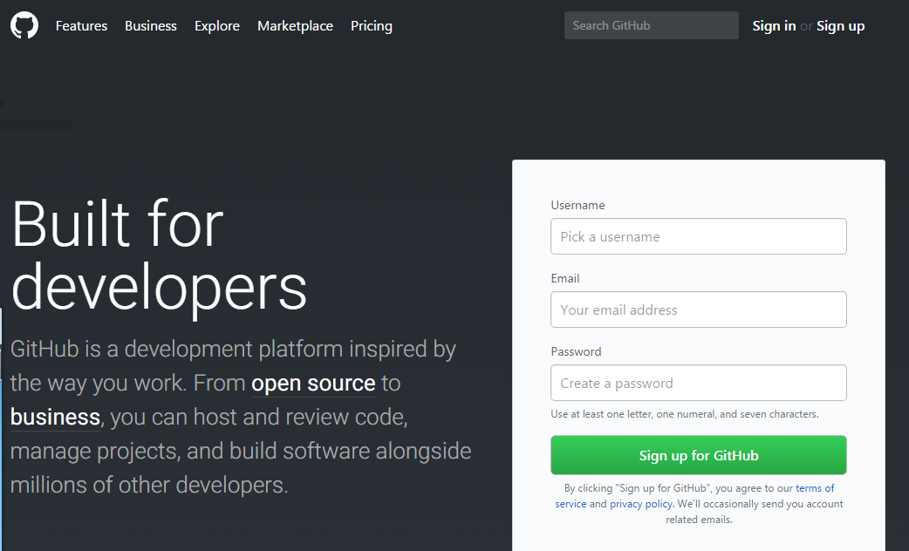
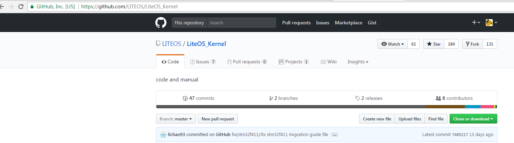
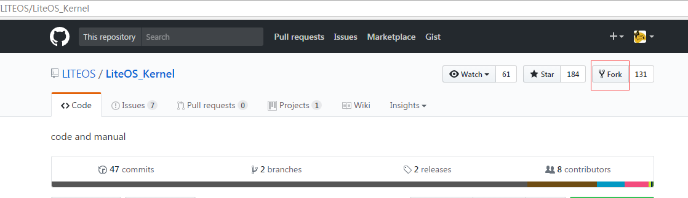
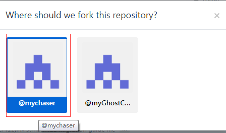
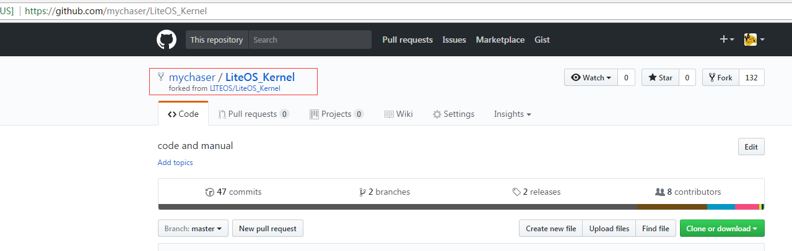
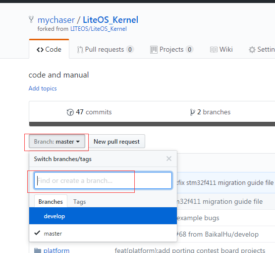
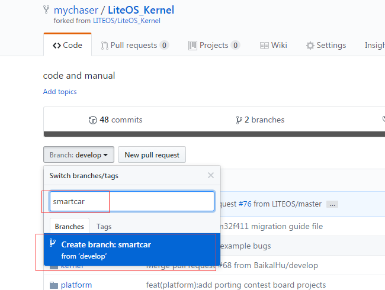
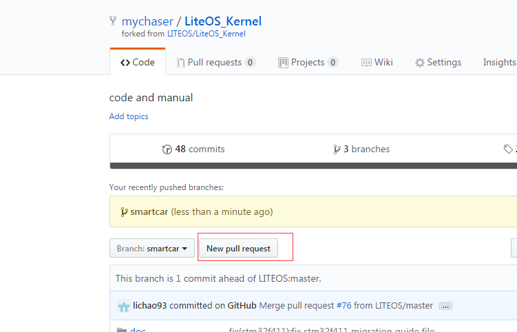
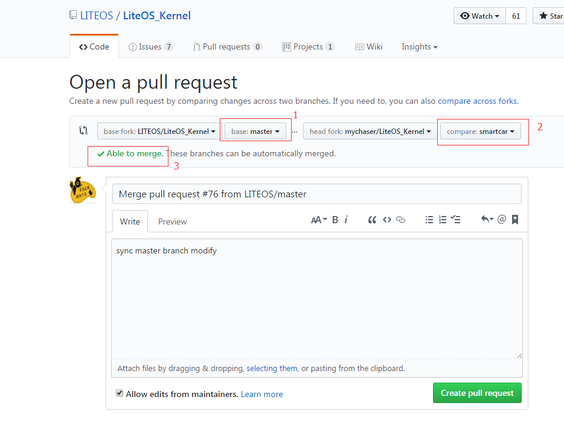

## LiteOS贡献代码流程
进行LiteOS的代码贡献可以遵循以下流程

1. 创建github账号
2. fork LiteOS Kernel源代码
3. 创建开发分支
4. 同步LiteOS主仓库代码到fork的仓库
5. 提交pull request到LiteOS仓库

### 1 创建GitHub账号

由于LiteOS是在GitHub上进行代码管理的，因此代码贡献者也需要在Github上注册账户才能贡献代码。
在浏览器输入github.com，然后在其界面上进行账户的注册(如有github账户，则直接使用即可)。

### 2 fork LiteOS源代码

拥有Github账户后，则可以将LiteOS仓库fork到自己账户下，步骤如下：

- 首先登录github账户
- 然后在github中找到https://github.com/LITEOS/LiteOS

- 点击fork按钮，将LiteOS的代码fork到自己账户下(比如：我的账户是mychaser)

点击完成后，稍等一会就会自动跳转到自己账户下的LiteOS位置。

### 3 创建开发分支

在自己的账户下的LiteOS仓库下创建新的开发分支，开发新功能或者修正bug等等。

在上图中master的下拉框点击后，可以选择不同的分支，默认是master，建议选择develop。然后在下拉的菜单中输入新的分支的名字，比如smartcar

点击上图中蓝色的内容，则会创建一个叫做smartcar的分支

### 4 同步LiteOS主仓库代码到fork的仓库

- 开发的第一步，是clone代码到本地PC
  
		git clone https://github.com/mychaser/LiteOS.git
  
		clone之后checkout到smartcar分支

		git checkout -b smartcar origin/smartcar

然后在该分支进行开发，开发完成之后，进行git add 添加代码到PC本地的仓库，然后git commit提交到PC本地仓库。

- 由于在开发的过程中，LiteOS的主仓库可能已经更新的许多新的内容，所以建议提交代码到自己账户下的仓库时先同步LiteOS的主仓库的内容，步骤示意如下：

		git remote add upstream https://github.com/LITEOS/LiteOS

		git remote update upstream

		git merge upstream/develop

		如果存在冲突，请解决冲突，然后在merge
以上步骤完成之后，再进行git push origin smartcar操作，将代码提交到自己账户的github smartcar分支

说明：所有git命令相关内容，如果不熟悉，请自行google或者baidu查找。

### 5 提交pull request到LiteOS仓库

代码开发完毕之后，就可以向LiteOS的主仓库提交pull request，该操作在github网页上进行操作。

点击 New pull request

在上图中 1 标识的位置选择 develop ， 2 标识的位置选择smartcart

如果没有冲突则会显示 3所示内容，否则需要先解决冲突然后重新创建pull request。

选择完成后，并输入相关描述，最后点击绿色按钮 Create pull request 完成pull request的创建。

注：请将以上示例图中的LiteOS_Kernel替换为LiteOS即可。
