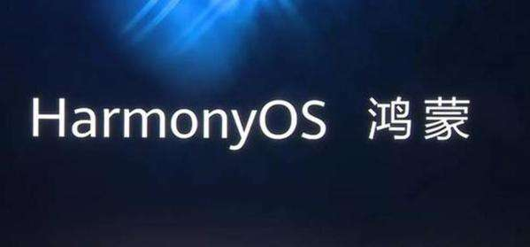
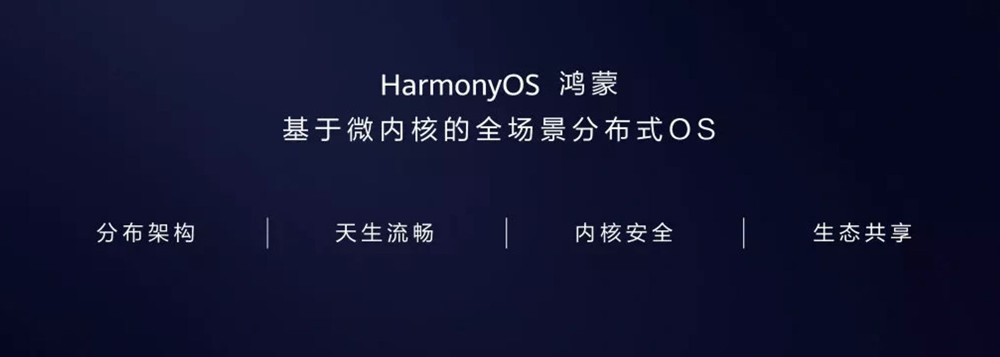
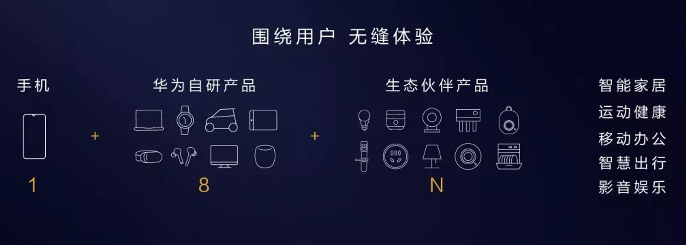
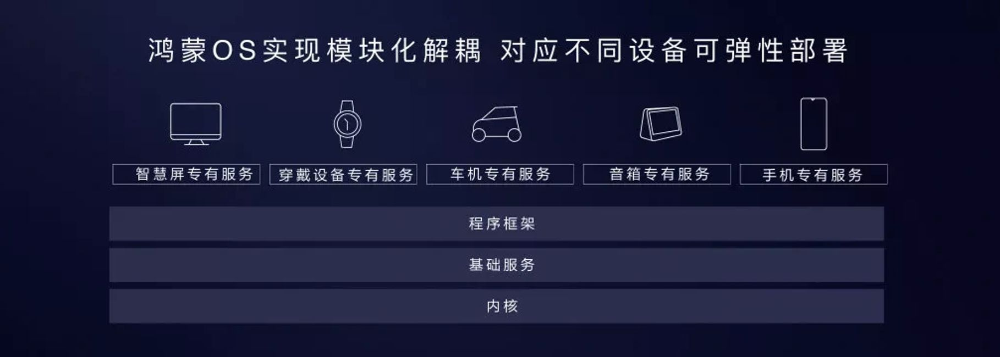
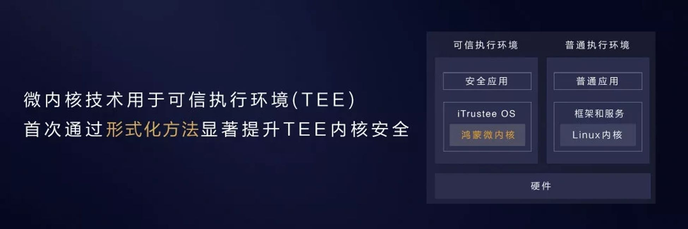
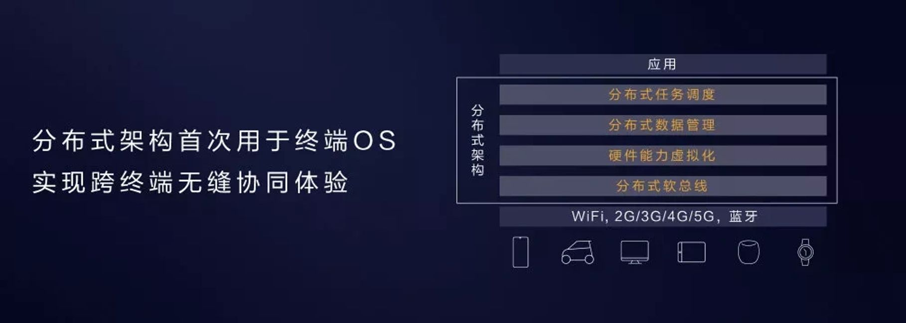

[English Docs](../README.md)  |  [中文文档](README-zh.md)  |  [Türkçe Dökümanlar](README-tr.md)

# HarmonyOS
 

  

> HarmonyOS ile ilgili şeyler listesi.

# Ⅰ . HarmonyOS Nedir?
`HarmonyOS` ilk tam dağıtık işletim sistemidir. İşletim sistemi, Huawei tarafından bağımsız olarak geliştirilmiştir. `HarmonyOS` resmi olarak 9 Ağustos 2019 tarihinde Huawei Developers Conference (<HDC.2019>) adlı konferans ile yayınlandı. Huawei, akıllı ekranlar, araç ve giyilebilir terminallerin yerleştirilmesinde öncülük edecektir. Gelecekte, daha akıllı cihazlar açık kaynak kodlu `HarmonyOS` kullanacaktır.

`HarmonyOS` esnek yapısı nedeniyle farklı cihazlarda modüler bağlar kurmayı sağlar. `HarmonyOS` 3 katmanlı bir mimarisi mevcuttur. İlk katman çekirdek, ikinci katman temel servisler ve son üçüncü katman ise programlama yapılan çatıdır. Huawei şu sıralar tercihini Android tarafında kullansa bile bu sistem her zaman mobil cihazlarda kullanılabilecektir. 

`HarmonyOS` altındaki katmanlar şu şekildedir. `HarmonyOS micro kernel`, `Linux kernel` ve [`Lite OS`](https://github.com/Awesome-HarmonyOS/HarmonyOS/tree/master/Huawei_LiteOS) 
Ve gelecekte tamamen `hongmeng` mimarisi olacaktır.

# Ⅱ . Geliştirme Süreci
- [2012] HarmonyOS 2012 yılında Şangaydaki Jiao Tong üniversitesinde geliştirilmeye başlandı.
- [2018.8.24] Huawei tarafından `Huawei HarmonyOS` isimli marka olarak başvuru yapıldı. 14 Mayıs 2019 da `HarmonyOS` isimli marka tescilini duyurdu. `HarmonyOS` isimli markanın özel hakları 14 Mayıs 2019 dan 13 mayıs 2029 yılına kadardır.
- [2019] Huawei iddaa ettiğine göre  1 milyon akıllı telefonda `HarmonyOS` işletim sistemi test edilmeye hazır.
- [2019.5.17] Huawei işletim sistemi takımı kendi tescilli işletim sistemi olan `HarmonyOS` geliştirdi.
- [2019.8.9]  Huawei resmi olarak `HarmonyOS` ismiyle duyurdu ve `HarmonyOS` açık kaynak olacaktır.

# Ⅲ . Özellikler

HarmonyOS, tam sahne akıllı deneyiminin yüksek standart bağlantı gereksinimlerini karşılamak için tasarlanmıştır. Bu nedenle, Huawei 4 büyük özellikle sistem çözümleri ileri sürüyor.

* #### 1. Dağıtılmış mimari ilk işletim sistemi terminalinde terminaller arasında sorunsuz iş akışı sağlamak için kullanılır. 

HarmonyOS "Distributed OS Architecture" ve "Distributed Soft Bus Technology" teknolojileri uygulama geliştiricileri temel teknolojilerin uygulamasını korur. 4 yetenek yani açık iletişim platformu, dağıtık veri yönetimi, dağıtık yetenek zamanlaması ve sanal çevre birimleri geliştiricilere kendi uygulamalarına ait iş mantıklarını geliştirmelerine odaklanmalarını sağlar.
Terminallerde olduğu gibi burada da yeteneklerin kullanılarak kesintisiz deneyimin keyfini çıkarmalarını sağlanır.

* #### 2. Sistemdeki doğal akıcılığı sağlamak için zaman gecikmeli motoru ve yüksek performanslı IPC teknolojisini değerlendirelim.

HarmonyOS, iki teknolojiyi kullanarak mevcut sistemlerin yetersiz performans sorununu çözdü.
Bunlar deterministik gecikme motoru ve yüksek performanslı IPC. Gecikme motorunun belirlenmesi, görev yürütmeden önce sistemde görev yürütmenin öncelik ve zaman sınırını atayabilir.Görev kaynaklarını zamanlamaya göre öncelik verecektir ve uygulamanın cevap dönüş gecikmesi 25.7% oranında azalacaktır. Sıkıştırılmış `Hongmeng` mimarisi süreçler arası iletişimi yüksek oranda arttırırken işlem hızı mevcut sistemlerden beş kat daha yüksektir

* #### 3. Yeniden güvenle inşa edilebilir terminal ekipman bazlı Microkernel Mimari

HarmonyOS mikro-çekirdek dizaynı benimser ve ayrıca düşük gecikme süreli güçlü güvenlik yapıları vardır. Mikro-çekirdek mimarisi basitçe çekirkek fonksiyonları mümkün olduğu kadar çok sistem hizmetini gerçekleştirmekte ve her biri için ek olarak güvenlik katmanı mevcuttur. Mikro-çekirkek sadece en çok basit bilinen servislerini örneğin çoklu işlemci zamanlanması ve çalışması sağlar.

HarmonyOS mikro-çekirdek mimarisinde Trusted Execution Environment (TEE) teknolojisini uygulayarak güvenliği resmi olarak şekillendirmiştir.Resmi yöntem, sistemin doğruluğunu doğrulamak için etkili bir yol ve matematiksel işlemlerdir.İşlev doğrulama ve simülasyon saldırısı gibi geleneksel doğrulama yöntemleri yalnızca sınırlı senaryolarda doğrulayabilirken resmi yöntemler, çalışan tüm yazılım yollarını veri modeli aracılığıyla doğrulayabilir. İlk kez Hongmeng OS için TEE terminaline resmi yöntemler uyguladı ve yöntemler güvenlik seviyesini önemli ölçüde arttırdı. Aynı zamanda, Hongmeng OS mikro çekirdeğinin kod miktarı Linux makro çekirdeğinin yalnızca binde biri olduğundan, saldırı olasılığı büyük ölçüde azaltıldı.

* #### 4. Birleşik tek bir geliştirme ortamı(IDE) desteği, çoklu güncelleme ve cihazlar arası dengenin sağlanabilmesi

HarmonyOS çoklu terminal geliştirme ortamına, bir çok dili birleştirip derleme, dağıtık mimari ekran genişlik kontrolü ve otomatik cihaz ekranına adapte olabilme, taşıma kontrolleri desteği, önizleme odaklı görsel programlama altyapıları geliştiricilerin verimli bir şekilde aynı projeye dayalı çalışan çoklu cihaz ortamlarında otomatik çalışabilmesini sağlayan altyapılara sahiptir.
 
Yeni güncellemeler cihazlar arasında uygulanır. Huawei Ark Derleyici, Android sanal makine modelinin yerini alan ilk statik derleyicidir ve bu durum  makina kodunun yüksek seviyeli dillerin derlenirken geliştiricilerin geliştirme ortamında bir defada  derlemelerine olanak sağlar. Ek olarak Ark Derleyici, gelecekte geliştirme verimliliğini büyük ölçüde artırabilen çok dilli birleşik derlemeyi destekleyecektir.

# IV . Kaynaklar

## 1. Resmi Kaynaklar

- [Resmi Site](https://developer.huawei.com)
- [Sürüm Notları]
- [Güvenlik Notları]
- [Tutorials]
- [Dökümantasyon]

## 2. İndir
- [Sunucu Adresleri]

## 3. Mimari Referanslar
- [LiteOS](../Huawei_LiteOS/README.md)
- [ABI] Application Binary Interface
- [EABI] Embedded Application Binary Interface

## 4. Donanım Sürücüleri
- [Cihaz Uygunlukları]
- [Standartlar & Protokoller] 
- [Donanım Kalite Özellikleri]
- [Sürücü Geliştirme Kitleri]
- [Sürücü Örnekleri]
- [Hata ayıklama Araçları]
- [Güvenlik]
- [5 inci Jenerasyon Sürücü ve yazılım]
- [Boot ve UEFI]
- [ACPI/SoC]
- [Wi-Fi]
- [USB]
- [Yazıcı]

## 5. Geliştirme Araçları
#### Derleme
- [Ark] `Harmony` Android uygulama uyumlu işletim sistemi, Ark derleyicisi Android sistem işlem akıcılığını 24% , yanıt dönüş hızını 44%, ve üçüncü taraf uygulamasının düzgünlüğü 60% oranında arttırabilir.

#### SDK
[SDK hakkında]

#### IDE
- [LiteOS IDE][Huawei LiteOS Studio](https://static.huaweicloud.com/upload/files/sdk/LiteOS_IDE.zip)

## 6. Topluluk
- [Sorular]

## 7. Kitaplar
[Kitaplar Hakkında]

## 8. Ürünler

- [Honor Smart Screen -- HarmonyOS kullanan ilk cihaz](products/honor_smart_screen.md)

## 9. Videolar

* [Eğitici Videolar]
* [Huawei HDC.2019 Harmony OS & EMUI10 Live Record](https://youtu.be/yUVGc7zpuKU)
* [Honor Smart Screen TV Official Trailer](https://youtu.be/GczF2CKIGPk)

İpuçları: Bu proje resmi değildir. Bu projenin amacı internette HarmonyOS ile ilgili bazı belgeler derlemek ve okuyuculara sunmaktır. Bu ticari bir proje değildir. Bu proje sadece HarmonyOS ye başlamak ve tüm dökümanlarına ulaşmak içindir. Bu projeyi iş için ya da para kazanmakla ilgili bir şey için kullanıyorsanız ya da bu projenin kullanılmasından veya bu projeyle bağlantılı olarak ortaya çıkan herhangi bir anlaşmazlık durumunda, birinin seçiminin veya eyleminin olumsuz sonuçlarından veya etkilerinden tüm sorumluluğu siz üstleneceksiniz.

