# 荣耀智慧屏

全球首款华为鸿蒙操作系统终端。

## 8大特色：

* 1.鸿蒙系统（HarmonyOS）（全球首款华为鸿蒙操作系统）
* 2.鸿鹄818智慧芯片（先进画质技术，引领未来视界）
* 3.魔法画质引擎（MEMC等7大先进画质技术）
* 4.6*10W越级音质（HuaWeiiHisten专业音效）
* 5.亲情视频通话（高清1080P通话）
* 6.大小屏魔法互动（开创手机与大屏交互的新方式）
* 7.联控智能家居（智能家居状态显示与控制）
* 8.智慧语音交互（6麦克远场语音）

具体介绍如下图所示：

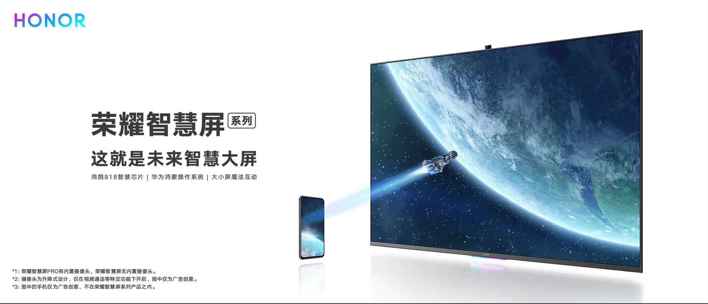

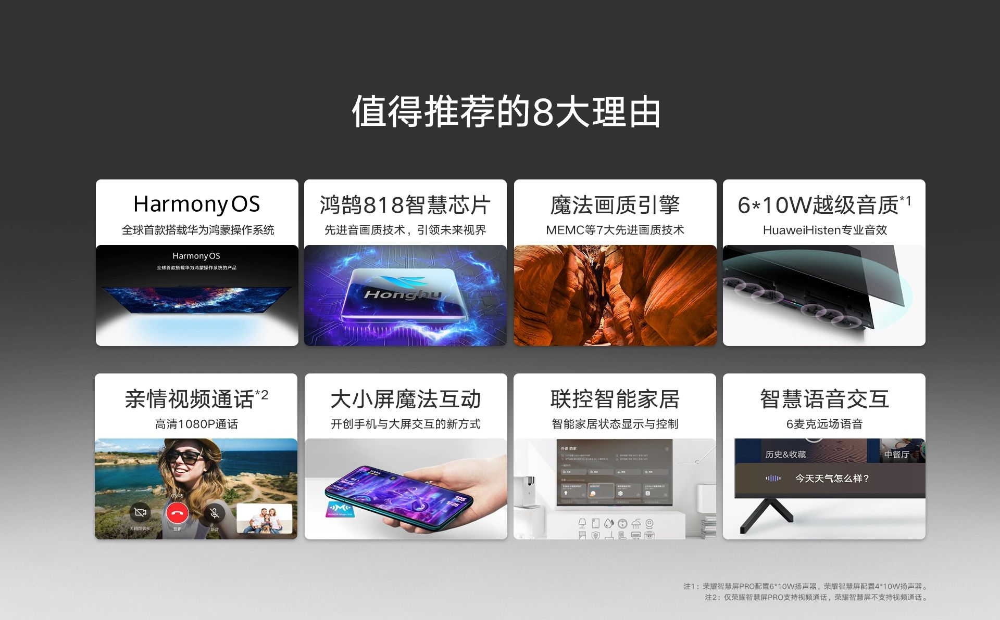

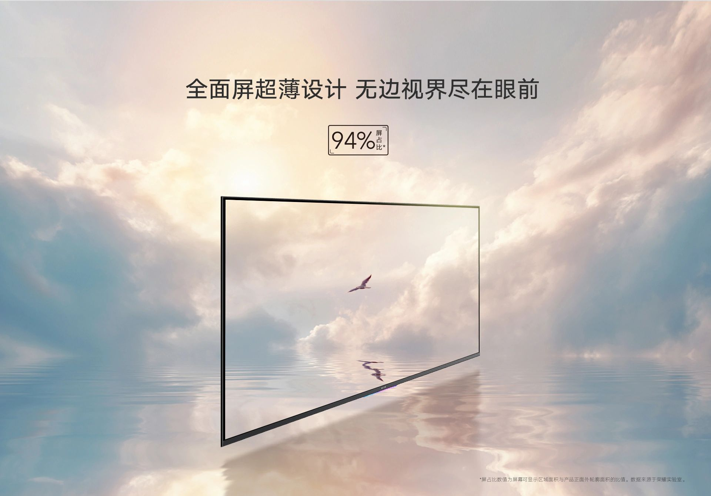

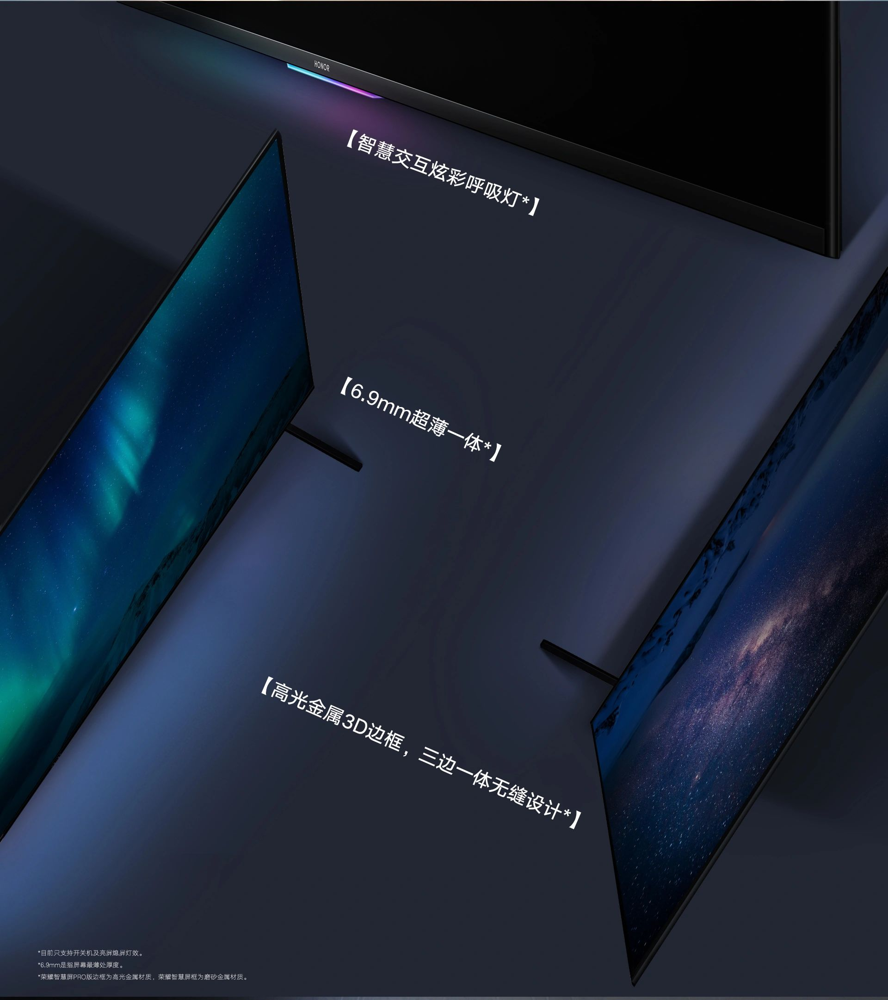

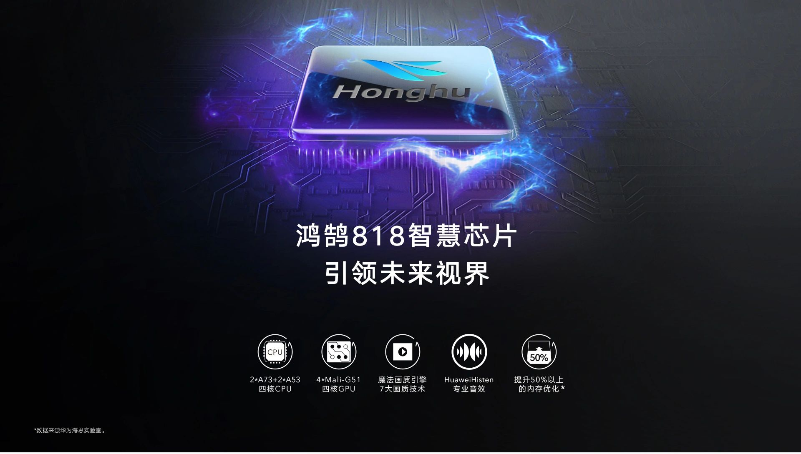

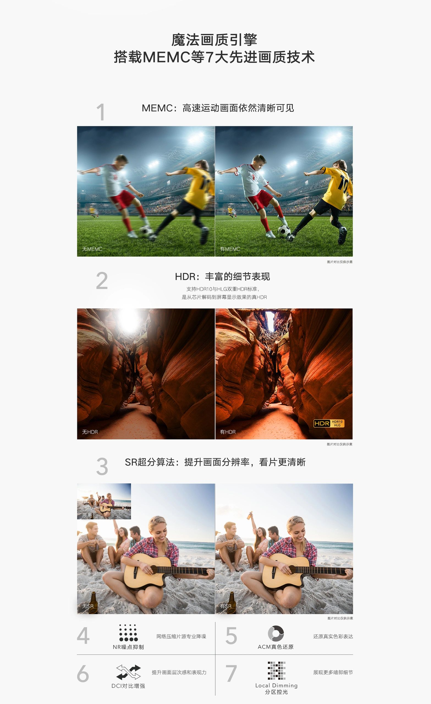

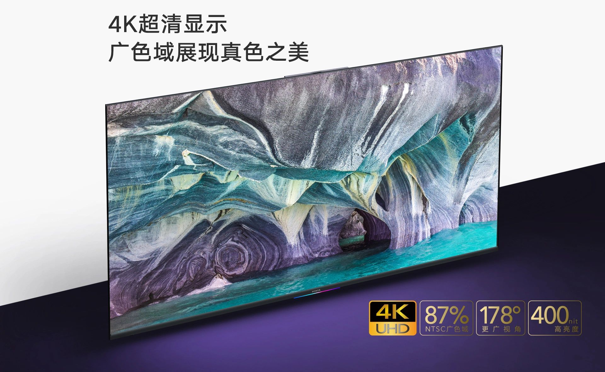

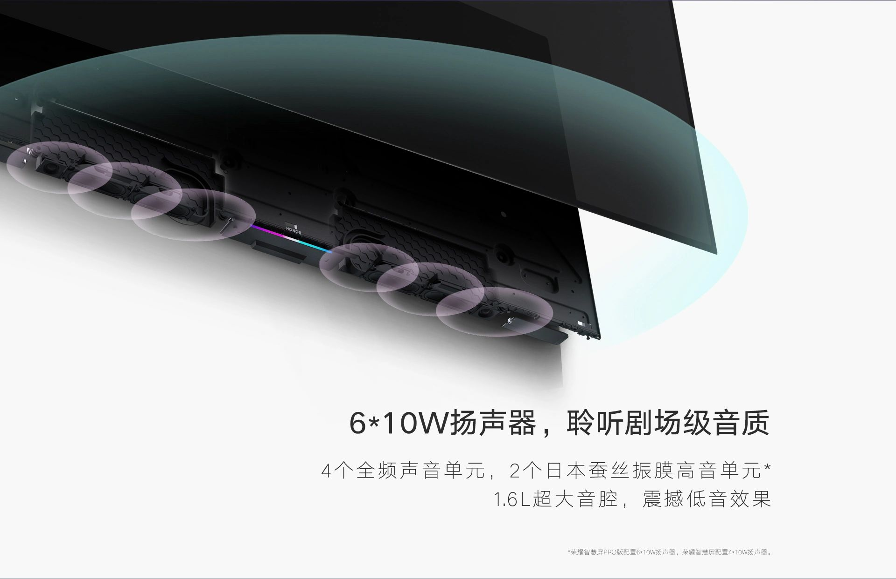

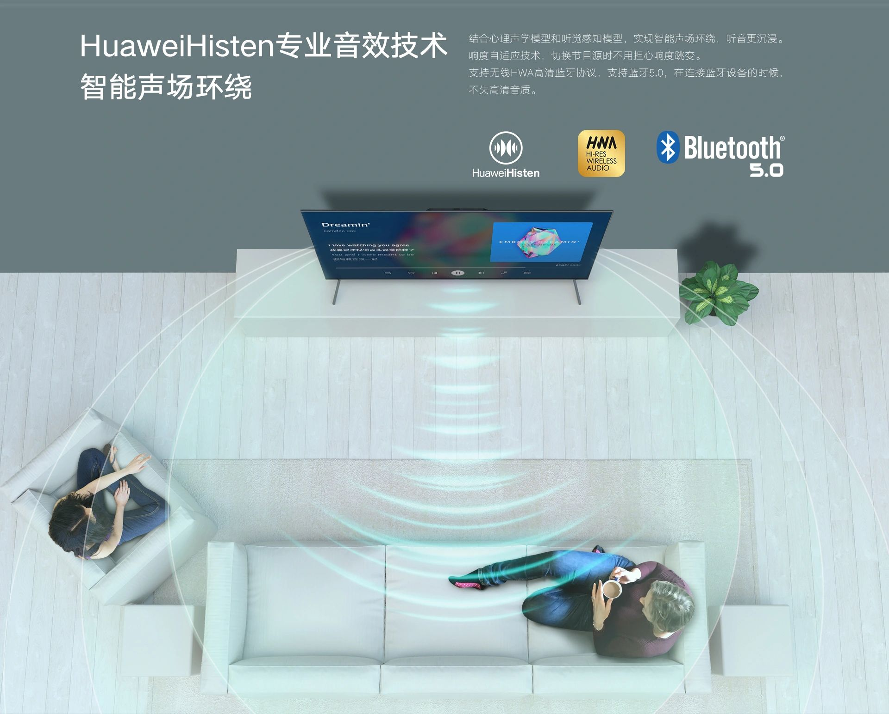

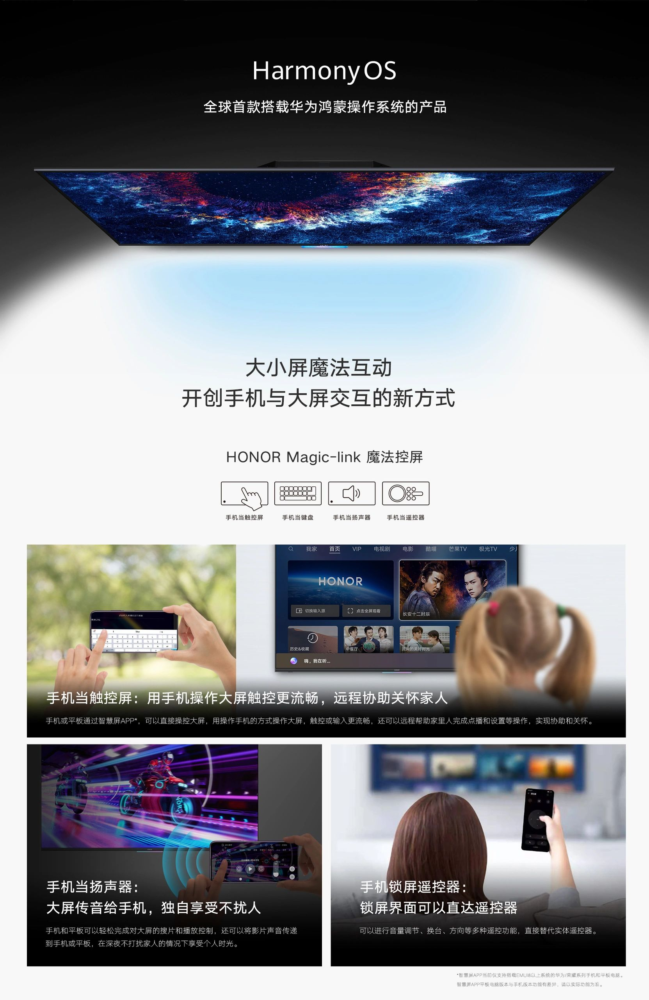

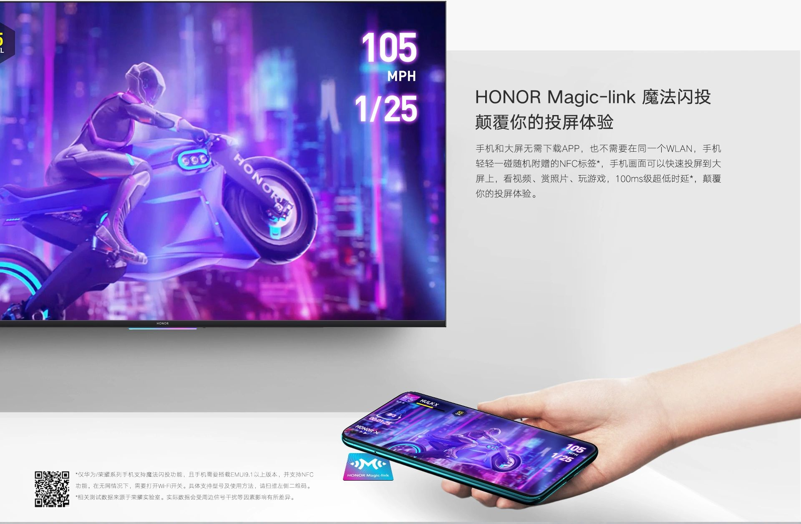

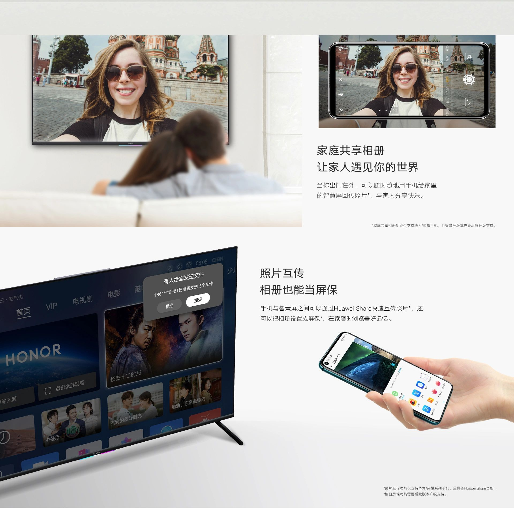

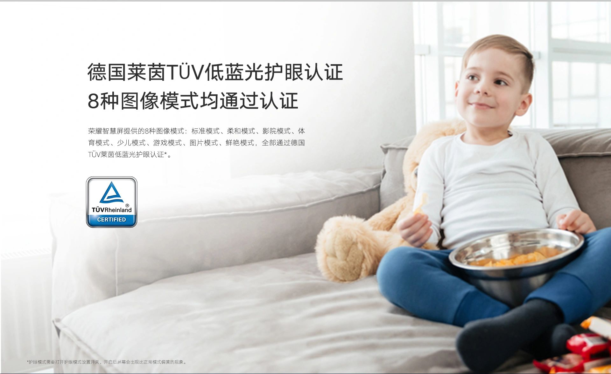

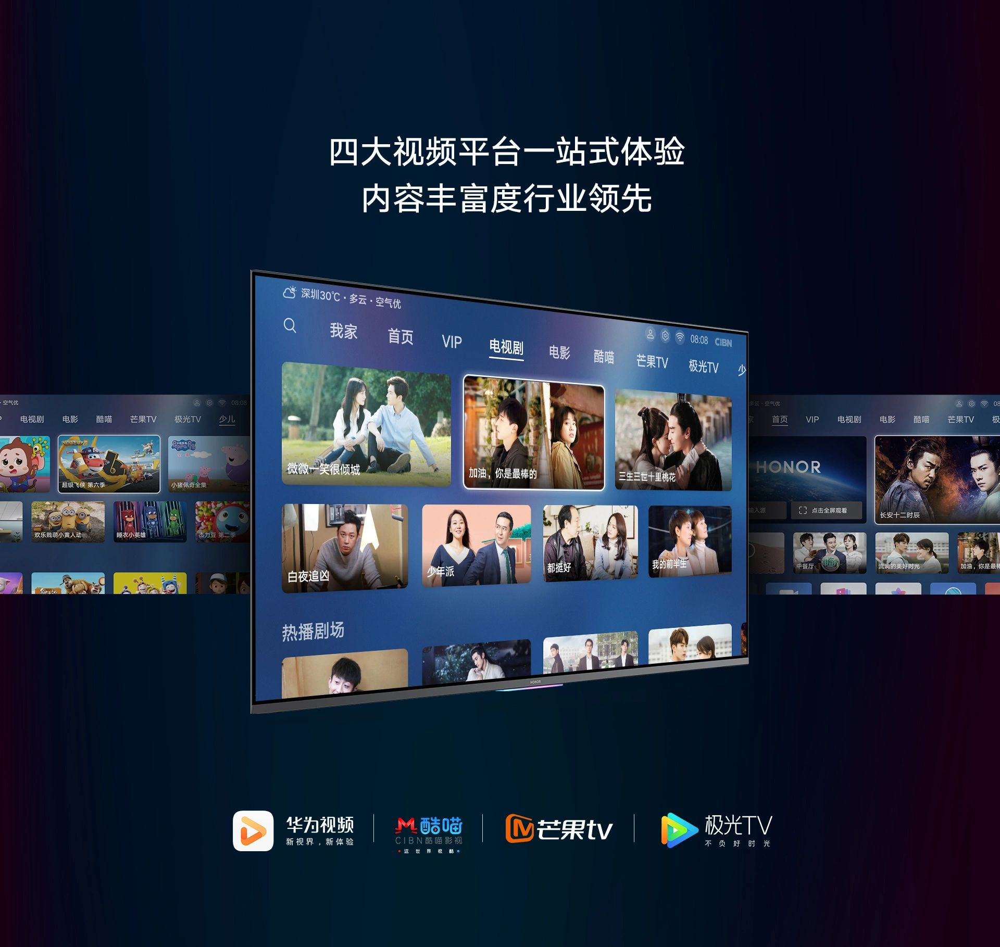
